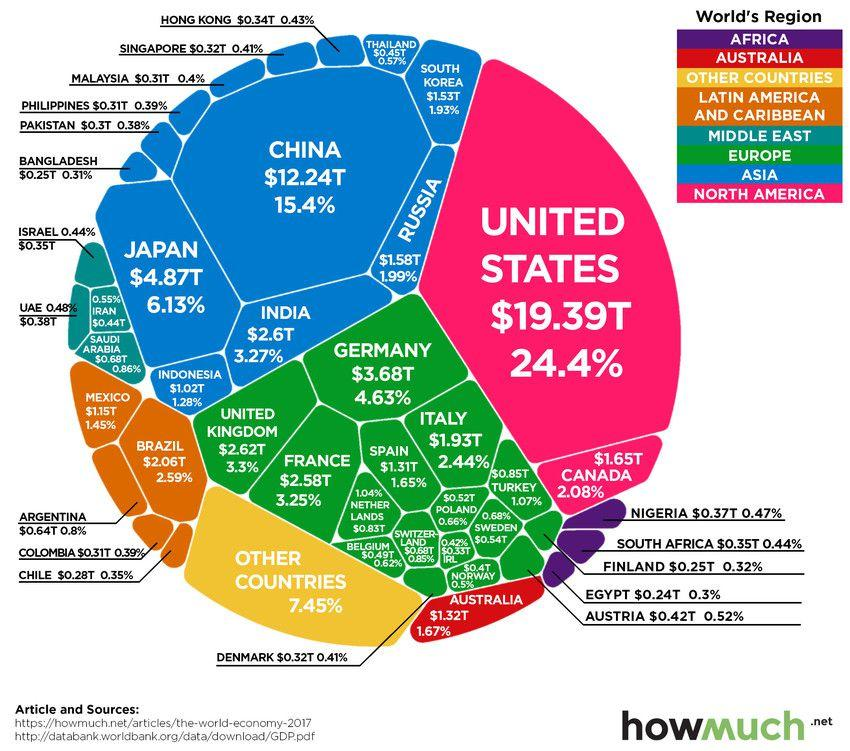

Algorithmic trading is reshaping the landscape of global financial markets, acting as a potent force in driving or challenging economic development across nations. As technology progressively integrates into financial systems, understanding the interplay between economic development and algorithmic trading holds great significance, especially in contrasting environments of developed and developing countries. 

In developed countries, algorithmic trading is a cornerstone of modern financial activity, crucially supporting sustained economic growth. These countries leverage advanced technology and sophisticated capital market infrastructures to enhance trading efficiencies, liquidity, and market depth. This technological evolution strengthens economic stability, promotes competitive financial markets, and fosters an environment conducive to innovation and technological adaptation. 



Conversely, developing countries stand at a different juncture where algorithmic trading presents a dual-edged sword of opportunity and challenge. With fewer barriers to entry in technology adoption, these countries have the chance to leapfrog traditional financial systems, using algorithmic trading to better integrate with global financial markets. However, they face hurdles such as inadequate technological infrastructure, nascent regulatory frameworks, and limited market accessibility, which can impede the realization of potential economic benefits. Addressing these challenges is paramount to harnessing algorithmic trading as a catalyst for economic development.

The divergence in how algorithmic trading impacts economic development between developed and developing countries underscores the importance of key factors like technological advancement, regulatory adequacy, and market accessibility. In developed markets, structured regulations and extensive technological resources facilitate efficient implementation and operation of algorithmic systems. In contrast, developing markets need to enhance these areas to fully capitalize on the prospects offered by algorithmic trading.

Understanding these dynamics is essential for informed policy-making and strategic investment decisions globally. Policymakers must tailor regulations to balance innovation with risk management, ensuring that the benefits of algorithmic trading are equitably distributed. For investors, discerning the technological readiness and regulatory landscapes of different regions can aid in identifying lucrative opportunities or potential pitfalls. 

In essence, this exploration reveals the profound impact of algorithmic trading on economic development, highlighting the divergent pathways and potential harmonization strategies. As the financial world becomes increasingly interconnected, grasping these relationships and adapting strategies accordingly is imperative for fostering global economic prosperity.

## Table of Contents

## Algorithmic Trading: An Overview

Algorithmic trading encompasses the utilization of computer algorithms to automate trading decisions, aiming to achieve optimal execution in terms of speed and price. This trading method leverages sophisticated mathematical models and high-frequency trading techniques to either replace or enhance human decision-making processes. By automating trades, these algorithms can analyze vast datasets and execute orders with precision and swiftness that surpasses human capabilities.

The ascent of [algorithmic trading](/wiki/algorithmic-trading) is closely linked to technological advancements, including the increased processing power of computers and more extensive connectivity across the globe. These technological innovations have transformed financial markets by fostering an environment where efficiency is paramount. The pursuit of this efficiency has encouraged the development of more advanced trading strategies, further cementing the role of algorithms in modern markets.

Algorithmic trading's applications span across a variety of financial instruments, including equities, [forex](/wiki/forex-system), and commodities. Despite its global prevalence, the degree of adoption varies significantly from one region to another, influenced by factors such as technology infrastructure, market maturity, and regulatory environments. In equity markets, algorithms are extensively used for market-making, [arbitrage](/wiki/arbitrage), and executing large orders without significantly affecting the market price. In the forex market, algorithms facilitate transactions across diverse currency pairs by swiftly capitalizing on arbitrage opportunities and adjusting to market dynamics.

Understanding algorithmic trading's foundational concepts is critical for evaluating its economic impacts. Algorithms typically follow pre-defined rules to initiate trade orders, which can be based on timing, price, [volume](/wiki/volume-trading-strategy), or any mathematical model. High-frequency trading ([HFT](/wiki/high-frequency-trading-strategies)), a subset of algorithmic trading, focuses on executing a large number of orders at extremely rapid speeds, often within milliseconds. 

A typical algorithmic trading model might involve mean reversion, where a trading strategy is developed under the assumption that asset prices will revert to their historical mean. Alternatively, it might implement [momentum](/wiki/momentum) strategies, which exploit the tendency of asset prices to continue in their current direction for a period. An example of a simple momentum-based trading algorithm in Python might look like the following:

```python
import pandas as pd

def momentum_strategy(prices, window=20):
    returns = prices.pct_change()
    moving_avg = returns.rolling(window=window).mean()
    signal = (returns > moving_avg).shift(1)
    return signal * returns

# Example usage with hypothetical price data
prices = pd.Series([100, 102, 101, 105, 107, 106])
strategy_returns = momentum_strategy(prices)
```

This script calculates the returns based on a 20-day moving average and generates a signal whenever the daily return exceeds the moving average, indicating a buy decision. The presence of such advanced algorithmic practices considerably affects financial markets by providing [liquidity](/wiki/liquidity-risk-premium), tightening spreads, and reducing transaction costs.

Consequently, understanding the core principles and operation of algorithmic trading helps assess its profound influence on economies. This knowledge is vital as markets continue to evolve and integrate more complex technologies, shaping economic landscapes around the world.

## Economic Development in Developed Countries

Developed countries experience significant benefits from robust financial infrastructures that underpin the adoption and evolution of algorithmic trading. These infrastructures are instrumental in promoting economic growth, driven by continuous innovation, aggressive technology adoption, and the efficiency of capital markets. Algorithmic trading is an integral component that enhances market liquidity and efficiency, two characteristics that are fundamental to the financial ecosystems of developed economies.

Algorithmic trading operates by leveraging speedy execution capabilities and price optimization through sophisticated computer algorithms. This trading approach ensures continuous market participation, which intensifies competition and reduces bid-ask spreads, leading to increased market liquidity. A liquid market enables the quick buying or selling of financial instruments without causing drastic price changes, thus fostering an environment conducive to investment and economic stability.

Moreover, in countries such as the United States and the United Kingdom, high-frequency trading—a form of algorithmic trading—accounts for a significant proportion of equity trades. These nations benefit from cutting-edge technology and data infrastructure, which provide the enormous computational power necessary to support complex algorithms that underlie trading strategies. This advancement in technology not only reinforces market efficiency but also stimulates economic growth by attracting both domestic and foreign investments.

The economic landscape in developed countries is significantly affected by the regulatory frameworks governing algorithmic trading. Regulatory bodies, like the Securities and Exchange Commission (SEC) in the U.S. and the Financial Conduct Authority (FCA) in the U.K., continuously adapt to the rapid advancements in algorithmic technologies. They address challenges such as market manipulation, the risks of high-frequency trades causing market flash crashes, and ensuring fair market access. These regulations are pivotal in maintaining market integrity while fostering innovation and protecting public interest.

Furthermore, developed countries are not immune to ethical considerations posed by algorithmic trading. Issues around data privacy, the ethical use of [artificial intelligence](/wiki/ai-artificial-intelligence), and algorithm transparency are continuously scrutinized. Developed economies, equipped with adequate resources and technological expertise, are generally well-positioned to address these challenges efficiently. Advanced economies work toward ensuring that trading algorithms do not bypass regulatory scrutiny or lead to unfair advantages that could disrupt fair market play.

The impact of algorithmic trading on employment within the financial sector is multifaceted. While traditional trading roles may be reduced, there is a growing demand for new skills and technological competencies. This shift in employment dynamics has led to an increased need for professionals with expertise in data analytics, algorithm development, and financial technology (FinTech). Educational institutions and training facilities in developed countries have responded by offering specialized programs, thereby preparing the workforce for the evolving demands of the financial industry.

In summary, developed countries are at the forefront of maximizing the advantages offered by algorithmic trading, supported by advanced technological infrastructure, progressive regulations, and a skilled workforce. While it creates challenges, particularly in regulatory compliance and employment shifts, the overall benefits contribute to sustained economic development and enhanced competitive positioning in the global financial landscape.

## Opportunities and Challenges of Algo Trading in Developing Countries

Developing countries face a set of unique challenges and opportunities when it comes to the integration and adoption of algorithmic trading within their financial markets. One of the formidable challenges lies in technological barriers. These regions typically possess less sophisticated technological infrastructures compared to their developed counterparts. This lack hinders the efficient implementation and scaling of algorithmic trading platforms that rely heavily on robust and high-speed computing capabilities. Moreover, the financial markets in these countries are often less mature, lacking the depth and liquidity seen in more developed economies, which are essential ingredients for the successful operation of algorithmic trading systems.

However, despite these challenges, developing countries have the potential to leapfrog technological stages by adopting cutting-edge advancements. Embracing modern trading technologies without the need for extensive legacy systems can streamline the integration process, offering the possibility to attract global investments keen on high-growth opportunities. The adoption of algorithmic trading can improve market efficiency and liquidity, which are crucial in minimizing transaction costs and enhancing price discovery processes.

For these benefits to materialize, developing regions need supportive regulatory frameworks and infrastructure development. Regulatory bodies need to create environments that balance innovation with investor protection, ensuring that trading technologies operate transparently and fairly. Additionally, infrastructural improvements, such as enhanced internet connectivity and data management systems, are essential to support high-frequency and high-volume trades characteristic of algorithmic trading.

There is also a significant need for capacity building and knowledge transfer to maximize the economic benefits of algorithmic trading. This involves training local talent in quantitative finance, data analytics, and programming skills essential for operating and managing algorithmic systems. Bridging this skills gap can empower local workforces and mitigate potential risks associated with over-reliance on foreign expertise.

In conclusion, while developing countries face significant challenges in adopting algorithmic trading due to technological and market maturity constraints, they possess substantial opportunities for economic advancement. By focusing on technology adoption, regulatory framework establishment, and capacity building, these countries can successfully integrate algorithmic trading into their markets. This integration holds the promise of stimulating broader economic growth and development, potentially transforming these economies into vibrant financial hubs.

## Comparative Analysis: Developed vs. Developing Economies

Algorithmic trading, increasingly pivotal in global financial markets, exhibits notable differences in its implementation and impact between developed and developing countries. These differences stem from variations in technology infrastructure, regulatory frameworks, and capital market maturity. Developed countries, such as the United States, the United Kingdom, and Japan, have leveraged advanced technology and sophisticated market practices to integrate algorithmic trading seamlessly into their financial systems. These regions benefit from robust digital infrastructures and well-established trading mechanisms, which facilitate the efficient execution of algorithm-driven strategies. As a result, developed economies often witness enhanced market liquidity, reduced transaction costs, and improved price discovery due to algorithmic trading.

Conversely, developing countries, including nations in Africa, Latin America, and parts of Asia, encounter diverse challenges in adopting algorithmic trading. Limited access to advanced technology, inadequate infrastructure, and less sophisticated financial markets can impede the efficient implementation of algorithmic trading systems. However, these economies possess significant growth potential by potentially leapfrogging through technological advancements. By addressing infrastructure deficits and fostering an enabling environment for technology uptake, developing nations can attract global investments and improve market efficiency.

Regulatory considerations also differ starkly between developed and developing regions. In developed countries, regulatory bodies have accumulated experience and resources to effectively oversee and manage the implications of algorithmic trading, especially concerning market stability and fairness. Conversely, regulatory frameworks in developing countries are often nascent, necessitating refinement to accommodate the complexities introduced by automated trading. Ensuring that these regulations are supportive yet careful to prevent market abuse or [volatility](/wiki/volatility-trading-strategies) is essential for fostering sustainable growth in algorithmic trading.

Despite these disparities, opportunities for cross-border collaborations, foreign direct investments, and policy exchanges offer avenues to harmonize algorithmic trading practices globally. For instance, developed economies can share insights and frameworks that can assist developing nations in formulating strategies to leverage algorithmic trading effectively. Such collaborations not only bridge the technology gap but also promote financial inclusion and economic development on a broader scale.

In conclusion, the comparative analysis of algorithmic trading in developed versus developing economies underscores a landscape of both challenges and opportunities. By learning from the established practices of developed nations, developing countries can craft strategies that tap into the potential of algorithmic trading, contributing to their broader economic growth and integration into the global financial system.

## Conclusion

Algorithmic trading is a pivotal element of contemporary financial markets, exerting diverse effects on economic development across regions. In developed countries, algorithmic trading bolsters existing financial frameworks, enhancing market efficiency and liquidity through advanced technologies and established systems. This integration supports sustainable economic growth, fostering innovation and maintaining competitive capital markets.

Conversely, for developing nations, algorithmic trading presents opportunities for economic innovation and transformation. By leveraging algorithmic solutions, these countries can bypass traditional financial growth stages, propelling their markets towards increased efficiency and attracting international investments. The positive impacts of algorithmic trading in these regions hinge on overcoming technological barriers and fostering infrastructural development.

Understanding how algorithmic trading influences economic development requires a comprehensive view that incorporates both global insights and tailored local strategies. While the growth potential of algorithmic trading is substantial, it demands prudent management of associated risks and ensuring equitable access to technological advancements and resources. The disparity in access to these resources often delineates the effectiveness of algorithmic trading's implementation between developed and developing nations.

To fully harness the benefits of algorithmic trading, continuous research and international collaboration are imperative. These efforts can facilitate the exchange of knowledge and best practices, aiding countries in crafting informed policy decisions and investment strategies. Ultimately, by maximizing the advantageous aspects of algorithmic trading, economies worldwide can achieve more robust and inclusive economic development.

## References & Further Reading

[1]: Cartea, Á., Jaimungal, S., & Penalva, J. (2015). ["Algorithmic and High-Frequency Trading."](https://assets.cambridge.org/97811070/91146/frontmatter/9781107091146_frontmatter.pdf) Cambridge University Press.

[2]: Narang, R. (2013). ["Inside the Black Box: A Simple Guide to Quantitative and High-Frequency Trading."](https://www.amazon.com/Inside-Black-Box-Quantitative-Frequency/dp/1118362411) John Wiley & Sons.

[3]: Aldridge, I. (2013). ["High-frequency Trading: A Practical Guide to Algorithmic Strategies and Trading Systems."](https://www.amazon.com/High-Frequency-Trading-Practical-Algorithmic-Strategies/dp/1118343506) John Wiley & Sons.

[4]: Hendershott, T., Jones, C. M., & Menkveld, A. J. (2011). ["Does Algorithmic Trading Improve Liquidity?"](https://onlinelibrary.wiley.com/doi/full/10.1111/j.1540-6261.2010.01624.x) Management Science, 57(1), 1-19.

[5]: Gomber, P., Arndt, B., Lutat, M., & Uhle, T. (2011). ["High-Frequency Trading."](https://www.semanticscholar.org/paper/High-Frequency-Trading-Gomber-Arndt/3d0ba8179934e0a45e85a184d1ec526616e2e213) In Algorithmic Trading and DMA: An Introduction to Direct Access Trading Strategies (pp. 367-390). Springer.