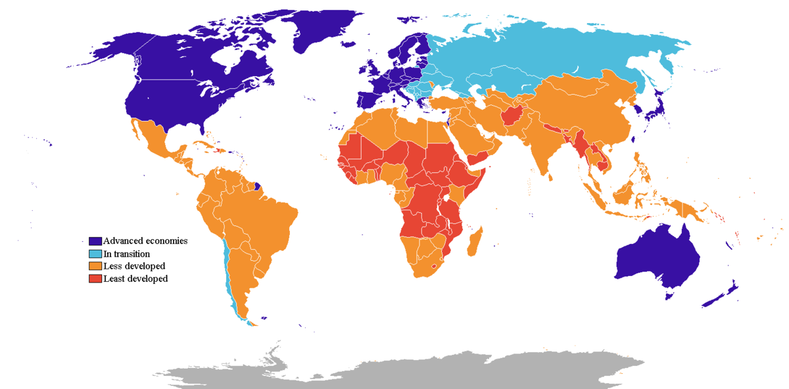

## Table of Contents

## What is the difference between developed and developing countries?

Developed countries are nations that have strong economies and high standards of living. These countries usually have good healthcare, education, and infrastructure. People in developed countries often have access to many resources and services. Examples of developed countries include the United States, Japan, and many countries in Europe. These countries have been able to grow and improve over time, which has helped them become more advanced.

Developing countries, on the other hand, are nations that are still working to improve their economies and living standards. These countries may face challenges like poverty, limited access to healthcare and education, and poor infrastructure. People in developing countries often have fewer resources and may struggle to meet their basic needs. Examples of developing countries include many nations in Africa, Asia, and Latin America. These countries are trying to grow and develop, but it can be a slow and difficult process.

The main difference between developed and developing countries is the level of economic growth and the quality of life for their people. Developed countries have already achieved a high level of development, while developing countries are still working towards that goal. Both types of countries have their own unique challenges and opportunities as they try to improve the lives of their citizens.

## How is the classification of countries into developed and developing determined?

The classification of countries into developed and developing is determined by looking at different factors. One important [factor](/wiki/factor-investing) is the economy. Countries with strong economies that produce a lot of goods and services are usually considered developed. Another factor is the standard of living. This includes things like how much money people earn, how good their healthcare and education are, and whether they have access to clean water and safe homes. Organizations like the United Nations and the World Bank use these factors to group countries.

Sometimes, the classification can change over time. A country that was once considered developing can become developed if it improves its economy and living standards. For example, South Korea was considered a developing country in the past, but it has grown a lot and is now seen as developed. On the other hand, a country can also move from developed to developing if it faces big problems like war or economic crisis. The classification is not always clear-cut, and different organizations might group countries differently based on the factors they focus on.

## What are some common indicators used to classify countries as developed or developing?

Common indicators used to classify countries as developed or developing include income levels, the Human Development Index (HDI), and infrastructure quality. Income levels are measured by Gross National Income (GNI) per capita, which shows how much money people in a country earn on average. Developed countries usually have high GNI per capita, meaning people there earn more money. The HDI looks at health, education, and living standards. Countries with high HDI scores are considered developed because they have good healthcare, education, and a high quality of life. Infrastructure, like roads, hospitals, and schools, is also important. Developed countries have better infrastructure, which helps people live better lives.

Another indicator is the level of industrialization. Developed countries have more advanced industries and technology, which helps their economies grow. Developing countries might rely more on farming and have less advanced technology. The poverty rate is also a key indicator. In developing countries, more people often live in poverty and struggle to meet their basic needs. In developed countries, fewer people are poor, and more people have what they need to live well. These indicators help organizations like the United Nations and the World Bank decide if a country is developed or developing.

## Can you list some examples of developed countries?

Developed countries are places where people have a good life. They have strong economies and people earn a lot of money. Some examples of developed countries are the United States, Japan, and Germany. In these countries, people have good healthcare, schools, and roads. They also have a lot of technology and industries that help their economies grow.

Other examples of developed countries include the United Kingdom, Canada, and Australia. In these countries, people live well and have what they need. They have low poverty rates and good living standards. These countries have worked hard to improve over time, which has helped them become developed.

France, Sweden, and Switzerland are also developed countries. People in these countries have access to good services and resources. They have strong economies and high quality of life. These countries show how important it is to have good healthcare, education, and infrastructure.

## Can you list some examples of developing countries?

Developing countries are places where people are still working to have a good life. They are trying to make their economies stronger and help people earn more money. Some examples of developing countries are India, Nigeria, and Indonesia. In these countries, many people do not have good healthcare or schools. They might not have clean water or safe homes. These countries are working hard to get better, but it can take a long time.

Other examples of developing countries include Bangladesh, Kenya, and Vietnam. In these places, a lot of people live in poverty and struggle to meet their basic needs. They might rely on farming and have less advanced technology. These countries are trying to build better roads, hospitals, and schools to help people live better lives. It is a big challenge, but they are making progress.

Countries like Brazil, Pakistan, and the Philippines are also considered developing. People in these countries face many challenges, but they are trying to improve. They want to have stronger economies and better living standards. It takes time and effort, but these countries are working towards a better future for their people.

## How does the economic status of a country affect its classification?

The economic status of a country is a big reason why it is classified as developed or developing. Developed countries have strong economies. This means they make a lot of money from businesses and industries. People in these countries earn more money and can buy what they need. They also have good healthcare, schools, and roads. All of these things help people live well. Because their economies are strong, developed countries are able to provide a high standard of living for their people.

On the other hand, developing countries have weaker economies. This means they do not make as much money from businesses and industries. Many people in these countries are poor and struggle to meet their basic needs. They might not have good healthcare or schools. The roads and other infrastructure might not be as good. Because their economies are not as strong, developing countries face more challenges in providing a good life for their people. The economic status of a country is a key factor in deciding if it is developed or developing.

## What role do international organizations like the United Nations play in categorizing countries?

International organizations like the United Nations help decide if a country is developed or developing. They look at things like how much money people earn, how good their healthcare and schools are, and if they have clean water and safe homes. The United Nations uses these factors to group countries. This helps them understand which countries need more help to improve their lives. By doing this, the United Nations can work with governments and other groups to make things better for people in developing countries.

The United Nations also uses tools like the Human Development Index (HDI) to help categorize countries. The HDI looks at health, education, and living standards. Countries with high HDI scores are seen as developed because people there have a good life. Countries with lower HDI scores are seen as developing because they face more challenges. The United Nations shares this information with the world, which helps everyone understand where help is needed most. This way, they can work together to make the world a better place for everyone.

## How have classifications of countries changed over time?

The way countries are grouped as developed or developing has changed over time. In the past, many countries that are now considered developed were seen as developing. For example, South Korea used to be a developing country, but it worked hard to grow its economy and improve life for its people. Now, it is seen as a developed country. This shows that countries can move from one group to another if they make big improvements.

Changes in how countries are classified can also happen because of big problems like wars or economic crises. For example, a country that was once doing well might face a lot of trouble and become a developing country again. The way countries are grouped is not always the same, and different groups might use different ways to decide. The United Nations and the World Bank, for example, might look at different things when they group countries. This means that the way countries are seen can change over time based on many different factors.

## What are the challenges faced by developing countries in achieving developed status?

Developing countries face many challenges when trying to become developed. One big challenge is poverty. Many people in these countries do not have enough money to meet their basic needs like food, clean water, and safe homes. This makes it hard for them to go to school or see a doctor. Without good education and healthcare, it is difficult for people to get better jobs and earn more money. Another challenge is poor infrastructure. Developing countries often do not have good roads, hospitals, or schools. This makes it hard for people to get around, get the care they need, and learn new things. Without strong infrastructure, it is tough for the economy to grow.

Another challenge is limited access to technology and industry. Developed countries have advanced technology and strong industries that help their economies grow. Developing countries might rely more on farming and have less advanced technology. This makes it harder for them to create new jobs and make more money. Political problems can also be a challenge. Some developing countries face issues like war, corruption, or unstable governments. These problems can make it hard to make plans and build a strong economy. Despite these challenges, many developing countries are working hard to improve and move towards becoming developed.

## How do political and social factors influence a country's development status?

Political and social factors play a big role in a country's development status. If a country has a stable government, it can make plans and work on improving things like healthcare, education, and infrastructure. But if a country has a lot of political problems like war or corruption, it can be hard to focus on development. These problems can stop the country from growing its economy and helping its people live better lives. A stable government can also make it easier for a country to work with other countries and get help when it needs it.

Social factors are also important. If people in a country are treated fairly and have equal opportunities, it can help the country develop. But if there is a lot of inequality or discrimination, it can hold the country back. For example, if some groups of people do not have access to good schools or jobs, it can be hard for the whole country to grow. Social issues like poverty and poor health can also make it difficult for a country to improve. When people are struggling to meet their basic needs, it is hard for them to focus on other things that can help the country develop.

## What are the implications of being classified as a developing country in terms of international aid and trade?

Being classified as a developing country can affect how much help it gets from other countries and international organizations. Many developed countries and groups like the United Nations give money and resources to developing countries to help them grow. This aid can be used to build better schools, hospitals, and roads. It can also help people in developing countries get the food, clean water, and healthcare they need. Without this help, it would be much harder for developing countries to improve their economies and living standards.

The classification also impacts trade. Developing countries often get special treatment in international trade agreements. This can mean lower taxes on the things they sell to other countries, which helps their businesses grow. It can also mean easier access to markets in developed countries. But, being seen as a developing country can also make it harder to compete in some ways. Other countries might see them as riskier to do business with, which can limit their trade opportunities. Overall, being classified as a developing country can open doors for aid and trade, but it also comes with challenges.

## How do emerging economies fit into the traditional developed vs. developing country dichotomy?

Emerging economies are countries that are doing better than other developing countries but are not yet as strong as developed countries. They are growing fast and making big improvements in their economies. Countries like Brazil, China, and India are examples of emerging economies. These countries are working hard to build better businesses, industries, and technology. They are also trying to improve things like healthcare, education, and infrastructure. Because they are growing so quickly, emerging economies are seen as having a lot of potential to become developed countries in the future.

The traditional way of dividing countries into developed and developing does not always fit well with emerging economies. These countries are somewhere in the middle. They have some of the good things that developed countries have, like growing businesses and more money for people, but they also face many of the challenges that developing countries face, like poverty and poor infrastructure. This makes it hard to put them in just one group. Because of this, some people think we need new ways to classify countries that take into account the special situation of emerging economies.

## References & Further Reading

[1]: Cartea, Á., Jaimungal, S., & Penalva, J. (2015). ["Algorithmic and High-Frequency Trading."](https://assets.cambridge.org/97811070/91146/frontmatter/9781107091146_frontmatter.pdf) Cambridge University Press.

[2]: Narang, R. (2013). ["Inside the Black Box: A Simple Guide to Quantitative and High-Frequency Trading."](https://www.amazon.com/Inside-Black-Box-Quantitative-Frequency/dp/1118362411) John Wiley & Sons.

[3]: Aldridge, I. (2013). ["High-frequency Trading: A Practical Guide to Algorithmic Strategies and Trading Systems."](https://www.amazon.com/High-Frequency-Trading-Practical-Algorithmic-Strategies/dp/1118343506) John Wiley & Sons.

[4]: Hendershott, T., Jones, C. M., & Menkveld, A. J. (2011). ["Does Algorithmic Trading Improve Liquidity?"](https://onlinelibrary.wiley.com/doi/full/10.1111/j.1540-6261.2010.01624.x) Management Science, 57(1), 1-19.

[5]: Gomber, P., Arndt, B., Lutat, M., & Uhle, T. (2011). ["High-Frequency Trading."](https://www.semanticscholar.org/paper/High-Frequency-Trading-Gomber-Arndt/3d0ba8179934e0a45e85a184d1ec526616e2e213) In Algorithmic Trading and DMA: An Introduction to Direct Access Trading Strategies (pp. 367-390). Springer.