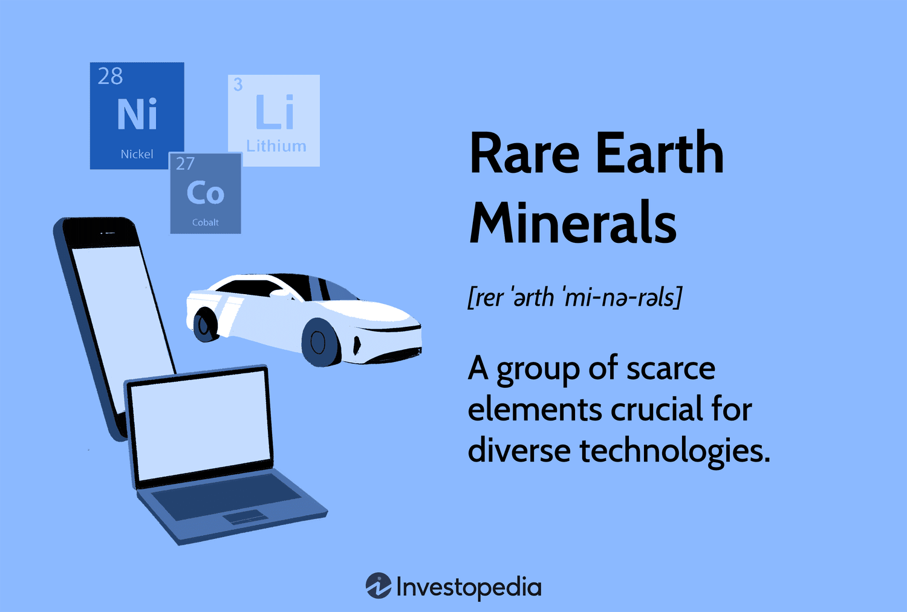

The demand for rare earth minerals and critical minerals has significantly increased over the past few years, driven by their pivotal role in modern technological advancements and the transition towards cleaner energy sources. Key minerals such as lithium, nickel, and cobalt have become indispensable components in the production of batteries, electronics, and renewable energy technologies. Specifically, lithium is crucial for battery technology, particularly in electric vehicles (EVs), while nickel and cobalt are essential for battery storage and stainless steel production. As global demand for sustainable technologies escalates, the pressure on these minerals has intensified.

China has established itself as a dominant force in the refining and processing of these critical minerals. The country's significant market share in this sector has prompted geopolitical concerns and driven other nations to secure alternative suppliers and enhance domestic production capabilities. The strategic importance of diversifying mineral supply chains has become apparent, as countries like the United States, Canada, and Australia take measures to reduce dependency on China and mitigate supply chain vulnerabilities.

Understanding the dynamics of the mineral market is complex, with various factors influencing supply and demand. Emerging technologies, such as algorithmic trading, are increasingly being utilized to navigate these complexities. Algorithmic trading offers enhanced efficiency and rapid responsiveness to market fluctuations and emerging trends. By leveraging vast datasets, algorithms can predict trends and optimize trading strategies, underscoring their growing importance in the mineral market.

This article will explore the critical role of rare earth and critical minerals in modern technology and energy transition, examining current demand trends and the influence of algorithmic trading on the mineral market.

## Table of Contents

## The Growing Demand for Rare Earth and Critical Minerals

The demand for rare earth and critical minerals has witnessed a remarkable increase, driven largely by the global shift towards cleaner energy solutions. As societies worldwide prioritize reducing carbon emissions, the need for technologies that facilitate this transition has concurrently amplified the demand for specific minerals. Among these, lithium stands out as an essential element due to its critical role in battery technology employed in electric vehicles (EVs) and renewable energy infrastructures such as solar and wind power systems.

Lithium's unique electrochemical properties make it ideal for use in lithium-ion batteries, which power not just electric vehicles but a range of portable electronic devices. Its light weight and high electrochemical potential allow for high energy density, facilitating longer battery life and greater efficiency. As the electrification of transport systems gains momentum, forecasts predict a continued upward trajectory in lithium demand.

In addition to lithium, other minerals, including nickel and cobalt, are significant for their applications in battery storage technology. Nickel's contribution to battery cathode production enhances energy density and battery longevity. This increased requirement for advanced battery technologies underscores the broader trend where achieving cleaner energy solutions often relies on these critical minerals.

Furthermore, as economies commit to achieving net-zero emission goals, investments in renewable energy infrastructure are accelerating. This shift is reflected in the burgeoning market for electricity storage solutions, which are integral to balancing supply and demand in power systems reliant on intermittent energy sources like wind and solar. Thus, the demand for minerals essential to developing and deploying these technologies has rapidly increased, underscoring the pivotal role they play in the global energy transition.

## Key Rare Earth and Critical Minerals

The essential minerals that are currently recognized as critical due to their growing importance in modern technology and renewable energy solutions include lithium, nickel, cobalt, copper, graphite, and a variety of rare earth elements. Each of these minerals plays a crucial role in the technological advancements shaping contemporary society.

Lithium stands out as a key component due to its widespread use in the manufacturing of batteries for electric vehicles (EVs) and electronic devices. This alkali metal, known for its high energy density and long lifespan, is integral to lithium-ion batteries, which are the preferred choice for portable electronic devices and EVs. As the global push towards renewable energy sources intensifies, the demand for lithium is projected to continue its upward trajectory.

Nickel and cobalt are also critical, particularly in the context of battery storage technology and the production of stainless steel. Nickel is essential in cathode materials of batteries, enhancing their energy density and storage capacity. Similarly, cobalt contributes to battery stability and longevity but faces scrutiny over supply chain sustainability and ethical sourcing concerns.

Copper, another pivotal mineral, serves as a fundamental component in electrical wiring and motors due to its excellent conductivity properties. The transition to cleaner energy systems, which often require extensive electricity infrastructure, has significantly elevated the demand for copper.

Graphite is another mineral that has seen a surge in demand, primarily driven by its application in EV batteries. Its role in anodes of lithium-ion batteries is unmatched due to its ability to effectively conduct electricity and withstand high temperatures, which are vital traits for the efficient functioning of these power cells.

Furthermore, rare earth elements (REEs), despite being less visually prominent in the periodic table, are indispensable to various high-tech applications. These elements, which include neodymium, dysprosium, and praseodymium, are vital in producing powerful permanent magnets used in wind turbines, EVs, and numerous electronic devices.

The rising importance of these minerals highlights the need to secure sustainable and ethical supply chains, while concurrently developing technological innovations and alternative materials to mitigate potential environmental and social impacts associated with mining and processing activities.

## Global Production and Geopolitical Influence

China has established itself as a dominant force in the refining and processing of critical minerals, controlling approximately 80% of the global refining capacity for rare earth elements. This dominance has significant implications for global supply chains and market dynamics. China's stronghold on critical minerals is primarily due to its substantial investments in mining and processing infrastructure, as well as strategic policies that support the industry's growth.

In response to China's dominance, countries such as the United States, Canada, and Australia are actively seeking to boost their domestic production capacities. The U.S. government has identified critical minerals as essential to national security and economic prosperity, leading to initiatives aimed at increasing local mining and processing capabilities. Similarly, Canada and Australia are investing in new mining projects and developing policies to attract investments in the minerals sector. These efforts are motivated by the desire to reduce dependency on Chinese supplies and to secure stable, reliable sources for these essential materials.

The geopolitical landscape surrounding critical minerals is fraught with tensions, as countries recognize the strategic importance of these resources. Trade disputes and political tensions can lead to supply chain disruptions, underscoring the need for diversified mineral sourcing. For instance, China's recent export restrictions on critical minerals have prompted several countries to reconsider their reliance on a single dominant supplier and to accelerate exploration and development of alternative sources.

The international push for diversification in mineral sourcing is further fueled by supply chain vulnerabilities exposed by the COVID-19 pandemic. The pandemic highlighted the risks associated with concentrated supply chains and the need for resilience in critical industries. Consequently, governments and private entities are exploring partnerships and cooperative ventures to establish a more balanced and secure supply network for critical minerals.

In summary, the global production and geopolitical dynamics of critical minerals are characterized by China's refining predominance and efforts by other nations to enhance their own production capabilities. The interplay of these factors significantly influences global trade policies and the strategic approaches of countries aiming to secure access to these vital resources.

## The Role of Algorithmic Trading in the Mineral Market

Algorithmic trading has become increasingly influential in commodity markets, encompassing vital sectors such as minerals. This sophisticated method of trading uses pre-defined algorithms to execute orders based on complex mathematical models and data analysis. It allows for enhanced efficiency and speed, enabling traders to respond swiftly to fluctuations in market conditions and emerging demands.

The hallmark of [algorithmic trading](/wiki/algorithmic-trading) is its ability to process vast datasets at remarkable speeds. By employing [machine learning](/wiki/machine-learning) algorithms and quantitative models, traders can predict market trends with higher accuracy and optimize their strategies accordingly. For example, algorithms can analyze historical data and current market conditions to identify patterns and forecast price movements, thus providing a competitive edge in making informed trading decisions.

One of the primary advantages of algorithmic trading is the reduction of human error. Automated systems mitigate the risk of emotional biases that can affect human traders, thereby enhancing the reliability of trades. These algorithms can execute multiple trades across different markets within milliseconds, a feat unattainable by manual trading. This speed is crucial for capitalizing on transient market opportunities and achieving cost efficiencies.

Algorithmic trading also facilitates better [liquidity](/wiki/liquidity-risk-premium) in the mineral market. By continuously placing buy and sell orders at various prices, these systems contribute to more stable and efficient market dynamics. For instance, high-frequency trading ([HFT](/wiki/high-frequency-trading-strategies)), a subset of algorithmic trading, enables tighter bid-ask spreads, ensuring fairer pricing for all market participants and enhancing overall market integrity.

Moreover, algorithmic trading empowers traders to implement advanced strategies such as statistical [arbitrage](/wiki/arbitrage), [momentum](/wiki/momentum) trading, and market-making. These strategies leverage computational power to identify arbitrage opportunities and capitalize on price discrepancies between related instruments or markets. Through [backtesting](/wiki/backtesting), traders can refine these strategies by simulating their performance using historical data, thus optimizing their practical implementation.

In conclusion, algorithmic trading is reshaping the landscape of the mineral market. Its capacity to swiftly process colossal amounts of data, execute trades with precision, and optimize trading strategies marks a significant advance in how mineral commodities are traded. As technology continues to evolve, the role of algorithmic trading is likely to expand, offering further innovations and efficiencies in the mineral market.

## Alternatives and Innovations in Mineral Usage

Material science is at the forefront of developing alternatives and innovations to lessen the dependence on critical minerals in modern technologies. Research is focused on finding substitutes and creating synthetic materials that can perform the same functions as traditional minerals used in batteries, electronics, and renewable energy technologies. These efforts aim to alleviate the pressures on supply chains and reduce environmental impacts associated with mining.

Recycling is a pivotal strategy in this context. By improving recycling technologies and systems, valuable materials can be recovered from used devices and reintegrated into the manufacturing process. This approach not only saves resources but also diminishes the environmental footprint of mineral extraction. Efficient use of resources through recycling could significantly cover the future demand for critical minerals.

Technological advances are also contributing to reducing reliance on extensive mining. Innovations in manufacturing and design processes can minimize the amount of critical minerals required. For instance, advancements in battery technology are leading to the development of energy storage solutions that use alternative materials or require fewer minerals like lithium or cobalt. This might include utilizing solid-state batteries or exploring chemistries that incorporate more abundant elements.

Furthermore, machine learning algorithms and data analytics are employed to enhance mining efficiency and resource management. These technologies enable precise mapping of mineral deposits, optimize extraction processes, and predict maintenance needs, thereby reducing waste and improving yields. Python coding, for example, is frequently used in developing algorithms for these applications, providing the computational power needed to handle complex datasets and simulations, enhancing decision-making processes in mineral exploration and extraction.

In conclusion, through the lens of material science, the pursuit of alternatives and innovations ensures a sustainable future in mineral usage, balancing the demand for technological advancement with environmental stewardship and resource efficiency.

## Conclusion

The increasing demand for critical minerals such as lithium, nickel, and cobalt is accompanied by significant challenges, notably geopolitical risks and environmental concerns. Reliance on certain countries for mineral supply chains introduces vulnerability to political tensions and trade policies. These geopolitical dynamics necessitate a strategic approach to diversify mineral sources. Countries like the United States, Canada, and Australia are investing in domestic production capabilities to reduce dependence on dominant market players like China, aiming to achieve greater stability and security.

In addition to diversification, investing in sustainable mining and processing technologies is crucial to address environmental concerns. The extraction and refinement of critical minerals can have detrimental impacts on ecosystems, water resources, and local communities. Implementing environmentally friendly practices and advancing recycling technologies can mitigate these effects, supporting more responsible use of resources.

Furthermore, algorithmic trading stands as a pivotal tool in managing the complexities of the mineral market. By leveraging sophisticated algorithms, it is possible to enhance trading efficiency and responsiveness to market fluctuations. Algorithmic models can process extensive datasets, identify emerging trends, and optimize trading strategies, providing stakeholders with real-time insights and competitive advantages. This capability is invaluable in a market characterized by rapid changes and high uncertainty, ensuring more informed decision-making and resource allocation.

Efforts to diversify sources, coupled with investments in sustainable practices and technological innovations like algorithmic trading, will play essential roles in meeting the burgeoning demand for critical minerals. Together, these strategies offer a path toward a more balanced, resilient, and environmentally considerate mineral supply chain, enabling progress in developing modern technologies and cleaner energy solutions.

## References & Further Reading

[1]: Roskill. (2021). ["Nickel: A Rapidly Changing Battery Raw Material."](https://www.globenewswire.com/news-release/2021/05/25/2235712/0/en/Roskill-Multiple-factors-at-play-as-the-dynamic-nickel-market-undergoes-further-transformation.html) Roskill Information Services.

[2]: Metalary. (2021). ["Rare Earths and Critical Minerals."](https://www.sciencedirect.com/science/article/pii/S2214790X24001060) Metalary.

[3]: U.S. Department of Commerce. (2019). ["A Federal Strategy to Ensure Secure and Reliable Supplies of Critical Minerals."](https://www.commerce.gov/data-and-reports/reports/2019/06/federal-strategy-ensure-secure-and-reliable-supplies-critical-minerals) U.S. Department of Commerce.

[4]: Graedel, T. E., Harper, E. M., Nassar, N. T., & Reck, B. K. (2015). ["On the Materials Basis of Modern Society."](https://pubmed.ncbi.nlm.nih.gov/24297915/) Proceedings of the National Academy of Sciences, 112(20), 6295-6300.

[5]: McLellan, B. C., Corder, G. D., Ali, S. H., & Green, S. (2012). ["Sustainability of Rare Earths—An Overview of the State of Knowledge."](https://www.researchgate.net/publication/277470366_Sustainability_of_Rare_Earths-An_Overview_of_the_State_of_Knowledge) Journal of Cleaner Production, 37, 38-43.

[6]: U.S. Geological Survey. (2021). ["Mineral Commodity Summaries 2021."](https://pubs.usgs.gov/publication/mcs2021) U.S. Geological Survey.

[7]: Jowitt, S. M., & Werner, T. T. (2018). ["The Critical Metals Report."](https://www.sciencedirect.com/science/article/abs/pii/S2452223617301256) Mining.com.

[8]: "Algorithmic Trading: A Practitioner's Guide" by Jeffrey Bacidore and Raj Mahajan (2016)

[9]: Hinton, G., Krizhevsky, A., & Sutskever, I. (2012). ["ImageNet Classification with Deep Convolutional Neural Networks."](https://dl.acm.org/doi/10.1145/3065386) Advances in Neural Information Processing Systems 25.