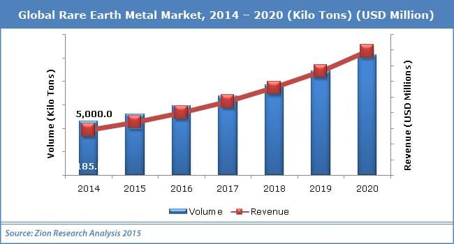

## Table of Contents

## What are rare earth minerals?

Rare earth minerals are a group of 17 elements that are found in the Earth's crust. They are called "rare earth" because they were once thought to be very hard to find, but they are actually quite common. These elements are important because they have special properties that make them useful in many different technologies. Some examples include magnets, batteries, and electronics like smartphones and computers.

Even though these minerals are not that rare, it can be hard and expensive to get them out of the ground and turn them into something useful. This is because they often come mixed together with other minerals, and separating them takes a lot of work. Most of the world's supply of rare earth minerals comes from China, which makes them important in global trade and technology.

## Why are rare earth minerals in high demand?

Rare earth minerals are in high demand because they are used in many important technologies that we use every day. Things like smartphones, computers, and electric cars all need rare earth minerals to work properly. For example, these minerals help make strong magnets for electric motors and tiny parts for electronic devices. As more people around the world start using these technologies, the need for rare earth minerals keeps growing.

Another reason for the high demand is that these minerals are hard to replace. They have special properties that other materials don't have, so it's tough to find alternatives. This means that even if the minerals are not that rare in the earth, getting them out and making them useful is a big challenge. Because of this, countries and companies are always looking for more ways to find and use rare earth minerals, which keeps the demand high.

## What industries rely on rare earth minerals?

Many industries rely on rare earth minerals because they help make products work better. The electronics industry uses these minerals in things like smartphones, computers, and TVs. They are important for making tiny parts that help these devices work well. The car industry also uses rare earth minerals, especially in electric cars. These minerals help make strong magnets that are used in the motors of electric cars, making them run smoothly and efficiently.

Another industry that depends on rare earth minerals is the renewable energy sector. Wind turbines, for example, use these minerals in their magnets to generate electricity from wind. Also, the military uses rare earth minerals in many high-tech weapons and equipment. These minerals are important for making things like night vision goggles and guidance systems for missiles. Because so many different industries need these minerals, the demand for them keeps growing.

## Can you name the most common rare earth minerals?

The most common rare earth minerals are cerium, neodymium, and lanthanum. Cerium is used a lot in car exhaust systems to help clean up the air we breathe. It's also used in glass and ceramics to make them stronger. Neodymium is really important for making strong magnets. These magnets are used in things like electric car motors and wind turbines. Lanthanum is used in batteries, especially in the kind that power hybrid cars.

Another common rare earth mineral is praseodymium, which is often used with neodymium to make even stronger magnets. These magnets are important for many electronics, like headphones and hard drives. Yttrium is another common one, and it's used in things like LED lights and superconductors. These minerals might sound complicated, but they're really important for making a lot of the technology we use every day.

## What are the uses of each high-demand rare earth mineral?

Cerium is a very important rare earth mineral. It's used a lot in car exhaust systems to help clean up the air we breathe. When cars burn gas, they make bad gases, but cerium helps turn those bad gases into safer ones. Cerium is also used in glass and ceramics to make them stronger and more resistant to heat. You might find cerium in things like sunglasses or in the glass of your oven door.

Neodymium is another high-demand rare earth mineral, mainly because it makes really strong magnets. These magnets are used in electric car motors, which help the cars run smoothly and efficiently. They're also used in wind turbines to help generate electricity from wind. Plus, neodymium magnets are in a lot of electronics, like headphones and hard drives, making them smaller and more powerful. Lanthanum is used in batteries, especially the kind that power hybrid cars. It helps make the batteries work better and last longer.

Praseodymium is often used together with neodymium to make even stronger magnets. These magnets are important for many electronics, helping them be smaller and more powerful. Yttrium is used in things like LED lights, making them bright and efficient. It's also used in superconductors, which are materials that can conduct electricity without losing any energy. These rare earth minerals might sound complicated, but they're really important for making a lot of the technology we use every day.

## How are rare earth minerals extracted and processed?

Rare earth minerals are found in the earth, often mixed with other minerals. To get them out, miners dig big holes in the ground or use machines to move dirt and rocks. They look for places where these minerals are more common. Once they find the right spot, they take out the rocks that have the minerals. This is called mining. After mining, the rocks are crushed into smaller pieces to make it easier to separate the rare earth minerals from other stuff.

After the rocks are crushed, the next step is to separate the rare earth minerals. This can be tricky because they are mixed with other minerals. One way to do this is by using chemicals that stick to the rare earth minerals but not to the other stuff. These chemicals help pull the rare earth minerals out. Another way is to use magnets, because some rare earth minerals are magnetic. Once the minerals are separated, they are turned into a pure form. This process can take a lot of steps and can be hard on the environment because it uses a lot of water and chemicals. After all this, the rare earth minerals are ready to be used in things like electronics and cars.

## What are the environmental impacts of mining rare earth minerals?

Mining rare earth minerals can hurt the environment a lot. When people dig for these minerals, they make big holes in the ground and move a lot of dirt and rocks. This can mess up the land and make it hard for plants and animals to live there. Also, mining uses a lot of water and chemicals to get the minerals out of the rocks. These chemicals can get into rivers and lakes, making the water dirty and unsafe for fish and other animals that live in the water.

Another big problem is the waste that comes from mining. After miners take out the rare earth minerals, they leave behind a lot of leftover rock and chemicals. This waste can have harmful stuff in it, like radioactive materials. If this waste is not taken care of properly, it can leak into the ground and water, making the area polluted for a long time. Because of these problems, people are trying to find better ways to mine rare earth minerals that are less harmful to the environment.

## What are the global supply and demand trends for rare earth minerals?

The demand for rare earth minerals is growing fast around the world. More and more people are using technology like smartphones, computers, and electric cars, which all need these minerals. Also, countries are trying to use more clean energy, like wind turbines, which also use rare earth minerals. Because of this, the need for these minerals keeps going up. China is the biggest supplier of rare earth minerals, but other countries are trying to find their own sources because they don't want to rely too much on one country.

On the supply side, it can be hard to get enough rare earth minerals. Mining these minerals can be expensive and bad for the environment, so not every country wants to do it. Also, it takes a lot of work to separate the minerals from the rocks they come in, which can slow down how quickly new supplies can be made available. Because of these challenges, the supply of rare earth minerals can struggle to keep up with the growing demand. This can make the minerals more expensive and can cause countries to look for new ways to get them, like recycling old electronics or finding new places to mine.

## Which countries are the leading producers of rare earth minerals?

China is the biggest producer of rare earth minerals. They have a lot of these minerals in their land and they have been mining them for a long time. China makes more than half of all the rare earth minerals in the world. Because of this, many countries depend on China for these important minerals. But China is trying to use less of its own minerals and is selling less to other countries, which makes other countries worried about where they will get their minerals.

Other countries are also trying to produce more rare earth minerals. The United States, Australia, and Myanmar are some of the other big producers. The United States used to produce a lot of these minerals but stopped for a while. Now, they are starting to mine them again because they want to be less dependent on China. Australia has big mines and is working to produce more. Myanmar has also started to produce more rare earth minerals in recent years. These countries are important because they help make sure there are enough minerals for everyone who needs them.

## What are the challenges in securing a stable supply of rare earth minerals?

Getting a steady supply of rare earth minerals can be tough. One big problem is that most of these minerals come from China. If China decides to sell less or if there are problems like trade fights, other countries might not get enough minerals. Also, mining these minerals is hard and expensive. It takes a lot of work to dig them out of the ground and even more work to separate them from other stuff in the rocks. This makes it hard for new mines to start up quickly.

Another challenge is the impact on the environment. Mining rare earth minerals can hurt the land, water, and air. Because of this, some places don't want to start new mines. It's also hard to find new places to mine because the minerals are often spread out and mixed with other stuff. Plus, the demand for these minerals keeps growing as more people use technology and clean energy. This means we need to find new ways to get these minerals, like recycling old electronics or finding new mining spots, to keep up with the need.

## How do geopolitical factors influence the rare earth minerals market?

Geopolitical factors play a big role in the rare earth minerals market because most of these minerals come from China. If China decides to limit how much they sell or if there are trade fights between countries, it can make it hard for other countries to get the minerals they need. This can make the minerals more expensive and cause problems for companies that use them in things like smartphones and electric cars. Countries that rely a lot on China for these minerals worry about what might happen if they can't get enough.

Because of these worries, some countries are trying to find their own sources of rare earth minerals. The United States, Australia, and Myanmar are working to mine more of these minerals so they don't have to depend so much on China. But starting new mines takes a lot of time and money, and there can be problems with the environment and local people not wanting mines in their areas. All of these geopolitical issues make the rare earth minerals market tricky and important to watch closely.

## What are the latest technological advancements in the recycling and substitution of rare earth minerals?

People are working on new ways to recycle rare earth minerals from old electronics. One way is to use special machines that can take apart things like old smartphones and computers to get the minerals out. These machines use magnets and chemicals to separate the minerals from other stuff. Recycling is good because it helps us use the minerals again instead of always mining new ones. It also helps the environment because it means less mining and less waste. Scientists are trying to make recycling easier and cheaper so more people can do it.

Another thing scientists are doing is trying to find other materials that can do the same jobs as rare earth minerals. This is called substitution. For example, they are working on new kinds of magnets that don't need rare earth minerals but can still be strong. These new magnets might use other metals like iron or cobalt. If they can make these new materials work well, it could mean we don't need as many rare earth minerals. This would help make sure we have enough minerals for everyone and could make things like electric cars and wind turbines cheaper to make.

## Key Rare Earth and Critical Minerals

The essential minerals that are currently recognized as critical due to their growing importance in modern technology and renewable energy solutions include lithium, nickel, cobalt, copper, graphite, and a variety of rare earth elements. Each of these minerals plays a crucial role in the technological advancements shaping contemporary society.

Lithium stands out as a key component due to its widespread use in the manufacturing of batteries for electric vehicles (EVs) and electronic devices. This alkali metal, known for its high energy density and long lifespan, is integral to lithium-ion batteries, which are the preferred choice for portable electronic devices and EVs. As the global push towards renewable energy sources intensifies, the demand for lithium is projected to continue its upward trajectory.

Nickel and cobalt are also critical, particularly in the context of battery storage technology and the production of stainless steel. Nickel is essential in cathode materials of batteries, enhancing their energy density and storage capacity. Similarly, cobalt contributes to battery stability and longevity but faces scrutiny over supply chain sustainability and ethical sourcing concerns.

Copper, another pivotal mineral, serves as a fundamental component in electrical wiring and motors due to its excellent conductivity properties. The transition to cleaner energy systems, which often require extensive electricity infrastructure, has significantly elevated the demand for copper.

Graphite is another mineral that has seen a surge in demand, primarily driven by its application in EV batteries. Its role in anodes of lithium-ion batteries is unmatched due to its ability to effectively conduct electricity and withstand high temperatures, which are vital traits for the efficient functioning of these power cells.

Furthermore, rare earth elements (REEs), despite being less visually prominent in the periodic table, are indispensable to various high-tech applications. These elements, which include neodymium, dysprosium, and praseodymium, are vital in producing powerful permanent magnets used in wind turbines, EVs, and numerous electronic devices.

The rising importance of these minerals highlights the need to secure sustainable and ethical supply chains, while concurrently developing technological innovations and alternative materials to mitigate potential environmental and social impacts associated with mining and processing activities.

## References & Further Reading

[1]: Roskill. (2021). ["Nickel: A Rapidly Changing Battery Raw Material."](https://www.globenewswire.com/news-release/2021/05/25/2235712/0/en/Roskill-Multiple-factors-at-play-as-the-dynamic-nickel-market-undergoes-further-transformation.html) Roskill Information Services.

[2]: Metalary. (2021). ["Rare Earths and Critical Minerals."](https://www.sciencedirect.com/science/article/pii/S2214790X24001060) Metalary.

[3]: U.S. Department of Commerce. (2019). ["A Federal Strategy to Ensure Secure and Reliable Supplies of Critical Minerals."](https://www.commerce.gov/data-and-reports/reports/2019/06/federal-strategy-ensure-secure-and-reliable-supplies-critical-minerals) U.S. Department of Commerce.

[4]: Graedel, T. E., Harper, E. M., Nassar, N. T., & Reck, B. K. (2015). ["On the Materials Basis of Modern Society."](https://pubmed.ncbi.nlm.nih.gov/24297915/) Proceedings of the National Academy of Sciences, 112(20), 6295-6300.

[5]: McLellan, B. C., Corder, G. D., Ali, S. H., & Green, S. (2012). ["Sustainability of Rare Earths—An Overview of the State of Knowledge."](https://www.researchgate.net/publication/277470366_Sustainability_of_Rare_Earths-An_Overview_of_the_State_of_Knowledge) Journal of Cleaner Production, 37, 38-43.

[6]: U.S. Geological Survey. (2021). ["Mineral Commodity Summaries 2021."](https://pubs.usgs.gov/publication/mcs2021) U.S. Geological Survey.

[7]: Jowitt, S. M., & Werner, T. T. (2018). ["The Critical Metals Report."](https://www.sciencedirect.com/science/article/abs/pii/S2452223617301256) Mining.com.

[8]: "Algorithmic Trading: A Practitioner's Guide" by Jeffrey Bacidore and Raj Mahajan (2016)

[9]: Hinton, G., Krizhevsky, A., & Sutskever, I. (2012). ["ImageNet Classification with Deep Convolutional Neural Networks."](https://dl.acm.org/doi/10.1145/3065386) Advances in Neural Information Processing Systems 25.