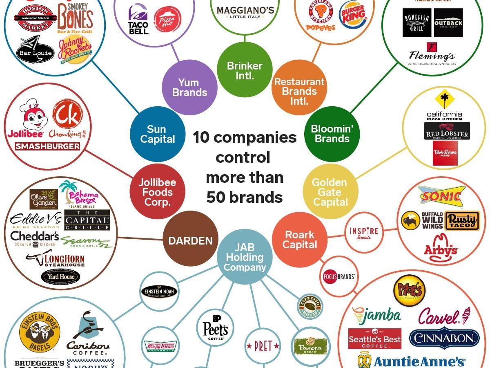

The food industry represents a vast and intricate global network, powered by some of the most prominent and influential restaurant corporations. These corporate entities not only shape dining trends but also significantly influence market dynamics, affecting the eating habits of millions around the world. This article aims to investigate the major players dominating the restaurant industry and the manner in which algorithmic trading influences their markets.

Specifically, the focus will be on companies such as McDonald's, Starbucks, and Compass Group. These corporations have established themselves as leaders in the sector, each with distinctive business models and diverse revenue streams. McDonald's, with its extensive franchise system, Starbucks, with its focus on brand loyalty and innovation, and Compass Group, a leader in contract food services, each offer unique insights into the industry.

Moreover, the advent of technology, especially algorithmic trading, has introduced a new dimension to financial operations within these companies. Algorithmic trading, characterized by the use of complex algorithms to execute trading decisions at high speed, is reshaping investment strategies on a large scale. Understanding its role provides valuable context regarding how these companies manage risks and optimize their profit margins.

This exploration will provide a comprehensive overview of the intricate interplay between these industry giants and technological advancements, offering insights into their sustained success in the food industry.

## Table of Contents

## Top Restaurant Companies

The restaurant industry is dominated by a few key players that set the tone for global market trends and consumer preferences. Among these industry leaders, McDonald's, Starbucks, and Chipotle stand out for their large market capitalizations, significant revenue streams, and expansive global reach. These companies have developed robust business models that allow them to sustain growth and maintain their leadership positions.

### McDonald's

McDonald's Corporation is a global entity unrivaled in terms of brand recognition and market presence. As of recent data, McDonald's operates over 38,000 outlets in more than 100 countries. The company employs a franchise model, where a significant portion of its revenue comes from franchisee fees and property income. This model reduces operational risks and capital expenditure, allowing McDonald's to focus on marketing and brand management.

McDonald's business strategy emphasizes localization and menu diversification. It adapts its offerings to cater to regional tastes while maintaining its core products, such as the Big Mac. Additionally, McDonald's invests heavily in technology, such as automated kiosks and mobile app services, to enhance customer convenience and streamline operations.

### Starbucks

Starbucks Corporation has established itself as a leader in the global coffeehouse chain market, with over 33,000 stores worldwide. The company's concept of the "third place" — a social hub between home and work — has been integral to its brand strategy, focusing on customer experience and high-quality coffee products.

Starbucks differentiates itself through a vertically integrated supply chain and commitment to ethical sourcing, which not only ensures quality control but also strengthens its brand image. The company has also embraced technology, offering mobile ordering and payment options to enhance customer engagement.

### Chipotle

Chipotle Mexican Grill is a prominent player in the fast-casual dining segment, known for its focus on fresh, responsibly sourced ingredients. With over 2,800 locations predominantly in the United States, Chipotle has built its brand on principles of sustainability and food integrity.

Chipotle's business model centers on a limited menu with customizable options, minimizing waste and optimizing efficiency. The company benefits from strong brand loyalty and has experimented with innovative technology, such as digital make-lines and AI-enhanced food preparation, to improve service speed and accuracy.

### Global Market Presence and Strategies

These companies' success is attributed to their effective market strategies and operational efficiency. McDonald's, Starbucks, and Chipotle all maintain substantial global footprints by adapting to local markets while standardizing operational procedures to ensure quality and efficiency. They leverage technology to improve customer experience, expand digital engagement, and optimize supply chain management, which further supports their competitive advantage.

By understanding the strategic approaches of McDonald's, Starbucks, and Chipotle, one gains insight into how these industry giants sustain their leadership in an ever-evolving market. Their ability to innovate and adapt continues to position them at the forefront of the restaurant industry, driving trends that influence the dining habits of millions worldwide.

## The Role of Algorithmic Trading in the Restaurant Industry

Algorithmic trading, often referred to as algo trading, is increasingly influential in reshaping the financial strategies of major restaurant corporations. It utilizes complex algorithms to make trading decisions based on market data and pre-defined instructions, significantly impacting how companies in the restaurant industry manage their finances and investment portfolios.

At its core, [algorithmic trading](/wiki/algorithmic-trading) facilitates high-speed decision-making, transcending human capabilities in processing vast quantities of data. Restaurant giants use these sophisticated trading strategies to enhance profit margins and manage risks effectively. The systems can analyze market signals, assess [order book](/wiki/order-book-trading-strategies) data, and [factor](/wiki/factor-investing) in macroeconomic indicators to optimize trading actions, thus aiding in safeguarding these corporations against volatile market conditions.

Algorithmic trading offers significant benefits to restaurant companies. Firstly, its speed and efficiency are unmatched. By using algorithms, companies can execute trades in milliseconds, ensuring they capitalize on fleeting market opportunities and maintain [liquidity](/wiki/liquidity-risk-premium). This speed facilitates [arbitrage](/wiki/arbitrage) opportunities where minor price differences can be exploited across different exchanges or markets. Additionally, algo trading assists in portfolio diversification. Algorithms can analyze historical and real-time data to predict asset performance, leading to strategic adjustments that reduce risk exposure and improve returns.

Moreover, algorithmic trading helps in reducing transaction costs and enhancing pricing efficiency by diminishing the bid-ask spreads through rapid transactions. These cost reductions contribute positively to the bottom line, which is crucial in an industry with typically tight profit margins.

Despite its advantages, embracing algorithmic trading can pose challenges for restaurant companies. The complexity of algorithm development requires significant expertise and investment in advanced IT infrastructure. Furthermore, reliance on algorithmic models introduces systemic risks, as errors in the algorithms can lead to cascading failures in trading operations. These errors, if not promptly identified and rectified, could lead to substantial financial losses.

Market regulators also pose challenges due to their stringent oversight over algorithmic trading activities. Compliance with these regulatory standards requires additional resources and careful monitoring to ensure that trading practices meet all legal requirements.

In summary, algorithm trading is proving to be a game-changer for large restaurant corporations by offering tools to manage their investments more proficiently. It amalgamates technology with finance to improve decision-making, efficiency, and profitability. However, the adoption of such systems necessitates navigating a landscape of complexities, from technical challenges to regulatory compliance.

## Case Studies: McDonald's and Starbucks

McDonald's and Starbucks represent two of the most prominent figures in the global restaurant industry, recognized for their innovative approaches to financial management and operational efficiency. Both companies leverage technology and innovation extensively to maintain their competitive advantage.

### McDonald's Approach to Financial Management and Innovation

McDonald's has embraced technology as a critical component of its strategy to enhance financial management and operations. The company leverages data analytics to optimize its supply chain, ensuring that it aligns with consumer demands and cost efficiencies. By implementing predictive analytics, McDonald's can forecast demand more accurately, thus minimizing inventory risks and reducing wastage.

The company's use of algorithmic tools extends to pricing strategies. Algorithms analyze various data inputs, such as customer purchasing habits, competitor pricing, and local economic conditions, to recommend optimal pricing. This dynamic pricing model allows McDonald’s to maximize revenue without compromising on customer satisfaction.

Moreover, McDonald's investment in the Internet of Things (IoT) and smart technology in its outlets has streamlined operations. These technologies contribute to the efficient management of resources, from energy consumption to inventory control, further reducing operational costs and enhancing profitability.

### Starbucks' Utilization of Technology

Starbucks is renowned for its innovative use of technology to enhance both customer experience and operational efficiency. Integral to its financial management approach is the use of mobile technology to drive sales and collect data. The Starbucks mobile app is a prominent example, serving as a platform for customer engagement while also functioning as a critical data collection tool. The data gathered through the app feeds into the company's algorithms, enabling them to predict customer behavior and preferences more precisely.

Algorithmic trading and data analytics also play a significant role in Starbucks’ supply chain management. By analyzing weather patterns, geopolitical factors, and market trends, Starbucks optimizes its procurement strategies to ensure cost-effective sourcing of raw materials, predominantly coffee beans. This approach mitigates risks associated with price [volatility](/wiki/volatility-trading-strategies) and supply chain disruptions.

Furthermore, Starbucks has pioneered the use of [machine learning](/wiki/machine-learning) to personalize customer experiences. Their recommendation engine uses customer data to suggest products, enhancing customer engagement and driving sales. This level of personalization not only boosts individual transaction values but also enhances customer loyalty, a critical factor in Starbucks' sustained market leadership.

### Optimization and Streamlining Operations through Algorithmic Tools

Both McDonald's and Starbucks employ algorithmic tools beyond just financial forecasting and supply chain management. These tools aid in workforce management by predicting customer foot traffic and optimizing staffing schedules accordingly. By aligning staff levels with predicted demand, both companies can maintain service quality while controlling labor costs.

The integration of advanced technologies into their business models underscores McDonald's and Starbucks' commitment to leveraging innovation to sustain their market leadership. By investing in technologies that optimize supply chains and streamline operations, these giants not only enhance their operational efficiency but also create a more resilient business model capable of adapting to market changes and consumer demands. These strategic investments in technology and algorithmic tools are pivotal in maintaining their leadership positions in the competitive restaurant industry.

## Emerging Trends and Future Outlook

The restaurant industry is undergoing significant evolution, driven by digital transformation and technological innovations. These changes are reshaping restaurant operations and potentially altering consumer experiences. One major trend involves the increasing use of technology to streamline operations, enhance customer engagement, and improve decision-making processes within restaurants. 

Digital transformation is evident in the adoption of data analytics and [artificial intelligence](/wiki/ai-artificial-intelligence). Restaurants are leveraging these technologies to optimize menus, reduce waste, and improve customer service. Advanced analytics enable businesses to understand consumer preferences better, allowing for personalized marketing and more efficient supply chain management. For instance, predictive analytics can forecast demand and suggest optimal stock levels, reducing the risk of overstocking or stockouts.

Another significant trend is the rise of delivery and mobile ordering platforms. The COVID-19 pandemic has accelerated this trend, with consumers increasingly opting for the convenience of ordering food online. Restaurants have responded by integrating third-party delivery services like Uber Eats and DoorDash into their operations, or by developing their proprietary apps. This shift not only meets consumer demand but also opens new revenue streams and expands customer reach.

Moreover, the implementation of automation and robotics in restaurant operations is gaining [momentum](/wiki/momentum). From robots flipping burgers to automated kiosks taking orders, these innovations can significantly reduce labor costs and improve efficiency. However, the adoption of such technologies must be balanced with maintaining the quality of customer service, which remains a critical differentiator in the restaurant industry.

Looking forward, global economic factors and changing consumer preferences are likely to influence the industry's dynamics. Economic uncertainties, such as inflation and fluctuating commodity prices, could affect operating costs and profit margins. Restaurants may need to adapt by adjusting menu prices or sourcing ingredients differently to maintain profitability.

Consumer preferences are also shifting, with increased demand for healthier and sustainable food options. The growing emphasis on sustainability is driving restaurants to adopt environmentally friendly practices, such as reducing plastic usage and sourcing locally. This trend aligns with consumers’ desire for transparency and ethical practices, likely influencing brand loyalty and consumer choices in the future.

Overall, the restaurant industry is poised for transformation as these technological advancements and evolving consumer preferences take hold. Business leaders must stay agile to leverage these trends effectively while navigating the associated challenges.

## Conclusion

Understanding the significance of leading entities within the restaurant industry and the technological advancements shaping their operations is crucial for investors and industry stakeholders. The dominance of industry giants such as McDonald's and Starbucks lies not just in their expansive global market presence but also in their adaptability to integrating cutting-edge technologies like algorithmic trading into their financial operations.

Algorithmic trading is positioned to redefine the restaurant industry by optimizing investment strategies and enhancing efficiency in financial management. As companies increasingly adopt algorithmic models, they can analyze vast datasets faster and make informed, strategic decisions that align with dynamic market conditions. This integration allows these corporations to effectively manage risks and maximize profit margins, thereby strengthening their competitive edge.

For those evaluating potential investments in the food and restaurant sectors, it's essential to consider how these technological advancements impact the long-term sustainability and growth potential of restaurant corporations. The ability to leverage technology for operational excellence and financial optimization is becoming a critical differentiator. As the industry continues to evolve, staying informed about how these factors shape business trajectories will be vital for making astute investment choices.

## References & Further Reading

[1]: Bergstra, J., Bardenet, R., Bengio, Y., & Kégl, B. (2011). ["Algorithms for Hyper-Parameter Optimization."](https://dl.acm.org/doi/10.5555/2986459.2986743) Advances in Neural Information Processing Systems 24.

[2]: ["Advances in Financial Machine Learning"](https://www.amazon.com/Advances-Financial-Machine-Learning-Marcos/dp/1119482089) by Marcos Lopez de Prado

[3]: ["Evidence-Based Technical Analysis: Applying the Scientific Method and Statistical Inference to Trading Signals"](https://www.amazon.com/Evidence-Based-Technical-Analysis-Scientific-Statistical/dp/0470008741) by David Aronson

[4]: ["Machine Learning for Algorithmic Trading"](https://github.com/stefan-jansen/machine-learning-for-trading) by Stefan Jansen

[5]: ["Quantitative Trading: How to Build Your Own Algorithmic Trading Business"](https://www.amazon.com/Quantitative-Trading-Build-Algorithmic-Business/dp/1119800064) by Ernest P. Chan