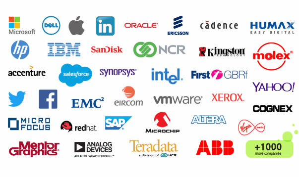

## Table of Contents

## What defines a software company?

A software company is a business that creates, sells, and supports software products. These products can be anything from apps on your phone to big programs that businesses use. The main thing these companies do is make software that helps people or other businesses do things better or easier.

These companies often have teams of people who write code, design how the software looks, and test it to make sure it works well. They also have people who help customers use the software and fix any problems that come up. Some software companies focus on making new and different kinds of software, while others might work on making their existing software even better.

## How is the size of a software company typically measured?

The size of a software company is usually measured by looking at how many people work there and how much money they make. The number of employees is a simple way to see how big a company is. A small software company might have just a few people, while a big one could have thousands. The amount of money a company makes, or its revenue, is another important measure. Bigger companies usually make more money, but sometimes a smaller company can make a lot of money if it has a really popular product.

Another way to measure the size of a software company is by looking at its market share. This means how much of the market for a certain type of software the company controls. For example, if a company sells a lot of its software compared to other companies, it has a big market share. This can show that the company is big and important in its field. Sometimes, the size of a company's offices or the number of places it has offices can also be used to measure its size, but this is less common.

## What are some of the largest software companies by revenue?

Some of the biggest software companies, when we look at how much money they make, are Microsoft, Oracle, and SAP. Microsoft makes a lot of money from its Windows operating system and Office software, which many people and businesses use every day. They also make money from their cloud services like Azure. Oracle is known for its database software, which helps big companies keep track of a lot of information. They also have cloud services and other software that businesses use. SAP focuses on software that helps businesses run better, like managing their money and keeping track of what they sell.

Another big software company is Adobe, which makes a lot of money from its creative software like Photoshop and its document software like Acrobat. Salesforce is also very big; it makes software that helps businesses manage their customers and sales. These companies are all very important because they make a lot of money and their software is used by a lot of people and businesses around the world.

## Which software companies have the highest market capitalization?

The biggest software companies by market capitalization are Microsoft and Apple. Market capitalization means the total value of all the company's shares. Microsoft is very big because it makes a lot of software that people and businesses use, like Windows and Office. They also have cloud services like Azure that help them make a lot of money. Apple is also very big, but they make more than just software. They make phones, computers, and other devices, but their software like the operating system for their devices and services like the App Store also help them be one of the biggest companies.

Another big software company by market capitalization is Alphabet, the company that owns Google. Google makes a lot of software that people use every day, like the Google search engine, Google Docs, and the Android operating system. They also have a lot of other businesses that help them make money, like their cloud services and advertising. These three companies are some of the biggest in the world because a lot of people use their software and they make a lot of money.

## How do employee numbers factor into determining the size of software companies?

The number of employees is a key way to figure out how big a software company is. If a company has a lot of people working for it, it's usually thought of as a big company. For example, a small software company might have just a few people, maybe 10 or 20. But a big company like Microsoft or Google has thousands of employees all over the world. The more employees a company has, the more work it can do, and the more different kinds of software it can make.

But the number of employees is not the only thing that matters. Sometimes, a company with fewer employees can still be very important if it makes a lot of money or if its software is used by a lot of people. Also, big companies might have many employees, but not all of them work on making software. Some might work in other parts of the business, like selling the software or helping customers. So, while the number of employees is a good way to see how big a company is, it's just one part of the picture.

## What are the key products or services offered by the largest software companies?

Microsoft is one of the biggest software companies and they make a lot of different things. Their most famous products are the Windows operating system, which runs on many computers, and Microsoft Office, which has programs like Word and Excel that people use at work and school. They also have a big cloud service called Azure that helps businesses keep their information online. Microsoft makes gaming software too, like the Xbox and games for it. They also have a search engine called Bing.

Another big company is Apple, which makes the macOS operating system for their computers and iOS for their iPhones and iPads. They also have the App Store where people can download apps for their devices. Apple makes software like iWork, which is like Microsoft Office but for Apple devices. They also have services like Apple Music for listening to music and iCloud for storing things online.

Alphabet, which owns Google, is also very big. Google makes the Android operating system for phones and tablets. They have a search engine that people use to find things on the internet, and they also make software like Google Docs and Google Sheets, which are like Microsoft's Office programs but free to use online. Google also has a big cloud service called Google Cloud Platform and they make a lot of money from advertising on their search engine and other websites.

## How have the rankings of the largest software companies changed over the past decade?

Over the past ten years, the rankings of the biggest software companies have changed a bit. Microsoft has stayed at the top because they keep making a lot of money from Windows, Office, and their cloud service Azure. They've also gotten into gaming with Xbox and have services like Bing. Apple has also been near the top because they make the software for their iPhones and iPads, like iOS and macOS, and they have the App Store and services like Apple Music. They've grown a lot because more people are using their devices and software.

Alphabet, the company that owns Google, has also been very big. Google's search engine, Android operating system, and cloud services like Google Cloud Platform have helped them stay important. They make a lot of money from ads too. Over the years, other companies like Oracle and SAP have stayed big but haven't moved up in the rankings as much. Oracle keeps making money from their database software and cloud services, while SAP focuses on software for businesses. Adobe and Salesforce have grown a lot too, but they are still behind the top three.

## What role do acquisitions and mergers play in the growth of software companies?

Acquisitions and mergers are really important for software companies to grow. When a big company buys a smaller one, it can get new software or technology that it didn't have before. This helps the big company offer more things to its customers. For example, Microsoft bought LinkedIn, which helped them get into the business of connecting people for work. Mergers happen when two companies decide to join together to become one bigger company. This can help them share their knowledge and resources to make better software and reach more people.

These deals can also help a company grow faster than if they tried to build everything themselves. It's like taking a shortcut. Instead of spending a lot of time and money to make new software, a company can just buy one that already exists. This can make them bigger and more powerful in the market. But, it's not always easy. Sometimes, the companies have a hard time working together after the deal, and it can be expensive. Still, when it works well, acquisitions and mergers can help a software company become one of the biggest and most important in the world.

## How do global economic conditions affect the performance of large software companies?

Global economic conditions can really change how well big software companies do. When the economy is doing well, businesses and people have more money to spend on software. This means companies like Microsoft, Apple, and Google can sell more of their products and services. They might make more money from things like cloud services, software subscriptions, and ads. But when the economy is not doing so well, like during a recession, businesses and people might not want to spend as much. They might cut back on buying new software or using cloud services, which can hurt the big software companies' profits.

Also, changes in the economy can affect what kind of software people need. For example, during tough economic times, businesses might look for software that helps them save money or work better with less. This can be good for companies that make software for managing money or helping teams work together. On the other hand, if the economy is growing, businesses might spend more on software that helps them grow, like customer relationship management tools or new apps. So, big software companies need to watch the economy and be ready to change what they offer to keep doing well.

## What are the technological trends driving the growth of the largest software companies?

The biggest software companies are growing because of some important tech trends. One big trend is cloud computing. Companies like Microsoft with Azure, Google with Google Cloud Platform, and Amazon with AWS are making a lot of money from it. Cloud computing lets businesses keep their information online and use software without needing to buy a lot of computers. This is really helpful for businesses, and it's making these companies bigger and more important. Another trend is [artificial intelligence](/wiki/ai-artificial-intelligence) (AI). AI is used in things like search engines, voice assistants, and even in making new software. Microsoft, Google, and others are using AI to make their products better and to offer new services.

Another trend is mobile technology. More and more people use their phones and tablets for everything, so companies like Apple and Google are making a lot of money from their mobile operating systems, iOS and Android. They also make money from app stores where people can buy apps and games. The last big trend is cybersecurity. As more things happen online, keeping information safe is really important. Companies like Microsoft and others are making software to protect businesses and people from hackers. These trends are helping the biggest software companies grow and stay important in the tech world.

## How do the largest software companies invest in research and development?

The biggest software companies put a lot of money into research and development (R&D) because they want to keep making new and better software. Companies like Microsoft, Google, and Apple spend billions of dollars each year on R&D. They do this to come up with new ideas and to make their current products even better. For example, Microsoft invests in things like cloud computing and AI to make Azure and other products better. Google works on improving its search engine and developing new AI technologies. Apple focuses on making its devices and software, like iOS and macOS, even more user-friendly and powerful.

These companies have big teams of people who work on R&D. They have scientists, engineers, and other experts who think of new ideas and try them out. Sometimes, they work with universities or other companies to share knowledge and come up with new things. They also buy smaller companies that have cool new technology, which helps them grow faster. By spending a lot on R&D, these big software companies can stay ahead of others and keep making things that people and businesses want to use.

## What strategies do the largest software companies use to maintain their market position?

The biggest software companies use a few important strategies to stay at the top. One big way is by always making their products better. They spend a lot of money on research and development to come up with new ideas and improve what they already have. For example, Microsoft keeps updating Windows and Office, and Google keeps making its search engine better. They also listen to what customers want and need, so they can make software that people really like. Another way is by buying other companies that have cool new technology. This helps them add new things to what they offer without having to start from scratch.

Another strategy is to focus on growing areas like cloud computing and artificial intelligence. Companies like Microsoft, Google, and Amazon are all working hard on their cloud services because more and more businesses want to use them. They also use AI to make their products smarter and more helpful. For example, Google uses AI to make its search engine better at understanding what people are looking for. These companies also make sure they have a strong brand that people trust. They do this by always trying to do a good job and by helping their customers when they have problems.

Lastly, these big software companies work hard to keep their customers happy. They offer good customer service and make sure their software is easy to use. They also keep coming up with new features and updates to keep people interested. By doing all these things, they can stay ahead of other companies and keep their spot as the biggest and most important software companies in the world.

## Overview of the Largest Software Companies

Microsoft, Oracle, and SAP are prominent leaders in the software industry, exerting significant influence over the global market. These companies offer a range of products and services that cater to diverse business needs and technological advancements, reinforcing their dominance in the industry.

### Revenue Models and Streams

1. **Cloud Computing**: Microsoft has established itself as a key player in the cloud computing arena with its Azure platform. Azure provides a broad range of cloud services, including computing, analytics, and networking, which cater to businesses of all sizes [1]. This segment has contributed substantially to Microsoft's revenue growth, playing a pivotal role in its business strategy. Oracle, with its Oracle Cloud Infrastructure, and SAP, through its SAP HANA Enterprise Cloud, also emphasize cloud solutions to enhance their service offerings and generate consistent revenue streams.

2. **Enterprise Software**: Enterprise software remains a core component of these companies' portfolios. Microsoft's suite includes products like Microsoft Office and Dynamics 365, which continue to be staples in enterprise environments [2]. Oracle's enterprise systems focus on database management, applications, and middleware, forming the backbone of its business operations. Similarly, SAP's strength lies in its enterprise resource planning (ERP) software, which integrates various business functions and is widely utilized by organizations worldwide.

3. **Data Management Solutions**: These firms also prioritize data management as businesses increasingly rely on data-driven decision-making. Oracle's database products are renowned for managing complex data environments efficiently. SAP's data solutions are designed to streamline data processes across organizations, offering cloud and on-premise deployments to meet different business needs.

### Software-as-a-Service (SaaS) Model

The transition to software-as-a-service (SaaS) models has been instrumental in enhancing the financial performance and sustainability of these software giants. SaaS provides steady, recurring revenue streams, which has proven beneficial for investors and company stability. Subscriptions and licenses form a significant part of Microsoft’s revenue, while Oracle's cloud applications have shifted towards subscription-based models. SAP has also embraced SaaS, allowing customers to access software and services in a flexible, scalable manner. This strategic shift has allowed these firms to maintain robust cash flows and foster customer loyalty through regular updates and service improvements.

### Market Dominance and Business Strategies

Microsoft, Oracle, and SAP maintain their market dominance through continuous innovation, strategic partnerships, and acquisitions. These companies invest substantially in research and development to introduce new products and improve existing offerings, ensuring they remain competitive. Microsoft's acquisition of LinkedIn and Oracle's purchasing of NetSuite exemplify their strategies to enhance capabilities and expand market reach.

In summary, Microsoft's focus on comprehensive cloud solutions, Oracle's dominance in database technologies, and SAP's stronghold in ERP systems exemplify their commanding positions in the software sector. Their ability to adapt to emerging technologies and trends positions them well for future growth in a rapidly evolving market environment.

## References & Further Reading

[1]: Bergstra, J., Bardenet, R., Bengio, Y., & Kégl, B. (2011). ["Algorithms for Hyper-Parameter Optimization."](https://dl.acm.org/doi/10.5555/2986459.2986743) Advances in Neural Information Processing Systems 24.

[2]: ["Advances in Financial Machine Learning"](https://www.amazon.com/Advances-Financial-Machine-Learning-Marcos/dp/1119482089) by Marcos Lopez de Prado

[3]: ["Evidence-Based Technical Analysis: Applying the Scientific Method and Statistical Inference to Trading Signals"](https://www.amazon.com/Evidence-Based-Technical-Analysis-Scientific-Statistical/dp/0470008741) by David Aronson

[4]: ["Machine Learning for Algorithmic Trading"](https://github.com/stefan-jansen/machine-learning-for-trading) by Stefan Jansen

[5]: ["Quantitative Trading: How to Build Your Own Algorithmic Trading Business"](https://www.amazon.com/Quantitative-Trading-Build-Algorithmic-Business/dp/1119800064) by Ernest P. Chan