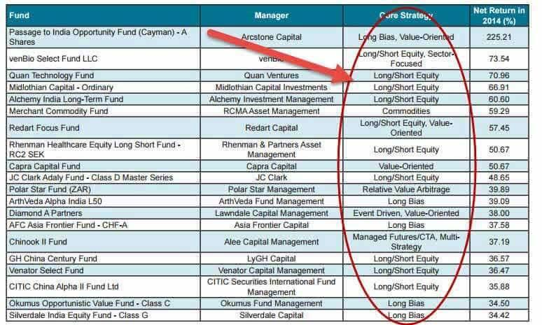

## Table of Contents

## What is a hedge fund?

A hedge fund is a type of investment fund that pools money from investors to invest in various assets, like stocks, bonds, and commodities. The goal is to make money for the investors, often by using strategies that are different from traditional investing. Hedge funds are usually managed by professional money managers who can make quick decisions and use special techniques to try to beat the market.

Unlike mutual funds, which are open to the general public, hedge funds are typically only available to wealthy individuals and institutions. This is because they often require a high minimum investment and are less regulated by the government. Hedge fund managers can take bigger risks in hopes of earning higher returns, but this also means that the investments can be more volatile and potentially lead to bigger losses.

## How do hedge funds differ from mutual funds?

Hedge funds and mutual funds are both types of investment funds, but they have some big differences. Hedge funds are usually only for rich people and big organizations because they need a lot of money to start investing. They can use special strategies that might be riskier but can also make more money. These strategies can include betting against the market or using borrowed money to invest more. Because of this, hedge funds are not watched as closely by the government as mutual funds are.

Mutual funds, on the other hand, are open to everyone. You can start investing with less money than you need for a [hedge fund](/wiki/hedge-fund-trading-strategies). They follow rules set by the government to make sure they are safe for everyone to invest in. Mutual funds usually just buy stocks, bonds, or other investments and hold onto them, hoping they will grow over time. They are less risky than hedge funds but might not make as much money either. So, while hedge funds can be exciting and potentially more profitable, mutual funds are more stable and accessible to the average person.

## What are the common strategies employed by hedge funds?

Hedge funds use a bunch of different ways to try to make money for their investors. One common strategy is called "long/short equity." This means they buy stocks they think will go up in price (that's the "long" part) and sell stocks they think will go down in price (that's the "short" part). By doing both at the same time, they hope to make money no matter which way the market goes. Another strategy is "market neutral," where they balance their investments so that they are not affected by overall market movements. They do this by making sure their long and short positions cancel each other out.

Another popular strategy is "[global macro](/wiki/global-macro-strategy)," where hedge funds bet on big economic trends around the world. They might invest in different countries' currencies, interest rates, or commodities like oil and gold, based on what they think will happen in the global economy. "Event-driven" strategies focus on specific events like mergers, acquisitions, or company restructurings. Hedge funds try to predict how these events will affect stock prices and make their moves accordingly. These are just a few examples, but hedge funds can get really creative with their strategies, always looking for new ways to beat the market.

## Who are the key players in the hedge fund industry?

Some of the biggest names in the hedge fund world are people like Ray Dalio from Bridgewater Associates, which is the largest hedge fund in the world. Another well-known person is George Soros, who started the Soros Fund Management. These guys are famous for making big bets on the economy and sometimes making huge profits. There are also firms like Renaissance Technologies, run by Jim Simons, which uses math and computers to pick investments. They are known for their super smart strategies that other people can't easily copy.

Besides these big names, there are lots of other important hedge funds and people who run them. For example, Ken Griffin's Citadel is another giant in the industry, known for trading in lots of different markets. Then there's Paul Singer from Elliott Management, who is famous for investing in distressed companies and trying to turn them around. These key players not only manage a lot of money but also influence how the whole industry works. They often come up with new ideas and ways to invest that other hedge funds try to follow.

## What criteria are used to determine the leading hedge funds?

Leading hedge funds are usually judged by how much money they make for their investors. This is called their "return on investment." If a hedge fund can make a lot of money compared to other funds, it gets a high ranking. Another important thing is how much risk they take to get those returns. Funds that make good money without taking too many risks are seen as the best. Also, the size of the fund matters. Bigger funds with more money to invest are often seen as leaders because they have more influence in the market.

Another way to tell if a hedge fund is a leader is by looking at how long it has been around and how stable it is. Funds that have been successful for many years are respected because they have proven they can handle different market conditions. The reputation of the people running the fund is also important. If the managers are well-known and respected, their fund is more likely to be seen as a leader. Finally, awards and recognition from financial magazines and organizations can boost a fund's status as a top player in the industry.

## How has the performance of leading hedge funds been over the past decade?

Over the past decade, the performance of leading hedge funds has been a bit of a mixed bag. Some hedge funds did really well, making big profits for their investors. For example, funds like Renaissance Technologies and Bridgewater Associates had years where they beat the market by a lot. But not all hedge funds were so lucky. Some struggled to make money, especially during times when the stock market was doing well. Overall, the average return for hedge funds was okay, but it wasn't as good as just investing in the stock market through an index fund.

The reason for this mixed performance is that hedge funds use different strategies. Some strategies worked better than others depending on what was happening in the economy. For instance, funds that bet on big economic changes did well during times of uncertainty, like during the early years of the decade when there were big swings in the market. But when the market was calm and just going up, these same funds didn't do as well. So, while some leading hedge funds were able to navigate the ups and downs and come out on top, others found it hard to keep up with the simpler, less risky investments like index funds.

## What are the largest hedge funds by assets under management?

The biggest hedge fund in the world right now is Bridgewater Associates, started by Ray Dalio. They have over $140 billion in assets under management. Bridgewater is famous for using a strategy called "global macro," where they bet on big economic trends around the world. Another giant is AQR Capital Management, which has around $90 billion in assets. They focus on using math and data to pick investments, a strategy known as "quantitative investing."

Renaissance Technologies, run by Jim Simons, is also one of the largest, with about $75 billion in assets. They are known for their super smart computer-based strategies that other people can't easily copy. Citadel, led by Ken Griffin, is another big player with around $55 billion in assets. They trade in lots of different markets and are known for being very good at it. These funds are the leaders because they manage a lot of money and have a big impact on the financial world.

## How do leading hedge funds manage risk?

Leading hedge funds manage risk by using a bunch of different methods. One big way is by spreading out their investments, which is called "diversification." Instead of putting all their money in one thing, they invest in lots of different things like stocks, bonds, and commodities. This way, if one investment goes down, it doesn't hurt them as much because their other investments might still be doing well. They also use something called "hedging," where they make bets that will help protect them if the market goes the wrong way. For example, if they think a stock might go down, they might buy something that will make money if that stock does go down.

Another way they manage risk is by using fancy computer models and data to figure out how risky their investments are. They look at things like how much the price of an investment might move up or down, and they try to keep their overall risk at a level they are comfortable with. They also keep a close eye on the market and are ready to change their strategies quickly if things start to look risky. By doing all these things, leading hedge funds try to make sure they can still make money for their investors even when the market is unpredictable.

## What are the fee structures typically associated with top hedge funds?

Top hedge funds usually charge their investors two kinds of fees. The first one is called the "management fee," which is a percentage of the total money the investors have put into the fund. This fee is usually around 2% of the assets under management. It's like a yearly charge for the fund managers to run the fund and do all the work needed to pick investments. The second fee is called the "performance fee," which is a percentage of the profits the fund makes. This fee is often around 20% of the gains. So, if the fund does really well and makes a lot of money, the managers get a big bonus.

These fees can add up, making hedge funds more expensive than other types of investments like mutual funds. But investors are often willing to pay these high fees because they hope the hedge fund managers can make even more money for them. The idea is that the managers are so good at what they do that the extra returns they bring in will be worth the extra cost. However, it's important for investors to think carefully about these fees and make sure they understand how they might affect their overall returns.

## How do regulatory environments affect the operations of leading hedge funds globally?

Regulatory environments around the world have a big impact on how leading hedge funds operate. In the United States, hedge funds are watched by the Securities and Exchange Commission (SEC). The SEC has rules that hedge funds need to follow, like registering if they manage a lot of money and telling the government about their investments. These rules are meant to protect investors and make sure the market is fair. But they can also make it harder for hedge funds to do some of the things they want to do, like using a lot of borrowed money or making secret deals.

In Europe, the rules can be even stricter. The European Union has something called the Alternative Investment Fund Managers Directive (AIFMD), which puts a lot of limits on what hedge funds can do. For example, they have to tell the government a lot more about their investments and how much risk they are taking. This can make it harder for hedge funds to be flexible and take quick action in the market. But it also helps make sure that hedge funds are being careful with their investors' money. So, while regulations can limit what hedge funds can do, they also help keep the financial system safe and fair for everyone.

## What role do leading hedge funds play in global financial markets?

Leading hedge funds play a big role in global financial markets because they manage a lot of money and can influence how the market moves. When these big hedge funds buy or sell a lot of stocks, bonds, or other investments, it can make the prices of those investments go up or down. This is because they have so much money that their actions can change what other people think about the market. For example, if a big hedge fund starts buying a certain stock, other investors might think that stock is a good investment and start buying it too, which can make the price go up even more.

Besides moving the market, leading hedge funds also help make it more efficient. They do a lot of research and use smart strategies to find the best investments. This helps set prices that are more accurate because hedge funds are always looking for deals and trying to figure out what things are really worth. When they find something that is priced wrong, they buy or sell it until the price is right. This can make the whole market work better because it helps make sure that investments are priced fairly. So, even though hedge funds can be risky and sometimes controversial, they play an important part in keeping the global financial markets running smoothly.

## What are the future trends and challenges facing the leading hedge funds?

Leading hedge funds are facing a few big trends and challenges in the future. One trend is the growing use of technology and data. Hedge funds are using more computers and math to pick investments, which can help them make better decisions and find new ways to make money. But this also means they need to keep up with the latest technology and hire smart people who can use it. Another trend is that investors are looking for more transparency and lower fees. They want to know more about what the hedge funds are doing with their money and they don't want to pay as much for it. This can make it harder for hedge funds to keep their investors happy and make enough money to cover their costs.

The challenges for leading hedge funds are also important to think about. One big challenge is competition. There are more hedge funds now than ever before, and they are all trying to do the same thing: make money for their investors. This means hedge funds have to work harder to stand out and do better than their competitors. Another challenge is regulation. Governments around the world are making more rules for hedge funds to follow, which can limit what they can do and make it harder for them to take risks. But if hedge funds can adapt to these trends and challenges, they can still play a big role in the global financial markets and keep making money for their investors.

## Top Hedge Funds Utilizing Algorithmic Trading

Several hedge funds have effectively integrated [algorithmic trading](/wiki/algorithmic-trading) strategies, establishing themselves as leaders in the financial world. 

Renaissance Technologies stands out as a pioneer in algorithmic trading, primarily through its Medallion Fund. This fund is renowned for using complex quantitative data models to inform its trading decisions. Founded by mathematician James Simons, Renaissance Technologies employs advanced mathematical techniques and statistical analyses to identify patterns in historical data and predict future market movements. The Medallion Fund's success is attributed to its ability to process and analyze large datasets, enabling it to make highly informed trading decisions.

Two Sigma Investments focuses heavily on technology and data science to develop predictive models and execute trades. By leveraging [machine learning](/wiki/machine-learning) and [artificial intelligence](/wiki/ai-artificial-intelligence), Two Sigma is capable of uncovering and exploiting market inefficiencies. Its approach involves the collection and analysis of vast amounts of data, from financial metrics to unconventional data sources like weather patterns and social media trends. This data-driven strategy allows Two Sigma to adapt to ever-changing market conditions and maintain a competitive edge.

AQR Capital Management combines quantitative research with algorithmic trading to capitalize on market inefficiencies. Co-founded by Cliff Asness, AQR employs a systematic approach to investment that relies on rigorous quantitative analysis. The fund explores various strategies, including [arbitrage](/wiki/arbitrage), [fundamental analysis](/wiki/fundamental-analysis), and [momentum](/wiki/momentum), to enhance returns. AQR’s use of algorithms facilitates the swift analysis of market trends and optimization of investment strategies across different asset classes.

Bridgewater Associates, the largest hedge fund globally, integrates both fundamental and quantitative principles in its investment strategies. Founded by Ray Dalio, Bridgewater employs a systematic approach known as "Pure Alpha," which blends traditional economic theories with quantitative analysis. The fund’s algorithms are designed to interpret macroeconomic data and anticipate economic shifts, allowing Bridgewater to make informed investment decisions. This combination of data-driven insights and fundamental analysis enables the firm to navigate complex market environments and achieve superior returns.

These leading hedge funds demonstrate the significant impact of algorithmic trading on modern financial strategies. By utilizing advanced technologies and vast datasets, they are able to optimize their trading activities, manage risk effectively, and maintain a competitive advantage in the financial markets.

## References & Further Reading

[1]: Bergstra, J., Bardenet, R., Bengio, Y., & Kégl, B. (2011). ["Algorithms for Hyper-Parameter Optimization."](https://papers.nips.cc/paper/4443-algorithms-for-hyper-parameter-optimization) Advances in Neural Information Processing Systems 24.

[2]: ["Advances in Financial Machine Learning"](https://www.amazon.com/Advances-Financial-Machine-Learning-Marcos/dp/1119482089) by Marcos Lopez de Prado

[3]: ["Evidence-Based Technical Analysis: Applying the Scientific Method and Statistical Inference to Trading Signals"](https://www.semanticscholar.org/paper/Evidence-Based-Technical-Analysis%3A-Applying-the-and-Aronson/3b33df8737f1772e9e14d66a08c9696f140a2ee1) by David Aronson

[4]: ["Machine Learning for Algorithmic Trading"](https://play.google.com/store/books/details/Machine_Learning_for_Algorithmic_Trading_Predictiv?id=4f30DwAAQBAJ&hl=en-US) by Stefan Jansen

[5]: ["Quantitative Trading: How to Build Your Own Algorithmic Trading Business"](https://books.google.com/books/about/Quantitative_Trading.html?id=j70yEAAAQBAJ) by Ernest P. Chan