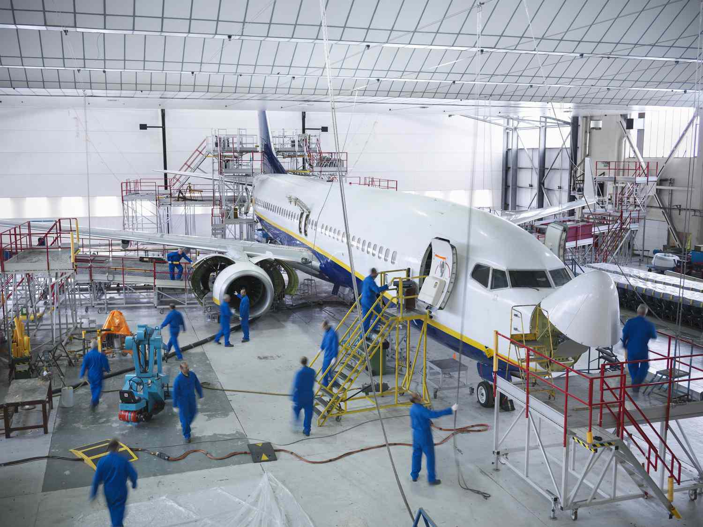

The aerospace industry is a dynamic and ever-evolving sector, playing an essential role in connecting the world and fostering technological advancement. Aircraft manufacturers are central to shaping the future of aviation through the introduction of innovative designs and state-of-the-art technologies. In recent years, the sector has witnessed an influx of digital tools that are disrupting traditional methodologies. Among these, algorithmic trading stands out as a transformative force. This digital technology, primarily associated with financial markets, has found applications within the aerospace industry, potentially optimizing operations and enhancing decision-making processes.

Algorithmic trading, or algo trading, utilizes complex algorithms to manage trades at speeds and scales beyond human capability. In aerospace, this technology facilitates better financial and supply chain management, demonstrating the adaptability of digital innovations across diverse industries. As technology continues to evolve, the interplay between airplane companies, aerospace industry developments, aircraft manufacturing, and algo trading becomes critical. This article explores these relationships, focusing on how advancements in technology pave the way for a future characterized by increased efficiency and sustainability in the aerospace sector.

## Table of Contents

## Overview of the Aerospace Industry

The aerospace industry encompasses several critical segments, each contributing uniquely to its overall dynamics. Among these segments, commercial aviation, defense, and space exploration stand out, forming the primary pillars of the industry.

Commercial aviation is witnessing unprecedented growth, driven by an increase in global air travel demand and the need for efficient air transport solutions. This expansion is propelled by technological advancements such as enhanced aerodynamics, fuel-efficient engines, and the integration of digital technologies in aircraft operations. The International Air Transport Association (IATA) reports a consistent increase in passenger numbers, further stimulating the need for innovative aircraft designs and air traffic management systems. [1]

The defense sector within aerospace involves the development and manufacturing of military aircraft, missiles, and other defense-related aerospace technologies. This segment benefits from substantial government investments aimed at maintaining national security and technological superiority. Defense spending continues to rise globally, with countries seeking to upgrade their aerial combat capabilities and bolster air defenses, further driving growth in this segment.

Space exploration represents an exciting frontier, marked by international collaborations and private sector participation. Significant advances have been made in satellite technology, spacecraft development, and extraterrestrial exploration missions. The advent of private entities like SpaceX and Blue Origin has introduced new dynamics into space exploration, offering launch services and innovative missions that were once the exclusive domain of national space agencies.

Prominent regions such as North America, Europe, and Asia-Pacific are at the forefront of aerospace innovation and market share. North America, home to industry giants like Boeing and Lockheed Martin, benefits from a robust ecosystem of suppliers, skilled labor, and advanced R&D facilities. Europe hosts Airbus, a major competitor in the commercial aviation market, and fosters a strong tradition of aerospace engineering and collaboration among European nations.

Asia-Pacific emerges as a critical player, driven by rapid economic growth and increasing demand for air travel within the region. Countries such as China and India are investing heavily in their aerospace industries, aiming to become significant contributors to global aerospace advancements. The region's expanding middle class amplifies this demand, making it a focal point for future growth in both commercial and defense aerospace sectors.

Overall, the aerospace industry's trajectory is shaped by ongoing technological innovations, increasing global connectivity, and the strategic interplay between its primary segments. This dynamic environment continues to foster growth and presents numerous opportunities for advancements in aerospace technologies.

Reference:
1. International Air Transport Association (IATA). "World Air Transport Statistics 2023."

## Key Airplane Companies and Their Impact

Major players such as Boeing, Airbus, and Lockheed Martin dominate the aircraft manufacturing landscape. These companies are instrumental in setting industry standards and driving technological advancements. Their ongoing projects and future goals highlight the commitment to sustainability and efficiency in air travel.

**Boeing**: As of 2023, Boeing remains at the forefront of aerospace manufacturing, continuing to innovate in areas such as aerodynamics, materials science, and avionics. The company is actively working on projects to reduce the environmental impact of aviation, such as developing fuel-efficient aircraft and exploring sustainable aviation fuels (SAF). Boeing is also advancing digital technologies in aircraft design and production, leveraging computational models and simulations to improve efficiency and performance.

**Airbus**: Airbus, a significant competitor to Boeing, focuses heavily on sustainability and environmental initiatives. Their recent projects include the A320neo and A350 family, which incorporate advanced materials and aerodynamics to improve fuel efficiency and reduce carbon emissions. Airbus has set ambitious targets to bring zero-emission commercial aircraft to the market by 2035, exploring hydrogen propulsion and electric aircraft technologies.

**Lockheed Martin**: Known primarily for its defense and space contributions, Lockheed Martin also impacts commercial aviation through its innovative solutions. The company applies its advances in stealth technology, autonomous systems, and materials engineering to improve aircraft performance and safety. Lockheed Martin's focus extends to sustainable practices, leveraging its expertise to minimize ecological footprints without compromising technological advancements.

These companies are not only pivotal in advancing aircraft design and manufacturing but also in collaborating with regulatory bodies to establish safety and environmental standards. For example, their engineering teams actively contribute to shaping the guidelines set forth by the International Civil Aviation Organization (ICAO) and other regulatory entities.

Furthermore, Boeing, Airbus, and Lockheed Martin invest heavily in research and development (R&D) to propel the industry towards a future of sustainable aviation. These investments manifest in partnerships with tech startups and academic institutions, fostering an ecosystem of innovation and collaboration. This commitment to R&D is crucial for the continued evolution of the aerospace industry, ensuring that air travel becomes more efficient, reliable, and environmentally friendly.

In summary, Boeing, Airbus, and Lockheed Martin are not just industry giants; they are pivotal in driving forward the technological and sustainable transformation of the aerospace industry. Their efforts play a critical role in reducing the industry's carbon footprint and enhancing the efficiency of air travel, setting the stage for the future of aviation.

## Aircraft Manufacturers: Innovating for the Future

Aircraft manufacturers are at the forefront of innovation, aiming to significantly reduce the carbon footprint of aviation through various strategies. One primary focus is the development of fuel-efficient engines. Advances in turbofan technology and the adoption of geared turbofans are leading to engines that consume less fuel and produce fewer emissions. These engines utilize components made from lighter, more durable materials, enhancing their overall performance and efficiency.

In addition to improving traditional fuel efficiency, manufacturers are exploring alternative fuel sources. Sustainable Aviation Fuels (SAFs), derived from renewable resources like algae or waste, are gaining traction. SAFs can reduce lifecycle carbon emissions significantly compared to conventional jet fuels, presenting a viable path toward greener aviation.

Moreover, aircraft production processes are undergoing a transformation driven by technological innovations such as 3D printing, automation, and [artificial intelligence](/wiki/ai-artificial-intelligence) (AI). 3D printing, also known as additive manufacturing, facilitates the creation of lighter and more complex components that were previously impossible or too costly to manufacture. This technology enables on-demand production, reducing waste and inventory costs.

Automation further enhances manufacturing efficiency by streamlining assembly lines and minimizing human error. Robotics and automated systems allow for precise and consistent construction of aircraft components, reducing production time and costs. AI is also playing a crucial role in optimizing manufacturing processes, predicting maintenance needs, and improving operational efficiency across the board.

Collaborations between aircraft manufacturers and tech startups are increasingly common, fostering an environment ripe for innovation. These partnerships often lead to groundbreaking developments in aerodynamics, propulsion systems, and materials science. By harnessing the agility and creativity of startups along with the experience and resources of established manufacturers, the aerospace industry is better equipped to tackle the challenges of the future.

Through these concerted efforts, aircraft manufacturers are not only improving the performance and sustainability of air travel but also pushing the boundaries of what is possible in aerospace technology. As these innovations continue to evolve, they promise to shape the future of aviation in a more environmentally responsible direction.

## The Rise of Algorithmic Trading in Aerospace

Algorithmic trading, or algo trading, employs sophisticated computer algorithms to execute large volumes of trades with remarkable precision and speed. This technology, traditionally associated with financial markets, has found groundbreaking applications in the aerospace sector, transforming how companies manage their supply chains and financial operations.

In the aerospace industry, supply chains are complex and often involve thousands of suppliers across different geographical locations. The introduction of algo trading techniques allows aerospace firms to streamline these processes by optimizing inventory management and procurement. By analyzing vast datasets, algorithms can predict demand fluctuations, adjust inventory levels in real-time, and reduce lead times. This results in cost savings and ensures that manufacturing plants operate efficiently with the necessary components delivered promptly.

Algorithmic trading also optimizes financial operations within aerospace companies. It enhances [liquidity](/wiki/liquidity-risk-premium) management by automating the buying and selling of financial instruments. This automation results in better cash flow management and improved capital allocation. Moreover, algo trading can aid in hedging against market [volatility](/wiki/volatility-trading-strategies), protecting companies from unfavorable financial conditions. 

Risk management, a critical aspect of aerospace operations, is significantly improved with [algorithmic trading](/wiki/algorithmic-trading). Algorithms can assess risk factors by processing historical data and current market conditions. By identifying potential risks early, aerospace firms can enact preemptive measures to mitigate them. Additionally, resource allocation is made more efficient as algorithms provide insights into the most effective ways to utilize financial and material resources.

Overall, the rise of algorithmic trading in the aerospace sector exemplifies the industry's commitment to innovation. By incorporating these advanced technologies, aerospace companies can achieve operational excellence and secure competitive advantages in a rapidly evolving market.

## Case Studies: Algo Trading Success in Aerospace

Recent case studies have demonstrated notable successes in the application of algorithmic trading strategies within the aerospace industry, leading to significant cost savings and operational improvements. Companies such as Rolls Royce and Honeywell have effectively harnessed these advanced technologies to boost their market competitiveness.

Rolls Royce, a prominent player in aircraft engine manufacturing, has adopted algorithmic trading to refine its supply chain management and procurement processes. By implementing sophisticated algorithms that analyze vast datasets, the company has achieved enhanced accuracy in demand forecasting, leading to optimized inventory levels and reduced holding costs. This approach not only streamlines operations but also ensures a more agile response to market fluctuations. The integration of algorithmic trading has enabled Rolls Royce to synchronize its production schedules more effectively with real-time market conditions, minimizing downtime and maximizing resource utilization.

Similarly, Honeywell has leveraged algorithmic trading to improve its financial operations and mitigate risk. By incorporating algorithms capable of processing high-frequency data, Honeywell has enhanced its ability to forecast exchange rate movements and manage foreign currency exposure. This capability allows Honeywell to better navigate the global financial environment, providing a competitive edge in pricing and contract negotiations. As a result, the company has witnessed an increase in its profit margins, attributed to the more efficient allocation of financial resources and improved risk management strategies.

The successful application of algorithmic trading in these companies underscores the aerospace industry's readiness to embrace digital innovations. The adaptability of aerospace firms to integrate such technologies highlights their commitment to advancing their operational frameworks. As algorithmic trading continues to evolve, its potential to drive further efficiencies and strategic advantages within the aerospace sector remains substantial.

## Challenges and Opportunities Ahead

The aerospace industry, despite its remarkable advancements, faces a myriad of challenges that must be navigated to maintain its trajectory of growth and innovation. Regulatory compliance remains one of the most significant hurdles. With stringent safety standards and environmental regulations, aircraft manufacturers are continuously tasked with adapting to new mandates that often require substantial investments in research and development. For example, achieving compliance with the International Civil Aviation Organization's CORSIA (Carbon Offsetting and Reduction Scheme for International Aviation) necessitates advancements in aircraft design and the development of alternative fuel sources.

Cybersecurity threats also loom large, as aerospace companies increasingly rely on digital technologies to enhance operations. The integration of digital tools into aircraft systems and manufacturing processes opens vulnerabilities that can be exploited by malicious actors. Protecting intellectual property and sensitive data is paramount, requiring robust cybersecurity frameworks and constant vigilance.

Economic uncertainties, such as fluctuating fuel prices and geopolitical tensions, add another layer of complexity. These factors can impact supply chains and the overall cost structure of aerospace operations, necessitating agile financial strategies to mitigate risks.

Embracing digital transformation, however, presents immense opportunities for growth and innovation. The incorporation of algorithmic trading showcases how digital tools can optimize financial operations and improve supply chain efficiencies. By leveraging big data analytics and [machine learning](/wiki/machine-learning), companies can make more informed decisions, enhancing operational performance and market competitiveness.

Additionally, the industry's future hinges on its ability to balance technological progress with sustainable practices. Manufacturers are exploring technologies such as electric and hybrid propulsion, which promise to reduce carbon emissions significantly. The integration of 3D printing and AI in manufacturing processes not only drives cost-efficiency but also aligns with sustainability goals by minimizing material waste.

The path forward for aerospace lies in the delicate balance between embracing cutting-edge technologies and adhering to sustainable practices. Those companies that can successfully navigate this landscape will be well-positioned to lead the industry's next wave of transformative innovation.

## Conclusion

The integration of algorithmic trading within the aerospace industry is playing a pivotal role in reshaping traditional business models and significantly enhancing operational efficiency. This innovative approach, characterized by the use of sophisticated computer algorithms to execute trades at exceptional speed and accuracy, provides aerospace companies with the tools to optimize their financial strategies and streamline supply chain management. By managing vast volumes of trades with precision, aerospace firms can potentially increase profitability and maintain a competitive edge in a fast-paced market environment.

Aircraft manufacturers continue to serve as the backbone of technological advancements in the aerospace sector. Through the relentless pursuit of innovation, these manufacturers contribute to the overall growth and sustainability of the aerospace industry. Progressive strides in technology, such as the development of fuel-efficient engines, the utilization of advanced materials, and the adoption of automated manufacturing processes, underscore the commitment to both enhancing performance and reducing environmental impact. The focus on sustainability not only mitigates ecological challenges but also aligns with evolving regulatory and public expectations.

As the aerospace industry advances, the interplay of innovation, sustainability, and technology emerges as a defining [factor](/wiki/factor-investing) in shaping its future. The ability of aerospace firms to seamlessly integrate technological breakthroughs while maintaining sustainable practices is crucial for long-term success. This synergy ensures that the transportation needs of the global population are met efficiently and responsibly. As such, the alignment of business strategies with cutting-edge technologies and sustainability principles will be vital in steering the aerospace sector toward continued prosperity and environmental stewardship.

## References & Further Reading

[1]: International Air Transport Association (IATA). ["World Air Transport Statistics 2023."](https://www.iata.org/en/pressroom/2024-releases/2024-01-31-02/) 

[2]: Lopez de Prado, M. ("Advances in Financial Machine Learning."](https://www.amazon.com/Advances-Financial-Machine-Learning-Marcos/dp/1119482089) Wiley, 2018.

[3]: Aronson, D.R. ["Evidence-Based Technical Analysis: Applying the Scientific Method and Statistical Inference to Trading Signals."](https://www.amazon.com/Evidence-Based-Technical-Analysis-Scientific-Statistical/dp/0470008741) Wiley, 2006.

[4]: Jansen, S. ["Machine Learning for Algorithmic Trading."](https://github.com/stefan-jansen/machine-learning-for-trading) Packt Publishing, 2020.

[5]: Chan, E.P. ["Quantitative Trading: How to Build Your Own Algorithmic Trading Business."](https://github.com/ftvision/quant_trading_echan_book) Wiley, 2008.

[6]: Airbus. ["Airbus and Air France-KLM Announce Ambitious Hydrogen-Powered Commercial Aircraft by 2035."](https://www.airfranceklm.com/en/newsroom/air-france-klm-and-airbus-enter-exclusive-negotiations-creation-joint-venture-dedicated)

[7]: Boeing. ["Sustainable Aviation Fuel (SAF): Leading the Commercial Aviation Industry in Innovation."](https://www.boeing.com/features/2023/11/boeing-expands-global-efforts-to-scale-up-sustainable-aviation-fuels)

[8]: CORSIA. ["Carbon Offsetting and Reduction Scheme for International Aviation (CORSIA)."](https://www.icao.int/environmental-protection/CORSIA/Pages/default.aspx) International Civil Aviation Organization (ICAO).