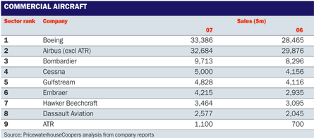

## Table of Contents

## What is an aircraft manufacturer?

An aircraft manufacturer is a company that makes airplanes and other types of flying vehicles. These companies design, build, and test different kinds of aircraft, like passenger planes, military jets, and small private planes. Some well-known aircraft manufacturers are Boeing, Airbus, and Lockheed Martin.

Aircraft manufacturers use advanced technology and materials to make sure their planes are safe and efficient. They work with engineers, designers, and scientists to create new models and improve existing ones. The process of making an aircraft can take many years and involves a lot of planning and testing.

These companies also have to follow strict rules and regulations set by aviation authorities to ensure that their aircraft meet safety standards. Once an aircraft is built and approved, it can be sold to airlines, governments, or private buyers. The work of aircraft manufacturers is important because it helps people travel, transport goods, and carry out military operations.

## Who are the largest aircraft manufacturers in the world?

The biggest aircraft manufacturers in the world are Boeing and Airbus. Boeing is an American company that makes many types of planes. They are famous for their 737 and 787 models, which many airlines use. Airbus is a European company that also makes big planes. Their A320 and A350 models are very popular. Both companies compete to sell the most planes to airlines around the world.

Another important aircraft manufacturer is Lockheed Martin, an American company known for making military planes. They make fighter jets like the F-35 and F-22, which are used by many countries' air forces. While Lockheed Martin focuses more on military aircraft, they still play a big role in the aviation industry.

Other companies like Embraer from Brazil and Bombardier from Canada also make planes, but they are smaller than Boeing and Airbus. Embraer makes regional jets and business jets, while Bombardier is known for its business jets and some smaller commercial planes. These companies help fill different needs in the aviation market, but Boeing and Airbus remain the leaders in making large commercial aircraft.

## What types of aircraft do these manufacturers produce?

Boeing makes many kinds of planes. They make big passenger planes like the 737, 787, and 777 that airlines use to fly people all over the world. They also make cargo planes to [carry](/wiki/carry-trading) goods and military planes like the KC-46 tanker and the P-8 Poseidon. Boeing's planes are used by many airlines and countries, making them one of the biggest aircraft makers.

Airbus also makes big passenger planes. Their popular models are the A320, A350, and A380. The A380 is the biggest passenger plane in the world. Airbus makes planes for airlines and also some military planes like the A400M, which is used to carry troops and equipment. Airbus and Boeing compete to sell the most planes to airlines around the world.

Lockheed Martin focuses on making military planes. They make fighter jets like the F-35 and F-22, which are used by many countries' air forces. They also make other military aircraft like the C-130 Hercules, which is used to transport troops and supplies. While Lockheed Martin doesn't make big passenger planes like Boeing and Airbus, they are still a very important aircraft manufacturer.

## How do aircraft manufacturers contribute to the global economy?

Aircraft manufacturers help the global economy a lot. They make planes that airlines use to fly people and goods all over the world. This helps people travel easily and helps businesses send their products to different countries. When airlines buy new planes, it creates jobs for many people who build, sell, and take care of the planes. This means more money is spent and more people have work, which helps the economy grow.

Aircraft manufacturers also spend a lot of money on research and new technology. This helps make planes safer and more efficient. When they find new ways to build planes, it can lead to new inventions and jobs in other industries too. For example, the technology used in planes can be used in cars or other machines. So, aircraft manufacturers not only help the aviation industry but also push forward technology and innovation in many other areas, making the global economy stronger.

## What are the key differences between commercial and military aircraft manufacturers?

Commercial aircraft manufacturers like Boeing and Airbus focus on making planes that airlines use to fly people and goods around the world. These planes need to be safe, comfortable, and good at saving fuel because they fly a lot. The companies that make these planes have to follow strict rules from aviation groups to make sure their planes meet safety standards. They also work hard to make their planes better and more efficient so airlines will buy them. 

Military aircraft manufacturers, like Lockheed Martin, make planes for the military. These planes are used for fighting, spying, or moving soldiers and supplies. They need to be strong, fast, and able to do special tasks. Military planes don't need to be comfortable like commercial planes, but they have to be able to handle tough situations. The companies that make these planes work closely with the military to make sure their planes meet the needs of the armed forces. 

Both types of manufacturers help the economy, but they focus on different needs. Commercial manufacturers aim to make planes that help airlines make money, while military manufacturers focus on helping the military do its job better. The technology and skills used in both types of manufacturing can also help other industries grow.

## Can you name some historical aircraft manufacturers that are no longer in operation?

Some historical aircraft manufacturers that are no longer in operation include companies like Douglas Aircraft Company and McDonnell Aircraft Corporation. Douglas was famous for making planes like the DC-3, which was very popular for airlines. They also made military planes during World War II. McDonnell made fighter jets like the F-4 Phantom II, which was used by the U.S. military. Both companies merged in 1967 to form McDonnell Douglas, which was later bought by Boeing in 1997.

Another historical manufacturer is the British company de Havilland. They made many famous planes, including the Comet, which was the world's first commercial jet airliner. De Havilland also made the Mosquito, a fast wooden plane used during World War II. The company stopped making planes in the 1960s and was eventually taken over by other companies.

A third example is the German company Junkers. They were known for making planes like the Ju 52, which was used a lot during World War II. Junkers also made the Ju 87, known as the Stuka, a dive bomber. After the war, the company faced many problems and stopped making planes in the 1950s.

## What technological advancements have major aircraft manufacturers made in recent years?

In recent years, aircraft manufacturers have made big steps in technology to make flying better and safer. One big change is using more composite materials instead of metal to build planes. These materials are lighter and stronger, which helps planes use less fuel. Boeing's 787 Dreamliner and Airbus's A350 XWB both use a lot of these materials. Another big step is making engines that are more efficient. New engines like the GE9X from General Electric and the Trent XWB from Rolls-Royce help planes fly farther and use less fuel. These improvements save airlines money and help the environment.

Aircraft manufacturers have also worked on new technology for the inside of planes to make flying more comfortable for passengers. For example, they've made cabins that are quieter and have better air. They've also added more ways for passengers to use their electronics, like Wi-Fi and power outlets. On the safety side, new technology helps pilots fly better. Systems like fly-by-wire make flying easier and safer by using computers to help control the plane. Also, new ways to check the health of the plane, like sensors and data systems, help find problems before they become big issues. These advancements show how aircraft manufacturers keep working to make flying better for everyone.

## How do regulations affect aircraft manufacturers?

Regulations play a big role in how aircraft manufacturers make planes. They have to follow strict rules from groups like the Federal Aviation Administration (FAA) in the United States and the European Union Aviation Safety Agency (EASA) in Europe. These rules make sure planes are safe for people to fly in. Manufacturers need to test their planes a lot and make sure they meet all the safety standards before they can sell them. This can take a long time and cost a lot of money, but it's important to keep flying safe.

Regulations also affect how fast new technology can be used in planes. When manufacturers want to use new materials or systems, they have to get them approved by the regulators. This means they need to show that the new technology is safe and works well. Sometimes, this can slow down the process of making new planes. But, it also helps make sure that planes keep getting better and safer over time. So, while regulations can make things harder for aircraft manufacturers, they are very important for keeping people safe in the sky.

## What are the current market trends influencing aircraft manufacturers?

Right now, aircraft manufacturers are dealing with a few big trends. One big trend is that airlines want planes that use less fuel. This is because fuel prices can be high, and using less fuel saves airlines money. So, manufacturers are working hard to make planes that are lighter and have better engines. Another trend is that more people want to fly. This means airlines need more planes, but they also want planes that can carry more people on each flight. Manufacturers are trying to make bigger planes that can fly long distances to meet this need.

Another important trend is the use of technology. Planes now have more computers and systems to help pilots fly better and make the plane safer. This includes things like fly-by-wire systems and sensors that check the health of the plane. Also, passengers want more comfort on flights, so manufacturers are making cabins quieter and adding things like Wi-Fi. These trends show that aircraft manufacturers need to keep up with what airlines and passengers want, which can be challenging but also helps them grow and improve.

## How do major aircraft manufacturers approach sustainability and environmental impact?

Major aircraft manufacturers are working hard to make flying better for the environment. They are trying to make planes that use less fuel. This is important because planes that use less fuel make less pollution. To do this, manufacturers are using new materials that are lighter and making better engines. For example, Boeing's 787 Dreamliner and Airbus's A350 use a lot of these new materials. These planes help airlines save money on fuel and also help the environment by making less pollution.

Manufacturers are also looking at other ways to make flying more sustainable. They are testing new kinds of fuel, like biofuels made from plants, which can be better for the environment than regular jet fuel. They are also working on making planes quieter, which is good for people living near airports. Some companies are even thinking about making planes that can fly without making any pollution at all, like electric or hydrogen-powered planes. All these efforts show that aircraft manufacturers are trying to make flying better for the planet.

## What are the challenges faced by new entrants in the aircraft manufacturing industry?

New companies that want to start making airplanes face many big challenges. It is very hard to get into the aircraft manufacturing industry because it costs a lot of money. They need to spend a lot on research and building factories. They also need to hire many smart people like engineers and scientists. On top of that, they have to follow very strict rules from groups like the FAA and EASA. These rules make sure planes are safe, but they can slow down new companies and make it hard for them to start selling planes.

Another challenge is that the big companies like Boeing and Airbus already have a lot of customers and are well-known. New companies have to work hard to show that their planes are just as good or better. They also need to find airlines that will buy their planes, which can be tough when the big companies are already selling a lot. It takes a long time for a new company to build a good name in the industry. All these things make it very hard for new aircraft manufacturers to start and grow their business.

## How do mergers and acquisitions impact the landscape of aircraft manufacturing?

Mergers and acquisitions change the aircraft manufacturing world a lot. When big companies like Boeing buy other companies, they get bigger and can do more things. For example, when Boeing bought McDonnell Douglas, it helped them make more types of planes and reach more customers. This makes it harder for smaller companies to compete because the big companies have more money and power. Mergers and acquisitions can also help companies share new ideas and technology, which can lead to better planes.

These changes can also affect jobs and how the industry works. When companies merge, some jobs might go away, and people might have to learn new ways of doing things. It can also make the market less competitive because there are fewer big companies. This might mean less choice for airlines buying planes. But, it can also help companies work together better and make flying safer and more efficient for everyone.

## Key Airplane Companies and Their Impact

Major players such as Boeing, Airbus, and Lockheed Martin dominate the aircraft manufacturing landscape. These companies are instrumental in setting industry standards and driving technological advancements. Their ongoing projects and future goals highlight the commitment to sustainability and efficiency in air travel.

**Boeing**: As of 2023, Boeing remains at the forefront of aerospace manufacturing, continuing to innovate in areas such as aerodynamics, materials science, and avionics. The company is actively working on projects to reduce the environmental impact of aviation, such as developing fuel-efficient aircraft and exploring sustainable aviation fuels (SAF). Boeing is also advancing digital technologies in aircraft design and production, leveraging computational models and simulations to improve efficiency and performance.

**Airbus**: Airbus, a significant competitor to Boeing, focuses heavily on sustainability and environmental initiatives. Their recent projects include the A320neo and A350 family, which incorporate advanced materials and aerodynamics to improve fuel efficiency and reduce carbon emissions. Airbus has set ambitious targets to bring zero-emission commercial aircraft to the market by 2035, exploring hydrogen propulsion and electric aircraft technologies.

**Lockheed Martin**: Known primarily for its defense and space contributions, Lockheed Martin also impacts commercial aviation through its innovative solutions. The company applies its advances in stealth technology, autonomous systems, and materials engineering to improve aircraft performance and safety. Lockheed Martin's focus extends to sustainable practices, leveraging its expertise to minimize ecological footprints without compromising technological advancements.

These companies are not only pivotal in advancing aircraft design and manufacturing but also in collaborating with regulatory bodies to establish safety and environmental standards. For example, their engineering teams actively contribute to shaping the guidelines set forth by the International Civil Aviation Organization (ICAO) and other regulatory entities.

Furthermore, Boeing, Airbus, and Lockheed Martin invest heavily in research and development (R&D) to propel the industry towards a future of sustainable aviation. These investments manifest in partnerships with tech startups and academic institutions, fostering an ecosystem of innovation and collaboration. This commitment to R&D is crucial for the continued evolution of the aerospace industry, ensuring that air travel becomes more efficient, reliable, and environmentally friendly.

In summary, Boeing, Airbus, and Lockheed Martin are not just industry giants; they are pivotal in driving forward the technological and sustainable transformation of the aerospace industry. Their efforts play a critical role in reducing the industry's carbon footprint and enhancing the efficiency of air travel, setting the stage for the future of aviation.

## References & Further Reading

[1]: International Air Transport Association (IATA). ["World Air Transport Statistics 2023."](https://www.iata.org/en/pressroom/2024-releases/2024-01-31-02/) 

[2]: Lopez de Prado, M. ("Advances in Financial Machine Learning."](https://www.amazon.com/Advances-Financial-Machine-Learning-Marcos/dp/1119482089) Wiley, 2018.

[3]: Aronson, D.R. ["Evidence-Based Technical Analysis: Applying the Scientific Method and Statistical Inference to Trading Signals."](https://www.amazon.com/Evidence-Based-Technical-Analysis-Scientific-Statistical/dp/0470008741) Wiley, 2006.

[4]: Jansen, S. ["Machine Learning for Algorithmic Trading."](https://github.com/stefan-jansen/machine-learning-for-trading) Packt Publishing, 2020.

[5]: Chan, E.P. ["Quantitative Trading: How to Build Your Own Algorithmic Trading Business."](https://github.com/ftvision/quant_trading_echan_book) Wiley, 2008.

[6]: Airbus. ["Airbus and Air France-KLM Announce Ambitious Hydrogen-Powered Commercial Aircraft by 2035."](https://www.airfranceklm.com/en/newsroom/air-france-klm-and-airbus-enter-exclusive-negotiations-creation-joint-venture-dedicated)

[7]: Boeing. ["Sustainable Aviation Fuel (SAF): Leading the Commercial Aviation Industry in Innovation."](https://www.boeing.com/features/2023/11/boeing-expands-global-efforts-to-scale-up-sustainable-aviation-fuels)

[8]: CORSIA. ["Carbon Offsetting and Reduction Scheme for International Aviation (CORSIA)."](https://www.icao.int/environmental-protection/CORSIA/Pages/default.aspx) International Civil Aviation Organization (ICAO).