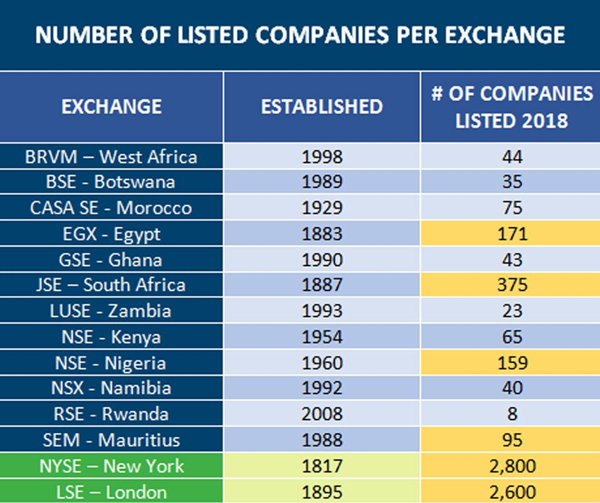

## Table of Contents

## What is a stock exchange?

A stock exchange is a place where people buy and sell shares of companies. It's like a big marketplace, but instead of buying fruits or clothes, people trade pieces of ownership in businesses. These pieces are called stocks or shares. When you buy a stock, you own a tiny part of that company. Stock exchanges help companies raise money by selling these shares to the public.

Stock exchanges also help people make money. If you buy a stock and its price goes up, you can sell it for more than you paid. This is called making a profit. But if the price goes down, you lose money. Stock exchanges have rules to make sure trading is fair and safe. Some famous stock exchanges are the New York Stock Exchange and the London Stock Exchange. They are important for the economy because they help money move around and businesses grow.

## How many stock exchanges are there in Africa?

There are several stock exchanges in Africa. The exact number can change over time, but as of now, there are about 20 stock exchanges across the continent. Some of the biggest ones are in South Africa, Egypt, and Nigeria. These stock exchanges help companies in Africa get money to grow their businesses.

Each stock exchange in Africa has its own rules and ways of working. They are important for the economy because they let people invest in companies and help businesses raise money. Some African countries share stock exchanges, like the West African Economic and Monetary Union, which has one for several countries. This helps smaller economies work together and grow.

## What are the largest stock exchanges in Africa?

The largest stock exchange in Africa is the Johannesburg Stock Exchange (JSE) in South Africa. It is the biggest and most active stock market on the continent. Many big companies from South Africa and other African countries list their stocks here. People from all over the world trade on the JSE because it is well-known and trusted.

The Egyptian Exchange (EGX) in Egypt is the second largest stock exchange in Africa. It is important for the Egyptian economy and helps many companies raise money. The EGX has a long history and is one of the oldest stock exchanges in the Middle East and Africa. It is also a popular place for investors looking to invest in Egyptian companies.

The Nigerian Exchange (NGX), formerly known as the Nigerian Stock Exchange, is another big stock exchange in Africa. It is the third largest on the continent and plays a key role in Nigeria's economy. Many Nigerian companies use the NGX to get money to grow their businesses. The NGX helps connect investors with these companies, making it easier for them to buy and sell stocks.

## What types of securities are traded on African stock exchanges?

On African stock exchanges, people trade different kinds of securities. The main ones are stocks, which are pieces of ownership in companies. When you buy a stock, you own a small part of that company. Companies sell these stocks to raise money for their business. Another common security is bonds. Bonds are like loans that people give to the government or companies. In return, the government or company pays back the money with interest over time.

Besides stocks and bonds, some African stock exchanges also trade other securities like exchange-traded funds (ETFs). ETFs are like baskets of stocks or other investments that you can buy and sell like a single stock. They help people invest in a lot of different things at once. Some exchanges also have derivatives, which are contracts that get their value from something else, like the price of a stock or a commodity. These can be more complicated and are used by investors who want to bet on future prices or protect themselves from risk.

Overall, African stock exchanges offer a variety of securities to help companies raise money and give investors different ways to grow their money. Whether it's through stocks, bonds, ETFs, or derivatives, these securities play a big role in the economy of African countries. They help money move around and businesses grow, making the economy stronger.

## How do African stock exchanges contribute to economic development?

African stock exchanges help the economy grow by giving companies a way to get money. When a company wants to grow or start something new, it can sell pieces of itself, called stocks, on the stock exchange. People buy these stocks, and the company gets the money it needs. This helps businesses expand, create new jobs, and bring new ideas to life. When businesses do well, they pay taxes, which the government can use to build roads, schools, and hospitals. This makes life better for everyone in the country.

Stock exchanges also help money move around the economy. When people buy and sell stocks, money changes hands. This movement of money can help the economy stay active and growing. Plus, stock exchanges attract investors from other countries. When foreign investors buy stocks in African companies, they bring in more money from outside, which can be used to grow the economy even more. Overall, stock exchanges are important because they help companies, create jobs, and bring in money, all of which make the economy stronger and help people live better lives.

## What are the regulatory bodies overseeing African stock exchanges?

Each African country has its own rules and groups that watch over its stock exchange. These groups make sure that people follow the rules when they buy and sell stocks. They check that companies tell the truth about their business when they want to sell stocks. They also make sure that the stock exchange is fair and safe for everyone. Some of these groups are called securities commissions or financial market authorities. For example, in South Africa, the Financial Sector Conduct Authority (FSCA) and the Prudential Authority (PA) work together to watch over the Johannesburg Stock Exchange (JSE).

In addition to national groups, there are also bigger groups that help different countries work together. The African Securities Exchanges Association (ASEA) is one of these groups. It helps all the stock exchanges in Africa share ideas and make their rules better. ASEA works to make sure that all African stock exchanges are strong and trusted. This helps investors feel safe about putting their money into African companies. By working together, these groups help make the whole African economy stronger and more connected.

## How has technology impacted African stock exchanges?

Technology has changed how African stock exchanges work. Now, people can buy and sell stocks using their computers or phones. They don't have to go to a special place to trade. This makes it easier and faster for people to invest in companies. Stock exchanges use special computer programs to keep track of all the trades and make sure everything is fair. This technology helps the stock exchanges work better and attract more people from around the world to invest in African companies.

Also, technology helps African stock exchanges share information quickly. Companies can put out news about their business online, and investors can see it right away. This helps people make better choices about buying or selling stocks. Some stock exchanges even use technology to teach people how to invest. They have online classes and tools that make it easier for everyone to understand how the stock market works. Overall, technology makes African stock exchanges more open, faster, and easier to use, which helps the economy grow.

## What are the challenges faced by African stock exchanges?

African stock exchanges face many challenges. One big problem is that not enough people know about them. Many people in Africa don't understand how stock markets work or why they should invest. This makes it hard for companies to raise money by selling stocks. Also, some countries have rules that make it hard for foreign investors to buy stocks in African companies. This means less money comes into the country, which can slow down the economy.

Another challenge is technology. While technology can help, many African stock exchanges don't have the best tools. They might not have fast computers or good internet, which can make trading slow and less reliable. This can scare away investors who want quick and safe trades. Plus, some African countries have problems like corruption or weak governments. This can make investors worried about losing their money, so they might choose to invest somewhere else.

Despite these challenges, African stock exchanges are working to get better. They are trying to teach more people about investing and making their rules easier for foreign investors. They are also working on getting better technology to make trading faster and safer. By solving these problems, African stock exchanges can help the economy grow and bring more money into the continent.

## How do African stock exchanges compare to global stock exchanges in terms of market capitalization?

African stock exchanges are much smaller than global stock exchanges when we look at market capitalization. Market capitalization is the total value of all the stocks in a stock exchange. For example, the Johannesburg Stock Exchange (JSE) in South Africa, which is the biggest in Africa, has a market capitalization of around $1 trillion. This is small compared to big global stock exchanges like the New York Stock Exchange (NYSE), which has a market capitalization of over $25 trillion, or the Nasdaq, which is over $19 trillion.

The smaller size of African stock exchanges means they have less money and fewer companies listed on them. This can make it harder for African companies to raise money to grow their businesses. It also means that investors might not see as many opportunities to make money in African stock markets as they do in bigger global markets. However, African stock exchanges are working hard to grow and attract more investors, which could help them become bigger and more important in the future.

## What initiatives are being taken to integrate African stock exchanges?

African countries are working together to make their stock exchanges stronger. One big group helping with this is the African Securities Exchanges Association (ASEA). They help different stock exchanges share ideas and make better rules. They also work on projects that let people buy and sell stocks from different African countries more easily. This can bring more money into Africa and help companies grow faster. By working together, African stock exchanges can become more important in the world.

Another way they are trying to integrate is by creating shared stock exchanges. For example, the West African Economic and Monetary Union (UEMOA) has a stock exchange that several countries use together. This helps smaller countries work together and grow their economies. It also makes it easier for investors to buy stocks from different countries in one place. These efforts to integrate African stock exchanges can make the whole continent's economy stronger and more connected.

## How do foreign investors participate in African stock exchanges?

Foreign investors can take part in African stock exchanges by buying and selling stocks through brokers. These brokers are special people or companies who help you trade stocks. Many African stock exchanges let foreign investors open accounts with local brokers. This means you can buy stocks from African companies even if you live in another country. Some big stock exchanges like the Johannesburg Stock Exchange (JSE) in South Africa are well-known and trusted, so they attract a lot of foreign investors.

There are some challenges for foreign investors, though. Rules in some African countries can make it hard to buy stocks. For example, you might need to follow special rules or pay extra fees. Also, not all African stock exchanges have the best technology, which can make trading slow or less reliable. But many African stock exchanges are working to make things easier for foreign investors. They are trying to make their rules simpler and use better technology to help more people from around the world invest in African companies.

## What are the future trends and predictions for African stock exchanges?

African stock exchanges are expected to grow in the future. More people will learn about investing, and this will help more companies raise money. Technology will play a big role too. Better computers and internet will make trading faster and safer. This can attract more investors from around the world. Also, African countries are working together to make their stock exchanges stronger. By sharing ideas and making rules easier, they hope to bring in more money and help their economies grow.

There are challenges, though. Some African countries have problems like corruption or weak governments, which can scare away investors. But many stock exchanges are trying to fix these issues. They are making their rules clearer and teaching people how to invest. If they can solve these problems, African stock exchanges could become much more important. They could help more companies grow and bring in more money from outside the continent, making life better for everyone in Africa.

## Key African Stock Exchanges in Algorithmic Trading

Africa's top five securities exchanges—Johannesburg Stock Exchange (JSE), Egyptian Exchange, Nigerian Stock Exchange, Casablanca Stock Exchange, and Nairobi Securities Exchange—are pivotal in the adoption of [algorithmic trading](/wiki/algorithmic-trading). These exchanges are leveraging technological advancements to increase efficiency, [liquidity](/wiki/liquidity-risk-premium), and transparency.

The Johannesburg Stock Exchange, Africa's largest and most advanced exchange, has been at the forefront of integrating sophisticated trading technologies. The JSE has a robust technological infrastructure, partnering with global tech providers like Nasdaq to utilize the Nasdaq X-Stream INET trading platform, renowned for its low latency and high capacity. This partnership underscores the JSE's commitment to providing efficient and secure trading mechanisms for algorithmic traders.

Similarly, the Egyptian Exchange has made significant strides in adopting algorithmic trading. By collaborating with financial technology firms, it has implemented electronic trading platforms that support high-frequency trading, thereby enhancing market depth and trading accuracy. The exchange's focus on technological upgrades is part of a broader strategy to attract more international investors.

Nigeria's Stock Exchange (NSE) has also been making progress by upgrading its trading infrastructure to support algorithmic trading. The NSE's adoption of the NASDAQ OMX platform provides a multi-asset, multi-currency trading environment that allows for increased versatility and speed for algorithmic strategies. This technology enables the NSE to handle a larger [volume](/wiki/volume-trading-strategy) of transactions with improved transparency and reduced transaction times.

The Casablanca Stock Exchange has been integrating advanced trading technologies to improve algorithmic trading capabilities. Although it hasn’t formed explicit partnerships with global providers like Nasdaq, its ongoing technological enhancements are aimed at supporting automated trading systems and fostering a more dynamic trading environment.

The Nairobi Securities Exchange has invested in upgrading its trading systems to support algorithmic trading. One of its key technological collaborations is with InfoTech Capizar, a provider known for facilitating secure and efficient trading solutions. This partnership marks a significant step towards enhancing the automation of trading processes, catering to both local and international investors interested in deploying algorithmic strategies.

In summary, these leading African exchanges are progressively embracing algorithmic trading by upgrading their technological infrastructures and forming strategic partnerships with global technology providers. This evolution is crucial in establishing these markets as competitive and attractive destinations for global investment.

## References & Further Reading

[1]: Reddy, Y. S., & Sebahattin, D. (2021). ["Algorithmic Trading and its Impact on Financial Markets"](https://link.springer.com/article/10.1007/s10690-021-09353-5) Journal of the Academy of Finance.

[2]: African Securities Exchanges Association (ASEA). ["About ASEA"](https://african-exchanges.org/).

[3]: Nasdaq. ["Johannesburg Stock Exchange Extends Partnership with Nasdaq for Trading Technology"](https://www.nasdaq.com/articles/25-cola-and-more-all-2025-social-security-changes-you-need-know-about).

[4]: Capital Markets Authority Kenya. ["Overview of the Nairobi Securities Exchange"](https://www.cma.or.ke/about-us/).

[5]: Bongbog-3gzi, J. C. (2016). ["The Emergence and Development of Stock Markets in Africa: Patterns, Determinants and Consequences"](https://www.sciencedirect.com/science/article/abs/pii/S1566014120303307). University of Cape Town, PhD Thesis.

[6]: International Monetary Fund (IMF). ["Africa on the Move: Unlocking the Potential of Small Middle-Income States"](https://www.elibrary.imf.org/view/book/9781513588605/9781513588605.xml).

[7]: KPMG. ["Regulation and Growth of Capital Markets in Africa"](https://kpmg.com/xx/en/our-insights/esg/unpacking-sustainable-finance-disclosure-regulation.html). 

[8]: MarketWatch. ["Algorithmic Trading 101: An Introduction"](https://intrinio.com/blog/stock-trading-algorithm-101-what-is-algorithmic-trading).