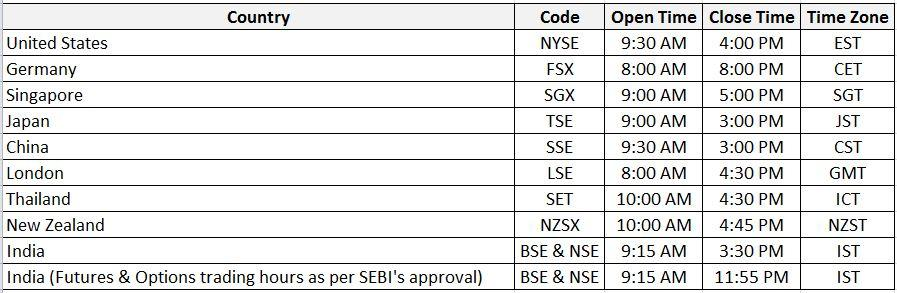

Stock exchanges serve as pivotal platforms where investors can buy and sell securities, playing a critical role in the global economy. By facilitating capital formation, they enable corporations to raise funds for expansion and innovation, which in turn drives economic growth and job creation. The liquidity provided by stock exchanges ensures that buying and selling activities can be conducted efficiently, maintaining the trust and confidence of investors. These exchanges are intrinsically linked to global economic health, with their performance often reflecting broader economic trends.

Algorithmic trading, a method where algorithms based on complex mathematical models execute trades at high speeds, has gained substantial traction within these exchanges. Its primary advantage lies in its ability to process vast amounts of data and execute orders at speeds unattainable by human traders, thereby reducing transaction costs and increasing market efficiency. By automating the trading process, algorithmic trading helps minimize human errors and emotional decisions, leading to more precise and consistent trading outcomes. It's estimated that a significant portion of trading volume on major stock exchanges is now executed via algorithms, underscoring its relevance.

The focus of this article is Asian stock exchanges, which are increasingly integrating algorithmic trading into their operations. These exchanges, spanning regions like Eastern, Central, Southeast, Southern, and Western Asia, are not just pivotal in their respective economies but also in the global financial landscape. With economic powerhouses like China, Japan, and India in this region, the adoption and evolution of algorithmic trading on these platforms could significantly influence global market dynamics. As these markets grow and evolve, understanding the role of algorithmic trading in Asian stock exchanges is essential for investors and policymakers aiming to navigate the shifting tides of global finance.

## Table of Contents

## Top Asian Stock Exchanges in Algorithmic Trading

Asian stock exchanges play a pivotal role in the global algorithmic trading landscape, leveraging technology to enhance trading efficiency and execution speed. As of 2023, several stock exchanges stand out due to their significant market capitalizations and integration of algorithmic trading.

The Tokyo Stock Exchange (TSE) is one of Asia's largest stock exchanges, renowned for its technological advancements and robust trading systems. According to recent data, the TSE has a market capitalization of approximately USD 6 trillion, making it a key player in the global financial market. The exchange's deployment of cutting-edge trading technologies facilitates high-frequency trading and market [liquidity](/wiki/liquidity-risk-premium).

The Shanghai Stock Exchange (SSE) follows closely, with a market capitalization of around USD 4.9 trillion. It has emerged as a major hub for [algorithmic trading](/wiki/algorithmic-trading) in Asia. The SSE has implemented numerous technological innovations to accommodate the growing demand for algorithmic trading strategies, catering to both domestic and international investors.

India's National Stock Exchange (NSE) is another significant entity in algorithmic trading. With a market capitalization of over USD 3.4 trillion, the NSE is the most active exchange in India. It has continuously upgraded its technology infrastructure to enable efficient algorithmic trading. The introduction of co-location services, where traders can place their servers close to the exchange, has further amplified the execution speed for algorithmic strategies at the NSE.

These exchanges are at the forefront of integrating technological advancements into their trading platforms, thus enhancing their capacity to support sophisticated algorithmic trading strategies. Their significance in the global economy is underscored by their substantial market capitalizations and the growing [volume](/wiki/volume-trading-strategy) of trades executed on their platforms using algorithms.

## Central Asia Stock Exchanges

Central Asia's stock exchanges, such as the Kazakhstan Stock Exchange (KASE) and the Astana International Exchange (AIX), have become increasingly significant players in their regional markets. The Kazakhstan Stock Exchange, as one of the longest-established exchanges in the region, plays a crucial role in facilitating capital flow and investment within the country and neighboring areas. It serves as a pivotal financial infrastructure, offering investors a platform for trading equity and debt instruments, as well as currency and other financial products. This has been vital for the economic development and integration of Kazakhstan into global financial systems.

The Astana International Exchange, although newer, is rapidly gaining traction. It serves as an innovative financial hub that aims to attract foreign investments while providing Kazakhstan and Central Asia with an advanced technological trading platform. A key aspect of AIX's appeal is its adoption of the Nasdaq Matching Engine, a state-of-the-art technology renowned for its high speed and reliability in executing trades. This system allows AIX to offer an electronic trading platform that matches buyers and sellers efficiently, handling a high volume of transactions per second. By leveraging such advanced technology, AIX ensures transparency and fosters investor trust, essential for market growth and stability.

The integration of cutting-edge technologies like the Nasdaq Matching Engine enables these exchanges to enhance their competitiveness and align with global standards. This not only attracts local and international investors but also facilitates more seamless regional financial integration. Consequently, both KASE and AIX have positioned themselves as pivotal components in Central Asia's financial landscape, contributing to the broader economic goals of growth and modernization within the region. As these exchanges evolve, they will continue to have a critical impact on the economic capabilities and financial infrastructure of Central Asia.

## Eastern Asia Stock Exchanges

Eastern Asia is home to some of the world's most influential stock exchanges, including the Tokyo Stock Exchange (TSE), the Hong Kong Stock Exchange (HKEX), and major Chinese exchanges such as the Shanghai Stock Exchange (SSE) and the Shenzhen Stock Exchange (SZSE). These exchanges are pivotal in driving the growth and evolution of algorithmic trading, harnessing advanced technology to enhance market efficiency and attract global investors.

The Tokyo Stock Exchange is one of the largest exchanges globally by market capitalization. It has been at the forefront of implementing cutting-edge technology to bolster algorithmic trading. The TSE utilizes the arrowhead trading system, which provides low-latency processing of trades, ensuring that algorithmic strategies can execute trades with minimal delay. The system's high-speed capabilities allow for processing a multitude of orders per second, a critical feature for high-frequency trading strategies that thrive on transient market opportunities.

Similarly, the Hong Kong Stock Exchange has invested significantly in its infrastructure to accommodate algorithmic trading, expanding its platform capabilities and reducing latency. HKEX’s Orion Trading Platform offers a high-performance trading environment, supporting a wide array of automated trading strategies. The exchange plays a strategic role as a gateway for investors seeking exposure to Mainland China's markets, facilitated further by the Stock Connect programs with the SSE and SZSE.

In China, both the Shanghai and Shenzhen Stock Exchanges have embraced technological advancements to support the burgeoning demand for algorithmic trading. These exchanges have implemented robust trading systems designed to handle vast numbers of transactions efficiently. The Shanghai Stock Exchange, for instance, offers the New Generation Trading System, which supports low-latency trading and provides a scalable platform that can accommodate the increasing volumes driven by algorithmic trading strategies.

The growth and development of these Eastern Asian exchanges in the global market are significant. They not only handle a large share of the world's trading volumes but also serve as innovation hubs where the integration of technology and finance advances rapidly. As algorithmic trading continues to evolve, it is likely that these exchanges will further enhance their technological frameworks to maintain competitive edges and attract more international participants.

Moreover, regulatory environments in these regions are progressively adapting to accommodate the unique challenges posed by algorithmic trading. This includes ensuring fair trading practices, managing systemic risk, and promoting market transparency. As these exchanges continue to upgrade their technological capabilities, they contribute to the robustness and dynamism of the global financial ecosystem, paving the way for future growth in algorithmic trading.

## Southeast Asia Stock Exchanges

Southeast Asia plays a significant role in the landscape of global stock exchanges, particularly through the presence of key markets like the Singapore Exchange (SGX) and the Indonesia Stock Exchange (IDX). These exchanges serve as pivotal hubs for algorithmic trading, a method that utilizes complex algorithms to automate trading strategies, enhancing efficiency and speed.

The Singapore Exchange is renowned for its advanced technological infrastructure, which supports various algorithmic trading strategies. One prevalent strategy is high-frequency trading ([HFT](/wiki/high-frequency-trading-strategies)), which involves executing a large number of orders at extremely high speeds, often within milliseconds. SGX has invested heavily in low-latency technology, offering co-location services that allow traders to place their servers near the exchange's matching engines, thereby reducing the time it takes for trade execution.

On the other hand, the Indonesia Stock Exchange has been focusing on increasing accessibility and technological upgrades to attract more algorithmic traders. A notable strategy in this market is statistical [arbitrage](/wiki/arbitrage), which involves using quantitative models to identify price differentials between financial instruments and capitalize on these inefficiencies. IDX's improvements in trading systems and connectivity have made it an attractive venue for traders employing such strategies.

Current trends indicate that algorithmic trading in Southeast Asia is poised for significant growth. Factors driving this expansion include the increased digitization of financial services, regulatory advancements, and a growing interest from international investors. Moreover, the region's strategic location and robust economic growth further amplify its appeal.

Looking ahead, the future growth potential for algorithmic trading in Southeast Asia appears promising. As technology evolves, exchanges like SGX and IDX will continue to enhance their infrastructure, enabling more sophisticated trading algorithms. Additionally, increasing competition among exchanges to offer better services and faster execution times will likely spur further advancements in algorithmic trading capabilities.

In summary, Southeast Asia's stock exchanges are crucial players in the development of algorithmic trading, with the Singapore Exchange and Indonesia Stock Exchange at the forefront. Continued technological enhancements and strategic investments are expected to bolster the region's position as a key hub for algorithmic trading, driving growth and innovation.

## Southern Asia Stock Exchanges

The Southern Asia region, particularly India, plays a pivotal role in the global algorithmic trading landscape, largely due to its prominent stock exchanges: the Bombay Stock Exchange (BSE) and the National Stock Exchange (NSE) of India. These exchanges are not only significant in terms of market capitalization but also in their adoption of advanced technology infrastructures that facilitate algorithmic trading.

At the core of algorithmic trading in India is the robust technology infrastructure adopted by both BSE and NSE. The exchanges have implemented sophisticated trading technology to ensure high-frequency trading (HFT) and algorithmic trades are executed swiftly and accurately. For instance, both exchanges utilize advanced trading platforms equipped with high-speed co-location services, allowing traders to place their servers on the exchange premises. This minimizes latency and enhances the speed of order execution – a critical [factor](/wiki/factor-investing) for success in algorithmic trading. Furthermore, BSE and NSE have integrated cutting-edge risk management systems that offer real-time monitoring and automated risk checks, ensuring that trading activities remain within regulatory compliance and risk parameters.

The regulatory environment in India plays a crucial role in shaping the algorithmic trading ecosystem. The Securities and Exchange Board of India (SEBI), the primary regulatory authority, has implemented strict regulations to oversee algorithmic trading activities. SEBI mandates that all algorithmic orders be tagged, logged, and subjected to robust audit trails to prevent market manipulation and ensure transparency. Additionally, risk management measures are enforced by requiring brokers to maintain a minimum latency and adhere to standardized market access controls. Algorithmic traders must also undergo periodic code verification to authenticate the strategies being employed.

These regulatory measures ensure a fair trading environment and protect market integrity. However, they also pose challenges for traders who must continually update their strategies and technology to comply with the evolving regulatory landscape. Despite these challenges, the adherence to such regulations helps in fostering a safer and more transparent trading environment, ultimately benefiting the overall market ecosystem in Southern Asia. The growing investment in technology and stringent regulatory oversight highlights the dynamic nature of India's stock exchanges in the rapidly evolving algorithmic trading arena.

## Western Asia Stock Exchanges

Stock exchanges in Western Asia, such as the Tadawul in Saudi Arabia and the Tel Aviv Stock Exchange in Israel, have increasingly embraced advanced technologies to enhance their trading capabilities. These exchanges serve as vital financial hubs in their respective regions and have recognized the potential of algorithmic trading to boost efficiency and liquidity.

**Tadawul in Saudi Arabia** has made significant strides in incorporating technology into its trading systems. In recent years, Tadawul upgraded its trading platform to the Nasdaq Financial Framework. This upgrade enables the exchange to process a higher volume of transactions with improved speed and accuracy, paving the way for more sophisticated trading strategies, including algorithmic trading. The new system supports multi-asset trading and offers better integration capabilities, which are crucial features for traders employing complex algorithms.

**The Tel Aviv Stock Exchange (TASE)** also highlights advanced technological integration. TASE has migrated to the TASE UP platform, which leverages blockchain technology to facilitate digital onboarding and enhance transparency in trading processes. This move not only modernizes the exchange's infrastructure but also makes it more attractive to algorithmic traders who seek a reliable and transparent trading environment. Additionally, TASE's adoption of FIX (Financial Information Exchange) protocol supports high-frequency trading and allows traders to implement advanced algorithms efficiently.

While these advancements have propelled Western Asian exchanges forward, they also present challenges. One of the primary concerns is the regulatory landscape, which must adapt to keep pace with technological innovations. Algorithmic trading raises issues of market fairness and stability, which necessitate robust regulatory frameworks to prevent manipulation and ensure market integrity. Exchanges must work closely with regulators to establish guidelines that balance technological potential with the protection of market participants.

Another challenge is the need for continuous investment in infrastructure to support the growing demands of algorithmic trading. As the complexity and volume of trades increase, exchanges must ensure their systems can handle large datasets and execute transactions without latency issues. This requires ongoing technological enhancements and cybersecurity measures to protect sensitive financial data from potential threats.

In summary, the stock exchanges in Western Asia are embracing technological advancements, enabling them to compete in the rapidly evolving landscape of global finance. While challenges remain, the opportunities presented by advanced trading technologies are immense, offering the potential for these exchanges to significantly enhance their role in international markets.

## Conclusion

Asian stock exchanges have become pivotal in the landscape of algorithmic trading, serving as hubs of technological advancement and economic growth. Their increasing significance can be attributed to both their substantial market size and the rapid adoption of cutting-edge technologies. Exchanges like the Tokyo Stock Exchange, Shanghai Stock Exchange, and National Stock Exchange of India have consistently stayed at the forefront, leveraging sophisticated algorithms to enhance trading efficiency and liquidity.

Current trends indicate a surge in the use of algorithmic trading strategies such as [statistical arbitrage](/wiki/statistical-arbitrage), [market making](/wiki/market-making), and high-frequency trading (HFT). The adoption of [machine learning](/wiki/machine-learning) and [artificial intelligence](/wiki/ai-artificial-intelligence) across Asian exchanges is aligning with global shifts towards more automated markets. This technological bent is transforming how trades are executed, reducing reliance on human intervention and increasing precision.

Looking ahead, the future of algorithmic trading in Asia appears promising. With the continuous evolution of trading technologies, Asian stock exchanges are well-positioned to drive global innovation. However, they must navigate challenges such as regulatory scrutiny and technological disparities across regions. As each country tailors its regulatory frameworks to balance innovation with market stability, these exchanges could serve as models for other emerging markets.

In conclusion, Asian stock exchanges are not only crucial for the algorithmic trading ecosystem but also exciting arenas for future exploration. Researchers and practitioners are encouraged to continue investigating the dynamic interplay between regulation, technology, and market behavior. The evolution of algorithmic trading in Asia will likely offer valuable insights, with potential ramifications for global financial markets.

## References

- To further explore the dynamics of algorithmic trading, consult the World Federation of Exchanges for comprehensive data on global stock exchanges, including Asian markets.

- Statista offers extensive statistical insights and reports useful for understanding market trends and technical advancements in algorithmic trading across different regions, specifically in Asia.

For additional verification and a deeper understanding, these resources are instrumental in supporting the content discussed and for future research.

## References & Further Reading

[1]: Li, B., Wong, W.K., & Qiao, Z. (2014). ["Stock liquidity, its determinants and implications: A case study of Hong Kong."](https://pubs.acs.org/doi/10.1021/acs.chemrev.4c00586) The Chinese Economy.

[2]: Gomber, P., Arndt, B., Lutat, M., & Uhle, T. (2011). ["High-frequency trading."](https://papers.ssrn.com/sol3/papers.cfm?abstract_id=1858626) Business & Information Systems Engineering.

[3]: Yan, Y., & Zhang, H. (2012). ["An improved algorithm for trading in highly frequent markets."](https://www.tandfonline.com/doi/full/10.1080/00036846.2017.1412075) Mathematics and Computers in Simulation.

[4]: Aitken, M. (2008). ["Algorithmic trading overview."](https://research.birmingham.ac.uk/en/publications/algorithmic-trading-and-market-quality-international-evidence-of-) JASSA: The Finsia Journal of Applied Finance.

[5]: Hasbrouck, J., & Saar, G. (2013). ["Low-latency trading."](https://papers.ssrn.com/sol3/papers.cfm?abstract_id=1695460) The Review of Financial Studies.