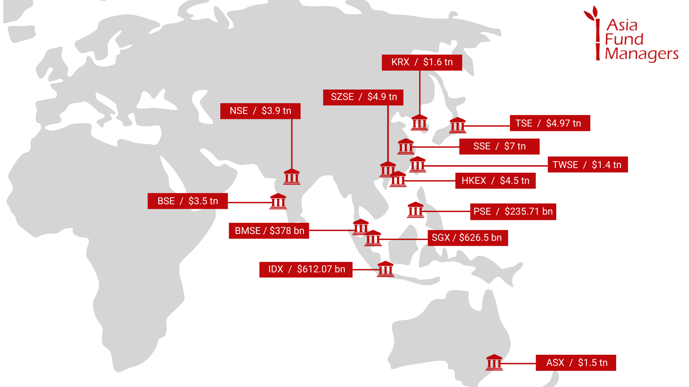

## Table of Contents

## What is a stock exchange?

A stock exchange is a place where people buy and sell shares of companies. It's like a big market, but instead of fruits and vegetables, people trade pieces of ownership in businesses. When you buy a share, you own a small part of that company. Stock exchanges help companies raise money by selling these shares to the public.

There are many stock exchanges around the world, like the New York Stock Exchange and the Tokyo Stock Exchange. They have rules to make sure trading is fair and safe. People who want to buy or sell shares usually do it through a broker, who helps them make the trades. The prices of shares go up and down based on what people think the company is worth and how well it's doing.

## What are the major stock exchanges in Asia?

In Asia, there are several big stock exchanges where people buy and sell shares of companies. One of the biggest is the Tokyo Stock Exchange in Japan. It's very important because Japan has a big economy, and many companies from Japan trade their shares there. Another major stock exchange is the Shanghai Stock Exchange in China. China is a huge country with a growing economy, so lots of people trade shares there too.

The Hong Kong Stock Exchange is also very important in Asia. It's a place where companies from all over the world, not just Hong Kong, can list their shares. This makes it a popular choice for international businesses. Another key exchange is the Shenzhen Stock Exchange, also in China. It's known for having many technology and startup companies, which makes it different from the Shanghai Stock Exchange.

Lastly, the Bombay Stock Exchange in India is one of the oldest and largest in Asia. It's a big deal because India has a lot of people and a growing economy. These stock exchanges help companies in Asia get money to grow and help people invest in these companies.

## How do Asian stock exchanges contribute to the global economy?

Asian stock exchanges play a big role in the global economy because they help companies in Asia grow and make money. When a company in Asia wants to get bigger, it can sell shares on a stock exchange like the Tokyo Stock Exchange or the Shanghai Stock Exchange. People from all over the world can buy these shares, which gives the company money to build new things or hire more people. This helps the company grow and also helps the economy of the country where the company is based.

These stock exchanges also help people from other countries invest in Asian companies. For example, someone in the United States might buy shares in a company listed on the Hong Kong Stock Exchange. This connects economies around the world, making them work together. When Asian companies do well, it can help the global economy because these companies might buy things from other countries or sell their products around the world. This way, Asian stock exchanges help make the world's economy stronger and more connected.

## What are the differences between the stock exchanges in Japan and China?

The Tokyo Stock Exchange in Japan and the stock exchanges in China, like the Shanghai and Shenzhen Stock Exchanges, have some big differences. The Tokyo Stock Exchange is one of the oldest and biggest in the world. It's where a lot of big Japanese companies trade their shares. Japan's economy is very advanced, so the companies on this exchange often focus on technology, cars, and electronics. The Tokyo Stock Exchange has strict rules to make sure trading is fair and to protect investors. It's also open to foreign investors, which means people from all over the world can buy shares of Japanese companies.

On the other hand, the stock exchanges in China, like the Shanghai and Shenzhen Stock Exchanges, are important because China has a huge and growing economy. The Shanghai Stock Exchange is known for having many big, established companies from different industries. The Shenzhen Stock Exchange, however, is famous for having more technology and startup companies. China's stock exchanges have been growing fast, and the government plays a big role in how they work. They have different rules compared to Japan, and sometimes it can be harder for foreign investors to buy shares in Chinese companies because of these rules.

Both Japan and China's stock exchanges help their countries' economies grow, but they do it in different ways. The Tokyo Stock Exchange helps Japanese companies get money from around the world, while China's exchanges help both big and small companies grow within China and sometimes beyond. These differences show how each country uses its stock exchanges to fit its own economic goals and needs.

## How can someone invest in Asian stock exchanges?

To invest in Asian stock exchanges, someone needs to open a brokerage account that allows trading in international markets. Many big online brokers in the U.S. and Europe offer this service, so you can choose one that works for you. Once you have an account, you can look at the different stock exchanges in Asia, like the Tokyo Stock Exchange in Japan or the Shanghai Stock Exchange in China. You'll need to do some research to pick the companies you want to invest in. You can buy shares of these companies through your broker, just like you would buy shares of a company in your own country.

It's important to know that investing in Asian stock exchanges can be a bit more complicated than investing at home. Some countries have rules that might make it harder for foreigners to buy shares. For example, China has some restrictions that might limit how much you can invest. Also, you need to think about the risks. The value of shares can go up and down, and when you're investing in another country, things like changes in the economy or politics can affect your investment more. So, it's a good idea to learn as much as you can before you start investing in Asian stock exchanges.

## What are the trading hours for major Asian stock exchanges?

The Tokyo Stock Exchange in Japan is open from 9:00 AM to 3:00 PM local time, which is Japan Standard Time (JST). This means if you want to buy or sell shares there, you need to do it during those hours. Japan is ahead of many other countries in time, so if you're in the United States, for example, you might need to trade in the evening or early morning.

In China, the Shanghai Stock Exchange and the Shenzhen Stock Exchange have similar hours. They are open from 9:30 AM to 11:30 AM and then from 1:00 PM to 3:00 PM local time, which is China Standard Time (CST). There's a break in the middle of the day. Like Japan, China is ahead in time, so people in other countries need to adjust their trading times accordingly.

The Hong Kong Stock Exchange operates from 9:30 AM to 12:00 PM and then from 1:00 PM to 4:00 PM Hong Kong Time (HKT). This exchange is important because it's a big place for international companies to trade. If you're planning to invest in any of these Asian stock exchanges, make sure you know their trading hours and adjust your schedule to match.

## What are the listing requirements for companies on Asian stock exchanges?

To list on the Tokyo Stock Exchange in Japan, a company needs to meet certain rules. They need to have enough money and a good history of making profits. The company also needs to show that it has good management and follows the law. The Tokyo Stock Exchange has different levels where a company can list, like the Prime Market, Standard Market, and Growth Market. Each level has its own rules, but they all want to make sure that the companies are strong and will be good for investors.

In China, the Shanghai Stock Exchange and the Shenzhen Stock Exchange also have rules for companies that want to list. They need to show that they have enough money and have been making profits for a few years. The company must also follow the laws and rules set by the Chinese government. The Shenzhen Stock Exchange has a special market called the ChiNext, which is for smaller, growing companies. Both exchanges want to make sure that the companies are honest and will be good for the economy.

The Hong Kong Stock Exchange has its own set of rules too. Companies need to show that they have enough money and a good track record of profits. They also need to have a certain number of shareholders and follow the rules set by the Hong Kong government. The Hong Kong Stock Exchange is known for being open to international companies, so their rules can be a bit different to welcome businesses from around the world.

## How have Asian stock exchanges evolved over the past decade?

Over the past decade, Asian stock exchanges have grown a lot and changed in many ways. The Tokyo Stock Exchange in Japan has worked on making its rules better to attract more companies and investors. They've made it easier for smaller companies to list on their Growth Market, which helps these companies get money to grow. The Tokyo Stock Exchange also uses new technology to make trading faster and safer. In China, the Shanghai and Shenzhen Stock Exchanges have become much bigger. More and more Chinese companies are listing on these exchanges, and they're using new technology to make trading easier. The Chinese government has also helped these exchanges grow by making new rules and supporting new markets like the STAR Market in Shanghai, which is for high-tech companies.

The Hong Kong Stock Exchange has also changed a lot in the last ten years. They've made it easier for companies from around the world to list there, which has made the exchange more international. They've also started using new technology to make trading faster and more secure. The Hong Kong Stock Exchange has worked on connecting with other stock exchanges in China, like the Shanghai and Shenzhen Stock Exchanges, to make it easier for investors to trade between these markets. Overall, Asian stock exchanges have become more connected, used more technology, and made their rules better to help companies and investors from around the world.

## What role do Asian stock exchanges play in regional economic development?

Asian stock exchanges help countries in Asia grow their economies by giving companies a place to get money. When a company wants to build new factories or start new projects, it can sell shares on a stock exchange like the Tokyo Stock Exchange or the Shanghai Stock Exchange. People buy these shares, which gives the company money to grow. This helps create jobs and makes the economy stronger. For example, when a company in Japan lists on the Tokyo Stock Exchange, it can use the money to hire more people and make more products, which helps Japan's economy grow.

These stock exchanges also help connect economies in Asia with the rest of the world. Investors from other countries can buy shares of Asian companies, which brings money into the region. This makes Asian countries more connected to global markets. For example, the Hong Kong Stock Exchange is a big place where companies from all over the world list their shares, which helps Hong Kong and other Asian countries work with businesses everywhere. By helping companies grow and connecting with the world, Asian stock exchanges play a big role in making the region's economy stronger.

## What are the regulatory bodies overseeing Asian stock exchanges?

In Japan, the Tokyo Stock Exchange is overseen by the Financial Services Agency (FSA). The FSA makes sure that companies and investors follow the rules. They check that the stock exchange is fair and safe for everyone. This helps keep the market honest and protects people who want to invest in Japanese companies.

In China, the Shanghai and Shenzhen Stock Exchanges are watched by the China Securities Regulatory Commission (CSRC). The CSRC sets the rules for how these exchanges work and makes sure that companies and investors follow them. They also work to make the market fair and safe. This is important because it helps the Chinese economy grow in a good way.

The Hong Kong Stock Exchange is overseen by the Securities and Futures Commission (SFC). The SFC makes sure that the exchange follows the rules and that trading is fair. They also work to protect investors and make sure that the market works well. This helps Hong Kong be a big place for companies from around the world to list their shares.

## How do geopolitical events affect Asian stock exchanges?

Geopolitical events, like fights between countries or big changes in government, can really affect Asian stock exchanges. When there's tension or conflict, people might feel worried about investing in companies from those countries. For example, if there's a problem between China and another country, the Shanghai and Shenzhen Stock Exchanges might see their share prices go down because investors are scared. This can make it harder for companies to get money and can slow down the economy.

But geopolitical events can also have good effects on Asian stock exchanges. Sometimes, when a country makes a new agreement with another country, it can help businesses grow. For instance, if Japan and another country sign a trade deal, companies on the Tokyo Stock Exchange might do better because they can sell more products to that country. This can make investors feel more confident and help the economy grow. So, geopolitical events can change how Asian stock exchanges work, sometimes making things harder and sometimes making things better.

## What are the future trends and technologies impacting Asian stock exchanges?

In the future, Asian stock exchanges will use more technology to make trading faster and safer. They will use things like [artificial intelligence](/wiki/ai-artificial-intelligence) (AI) and blockchain to help with trading. AI can help find the best times to buy and sell shares, and blockchain can make sure that all trades are safe and can't be changed. These technologies will make it easier for people to invest in Asian companies and help the exchanges work better.

Another big trend is that Asian stock exchanges will become more connected with each other and with exchanges in other parts of the world. This means investors will be able to buy and sell shares more easily between different countries. For example, the Hong Kong Stock Exchange might work more closely with the Shanghai and Shenzhen Stock Exchanges to let investors trade more easily between China and Hong Kong. This will help companies in Asia get more money from around the world and make the region's economy stronger.

## Top Asian Stock Exchanges in Algorithmic Trading

Asian stock exchanges play a pivotal role in the global algorithmic trading landscape, leveraging technology to enhance trading efficiency and execution speed. As of 2023, several stock exchanges stand out due to their significant market capitalizations and integration of algorithmic trading.

The Tokyo Stock Exchange (TSE) is one of Asia's largest stock exchanges, renowned for its technological advancements and robust trading systems. According to recent data, the TSE has a market capitalization of approximately USD 6 trillion, making it a key player in the global financial market. The exchange's deployment of cutting-edge trading technologies facilitates high-frequency trading and market [liquidity](/wiki/liquidity-risk-premium).

The Shanghai Stock Exchange (SSE) follows closely, with a market capitalization of around USD 4.9 trillion. It has emerged as a major hub for [algorithmic trading](/wiki/algorithmic-trading) in Asia. The SSE has implemented numerous technological innovations to accommodate the growing demand for algorithmic trading strategies, catering to both domestic and international investors.

India's National Stock Exchange (NSE) is another significant entity in algorithmic trading. With a market capitalization of over USD 3.4 trillion, the NSE is the most active exchange in India. It has continuously upgraded its technology infrastructure to enable efficient algorithmic trading. The introduction of co-location services, where traders can place their servers close to the exchange, has further amplified the execution speed for algorithmic strategies at the NSE.

These exchanges are at the forefront of integrating technological advancements into their trading platforms, thus enhancing their capacity to support sophisticated algorithmic trading strategies. Their significance in the global economy is underscored by their substantial market capitalizations and the growing [volume](/wiki/volume-trading-strategy) of trades executed on their platforms using algorithms.

## Central Asia Stock Exchanges

Central Asia's stock exchanges, such as the Kazakhstan Stock Exchange (KASE) and the Astana International Exchange (AIX), have become increasingly significant players in their regional markets. The Kazakhstan Stock Exchange, as one of the longest-established exchanges in the region, plays a crucial role in facilitating capital flow and investment within the country and neighboring areas. It serves as a pivotal financial infrastructure, offering investors a platform for trading equity and debt instruments, as well as currency and other financial products. This has been vital for the economic development and integration of Kazakhstan into global financial systems.

The Astana International Exchange, although newer, is rapidly gaining traction. It serves as an innovative financial hub that aims to attract foreign investments while providing Kazakhstan and Central Asia with an advanced technological trading platform. A key aspect of AIX's appeal is its adoption of the Nasdaq Matching Engine, a state-of-the-art technology renowned for its high speed and reliability in executing trades. This system allows AIX to offer an electronic trading platform that matches buyers and sellers efficiently, handling a high volume of transactions per second. By leveraging such advanced technology, AIX ensures transparency and fosters investor trust, essential for market growth and stability.

The integration of cutting-edge technologies like the Nasdaq Matching Engine enables these exchanges to enhance their competitiveness and align with global standards. This not only attracts local and international investors but also facilitates more seamless regional financial integration. Consequently, both KASE and AIX have positioned themselves as pivotal components in Central Asia's financial landscape, contributing to the broader economic goals of growth and modernization within the region. As these exchanges evolve, they will continue to have a critical impact on the economic capabilities and financial infrastructure of Central Asia.

## Eastern Asia Stock Exchanges

Eastern Asia is home to some of the world's most influential stock exchanges, including the Tokyo Stock Exchange (TSE), the Hong Kong Stock Exchange (HKEX), and major Chinese exchanges such as the Shanghai Stock Exchange (SSE) and the Shenzhen Stock Exchange (SZSE). These exchanges are pivotal in driving the growth and evolution of algorithmic trading, harnessing advanced technology to enhance market efficiency and attract global investors.

The Tokyo Stock Exchange is one of the largest exchanges globally by market capitalization. It has been at the forefront of implementing cutting-edge technology to bolster algorithmic trading. The TSE utilizes the arrowhead trading system, which provides low-latency processing of trades, ensuring that algorithmic strategies can execute trades with minimal delay. The system's high-speed capabilities allow for processing a multitude of orders per second, a critical feature for high-frequency trading strategies that thrive on transient market opportunities.

Similarly, the Hong Kong Stock Exchange has invested significantly in its infrastructure to accommodate algorithmic trading, expanding its platform capabilities and reducing latency. HKEX’s Orion Trading Platform offers a high-performance trading environment, supporting a wide array of automated trading strategies. The exchange plays a strategic role as a gateway for investors seeking exposure to Mainland China's markets, facilitated further by the Stock Connect programs with the SSE and SZSE.

In China, both the Shanghai and Shenzhen Stock Exchanges have embraced technological advancements to support the burgeoning demand for algorithmic trading. These exchanges have implemented robust trading systems designed to handle vast numbers of transactions efficiently. The Shanghai Stock Exchange, for instance, offers the New Generation Trading System, which supports low-latency trading and provides a scalable platform that can accommodate the increasing volumes driven by algorithmic trading strategies.

The growth and development of these Eastern Asian exchanges in the global market are significant. They not only handle a large share of the world's trading volumes but also serve as innovation hubs where the integration of technology and finance advances rapidly. As algorithmic trading continues to evolve, it is likely that these exchanges will further enhance their technological frameworks to maintain competitive edges and attract more international participants.

Moreover, regulatory environments in these regions are progressively adapting to accommodate the unique challenges posed by algorithmic trading. This includes ensuring fair trading practices, managing systemic risk, and promoting market transparency. As these exchanges continue to upgrade their technological capabilities, they contribute to the robustness and dynamism of the global financial ecosystem, paving the way for future growth in algorithmic trading.

## Southeast Asia Stock Exchanges

Southeast Asia plays a significant role in the landscape of global stock exchanges, particularly through the presence of key markets like the Singapore Exchange (SGX) and the Indonesia Stock Exchange (IDX). These exchanges serve as pivotal hubs for algorithmic trading, a method that utilizes complex algorithms to automate trading strategies, enhancing efficiency and speed.

The Singapore Exchange is renowned for its advanced technological infrastructure, which supports various algorithmic trading strategies. One prevalent strategy is high-frequency trading ([HFT](/wiki/high-frequency-trading-strategies)), which involves executing a large number of orders at extremely high speeds, often within milliseconds. SGX has invested heavily in low-latency technology, offering co-location services that allow traders to place their servers near the exchange's matching engines, thereby reducing the time it takes for trade execution.

On the other hand, the Indonesia Stock Exchange has been focusing on increasing accessibility and technological upgrades to attract more algorithmic traders. A notable strategy in this market is statistical [arbitrage](/wiki/arbitrage), which involves using quantitative models to identify price differentials between financial instruments and capitalize on these inefficiencies. IDX's improvements in trading systems and connectivity have made it an attractive venue for traders employing such strategies.

Current trends indicate that algorithmic trading in Southeast Asia is poised for significant growth. Factors driving this expansion include the increased digitization of financial services, regulatory advancements, and a growing interest from international investors. Moreover, the region's strategic location and robust economic growth further amplify its appeal.

Looking ahead, the future growth potential for algorithmic trading in Southeast Asia appears promising. As technology evolves, exchanges like SGX and IDX will continue to enhance their infrastructure, enabling more sophisticated trading algorithms. Additionally, increasing competition among exchanges to offer better services and faster execution times will likely spur further advancements in algorithmic trading capabilities.

In summary, Southeast Asia's stock exchanges are crucial players in the development of algorithmic trading, with the Singapore Exchange and Indonesia Stock Exchange at the forefront. Continued technological enhancements and strategic investments are expected to bolster the region's position as a key hub for algorithmic trading, driving growth and innovation.

## Southern Asia Stock Exchanges

The Southern Asia region, particularly India, plays a pivotal role in the global algorithmic trading landscape, largely due to its prominent stock exchanges: the Bombay Stock Exchange (BSE) and the National Stock Exchange (NSE) of India. These exchanges are not only significant in terms of market capitalization but also in their adoption of advanced technology infrastructures that facilitate algorithmic trading.

At the core of algorithmic trading in India is the robust technology infrastructure adopted by both BSE and NSE. The exchanges have implemented sophisticated trading technology to ensure high-frequency trading (HFT) and algorithmic trades are executed swiftly and accurately. For instance, both exchanges utilize advanced trading platforms equipped with high-speed co-location services, allowing traders to place their servers on the exchange premises. This minimizes latency and enhances the speed of order execution – a critical [factor](/wiki/factor-investing) for success in algorithmic trading. Furthermore, BSE and NSE have integrated cutting-edge risk management systems that offer real-time monitoring and automated risk checks, ensuring that trading activities remain within regulatory compliance and risk parameters.

The regulatory environment in India plays a crucial role in shaping the algorithmic trading ecosystem. The Securities and Exchange Board of India (SEBI), the primary regulatory authority, has implemented strict regulations to oversee algorithmic trading activities. SEBI mandates that all algorithmic orders be tagged, logged, and subjected to robust audit trails to prevent market manipulation and ensure transparency. Additionally, risk management measures are enforced by requiring brokers to maintain a minimum latency and adhere to standardized market access controls. Algorithmic traders must also undergo periodic code verification to authenticate the strategies being employed.

These regulatory measures ensure a fair trading environment and protect market integrity. However, they also pose challenges for traders who must continually update their strategies and technology to comply with the evolving regulatory landscape. Despite these challenges, the adherence to such regulations helps in fostering a safer and more transparent trading environment, ultimately benefiting the overall market ecosystem in Southern Asia. The growing investment in technology and stringent regulatory oversight highlights the dynamic nature of India's stock exchanges in the rapidly evolving algorithmic trading arena.

## Western Asia Stock Exchanges

Stock exchanges in Western Asia, such as the Tadawul in Saudi Arabia and the Tel Aviv Stock Exchange in Israel, have increasingly embraced advanced technologies to enhance their trading capabilities. These exchanges serve as vital financial hubs in their respective regions and have recognized the potential of algorithmic trading to boost efficiency and liquidity.

**Tadawul in Saudi Arabia** has made significant strides in incorporating technology into its trading systems. In recent years, Tadawul upgraded its trading platform to the Nasdaq Financial Framework. This upgrade enables the exchange to process a higher volume of transactions with improved speed and accuracy, paving the way for more sophisticated trading strategies, including algorithmic trading. The new system supports multi-asset trading and offers better integration capabilities, which are crucial features for traders employing complex algorithms.

**The Tel Aviv Stock Exchange (TASE)** also highlights advanced technological integration. TASE has migrated to the TASE UP platform, which leverages blockchain technology to facilitate digital onboarding and enhance transparency in trading processes. This move not only modernizes the exchange's infrastructure but also makes it more attractive to algorithmic traders who seek a reliable and transparent trading environment. Additionally, TASE's adoption of FIX (Financial Information Exchange) protocol supports high-frequency trading and allows traders to implement advanced algorithms efficiently.

While these advancements have propelled Western Asian exchanges forward, they also present challenges. One of the primary concerns is the regulatory landscape, which must adapt to keep pace with technological innovations. Algorithmic trading raises issues of market fairness and stability, which necessitate robust regulatory frameworks to prevent manipulation and ensure market integrity. Exchanges must work closely with regulators to establish guidelines that balance technological potential with the protection of market participants.

Another challenge is the need for continuous investment in infrastructure to support the growing demands of algorithmic trading. As the complexity and volume of trades increase, exchanges must ensure their systems can handle large datasets and execute transactions without latency issues. This requires ongoing technological enhancements and cybersecurity measures to protect sensitive financial data from potential threats.

In summary, the stock exchanges in Western Asia are embracing technological advancements, enabling them to compete in the rapidly evolving landscape of global finance. While challenges remain, the opportunities presented by advanced trading technologies are immense, offering the potential for these exchanges to significantly enhance their role in international markets.

## References & Further Reading

[1]: Li, B., Wong, W.K., & Qiao, Z. (2014). ["Stock liquidity, its determinants and implications: A case study of Hong Kong."](https://pubs.acs.org/doi/10.1021/acs.chemrev.4c00586) The Chinese Economy.

[2]: Gomber, P., Arndt, B., Lutat, M., & Uhle, T. (2011). ["High-frequency trading."](https://papers.ssrn.com/sol3/papers.cfm?abstract_id=1858626) Business & Information Systems Engineering.

[3]: Yan, Y., & Zhang, H. (2012). ["An improved algorithm for trading in highly frequent markets."](https://www.tandfonline.com/doi/full/10.1080/00036846.2017.1412075) Mathematics and Computers in Simulation.

[4]: Aitken, M. (2008). ["Algorithmic trading overview."](https://research.birmingham.ac.uk/en/publications/algorithmic-trading-and-market-quality-international-evidence-of-) JASSA: The Finsia Journal of Applied Finance.

[5]: Hasbrouck, J., & Saar, G. (2013). ["Low-latency trading."](https://papers.ssrn.com/sol3/papers.cfm?abstract_id=1695460) The Review of Financial Studies.