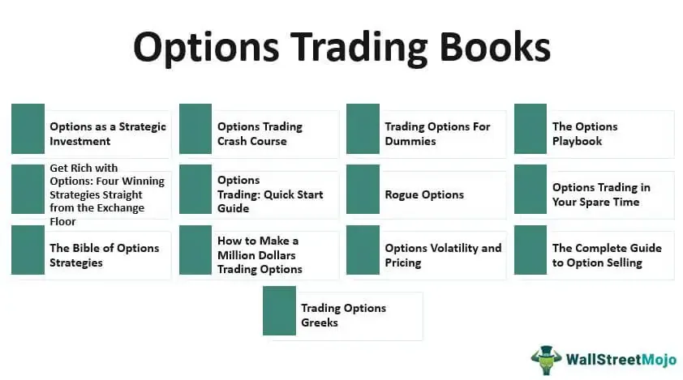

Investment strategies within the financial markets are diverse and complex, offering numerous avenues for traders to explore and exploit. Among these strategies, options trading and algorithmic trading have emerged as pivotal components that provide unique opportunities for maximizing profits while effectively managing risks. This article will illuminate these strategies, focusing on the key concepts, literature, and tools that equip traders to navigate the financial landscape with confidence.

Options trading represents a sophisticated approach whereby traders engage in buying and selling contracts, granting them the right, but not the obligation, to purchase or sell underlying assets at pre-established prices. This flexibility affords traders the ability to leverage their positions, hedge against potential market losses, and capitalize on market volatility. Famous texts, such as "Options as a Strategic Investment" by Lawrence McMillan, are invaluable for those beginning their journey or seeking to refine their expertise in options trading, as they provide essential knowledge on the mechanics and strategies involved.



On the other hand, algorithmic trading employs computer programs to conduct trades based on predefined criteria, enhancing trading efficiency and accuracy through the rapid processing of large quantities of data. This method of trading is often underpinned by quantifiable strategies and is supported by literature like "Algorithmic Trading: Winning Strategies and Their Rationale" by Ernest Chan, which provides insights into creating sophisticated trading algorithms. 

As we venture into these trading strategies, it is imperative to understand the interaction between market forces and trading techniques. By mastering the principles of options and algorithmic trading, traders can make informed decisions, optimizing their strategies to suit varying market conditions. Through a thorough exploration of strategic implementation and risk management, traders acquire the discipline and knowledge necessary to succeed in dynamic market environments.

## Table of Contents

## Understanding Options Trading

Options trading involves buying and selling contracts that confer the right, but not the obligation, to buy or sell an underlying asset at a predetermined price before or at the expiration date. These contracts, known as options, are typically associated with stocks, but they can also be based on indexes, commodities, or currencies.

One key advantage of options trading is the ability to leverage positions. Through the use of options, traders can control a larger amount of the underlying asset with a relatively small investment, thereby increasing the potential return on investment. However, this leverage also amplifies the risk of losses.

Options trading is also an effective tool for hedging against potential losses in an investment portfolio. By purchasing options, investors can protect their portfolios against unfavorable price movements, effectively acting as an insurance mechanism. For instance, buying a put option provides the holder with the right to sell the underlying asset at a specific price, thereby capping potential losses if the asset's price declines.

Exploiting market [volatility](/wiki/volatility-trading-strategies) is another significant advantage facilitated by options trading. Traders can formulate strategies that benefit from price fluctuations in the underlying asset, regardless of whether the market moves up, down, or remains stagnant.

To gain proficiency in options trading, understanding the Greeks is essential. The Greeks are mathematical measures that describe the sensitivity of an option's price to various factors:

- **Delta** measures the rate of change of the option's price with respect to changes in the price of the underlying asset. It ranges between -1 and 1, with call options having positive delta and put options having negative delta.
- **Theta** quantifies the effect of time decay on the value of an option. It indicates how much the price of an option decreases as it approaches expiration.
- **Vega** measures the sensitivity of the option's price to changes in the volatility of the underlying asset. An increase in volatility typically raises the price of both call and put options.
- **Rho** evaluates the impact of interest rate changes on the option's price. It shows how much the option's price would be expected to rise or fall based on a 1% change in interest rates.

A fundamental resource for understanding these concepts deeply is "Options as a Strategic Investment" by Lawrence McMillan. This book is widely recommended for both beginners and advanced traders as it provides comprehensive insights into various options strategies, risk management, and the theoretical underpinnings of trading options. Understanding these strategies and the role of the Greeks is pivotal for making informed decisions in options trading.

## Investment Strategies in Options Trading

Options trading strategies offer a range of possibilities for investors, from basic approaches involving calls and puts to more complex positions such as iron butterflies and straddles. These strategies serve different purposes and are selected based on the trader's risk tolerance and market outlook.

A fundamental understanding of call and put options forms the basis for more advanced strategies. A call option provides the buyer with the right, without obligation, to purchase an underlying asset at a specified price within a set timeframe, while a put option grants the right to sell under similar conditions. Traders can buy or sell these options to construct strategies tailored to their market expectations.

### Complex Strategies

**1. Iron Butterflies:**
An iron butterfly strategy involves a combination of four options with three distinct strike prices, centering on a specific target asset price at expiration. It typically comprises a bull put spread and a bear call spread. The structure may look like this:
- Buy one out-of-the-money put
- Sell one at-the-money put
- Sell one at-the-money call
- Buy one out-of-the-money call

This results in both limited profit and loss potentials, and its success relies on low market volatility.

**2. Straddles:**
A straddle involves the purchase of a call and a put option with the same strike price and expiration date. This strategy benefits from significant movement in either direction, as the loss is limited to the total premium spent, but the potential gain is theoretically unlimited. Straddles are advantageous in conditions of high volatility or preceding major market events.

### Strategic Implementation

The successful implementation of options strategies necessitates a keen analysis of market conditions and volatility. Historical and implied volatility can guide which strategies are likely to succeed. For instance, high volatility favors strategies like long straddles, while low volatility suits strategies like iron butterflies.

Dan Passarelli's 'Trading Options Greeks' is a crucial resource for traders looking to capitalize on time decay and volatility. Understanding the Greeks—Delta, Gamma, Theta, Vega, and Rho—enables traders to assess and manage the sensitivity of options' prices to market changes. For example, Theta measures an option’s sensitivity to time decay, crucial for strategies that thrive as time passes without much price movement, like iron condors or butterflies.

### Risk Management

Risk management is an integral part of options trading, linked inseparably to the potential profits and losses of each strategy. Traders must grasp the maximum loss or gain scenarios for their positions. For instance, in the case of an iron butterfly, the maximum possible loss is the difference between the strike prices of the spread, minus the net premium received. Effective risk management also involves diversifying strategies to mitigate losses in unpredictable markets and using tools like stop-loss orders to limit downside risks.

In summary, options trading incorporates a wide spectrum of strategies, each with unique implications for risk and reward. Mastery of these strategies, along with robust risk management and a thorough understanding of market dynamics, equip traders to navigate the complex financial landscape.

## Algorithmic Trading: An Overview

Algorithmic trading, commonly known as algo trading, involves the use of computer algorithms to execute trades automatically based on predefined criteria. These algorithms analyze market data, identify trading opportunities, and execute trades with precision and speed, minimizing the need for human intervention. One of the primary advantages of [algorithmic trading](/wiki/algorithmic-trading) is its ability to enhance efficiency in trading operations. By leveraging advanced computing power, algo trading systems are capable of processing vast amounts of data quickly, allowing traders to make informed decisions in a fraction of a second. 

This increased efficiency also translates to improved accuracy, as algorithms can execute trades at the best possible prices, minimizing slippage and reducing the impact of market movements on the execution time. Moreover, algorithmic trading enables traders to manage large portfolios systematically, balancing trades across markets, and can perform tasks that would be unfeasible manually.

A seminal work in this field, "Algorithmic Trading: Winning Strategies and Their Rationale" by Ernest Chan, offers valuable insights into developing successful algo trading strategies. The book explores a range of quantitative approaches and provides practical guidance on how traders can design, implement, and optimize their own trading algorithms.

Python is a preferred programming language for developing these algorithms due to its flexibility and extensive libraries that facilitate data analysis and algorithm development. A simple example of a basic trading algorithm in Python might involve using the `pandas` library for data handling, the `numpy` library for numerical computations, and `scikit-learn` for predictive modeling. Here is an illustrative snippet of Python code used in algorithmic trading for identifying a simple moving average crossover strategy:

```python
import pandas as pd
import numpy as np

def moving_average_strategy(prices, short_window, long_window):
    signals = pd.DataFrame(index=prices.index)
    signals['price'] = prices
    signals['short_mavg'] = prices.rolling(window=short_window, min_periods=1).mean()
    signals['long_mavg'] = prices.rolling(window=long_window, min_periods=1).mean()

    signals['signal'] = 0.0
    signals['signal'][short_window:] = np.where(signals['short_mavg'][short_window:] > signals['long_mavg'][short_window:], 1.0, 0.0)
    signals['positions'] = signals['signal'].diff()

    return signals

# Example usage:
# prices = pd.Series(your_price_data)
# signals = moving_average_strategy(prices, short_window=40, long_window=100)
```

In this example, the algorithm generates buy signals when the short-term moving average crosses above the long-term moving average and sell signals when the opposite occurs. Such strategies can be backtested against historical data to evaluate their effectiveness before deploying them in live market conditions.

Algorithmic trading thus represents a modernization of trading practices, offering traders innovative ways to interact with financial markets. Its reliance on data-driven insights and automation ensures that market actions are both rapid and rationally grounded, paving the way for more sophisticated and scalable trading operations.

## Essential Reads for Algorithmic Traders

Success in algorithmic trading often hinges on knowledge derived from foundational literature. Two essential [books](/wiki/algo-trading-books) are "Quantitative Trading" by Ernest Chan and "Advances in Financial Machine Learning" by Marcos López de Prado, which offer practical strategies and insights for algorithmic traders. These works are instrumental in helping traders develop robust trading systems and leverage [machine learning](/wiki/machine-learning) techniques effectively.

"Quantitative Trading" by Ernest Chan focuses on developing quantitative strategies for trading. The book emphasizes the use of statistical techniques and quantitative models to identify market inefficiencies. Readers learn to construct, backtest, and implement strategies that adapt to changing market conditions. Key topics include the selection of financial instruments, the design of trading strategies, and the importance of robust backtesting. The book also provides practical examples and code snippets in Python, making it accessible for both beginners and seasoned traders.

"Advances in Financial Machine Learning" by Marcos López de Prado investigates into the intersection of finance and machine learning. This book is crucial for understanding how machine learning algorithms can be applied to financial data to enhance trading strategies. De Prado introduces concepts such as feature importance, cross-validation, and overfitting. The book also addresses practical challenges in financial machine learning, such as dealing with imbalanced datasets and assessing model risk. It provides an in-depth look at the application of machine learning in constructing and optimizing trading systems.

A solid grasp of complex concepts like [backtesting](/wiki/backtesting), live trading, and stochastic calculus is crucial for successful algorithmic trading. Backtesting allows traders to simulate the performance of a strategy using historical data to evaluate its potential profitability. This process helps identify flaws in a strategy before risking real capital. Live trading involves the deployment of trading strategies in real-time, requiring traders to manage operational risks and ensure strategies perform as expected under live conditions.

Stochastic calculus plays a significant role in modeling the dynamic behavior of financial markets. It provides the mathematical underpinnings for modeling price movements, option pricing, and risk management. For instance, the Black-Scholes model, a famous application of stochastic calculus, is used for options pricing and risk assessment.

By understanding and applying the insights from these foundational books, algorithmic traders can create sophisticated trading systems that effectively respond to market opportunities and risks.

## Combining Options and Algorithmic Trading

Integrating options and algorithmic trading creates a comprehensive approach that leverages the strengths of both methodologies, thereby optimizing strategies that efficiently balance risk and reward. In options trading, algorithmic systems allow traders to automate complex strategies, significantly enhancing execution speed and accuracy. By employing sophisticated algorithms, market data can be analyzed in real-time to determine optimal entry and [exit](/wiki/exit-strategy) points for options trades. This automation reduces human error and enables traders to execute trades at times when it would be most effective, minimizing latency and taking advantage of fleeting opportunities.

Algorithmic trading systems use built-in criteria to manage large datasets, employing techniques such as statistical analysis and machine learning to predict market movements. For example, an algorithm might evaluate historical price data, volatility indices, and other relevant financial indicators to choose an appropriate options strategy, such as a straddle or a butterfly spread. The ability to process such a vast quantity of information quickly and accurately provides traders with a significant advantage in fast-moving markets.

Python is one of the most popular programming languages used for developing algorithms in trading due to its simplicity and powerful libraries like Pandas for data manipulation, NumPy for numerical computations, and SciPy for advanced scientific calculations. A sample Python code snippet for backtesting an options trading strategy could look like this:

```python
import pandas as pd
import numpy as np

# Load historical options data
data = pd.read_csv('options_data.csv')

# Define an algorithmic strategy function
def algo_strategy(data):
    signals = []
    for i in range(1, len(data)):
        if data['Volatility'][i] > data['Volatility'].mean():
            signals.append('Buy Call')
        else:
            signals.append('Sell Put')
    return signals

# Apply the strategy and evaluate performance
data['Signals'] = algo_strategy(data)
performance = np.cumsum(np.where(data['Signals'] == 'Buy Call', data['Return'], -data['Return']))
```

This approach facilitates better portfolio management by seamlessly integrating real-time market data and quantitative analysis for decision-making. Furthermore, it enables traders to harness broader market opportunities by deploying strategies that are not only based on [fundamental analysis](/wiki/fundamental-analysis) but also enriched with real-time computational insights. 

The synergy of options and algorithmic trading exemplifies the next generation of trading strategies. By combining high-level automation with strategic options trades, traders can aspire toward a dynamic yet controlled approach to financial markets. Through the automation of repetitive tasks and the incorporation of sophisticated data analysis, this integrated strategy offers heightened efficiency, robustness, and the potential for enhanced returns.

## Conclusion

Options trading and algorithmic trading both demand a robust understanding of financial markets, disciplined execution, and a commitment to continuous learning. Traders seeking to capitalize on these strategies must be equipped with both theoretical knowledge and practical skills, which can be significantly enhanced through a diligent study of fundamental books and resources. Works such as "Options as a Strategic Investment" by Lawrence McMillan and "Algorithmic Trading: Winning Strategies and Their Rationale" by Ernest Chan provide essential insights that form the cornerstone of a trader's education.

The integration of options and algorithmic trading techniques offers a promising framework for achieving profitability in today's dynamic market conditions. Algorithmic solutions can refine options trading strategies, enabling faster decision-making and more accurate trade executions. Such strategies allow traders to optimize results by analyzing vast datasets efficiently, identifying profitable opportunities with precision.

The application of advanced technologies and systematic strategies equips traders with the tools necessary to manage risk and enhance reward effectively. Programming skills and algorithm development are crucial for constructing robust trading systems capable of consistently navigating market fluctuations. As traders utilize these advanced methodologies, they can confidently address the complexities of modern financial markets, maximizing their potential for success.

In conclusion, the synergy of options trading and algorithmic trading offers a comprehensive approach to modern investing, combining strategic precision with technological prowess. This harmonious integration not only fortifies a trader's toolkit but also paves an ambitious pathway towards achieving their financial goals with confidence and acuity.

## References & Further Reading

[1]: ["Options as a Strategic Investment"](https://www.amazon.com/Options-as-Strategic-Investment-Fifth/dp/0735204659) by Lawrence McMillan

[2]: ["Algorithmic Trading: Winning Strategies and Their Rationale"](https://www.wiley.com/en-us/Algorithmic+Trading%3A+Winning+Strategies+and+Their+Rationale-p-9781118460146) by Ernest P. Chan

[3]: ["Trading Options Greeks: How Time, Volatility, and Other Pricing Factors Drive Profits"](https://www.amazon.com/Trading-Options-Greeks-Volatility-Pricing/dp/1118133161) by Dan Passarelli

[4]: ["Quantitative Trading: How to Build Your Own Algorithmic Trading Business"](https://www.amazon.com/Quantitative-Trading-Build-Algorithmic-Business/dp/1119800064) by Ernest P. Chan

[5]: ["Advances in Financial Machine Learning"](https://www.amazon.com/Advances-Financial-Machine-Learning-Marcos/dp/1119482089) by Marcos Lopez de Prado