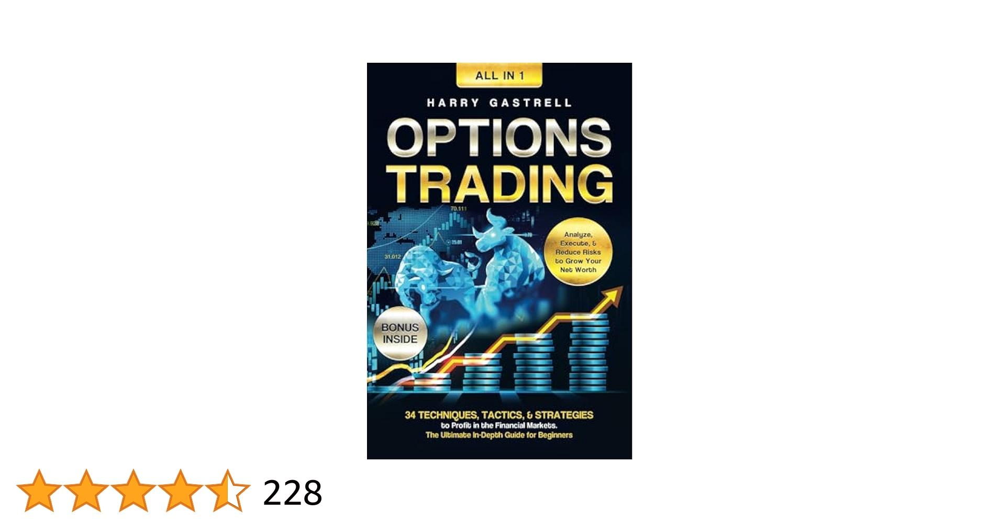

## Table of Contents

## What are the basic concepts of options trading that a beginner should understand?

Options trading involves buying and selling contracts that give you the right, but not the obligation, to buy or sell an underlying asset at a specific price before a certain date. There are two main types of options: calls and puts. A call option gives you the right to buy an asset, while a put option gives you the right to sell an asset. The price at which you can buy or sell the asset is called the strike price, and the date by which you must exercise your option is known as the expiration date.

Understanding the concepts of options can be helpful for managing risk and potentially increasing returns. When you buy an option, you pay a premium, which is the cost of the option. This premium can be affected by factors like the price of the underlying asset, the time until expiration, and the volatility of the asset. If you think the price of an asset will go up, you might buy a call option. If you think the price will go down, you might buy a put option. Selling options, also known as writing options, can generate income but comes with more risk because you could be obligated to buy or sell the asset if the option is exercised.

It's important for beginners to start with a solid understanding of these basics before diving into more complex strategies. Options can be used for speculation, where you try to profit from price movements, or for hedging, where you try to protect other investments from adverse price changes. Always remember that options trading involves significant risks, so it's wise to start small, educate yourself thoroughly, and perhaps consult with a financial advisor before making any big moves.

## How can beginners start trading options safely and effectively?

To start trading options safely and effectively, beginners should first educate themselves thoroughly about options and the market. They can do this by reading [books](/wiki/algo-trading-books), taking online courses, or even attending workshops. It's important to understand the basic concepts like calls, puts, strike prices, and expiration dates. Beginners should also learn about the risks involved in options trading, as it can be more complex and risky than trading stocks. A good way to start is by using a virtual trading account, where you can practice trading options without risking real money. This helps you get a feel for how options work and how to manage your trades.

Once you feel comfortable with the basics, start with small amounts of money that you can afford to lose. This approach minimizes your risk while you gain experience. It's also a good idea to focus on simple strategies at first, like buying call or put options, rather than jumping into more complex strategies like spreads or straddles. As you gain more experience, you can slowly increase the amount you invest and explore more advanced strategies. Always keep in mind that options trading involves significant risks, so it's wise to set clear goals, use stop-loss orders to limit potential losses, and perhaps consult with a financial advisor to help guide your trading decisions.

## What are the most recommended books for someone new to options trading?

One of the best books for beginners is "Options as a Strategic Investment" by Lawrence G. McMillan. This book is like a big guide that explains everything about options in a way that's easy to understand. It covers the basics, like what options are and how they work, and also goes into more advanced strategies. It's a great book because it's detailed but still easy to follow, so it's perfect for someone just starting out.

Another good book is "The Options Playbook" by Brian Overby and the Options Industry Council. This book is more like a handbook with lots of examples and pictures to help you learn. It explains different ways to use options and gives you step-by-step guides on how to do it. It's great for beginners because it makes options trading seem less scary and more doable.

Lastly, "Understanding Options" by Michael Sincere is also a great choice. This book breaks down options into simple terms and focuses on the most important things you need to know. It's short and to the point, which is perfect if you want to quickly learn the basics without getting overwhelmed.

## What are the key strategies for intermediate options traders to master?

For intermediate options traders, mastering strategies like covered calls and protective puts can really help manage risk and boost returns. A covered call involves owning the stock and then selling call options against that stock. This can bring in extra income from the option premiums, but it limits how much you can gain if the stock price goes way up. On the other hand, a protective put means buying a put option for a stock you already own. This acts like insurance, protecting you if the stock price falls, but it costs you the premium you pay for the put.

Another important strategy to learn is the use of vertical spreads, which can help manage risk and potentially increase profits. A vertical spread involves buying and selling options of the same type (either calls or puts) and expiration date but with different strike prices. For example, a bull call spread is when you buy a call option at a lower strike price and sell another call option at a higher strike price. This limits both your potential profit and loss, making it a more controlled way to trade. As an intermediate trader, understanding and using these strategies can help you navigate the options market more effectively.

## Which books provide the best insights into options trading strategies for intermediate traders?

For intermediate traders looking to dive deeper into options trading strategies, "Option Volatility and Pricing: Advanced Trading Strategies and Techniques" by Sheldon Natenberg is a top recommendation. This book is great because it goes into detail about how [volatility](/wiki/volatility-trading-strategies) affects option prices and how to use this knowledge to your advantage. Natenberg explains different strategies like straddles and strangles, which can be useful for intermediate traders wanting to understand how to profit from big price moves in either direction. The book is a bit more advanced, but it's written in a way that makes the concepts clear and easy to apply.

Another excellent book for intermediate traders is "Trading Options: Using Technical Analysis to Design Winning Trades" by Greg Harmon. This book focuses on combining options trading with technical analysis, which can help you make better trading decisions. Harmon explains how to use charts and indicators to spot good opportunities for options trades. He covers strategies like iron condors and butterflies, which are more complex but can be very effective for managing risk and maximizing returns. This book is perfect for intermediate traders who want to blend technical analysis with their options trading strategies.

## How can one assess and manage risk in options trading?

Assessing and managing risk in options trading starts with understanding the potential outcomes of your trades. Before you make a trade, think about what could happen to the price of the underlying asset and how that would affect your option's value. For example, if you buy a call option, you could lose the entire premium you paid if the stock price doesn't go above the strike price before the option expires. To manage this risk, you can use stop-loss orders, which automatically sell your option if it drops to a certain price, helping to limit your losses. It's also important to only invest money you can afford to lose, as options trading can be risky.

Another way to manage risk is by diversifying your options trades. Instead of putting all your money into one option, spread it across different options on different assets. This way, if one trade doesn't work out, you won't lose everything. Using strategies like covered calls and protective puts can also help manage risk. A covered call limits your potential loss on a stock you own by selling a call option against it, while a protective put acts like insurance by letting you sell a stock at a set price if it falls. By understanding these strategies and using them wisely, you can better manage the risks involved in options trading.

## What advanced options trading techniques should an expert trader be familiar with?

Expert traders should be familiar with advanced options trading techniques like iron condors and butterflies. An iron condor involves selling an out-of-the-money call spread and an out-of-the-money put spread on the same underlying asset with the same expiration date. This strategy is used when you think the stock price will stay within a certain range. It can generate income from the premiums of the options you sell, but your potential profit is limited to the net premium received, and there's a risk of significant loss if the stock price moves outside the range. Butterflies are another advanced strategy where you buy an in-the-money option, sell two at-the-money options, and buy an out-of-the-money option, all with the same expiration date. This strategy is used when you expect low volatility and the stock price to stay close to the middle strike price. The maximum profit is achieved if the stock price is at the middle strike at expiration, but the potential loss is limited to the net premium paid.

Another technique expert traders should know is the use of calendar spreads, also known as horizontal spreads. A calendar spread involves selling a short-term option and buying a longer-term option with the same strike price. This strategy profits from the difference in time decay between the two options, as the short-term option loses value faster than the long-term option. It's most effective in a stable market where the underlying asset's price doesn't move much. Expert traders also use delta-neutral trading, where they adjust their options positions to have a delta (sensitivity to the underlying asset's price) of zero. This technique aims to profit from changes in volatility rather than price movements, making it useful for traders who can predict shifts in market volatility.

## Which books are considered essential reading for advanced options trading?

For advanced options traders, "Volatility Trading" by Euan Sinclair is a must-read. This book dives deep into how to trade volatility, which is super important for experts. Sinclair explains how to use options to bet on how much a stock's price might move, not just which way it will go. He talks about things like the VIX, which measures market volatility, and how to use it to make smarter trades. The book also covers advanced math and models that can help you understand and predict how options prices will change. It's a bit technical, but if you want to master volatility trading, this book is key.

Another essential book for advanced traders is "Dynamic Hedging: Managing Vanilla and Exotic Options" by Nassim Nicholas Taleb. This book is all about how to manage the risks of trading options, especially the more complex ones. Taleb explains how to use dynamic hedging, which means constantly adjusting your trades to keep your risk under control. He goes into detail about different types of exotic options and how to trade them. The book can be tough to read because it's full of math and theory, but it's worth it if you want to learn how to handle the trickiest parts of options trading.

## How do market conditions affect options trading strategies?

Market conditions play a big role in how you should trade options. When the market is going up, or in a bull market, you might want to use strategies that benefit from rising prices. For example, buying call options can be a good idea because they let you buy a stock at a set price, which can be profitable if the stock keeps going up. On the other hand, if the market is going down, or in a bear market, you might want to use strategies that benefit from falling prices. Buying put options can be smart here because they let you sell a stock at a set price, which can be profitable if the stock keeps going down.

Another important thing to consider is how much the market is moving around, or its volatility. If the market is very volatile, meaning prices are swinging a lot, you might want to use strategies that can make money from big price moves. Strategies like straddles or strangles, where you buy both call and put options, can be good because they let you profit no matter which way the price goes, as long as it moves a lot. But if the market is calm and not moving much, you might want to use strategies that make money from the slow decay of option prices over time, like selling options or using spreads. Understanding the market conditions helps you pick the right strategy to make the most of your trades.

## What are some case studies or real-life examples of successful options trading that can be learned from books?

In "The Options Playbook" by Brian Overby and the Options Industry Council, there's a case study about a trader named Sarah who used a covered call strategy successfully. Sarah owned shares of a tech company and wanted to earn extra income from her holdings. She sold call options against her shares, collecting the premium. When the stock price stayed below the strike price of the calls at expiration, she got to keep the premium, boosting her returns without selling her stock. This example shows how covered calls can be a safe way to generate income from stocks you already own, especially in a stable market.

Another great example is found in "Trading Options: Using Technical Analysis to Design Winning Trades" by Greg Harmon. The book talks about a trader named John who used a bull call spread to profit from a stock he believed would go up but wanted to limit his risk. John bought a call option with a lower strike price and sold another call option with a higher strike price. When the stock price rose, he made a profit from the difference in the premiums of the two options. This case study illustrates how bull call spreads can be used to take advantage of rising stock prices while capping potential losses, making it a useful strategy for traders in a bullish market.

## How can one stay updated with the latest trends and developments in options trading through reading?

To stay updated with the latest trends and developments in options trading, reading financial news websites and blogs is a great start. Websites like Bloomberg, CNBC, and The Wall Street Journal often have articles and updates about options trading. They cover things like new strategies, changes in market conditions, and big moves in the options market. Blogs written by experienced traders can also give you insights into what's working right now and what's not. These sources are updated daily, so you can keep up with the latest news and trends easily.

Another way to stay informed is by subscribing to newsletters and magazines focused on options trading. Publications like "Options Insider" and "The Option Strategist" provide regular updates and in-depth analysis on options trading. They often include case studies, interviews with successful traders, and explanations of new strategies. Reading these can help you understand the current state of the options market and learn about new techniques that might work for you. By keeping up with these resources, you'll be better prepared to adapt your trading strategies to the ever-changing market.

## What are the top books that cover a comprehensive range of options trading topics from beginner to expert levels?

"Options as a Strategic Investment" by Lawrence G. McMillan is a great book that covers everything from the basics to advanced strategies in options trading. It's perfect for beginners because it explains the fundamentals like calls, puts, strike prices, and expiration dates in a clear way. But it doesn't stop there; it also goes into more complex strategies that experienced traders use. McMillan talks about how to use options for different goals, like making money from price movements or protecting other investments. This book is like a complete guide that can grow with you as you learn more about options trading.

Another excellent book that spans a wide range of topics is "The Options Playbook" by Brian Overby and the Options Industry Council. This book is really helpful because it breaks down options trading into easy-to-understand parts. It starts with the basics, showing you how to buy and sell options, and then moves on to more advanced strategies like spreads and straddles. The book also includes real-life examples and case studies, which can help you see how these strategies work in the real world. Whether you're just starting out or you've been trading for a while, "The Options Playbook" has something for everyone and can help you keep learning and improving your options trading skills.

## Essential Reads for Algorithmic Traders

Success in [algorithmic trading](/wiki/algorithmic-trading) often hinges on knowledge derived from foundational literature. Two essential [books](/wiki/algo-trading-books) are "Quantitative Trading" by Ernest Chan and "Advances in Financial Machine Learning" by Marcos López de Prado, which offer practical strategies and insights for algorithmic traders. These works are instrumental in helping traders develop robust trading systems and leverage [machine learning](/wiki/machine-learning) techniques effectively.

"Quantitative Trading" by Ernest Chan focuses on developing quantitative strategies for trading. The book emphasizes the use of statistical techniques and quantitative models to identify market inefficiencies. Readers learn to construct, backtest, and implement strategies that adapt to changing market conditions. Key topics include the selection of financial instruments, the design of trading strategies, and the importance of robust backtesting. The book also provides practical examples and code snippets in Python, making it accessible for both beginners and seasoned traders.

"Advances in Financial Machine Learning" by Marcos López de Prado investigates into the intersection of finance and machine learning. This book is crucial for understanding how machine learning algorithms can be applied to financial data to enhance trading strategies. De Prado introduces concepts such as feature importance, cross-validation, and overfitting. The book also addresses practical challenges in financial machine learning, such as dealing with imbalanced datasets and assessing model risk. It provides an in-depth look at the application of machine learning in constructing and optimizing trading systems.

A solid grasp of complex concepts like [backtesting](/wiki/backtesting), live trading, and stochastic calculus is crucial for successful algorithmic trading. Backtesting allows traders to simulate the performance of a strategy using historical data to evaluate its potential profitability. This process helps identify flaws in a strategy before risking real capital. Live trading involves the deployment of trading strategies in real-time, requiring traders to manage operational risks and ensure strategies perform as expected under live conditions.

Stochastic calculus plays a significant role in modeling the dynamic behavior of financial markets. It provides the mathematical underpinnings for modeling price movements, option pricing, and risk management. For instance, the Black-Scholes model, a famous application of stochastic calculus, is used for options pricing and risk assessment.

By understanding and applying the insights from these foundational books, algorithmic traders can create sophisticated trading systems that effectively respond to market opportunities and risks.

## References & Further Reading

[1]: ["Options as a Strategic Investment"](https://www.amazon.com/Options-as-Strategic-Investment-Fifth/dp/0735204659) by Lawrence McMillan

[2]: ["Algorithmic Trading: Winning Strategies and Their Rationale"](https://www.wiley.com/en-us/Algorithmic+Trading%3A+Winning+Strategies+and+Their+Rationale-p-9781118460146) by Ernest P. Chan

[3]: ["Trading Options Greeks: How Time, Volatility, and Other Pricing Factors Drive Profits"](https://www.amazon.com/Trading-Options-Greeks-Volatility-Pricing/dp/1118133161) by Dan Passarelli

[4]: ["Quantitative Trading: How to Build Your Own Algorithmic Trading Business"](https://www.amazon.com/Quantitative-Trading-Build-Algorithmic-Business/dp/1119800064) by Ernest P. Chan

[5]: ["Advances in Financial Machine Learning"](https://www.amazon.com/Advances-Financial-Machine-Learning-Marcos/dp/1119482089) by Marcos Lopez de Prado