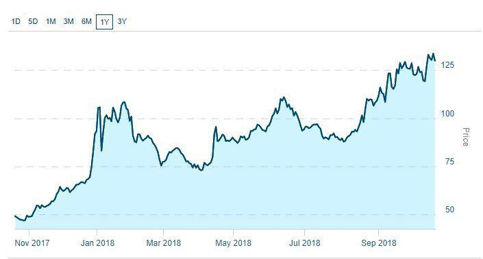

The cannabis industry has experienced significant transformation in recent years, emerging as a critical area of interest for investors. Driven by changing regulations, increased medical applications, and evolving consumer preferences, marijuana companies and cannabis stocks have drawn considerable attention in the financial markets. As the industry matures, understanding key performance indicators such as the U.S. Marijuana Index becomes increasingly important for investors aiming to capitalize on this growth.

The U.S. Marijuana Index serves as a vital tool for gauging the financial health and dynamics of cannabis and hemp stocks. It offers a comprehensive perspective on the market, tracking companies that derive a substantial portion of their revenue from the marijuana sector. This index is pivotal for investors seeking to navigate the complex landscape of cannabis investments, as it reflects the sector's volatility and growth potential.



Simultaneously, the role of algorithmic trading has expanded within the cannabis stock market, contributing to the nuanced fluctuations in stock prices and trading volumes. Algorithmic trading leverages advanced computational techniques to process data swiftly, providing an advantage in the often unpredictable cannabis market. Investors must be cognizant of how these algorithms operate and their potential impact on investment strategies.

This article aims to equip potential investors with insights into the U.S. Marijuana Index and algorithmic trading. By understanding these components, investors can make informed decisions, balancing the inherent risks and rewards associated with cannabis stock investments. As the industry continues to evolve, staying informed and strategic is crucial for successfully navigating the complexities of this burgeoning market.

## Table of Contents

## Overview of Marijuana Companies and Cannabis Stocks

Cannabis companies are an integral part of the industry, categorized into distinct segments that reflect the various stages of the cannabis business cycle. These segments include cultivation, distribution, and ancillary services, each playing a vital role in the overall ecosystem. 

### Cultivation

The cultivation segment involves the growing and harvesting of cannabis plants, which are then processed into various products for medical and recreational use. Companies that focus on cultivation often operate large-scale facilities and utilize advanced agricultural techniques to maximize yield and quality. A prominent player in this segment is **Curaleaf Holdings**, which is known for its extensive cultivation operations across the United States. Curaleaf's strategy emphasizes vertical integration, allowing it to control the quality and consistency of its products from seed to sale.

### Distribution

Distribution companies are responsible for the logistics of getting cannabis products from producers to consumers. This includes packaging, transport, and ensuring compliance with both state and federal regulations. **Trulieve** is a significant entity in this sector, establishing itself as a leading provider with a strong retail presence and comprehensive distribution networks. Trulieve's business model focuses on broadening its geographic footprint to secure a larger market share, partly enabled by its strategic acquisitions and scalable distribution processes.

### Ancillary Services

The ancillary services segment includes companies that provide products and services to the cannabis industry without directly dealing with the plant itself. This includes technology providers, equipment manufacturers, and consulting services. One of the most notable companies in this category is **GW Pharmaceuticals**, renowned for its advancements in cannabinoid-based pharmaceuticals. Unlike traditional marijuana companies, GW Pharmaceuticals concentrates on research and development, regulatory compliance, and the sale of cannabis-derived prescription medicines, notably contributing to medical cannabis innovation through its FDA-approved products.

### Financial Health and Market Position

Understanding the financial health and market position of these companies is crucial for investors. This involves analyzing key financial metrics such as revenue growth, profit margins, and debt levels. Investors should also consider market position, which includes the company's market share, competitive advantage, and strategic initiatives. Financial statements and market analyses provide insight into a company's operational efficiency and potential for scalability—a critical element for making informed investment decisions.

In conclusion, the landscape of marijuana companies and cannabis stocks comprises a diverse array of entities, each with a distinct role in the industry. The understanding of each segment, along with a detailed analysis of leading companies like Curaleaf Holdings, Trulieve, and GW Pharmaceuticals, is essential for investors aiming to capitalize on the burgeoning cannabis market.

## Understanding the U.S. Marijuana Index

The U.S. Marijuana Index is a vital tool for investors and analysts seeking to gauge the overall financial performance and viability of the cannabis industry. This index specifically tracks the stocks of companies engaged in the cannabis and hemp sectors, providing a streamlined benchmark to assess the industry's economic health and market trends.

To be included in the U.S. Marijuana Index, companies must adhere to strict criteria designed to ensure that only those primarily focused on marijuana-related activities are represented. Specifically, each company must derive at least 50% of its total revenue from cannabis-related operations. Additionally, they must meet certain thresholds related to market capitalization and trading [volume](/wiki/volume-trading-strategy). These requirements help filter and maintain a cohort of companies that are both influential and financially significant within the sector. For example, a company's market capitalization and trading volume must meet predetermined levels, ensuring that the index reflects the more stable and liquid entities in the industry.

This composition strategy is critical for providing an accurate snapshot of the cannabis sector's dynamics. By focusing on companies with substantial revenue generation from marijuana activities, the index reflects the potential growth and challenges faced by the industry. As the cannabis market continues to expand and evolve, the U.S. Marijuana Index offers a dynamic measure of this progression, capturing shifts in market sentiment and regulatory impact.

In essence, the U.S. Marijuana Index serves as a mirror of the cannabis sector's financial landscape, helping investors identify trends, opportunities, and risks associated with this burgeoning industry. Its design ensures that it remains a relevant and reliable resource for assessing the economic trajectory of cannabis-related businesses.

## The Role of Algorithmic Trading in Cannabis Stocks

Algorithmic trading refers to the use of computer algorithms to manage trading activities, processing a vast array of market data to make informed trading decisions at high speeds. In the context of cannabis stocks, [algorithmic trading](/wiki/algorithmic-trading) has gained prominence due to the pronounced [volatility](/wiki/volatility-trading-strategies) and rapid growth within this sector. The inherent volatility is partly due to evolving regulatory landscapes and frequent market-moving news, making it an ideal environment for algorithmic approaches that can capitalize on rapid price movements.

These trading systems utilize complex mathematical models and statistical techniques to analyze historical and real-time data, predicting price trends and executing trades accordingly. For instance, algorithms can monitor the U.S. Marijuana Index and individual stock performance, adjusting positions based on trend analysis, [momentum](/wiki/momentum), or [arbitrage](/wiki/arbitrage) strategies. By doing so, they influence both stock prices and trading volumes, often accounting for a significant portion of daily trading activity.

An algorithm typically follows a sequence, or flow, much like the following pseudocode:

```python
# Pseudocode for a simple trend-following algorithm
# This is a simplified representation and not suitable for actual trading.
def main():
    stocks = fetch_cannabis_stock_data()  # Fetch real-time stock data
    for stock in stocks:
        price_data = get_price_data(stock)
        if price_data.is_trending_up():
            execute_buy_order(stock)
        elif price_data.is_trending_down():
            execute_sell_order(stock)

def fetch_cannabis_stock_data():
    # Fetch data from a market API
    pass

def get_price_data(stock):
    # Analyze price data for trends
    pass

def execute_buy_order(stock):
    # Implement buying logic
    pass

def execute_sell_order(stock):
    # Implement selling logic
    pass

main()
```

The effectiveness of algorithmic trading in the cannabis market depends on several factors, including the quality of the data, the sophistication of the algorithms, and the trading infrastructure's speed. Algorithms designed for high-frequency trading can capitalize on even minute discrepancies in stock prices, offering opportunities to profit from short-term volatility.

For investors, understanding the impact of algorithmic trading is crucial when developing investment strategies. These systems can cause sudden shifts in market prices due to high-volume trades executed in microseconds, potentially introducing additional volatility. However, they also provide [liquidity](/wiki/liquidity-risk-premium) and transparency, which can be advantageous in a rapidly developing market. As algorithmic trading continues to evolve, its influence on market dynamics will likely increase, underscoring the need for investors to integrate a nuanced understanding of these systems into their overall investment approach.

## Risks and Opportunities in Cannabis Stock Investments

Investing in cannabis stocks presents a unique blend of risks and opportunities, largely due to the dynamic nature of the industry. One of the most prominent risks is regulatory uncertainty. Cannabis remains illegal under federal law in the United States, although many states have legalized it for medical and recreational use. This legal ambiguity creates a volatile regulatory environment that can significantly impact the operations and profitability of cannabis companies. Changes in legislation or enforcement practices can lead to abrupt shifts in market conditions, affecting stock prices and investor sentiment.

Market volatility is another critical risk associated with cannabis stocks. The sector is relatively young and has exhibited considerable price fluctuations, influenced by factors such as market speculation, changes in consumer demand, and varying degrees of adoption across states. These price swings can result in substantial short-term losses for investors unprepared for such volatility.

Political developments, particularly in the U.S., play a crucial role in shaping the cannabis industry. Legislative actions, such as potential federal legalization or changes in banking regulations, could dramatically alter the landscape, providing either risks or growth opportunities. Monitoring these political trends is essential for investors aiming to anticipate market shifts and optimize their investment strategies.

Despite these risks, the cannabis sector also offers significant growth potential. As the market matures, it is expected to expand due to increased legalization at the state and national levels, growing consumer acceptance, and the development of new cannabis-based products. This growth potential is particularly evident in emerging markets and in niche segments such as medical cannabis, which benefits from ongoing research and development.

Investors can mitigate risks by diversifying their portfolios and gaining a solid understanding of market trends. Diversification involves investing in a mix of cannabis-related businesses, such as cultivation, distribution, and ancillary services, to spread risk across different parts of the industry. This strategy can help cushion potential downturns in any one segment.

A comprehensive understanding of market trends is also crucial. Staying informed about consumer preferences, technological advancements, and competitive dynamics can provide valuable insights into the industry's direction. Investors equipped with such knowledge are better positioned to identify opportunities and avoid pitfalls.

In conclusion, while investing in cannabis stocks involves substantial risks, it also holds the promise of significant rewards. By navigating regulatory challenges, staying attuned to political developments, and employing strategies like diversification, investors can enhance their potential for successful outcomes in this evolving market.

## Conclusion

The cannabis industry is positioned as a significant prospect for investors as it continues its developmental trajectory. As the market matures, understanding the tools and dynamics that drive cannabis stock performance becomes invaluable. Indices such as the U.S. Marijuana Index serve as critical resources, offering benchmarks and insights into the industry's fiscal health. By analyzing the composition and performance of these indices, investors can glean meaningful perspectives on market trends and potential investment opportunities.

Furthermore, the integration of algorithmic trading within the cannabis sector adds another layer of complexity and opportunity. These sophisticated systems have the capability to process substantial data sets and execute trades with speed and precision, a significant advantage in a market that is often characterized by volatility. Being aware of how algorithmic trading influences stock prices and volumes can help investors develop more effective strategies and enhance their investment outcomes.

In this inherently volatile yet promising sector, investors must remain informed and adaptable. Regulatory changes and political developments continue to impact the market significantly. Therefore, a strategic approach that involves ongoing education, careful monitoring of legislative environments, and tactical diversification can mitigate potential risks. By staying abreast of industry innovations and market movements, investors can navigate the dynamic landscape of cannabis stocks with greater success, potentially capitalizing on the large growth opportunities within the industry.

## References & Further Reading

[1]: Borchardt, D. (2020). ["How To Invest In Marijuana Stocks."](https://www.fool.com/investing/stock-market/market-sectors/healthcare/marijuana-stocks/how-to-invest/) Forbes.

[2]: Lavery, I. (2022). ["U.S. Marijuana Index Quarterly Review."](https://crsreports.congress.gov/product/pdf/IF/IF12270) New Cannabis Ventures.

[3]: Chandra, S., Radwan, M. M., Majumdar, C. G., Church, J. C., Freeman, T. P., & ElSohly, M. A. (2019). ["New trends in cannabis potency in USA and Europe during the last decade (2008–2017)."](https://pubmed.ncbi.nlm.nih.gov/30671616/) European Archives of Psychiatry and Clinical Neuroscience.

[4]: Tan, C. M. (2021). ["Impact of Algorithmic Trading on Financial Markets."](https://wjaets.com/sites/default/files/WJAETS-2024-0054.pdf) Physica A: Statistical Mechanics and its Applications.

[5]: Ross, S. A., & ElSohly, M. A. (2016). ["The Medicinal Chemistry of Cannabis—A Review."](https://pubmed.ncbi.nlm.nih.gov/34066753/) Drug Metabolism Reviews.

[6]: Spitaru, F. (2021). ["Algorithmic Trading in Cryptocurrency and Stock Markets: A Literature Review."](https://www.researchgate.net/publication/349502278_Cryptocurrencies_in_Modern_Finance_A_Literature_Review) Applied Sciences.