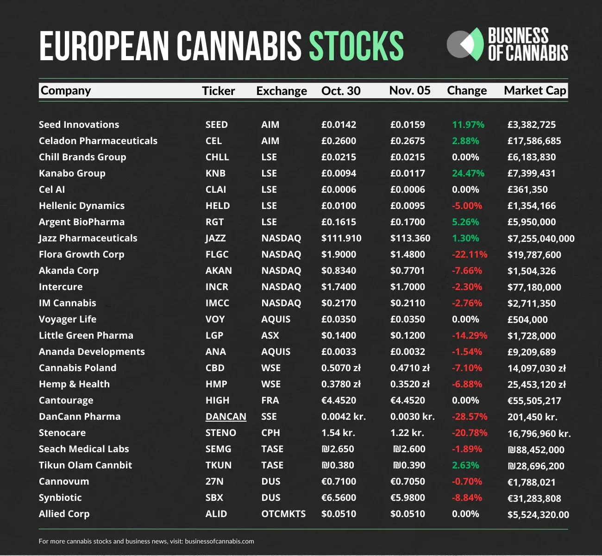

## Table of Contents

## What is the U.S. Marijuana Index?

The U.S. Marijuana Index is a stock market index that tracks the performance of companies involved in the marijuana industry. This includes businesses that grow, sell, or provide services related to marijuana, which is also known as cannabis. The index helps investors see how well these companies are doing overall, similar to how other indexes like the S&P 500 show the performance of a broad range of companies.

The index is important because it gives people a way to invest in the marijuana industry without having to pick individual companies. As more places in the U.S. and around the world start to allow marijuana for medical or recreational use, the industry is growing quickly. The U.S. Marijuana Index helps investors keep track of this growth and make informed decisions about where to put their money.

## How many companies are included in the U.S. Marijuana Index?

The U.S. Marijuana Index includes a total of 31 companies. These companies are all involved in the marijuana industry in some way, like growing, selling, or providing services related to marijuana.

The number of companies in the index can change over time. This happens when new companies join the marijuana industry or when existing companies grow or shrink in importance. The index is updated to make sure it always shows a good picture of the industry as a whole.

## What criteria must a company meet to be included in the U.S. Marijuana Index?

To be included in the U.S. Marijuana Index, a company must be involved in the marijuana industry. This means they can be growing marijuana, selling it, or providing services related to it. The company also needs to be listed on a major U.S. stock exchange, like the New York Stock Exchange or the NASDAQ. This helps make sure the company is big enough and well-known enough to be part of the index.

Another important rule is that the company must have a certain amount of its stock available for the public to buy. This is called the "public float," and it needs to be at least 10% of the company's total shares. This rule helps make sure the company is open and accessible to investors. By following these rules, the U.S. Marijuana Index can include companies that are active in the marijuana industry and are easy for investors to buy and sell.

## Can you name some of the top companies listed in the U.S. Marijuana Index?

Some of the top companies in the U.S. Marijuana Index are Tilray, Canopy Growth, and Aurora Cannabis. These companies are big names in the marijuana industry. Tilray is known for being one of the first cannabis companies to go public on a major U.S. stock exchange. Canopy Growth is another big player, and it's based in Canada but also has a strong presence in the U.S. Aurora Cannabis is also based in Canada and is known for its wide range of cannabis products.

These companies are important because they help show how the marijuana industry is doing. When people want to invest in marijuana, they often look at these companies first. They are leaders in the industry and can give investors a good idea of how the whole market is performing. By watching these companies, investors can make better choices about where to put their money in the growing marijuana market.

## How does the performance of companies in the U.S. Marijuana Index compare to other market indices?

The performance of companies in the U.S. Marijuana Index can be quite different from other market indices like the S&P 500 or the Dow Jones Industrial Average. The marijuana industry is still new and growing fast, so the companies in the U.S. Marijuana Index can have big ups and downs. Sometimes they grow really fast when new laws make it easier to sell marijuana, but they can also drop a lot if there is bad news or if the laws change in a way that hurts the industry.

When you compare the U.S. Marijuana Index to other indices, you see that it is more risky but can also offer bigger rewards. The S&P 500 and Dow Jones have companies from many different industries, so they tend to be more stable. The marijuana industry is smaller and focused on one thing, so it can be more affected by changes in that one area. Investors who put their money in the U.S. Marijuana Index might see bigger gains if the industry keeps growing, but they also need to be ready for more ups and downs than with other, more stable indices.

## What sectors within the marijuana industry are represented in the U.S. Marijuana Index?

The U.S. Marijuana Index includes companies from different parts of the marijuana industry. Some companies grow marijuana, which means they farm the plant and get it ready to sell. Others sell marijuana products, like the ones you can smoke or use in other ways. There are also companies that make things you need to use marijuana, like special pipes or vaporizers. Some companies help with the business side, like giving advice on how to follow the law or how to run a marijuana business better.

These different parts of the industry all work together to make the marijuana market. The companies that grow marijuana are important because they make the product that everyone else sells or uses. The companies that sell marijuana products help get it to the people who want to use it. The companies that make tools or give advice help make the whole process easier and better. By including companies from all these areas, the U.S. Marijuana Index shows a full picture of the marijuana industry.

## How often is the U.S. Marijuana Index updated, and what factors trigger changes in its composition?

The U.S. Marijuana Index is updated every three months, or four times a year. This means that the companies in the index are checked and changed if needed in March, June, September, and December. This regular update helps make sure the index always shows the latest and most important companies in the marijuana industry.

Changes in the index can happen for a few reasons. One big reason is if a company grows or shrinks a lot in size or importance. If a new company becomes really big in the marijuana industry, it might be added to the index. On the other hand, if a company gets smaller or less important, it might be taken out. Another reason for changes is if a company gets bought by another company or if it stops being listed on a major U.S. stock exchange. These updates help keep the index a good tool for investors to see how the marijuana industry is doing.

## What impact does legalization of marijuana in different states have on the companies listed in the U.S. Marijuana Index?

When a state in the U.S. decides to make marijuana legal for medical or recreational use, it can really help the companies in the U.S. Marijuana Index. More people can buy marijuana legally, so the companies that grow and sell it can make more money. This often makes their stock prices go up, which is good for the index. For example, if a big state like California or New York legalizes marijuana, it can be a big deal because a lot more people live there and might buy marijuana.

But legalization can also bring some challenges. Sometimes, when a state makes marijuana legal, it can take a while to set up all the rules and licenses. This can slow down how fast companies can start selling in that state. Also, if the laws are different in each state, it can be hard for companies to figure out how to do business everywhere. So, while legalization can help the companies in the U.S. Marijuana Index grow, it can also make things more complicated for them.

## How do companies in the U.S. Marijuana Index manage regulatory compliance across different jurisdictions?

Companies in the U.S. Marijuana Index have to deal with a lot of different rules because marijuana laws are different in each state. Some states let people use marijuana for medical reasons, while others let it be used for fun too. To follow all these rules, companies need to keep a close eye on what each state allows and make sure they have the right licenses to grow, sell, or do other business with marijuana. They often hire lawyers and experts to help them understand and follow these laws, so they don't get in trouble.

Even though it's hard, managing these different rules is really important for these companies. If they don't follow the laws, they could lose their licenses or get fined, which would hurt their business. So, they set up special teams to make sure they're always doing things the right way. This helps them keep selling their products and growing their business, even as the laws keep changing.

## What are the financial performance trends of companies in the U.S. Marijuana Index over the past five years?

Over the past five years, companies in the U.S. Marijuana Index have seen a lot of ups and downs in their financial performance. When more states started to make marijuana legal, these companies often saw their stock prices go up because more people could buy their products. This led to big growth for some companies, with their sales and profits increasing a lot. But the industry is still new and can be risky, so there were also times when the stock prices dropped. For example, if there was bad news about the industry or if the laws didn't change as expected, the companies could lose money.

Despite these challenges, the overall trend for many companies in the U.S. Marijuana Index has been positive. As more states have legalized marijuana, the market has gotten bigger and more people are buying these products. This has helped companies grow their sales and sometimes their profits too. But it's important to remember that the industry can be unpredictable, and companies need to keep an eye on the laws and how they change to keep doing well. Overall, the past five years have shown that the marijuana industry can offer big rewards, but it also comes with a lot of risk.

## How do geopolitical events influence the stock prices of companies in the U.S. Marijuana Index?

Geopolitical events can have a big impact on the stock prices of companies in the U.S. Marijuana Index. When countries or states change their laws about marijuana, it can make the stock prices go up or down. For example, if a big country like Canada or a state like California makes marijuana legal, it can help the companies in the index because more people can buy their products. This good news can make investors excited and push the stock prices higher. But if there's bad news, like a country deciding to make marijuana illegal again or putting more strict rules on it, the stock prices can drop because investors might worry about the future of the companies.

Another way geopolitical events can affect the U.S. Marijuana Index is through global trade and international relations. If countries start trading marijuana with each other, it can open up new markets for the companies in the index. This can make their stock prices go up because they can sell more products. But if there are trade problems or if countries can't agree on how to handle marijuana, it can make things harder for the companies. This uncertainty can make investors nervous and cause the stock prices to fall. So, keeping an eye on what's happening around the world is important for understanding how the companies in the U.S. Marijuana Index might do.

## What are the future growth prospects and potential risks for companies in the U.S. Marijuana Index?

The future growth prospects for companies in the U.S. Marijuana Index look promising because more and more places are making marijuana legal. As more states in the U.S. and countries around the world allow people to use marijuana for medical or fun reasons, the market for these products keeps getting bigger. This means more people can buy marijuana, so the companies that grow and sell it can make more money. Also, as the industry grows, companies might find new ways to use marijuana, like in medicine or other products, which can open up even more opportunities for them. If the laws keep changing in a good way, the companies in the U.S. Marijuana Index could see a lot of growth in the coming years.

But there are also some risks that these companies need to watch out for. One big risk is that the laws about marijuana can change suddenly. If a state or country decides to make marijuana illegal again or puts more strict rules on it, it can hurt the companies a lot. This can make their stock prices drop because investors might worry about the future. Another risk is that the marijuana industry is still new and can be hard to predict. Sometimes, companies might have trouble making money because they have to spend a lot on following the laws or because they face a lot of competition. So, while there are good chances for growth, the companies in the U.S. Marijuana Index need to be careful and ready for any surprises.

## Overview of Marijuana Companies and Cannabis Stocks

Cannabis companies are an integral part of the industry, categorized into distinct segments that reflect the various stages of the cannabis business cycle. These segments include cultivation, distribution, and ancillary services, each playing a vital role in the overall ecosystem. 

### Cultivation

The cultivation segment involves the growing and harvesting of cannabis plants, which are then processed into various products for medical and recreational use. Companies that focus on cultivation often operate large-scale facilities and utilize advanced agricultural techniques to maximize yield and quality. A prominent player in this segment is **Curaleaf Holdings**, which is known for its extensive cultivation operations across the United States. Curaleaf's strategy emphasizes vertical integration, allowing it to control the quality and consistency of its products from seed to sale.

### Distribution

Distribution companies are responsible for the logistics of getting cannabis products from producers to consumers. This includes packaging, transport, and ensuring compliance with both state and federal regulations. **Trulieve** is a significant entity in this sector, establishing itself as a leading provider with a strong retail presence and comprehensive distribution networks. Trulieve's business model focuses on broadening its geographic footprint to secure a larger market share, partly enabled by its strategic acquisitions and scalable distribution processes.

### Ancillary Services

The ancillary services segment includes companies that provide products and services to the cannabis industry without directly dealing with the plant itself. This includes technology providers, equipment manufacturers, and consulting services. One of the most notable companies in this category is **GW Pharmaceuticals**, renowned for its advancements in cannabinoid-based pharmaceuticals. Unlike traditional marijuana companies, GW Pharmaceuticals concentrates on research and development, regulatory compliance, and the sale of cannabis-derived prescription medicines, notably contributing to medical cannabis innovation through its FDA-approved products.

### Financial Health and Market Position

Understanding the financial health and market position of these companies is crucial for investors. This involves analyzing key financial metrics such as revenue growth, profit margins, and debt levels. Investors should also consider market position, which includes the company's market share, competitive advantage, and strategic initiatives. Financial statements and market analyses provide insight into a company's operational efficiency and potential for scalability—a critical element for making informed investment decisions.

In conclusion, the landscape of marijuana companies and cannabis stocks comprises a diverse array of entities, each with a distinct role in the industry. The understanding of each segment, along with a detailed analysis of leading companies like Curaleaf Holdings, Trulieve, and GW Pharmaceuticals, is essential for investors aiming to capitalize on the burgeoning cannabis market.

## References & Further Reading

[1]: Borchardt, D. (2020). ["How To Invest In Marijuana Stocks."](https://www.fool.com/investing/stock-market/market-sectors/healthcare/marijuana-stocks/how-to-invest/) Forbes.

[2]: Lavery, I. (2022). ["U.S. Marijuana Index Quarterly Review."](https://crsreports.congress.gov/product/pdf/IF/IF12270) New Cannabis Ventures.

[3]: Chandra, S., Radwan, M. M., Majumdar, C. G., Church, J. C., Freeman, T. P., & ElSohly, M. A. (2019). ["New trends in cannabis potency in USA and Europe during the last decade (2008–2017)."](https://pubmed.ncbi.nlm.nih.gov/30671616/) European Archives of Psychiatry and Clinical Neuroscience.

[4]: Tan, C. M. (2021). ["Impact of Algorithmic Trading on Financial Markets."](https://wjaets.com/sites/default/files/WJAETS-2024-0054.pdf) Physica A: Statistical Mechanics and its Applications.

[5]: Ross, S. A., & ElSohly, M. A. (2016). ["The Medicinal Chemistry of Cannabis—A Review."](https://pubmed.ncbi.nlm.nih.gov/34066753/) Drug Metabolism Reviews.

[6]: Spitaru, F. (2021). ["Algorithmic Trading in Cryptocurrency and Stock Markets: A Literature Review."](https://www.researchgate.net/publication/349502278_Cryptocurrencies_in_Modern_Finance_A_Literature_Review) Applied Sciences.