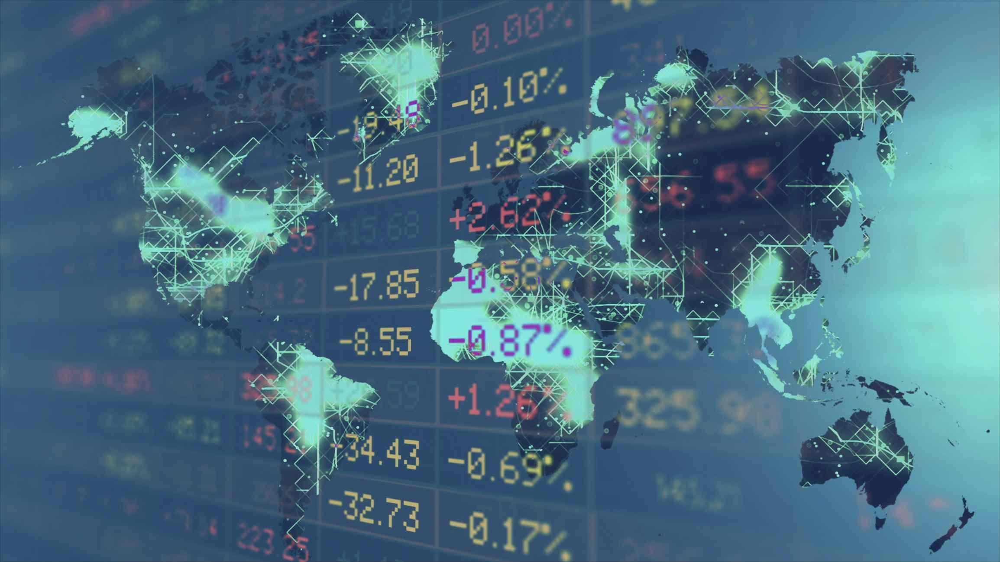

## Table of Contents

## What is a stock exchange?

A stock exchange is a place where people buy and sell shares of companies. It's like a big market, but instead of buying fruits or vegetables, people trade pieces of ownership in businesses. When someone buys a share, they own a small part of that company. The price of these shares can go up or down based on how well the company is doing and what people think about its future.

Stock exchanges help companies raise money. When a company wants to grow, it can sell shares to the public through the stock exchange. The money from selling these shares can be used to build new factories, hire more workers, or develop new products. This way, the company gets the funds it needs, and people who buy the shares can make money if the company does well.

## How many stock exchanges are there in Europe?

There are many stock exchanges in Europe. Some of the biggest ones are in London, Paris, Frankfurt, and Milan. Each country in Europe might have its own stock exchange, so the total number is quite large.

These stock exchanges help companies from different countries in Europe to raise money. People can buy and sell shares of these companies easily through these exchanges. This makes it simpler for investors to put their money into businesses they believe in, no matter where in Europe those businesses are located.

## What are the largest stock exchanges in Europe by market capitalization?

The largest stock exchange in Europe by market capitalization is the Euronext. It is a pan-European stock exchange that operates markets in several countries, including France, Belgium, Portugal, and the Netherlands. The Euronext has a big market cap because it combines the value of all the companies listed on its different markets. This makes it easier for companies in these countries to raise money and for investors to buy and sell shares.

The second largest stock exchange in Europe is the London Stock Exchange (LSE). It is located in the United Kingdom and has a long history of trading. Many big companies from around the world choose to list their shares on the LSE because it is well-known and trusted. The LSE helps these companies get the money they need to grow, and it gives investors a chance to own a piece of these businesses.

The third largest stock exchange in Europe is the Deutsche Börse, which is in Germany. It is known for being a strong and reliable place for companies to list their shares. The Deutsche Börse helps German companies, as well as companies from other countries, to raise money. Investors like using the Deutsche Börse because it is a safe and efficient way to buy and sell shares.

## What are the main functions of a stock exchange?

A stock exchange is like a big marketplace where people can buy and sell pieces of companies, called shares. Its main job is to help companies raise money. When a company wants to grow, it can sell shares to people on the stock exchange. The money from these sales helps the company build new things, hire more workers, or make new products. This way, the company gets the money it needs, and people who buy the shares can make money if the company does well.

Another important job of a stock exchange is to make trading easy and fair. It sets rules that everyone must follow, so trading is safe and honest. The stock exchange also keeps track of all the trades, making sure everything is done correctly. This helps people trust the stock exchange and feel confident when they buy or sell shares. By doing these things, the stock exchange helps the economy grow and lets people invest in businesses they believe in.

## How does one list a company on a European stock exchange?

To list a company on a European stock exchange, the first step is to choose which stock exchange to use. Many companies in Europe choose the Euronext, the London Stock Exchange, or the Deutsche Börse because they are big and well-known. Once the company decides on a stock exchange, it needs to meet the rules set by that exchange. These rules can include things like the company's size, how much money it makes, and how long it has been in business. The company also needs to prepare a lot of information about its business, like financial reports and plans for the future, to share with the public.

After getting all the information ready, the company works with banks and other experts to help with the listing process. These experts help the company set a price for its shares and figure out how many shares to sell. When everything is ready, the company sends its application to the stock exchange. If the stock exchange says yes, the company can start selling its shares to the public. This is called an Initial Public Offering, or IPO. Once the IPO is done, the company's shares can be bought and sold by anyone on the stock exchange, helping the company raise money to grow.

## What are the trading hours of major European stock exchanges?

The trading hours for major European stock exchanges are important to know if you want to buy or sell shares. The London Stock Exchange, which is one of the biggest in Europe, is open from 8:00 AM to 4:30 PM local time, Monday through Friday. This means that people in the UK can trade shares during these hours. The Euronext, which operates in several European countries like France, Belgium, and the Netherlands, has trading hours from 9:00 AM to 5:30 PM local time, also from Monday to Friday. This gives people in these countries a chance to trade shares during their workday.

The Deutsche Börse in Germany has trading hours from 9:00 AM to 5:30 PM local time, Monday through Friday. This schedule matches the Euronext's hours, which makes it easier for people in Germany to trade shares. Knowing these trading hours helps investors plan when to buy or sell shares on these major European stock exchanges.

## What are the differences between regulated and unregulated markets in Europe?

Regulated markets in Europe are like big, official places where companies can sell their shares. They have strict rules set by the government to make sure everything is fair and safe. For example, companies have to share a lot of information about their business, like how much money they make and what they plan to do in the future. This helps people trust the market and feel safe when they buy or sell shares. The big stock exchanges like the London Stock Exchange, Euronext, and Deutsche Börse are all regulated markets. They help companies raise money and let investors trade shares easily.

Unregulated markets, on the other hand, are less strict and don't have as many rules. They are sometimes called over-the-counter (OTC) markets. In these markets, companies don't have to share as much information, so it can be riskier for people to buy shares. But, unregulated markets can be good for smaller companies that might not meet the strict rules of regulated markets. They can still raise money and let people invest in them, but it's important for investors to be careful because there's more risk involved.

## How do European stock exchanges contribute to the economy?

European stock exchanges help the economy by letting companies raise money easily. When a company wants to grow, it can sell shares on the stock exchange. The money from selling these shares helps the company build new things, hire more people, or make new products. This growth creates jobs and helps the economy get bigger. It's like a big circle: companies grow, more people get jobs, and the economy does better.

Stock exchanges also make it easier for people to invest their money. When people buy shares, they are putting their money into businesses they believe in. This helps the economy because it gives companies the money they need to grow. Plus, when people invest, they can make money if the companies do well. This encourages more people to save and invest, which is good for the economy in the long run.

## What are the recent trends affecting European stock exchanges?

One big trend affecting European stock exchanges is the rise of technology. More and more, trading is done online, making it easier and faster for people to buy and sell shares. This means that stock exchanges are using new technology to make trading smoother and more efficient. For example, they use computer programs to match buyers and sellers quickly. This technology also helps make trading safer and more transparent, so people can trust the stock exchanges more.

Another trend is the focus on sustainable and responsible investing. Many people now want to invest in companies that are good for the environment and society. This means that stock exchanges in Europe are starting to include more information about how companies treat the environment and their workers. Companies that do well in these areas might attract more investors, which can help them grow. This trend is pushing companies to be more responsible and think about more than just making money.

A third trend is the increasing competition among European stock exchanges. With the rise of global markets, European exchanges are not just competing with each other but also with exchanges in other parts of the world. This competition is driving them to offer better services and lower costs to attract more companies and investors. As a result, European stock exchanges are working harder to stay relevant and useful in a fast-changing world.

## How do regulations like MiFID II impact European stock exchanges?

MiFID II, which stands for Markets in Financial Instruments Directive II, is a big set of rules that affect how European stock exchanges work. These rules were made to make trading safer and more fair for everyone. One big change is that MiFID II says that stock exchanges have to share more information about what they do. This helps people trust the stock exchanges more because they can see that everything is being done correctly. Another change is that the rules make it easier for people to trade across different countries in Europe. This means that investors can buy and sell shares more easily, no matter where they are.

MiFID II also tries to make sure that the prices of shares are fair. It does this by making stock exchanges show more details about the trades they do. This helps keep the prices honest and stops people from cheating. But, these new rules can also make things more complicated for stock exchanges. They have to spend more time and money to follow all the new rules. This can make it harder for them to make money and grow. Even though it's more work, MiFID II helps make sure that European stock exchanges are safe and fair places for everyone to trade.

## What role do technology and automation play in the operations of European stock exchanges?

Technology and automation are really important for how European stock exchanges work. They help make trading faster and easier. With computers, stock exchanges can match buyers and sellers in seconds. This means people can buy and sell shares quickly, without waiting. Automation also helps keep everything safe and fair. Computers can watch for any strange trading and stop it before it causes problems. This makes people trust the stock exchanges more because they know everything is being done correctly.

Stock exchanges also use technology to give people more information. They can show real-time prices and news about companies, so investors can make better choices. This helps everyone know what's happening in the market. Plus, technology lets stock exchanges work with other markets around the world. This means investors in Europe can trade shares from companies anywhere, not just in Europe. All these things make stock exchanges better and more useful for everyone.

## How do European stock exchanges compare to those in other regions like Asia or North America in terms of performance and regulation?

European stock exchanges, like the London Stock Exchange and Euronext, are known for being well-regulated and transparent. They have strict rules like MiFID II that make sure trading is fair and safe. This helps people trust these exchanges more because they know everything is being done correctly. Compared to North American exchanges, like the New York Stock Exchange, European exchanges might have more rules, but they also work hard to make trading easy across different countries in Europe. This can make it simpler for investors to trade shares from different European countries.

In Asia, stock exchanges like the Tokyo Stock Exchange and the Hong Kong Stock Exchange also have their own rules, but they can be different from those in Europe. Asian exchanges often focus on technology and automation to make trading fast and efficient. They might not have as many rules as European exchanges, but they still try to make trading safe and fair. When it comes to performance, stock exchanges in different regions can go up and down based on many things, like how well the companies listed there are doing and what's happening in the world economy. European exchanges might not always be the biggest, but they are known for being reliable and well-regulated.

## Major European Stock Exchanges

Europe hosts some of the world's most influential and financially significant stock exchanges, many with market capitalizations exceeding US$1 trillion. These exchanges are pivotal in facilitating trade, influencing global markets, and promoting economic growth.

Euronext is one of the largest stock exchanges in Europe, spanning multiple countries, including Belgium, France, Ireland, the Netherlands, Norway, and Portugal. As a pan-European exchange, Euronext offers a wide range of services, including equity, fixed income, [ETF](/wiki/etf-trading-strategies)s, and derivatives markets. It has established itself as a crucial player in enhancing market efficiency and transparency across these regions. Euronext's diverse operations are supported by its robust trading platform known as Optiq, which ensures high-speed and reliable trading for its users.

The London Stock Exchange Group (LSEG) stands as a prominent figure in the global financial landscape. Besides facilitating local trades, LSEG's influence extends worldwide, making it an essential hub for international finance. The Group operates multiple platforms, including the London Stock Exchange, Borsa Italiana, and Refinitiv, a provider of financial markets data and infrastructure. LSEG's advanced technology services, such as Turquoise, offer market participants sophisticated trading solutions, further solidifying its global significance.

Deutsche Börse, headquartered in Frankfurt, is another major European exchange commanding a vast network of global traders and investors. Its key trading system, Xetra, revolutionized electronic trading by offering a fully automated trading environment. Xetra's innovative technology provides [liquidity](/wiki/liquidity-risk-premium), transparency, and reduced trading costs, making it a preferred choice for trading securities across Europe.

The SIX Group primarily manages the Swiss Exchange and the BME Spanish Exchanges, representing significant financial markets in Switzerland and Spain. These exchanges play essential roles in their national economies while contributing to the European financial ecosystem. SIX Group's services extend beyond trading, offering clearing, settlement, and financial information services, ensuring comprehensive financial market operations.

Nasdaq Nordic operates exchanges in the Scandinavian and Baltic regions, facilitating equity, derivatives, fixed income, and commodities trading. This network includes the primary exchanges of Sweden, Denmark, Finland, and Iceland, as well as the smaller Baltic exchanges of Estonia, Latvia, and Lithuania. Nasdaq Nordic's strategic presence in these markets supports regional economic development and connects them to global capital flows. Its trading platform, Genium INET, is known for its high-performance capabilities and resilience, catering to the dynamic needs of these markets.

These major European stock exchanges not only cater to vast domestic markets but also act as conduits for global investment and economic integration. Their advanced technologies and strategic positions ensure their continued dominance and influence in the global financial domain.

## Stock Exchanges Across Europe

Stock exchanges across Europe extend beyond the major hubs like Euronext, the London Stock Exchange, Deutsche Börse, SIX Group, and Nasdaq Nordic. These smaller yet significant exchanges play crucial roles in their domestic and regional economies. They offer diverse platforms for raising capital, trading securities, and enabling economic growth at various levels.

Among these exchanges, Borsa Italiana stands out. Based in Milan, it is integral to the Italian financial landscape. Although Borsa Italiana is now part of the Euronext group, it retains significance with its own trading systems, like the Millennium IT platform, providing high-speed trading capabilities and robust market data.

Similarly, the Spanish stock exchange, Bolsas y Mercados Españoles (BME), before its integration into SIX Group, played a pivotal role in the Spanish financial market. Notably, its IBEX 35 index is a noteworthy barometer of the Spanish economy. Technology-wise, BME employs the SIBE, an electronic trading platform that ensures liquidity and market efficiency.

In Scandinavia, the Helsinki Stock Exchange, now part of Nasdaq Nordic, is notable for catering to the Finnish market. Its trading system, INET Nordic, derived from Nasdaq's INET platform, allows for high throughput trading essential for handling increased [volume](/wiki/volume-trading-strategy)s in a fast-paced financial environment.

The Vienna Stock Exchange, also known as Wiener Börse, contributes significantly to the Austrian economy. Its platform, Xetra, developed by Deutsche Börse, is used across multiple European exchanges, ensuring seamless integration and a technologically advanced trading environment.

Beyond these, smaller exchanges like the Warsaw Stock Exchange (WSE) in Poland and the Irish Stock Exchange, branded as Euronext Dublin, offer tailored financial solutions suited to their respective national markets. The WSE, for instance, functions on the Universal Trading Platform (UTP), shared among Euronext subsidiaries, allowing for efficiency and enhanced trading capabilities.

These exchanges support local and regional economies by providing companies with access to capital and liquidity, essential for business expansion and economic development. They foster a robust financial ecosystem where SMEs can grow and invest. Furthermore, these exchanges support employment in the financial services industry and contribute to the broader economic stability of their respective regions.

In conclusion, while often overshadowed by their larger counterparts, these smaller exchanges are vital for sustaining economic vitality across Europe, leveraging advanced technology platforms to facilitate efficient and dynamic trading environments.

## References & Further Reading

[1]: Bergstra, J., Bardenet, R., Bengio, Y., & Kégl, B. (2011). ["Algorithms for Hyper-Parameter Optimization."](https://papers.nips.cc/paper/4443-algorithms-for-hyper-parameter-optimization) Advances in Neural Information Processing Systems 24.

[2]: ["Advances in Financial Machine Learning"](https://www.amazon.com/Advances-Financial-Machine-Learning-Marcos/dp/1119482089) by Marcos Lopez de Prado

[3]: ["Evidence-Based Technical Analysis: Applying the Scientific Method and Statistical Inference to Trading Signals"](https://www.amazon.com/Evidence-Based-Technical-Analysis-Scientific-Statistical/dp/0470008741) by David Aronson

[4]: ["Machine Learning for Algorithmic Trading"](https://github.com/stefan-jansen/machine-learning-for-trading) by Stefan Jansen

[5]: ["Quantitative Trading: How to Build Your Own Algorithmic Trading Business"](https://books.google.com/books/about/Quantitative_Trading.html?id=j70yEAAAQBAJ) by Ernest P. Chan