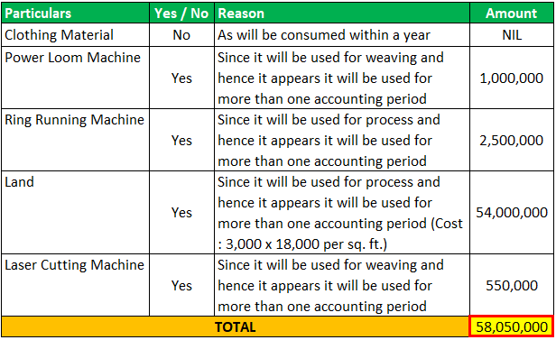

## Table of Contents

## What are fixed assets?

Fixed assets are things a business owns that it uses for a long time to help make money. These can be things like buildings, machines, or vehicles. They are not things that a business buys and sells quickly, like products in a store. Instead, they are important for the business to keep running and making things or providing services.

When a business buys a fixed asset, it doesn't count the whole cost as an expense right away. Instead, it spreads the cost over the years the asset will be used. This is called depreciation. For example, if a company buys a machine that will last 10 years, it will count a part of the machine's cost as an expense each year for 10 years. This way, the business can match the cost of the asset with the income it helps to make over time.

## Why is it important to keep a list of fixed assets?

Keeping a list of fixed assets is important for a business because it helps them know what they own and how much it's worth. This list, often called a fixed asset register, shows all the big things the business uses to make money, like buildings, machines, or vehicles. By having this list, the business can keep track of where these assets are, how old they are, and when they might need to be replaced or fixed. This helps the business plan for the future and make sure they have the right tools to keep working well.

Another reason to keep a list of fixed assets is for financial reasons. When a business makes its financial reports, it needs to show the value of its assets and how they change over time. The list helps the business figure out depreciation, which is how they spread the cost of the asset over its useful life. This is important for understanding the true cost of running the business and for paying the right amount of taxes. Without a good list of fixed assets, a business might miss out on important financial information and make bad decisions.

## How do you categorize different types of fixed assets?

Fixed assets can be sorted into different groups based on what they are and how the business uses them. One common way to categorize them is by their type, like land, buildings, machinery, vehicles, and furniture. Land is the ground the business owns, and buildings are structures like offices or factories. Machinery includes big equipment used to make things, while vehicles are cars, trucks, or other transport the business owns. Furniture is things like desks and chairs that help the business work day to day.

Another way to group fixed assets is by how long they last and how they are used in the business. Some assets, like land, can last forever and are called non-depreciable assets because they don't lose value over time. Other assets, like machinery and vehicles, wear out and need to be replaced, so they are depreciable assets. The business can also sort assets by whether they are used directly to make products or provide services, which are called tangible assets, or if they are things like patents or trademarks, which are intangible assets but still important for the business.

By sorting fixed assets into these groups, a business can keep better track of what it owns, how much it's worth, and how to plan for the future. This helps the business know when to fix or replace things and how to manage its money better.

## What are the common examples of fixed assets in a business?

Common examples of fixed assets in a business include buildings, land, and machinery. Buildings can be offices, factories, or warehouses that the business owns and uses to work every day. Land is the ground the business owns, which might be used for building on or for other business activities. Machinery includes big equipment like machines that make things, or computers and servers that help the business run.

Another common type of fixed asset is vehicles, which can be cars, trucks, or vans that the business uses to move things or people. Furniture is also a fixed asset, like desks, chairs, and shelves that help the business work smoothly. Some businesses might also have specialized equipment, like medical machines in a hospital or cooking equipment in a restaurant.

In addition to these, some businesses have intangible fixed assets, like patents or trademarks. These are things the business owns that aren't physical but are still important for making money. For example, a patent might protect a special way of making something, and a trademark could be a logo or brand name that people recognize. Even though you can't touch these assets, they are still valuable for the business.

## How should fixed assets be recorded in accounting?

When a business buys a fixed asset, like a building or a machine, it should record it in its accounting [books](/wiki/algo-trading-books) as an asset. This means writing down what the asset is, how much it cost, and when it was bought. The business should keep all this information in a list called a fixed asset register. This list helps the business know what it owns and how much those things are worth. It's important to keep this list up to date so the business can make good decisions about buying, selling, or fixing its assets.

Over time, fixed assets like machines or vehicles wear out and lose value. This is called depreciation. To show this in the accounting books, the business spreads the cost of the asset over the years it will be used. For example, if a machine costs $10,000 and will last 10 years, the business might count $1,000 as an expense each year. This way, the cost of the asset matches the income it helps to make over time. At the end of each year, the business updates its financial reports to show the new value of its fixed assets after depreciation.

## What is the difference between fixed assets and current assets?

Fixed assets and current assets are two different types of things a business owns. Fixed assets are things like buildings, machines, or vehicles that a business uses for a long time to help make money. They are not meant to be sold quickly. Instead, they are important for the business to keep running and making things or providing services. Fixed assets lose value over time, which is called depreciation, and the business spreads the cost of these assets over the years they are used.

On the other hand, current assets are things that a business can turn into cash quickly, usually within a year. These include things like money in the bank, products in the store that can be sold, or money that other people owe the business. Current assets help the business with day-to-day activities and are more liquid, meaning they can be used or sold faster than fixed assets. Unlike fixed assets, current assets do not depreciate over time because they are meant to be used up or sold quickly.

## How do you calculate depreciation on fixed assets?

To calculate depreciation on fixed assets, a business can use different methods, but one of the most common is the straight-line method. With this method, you take the cost of the asset, subtract any value it might have at the end of its useful life (called salvage value), and then divide that by the number of years the asset will be used. For example, if a machine costs $10,000, has a salvage value of $1,000, and will last 9 years, you would subtract $1,000 from $10,000 to get $9,000, and then divide that by 9 years. This gives you a yearly depreciation expense of $1,000.

Another method to calculate depreciation is the declining balance method, which is used to show that some assets lose more value in the early years. With this method, you apply a fixed rate to the asset's book value at the beginning of each year. The rate is usually double the straight-line rate, which is why it's also called the double-declining balance method. For example, if the straight-line rate for a $10,000 machine over 5 years is 20% (100% divided by 5 years), the double-declining rate would be 40%. In the first year, you would depreciate $4,000 (40% of $10,000), and in the second year, you would depreciate 40% of the new book value, which is $6,000, so $2,400. This continues until the asset's book value reaches its salvage value.

## What are the methods of depreciation applicable to fixed assets?

There are several methods a business can use to calculate depreciation on fixed assets, with the most common being the straight-line method. In this method, you figure out the cost of the asset, take away what it might be worth at the end of its useful life, called the salvage value, and then divide that by the number of years the asset will be used. For example, if a machine costs $10,000 and will last 10 years with no salvage value, you would divide $10,000 by 10 years to get a yearly depreciation expense of $1,000. This method spreads the cost evenly over the asset's life, making it easy to understand and use.

Another method is the declining balance method, which shows that some assets lose more value in the early years. This method uses a fixed rate applied to the asset's book value at the beginning of each year. Often, the rate is double the straight-line rate, so it's called the double-declining balance method. For example, if the straight-line rate for a $10,000 machine over 5 years is 20% (100% divided by 5 years), the double-declining rate would be 40%. In the first year, you would depreciate $4,000 (40% of $10,000), and in the second year, you would depreciate 40% of the new book value, which is $6,000, so $2,400. This continues until the asset's book value reaches its salvage value.

There's also the units of production method, which bases depreciation on how much the asset is used. You figure out the total number of units the asset will produce over its life and then calculate the cost per unit by dividing the asset's cost minus its salvage value by the total units. For example, if a machine costs $10,000, has a salvage value of $1,000, and is expected to produce 100,000 units, the cost per unit would be $0.09 ([$10,000 - $1,000] / 100,000 units). Each year, you multiply the number of units produced by the cost per unit to find the depreciation expense. This method is useful when the asset's use varies from year to year.

## How often should a fixed asset list be updated?

A business should update its fixed asset list regularly, usually at least once a year. This helps the business keep track of what it owns and how much those things are worth. If something new is bought or something old is sold, the list should be updated right away. This way, the business always knows what it has and can make good decisions about buying, selling, or fixing its assets.

Sometimes, a business might need to update its fixed asset list more often than once a year. For example, if the business is growing fast and buying a lot of new things, it might need to update the list every few months. Also, if there are big changes, like a merger or a big sale of assets, the list should be updated to reflect these changes. Keeping the list up to date helps the business stay on top of its money and plan for the future.

## What are the tax implications of fixed assets?

When a business buys fixed assets like buildings or machines, it can affect how much tax the business has to pay. Fixed assets are usually big investments that a business uses for a long time. The tax rules let businesses spread the cost of these assets over the years they use them, which is called depreciation. By doing this, the business can lower its taxable income each year, which means it might pay less in taxes. For example, if a business buys a machine for $10,000 and can depreciate it over 10 years, it might be able to deduct $1,000 from its income each year, reducing its tax bill.

Different countries have different rules about how to depreciate fixed assets for tax purposes. Some places let businesses use special methods or faster rates to depreciate their assets, which can help them save on taxes. For example, some countries have rules that let businesses take a big deduction in the first year they buy an asset, which is called bonus depreciation or immediate expensing. This can be a big help for a business because it means more money saved on taxes right away. It's important for businesses to know the tax rules in their country so they can use them to their advantage and save money.

## How do you handle disposals and impairments of fixed assets?

When a business gets rid of a fixed asset, like selling or scrapping it, this is called a disposal. The business needs to take the asset off its list of fixed assets and figure out if it made or lost money on it. To do this, the business looks at how much money it got from selling the asset and compares it to what the asset was worth in the books after depreciation. If the business got more money than the asset's book value, it made a profit. If it got less, it had a loss. The business then records this profit or loss in its financial reports. It's important to keep track of disposals so the business knows what it still owns and can plan for the future.

Sometimes, a fixed asset might lose value faster than expected because it gets damaged, becomes outdated, or the business's needs change. This is called an impairment. When this happens, the business needs to lower the value of the asset in its books to show its new, lower value. To do this, the business figures out how much the asset is worth now and compares it to its book value. If the asset's new value is less, the business records an impairment loss, which is the difference between the old book value and the new value. This helps the business have a true picture of what its assets are worth and can affect its financial reports and taxes.

## What advanced software solutions can be used to manage a list of fixed assets?

Many businesses use special software to keep track of their fixed assets, like buildings or machines. One popular software is called Sage Fixed Assets. It helps businesses know what they own, where it is, and how much it's worth. Sage Fixed Assets can also figure out depreciation and help with taxes. Another software that businesses like is called IBM Maximo. It's good for big companies that have a lot of assets to manage. IBM Maximo can keep track of when assets need to be fixed or replaced and helps businesses plan for the future.

Another useful software is called AssetWorks. It's made to help businesses manage all their assets in one place. AssetWorks can track everything from buying an asset to selling it, and it also helps with keeping records for taxes. For businesses that want something easy to use, there's also a software called Fixed Asset Pro. It's simple and helps businesses keep their fixed asset list up to date without a lot of work. All these software solutions make it easier for businesses to know what they own and how to handle it, which helps them save time and money.

## What are Fixed Assets?

Fixed assets are long-term resources fundamental to a company's operations, embodying elements such as machinery, buildings, and vehicles. These assets are integral to both production processes and service delivery mechanisms, perhaps functioning as the backbone of a company's operational capacity. When contrasting fixed assets with current assets, a key distinguishing [factor](/wiki/factor-investing) is their liquidity. Fixed assets are not intended for quick liquidation and instead are held by the company for more extended periods, contributing to sustained business activities over time.

A critical aspect of managing fixed assets lies in understanding concepts like depreciation and maintenance. Depreciation refers to the systematic allocation of the cost of a tangible asset over its useful life. This accounting method allows companies to gradually expense the value of an asset, reflecting its wear and tear over time, and aligning the asset’s cost with the revenue it generates. Common methods of calculating depreciation include the straight-line method, declining balance method, and units of production method. For instance, the straight-line depreciation method can be represented mathematically as:

$$
\text{Depreciation Expense} = \frac{\text{Cost of Asset} - \text{Salvage Value}}{\text{Useful Life of the Asset}}
$$

Maintenance also plays a crucial role, as it ensures fixed assets continue to operate efficiently, mitigating the risks of unexpected breakdowns and extending the asset’s life span.

On the balance sheet, fixed assets are classified as non-current assets and are recorded at their net book value, which is calculated as the original cost minus accumulated depreciation and any impairment losses. This classification highlights their significance in company financial statements, as they represent substantial investments and are indicators of the enterprise’s operational scale and capacity for future revenue generation. Therefore, fixed assets are pivotal to understanding a company's financial health and are instrumental in financial management and planning processes.

## What are the types of assets in a business?

Assets in a business are classified into several categories, each with distinct characteristics and roles in financial management and strategic planning. The primary categories include fixed, current, tangible, and intangible assets. Understanding these categories is crucial for accurate financial reporting, investment decisions, and growth strategies.

### Fixed and Current Assets

Fixed assets, also known as non-current assets, are long-term resources utilized in business operations and are expected to provide economic benefits over multiple accounting periods. These include items such as machinery, buildings, and vehicles. Fixed assets are not easily liquidated into cash within a short timeframe. They require careful consideration of depreciation and maintenance to ensure they reflect their fair value on the balance sheet. For example, depreciation can be calculated using methods like straight-line or reducing balance, impacting the asset's net book value: 

$$
\text{Depreciation Expense} = \frac{\text{Cost of Asset} - \text{Residual Value}}{\text{Useful Life}}
$$

Current assets, in contrast, are short-term resources expected to be converted into cash or consumed within one year. These include cash, accounts receivable, and inventory. Due to their short-term nature, they offer quick [liquidity](/wiki/liquidity-risk-premium), providing the financial flexibility necessary for day-to-day operations and unexpected expenses.

### Tangible and Intangible Assets

Tangible assets are physical items that a business owns, such as land, buildings, machinery, and inventory. These assets have measurable value and can be easily quantified. In financial reporting, tangible assets are crucial because they provide a clear indication of the company's net worth and investment capacity.

Intangible assets, by contrast, lack physical form and include items like patents, trademarks, goodwill, and intellectual property. Valuation of intangible assets can be complex as it heavily relies on estimations and assumptions. Despite their lack of physical presence, intangible assets can significantly influence a company's market value and competitive advantage, often contributing to long-term profitability.

### Liquidity Spectrum

Different asset types have varying levels of liquidity, which refers to how quickly an asset can be converted into cash without significantly affecting its market value. Understanding the liquidity spectrum is essential for managing a company's cash flow and ensuring financial stability. Current assets generally rank higher on the liquidity spectrum, as they are readily convertible to cash, whereas fixed and some intangible assets rank lower due to the time and effort required to realize their value.

### Importance in Financial Reporting

Proper categorization of assets is vital for accurate financial reporting and analysis. It ensures that financial statements, such as the balance sheet, accurately depict a company's economic condition. Asset categorization affects computations of financial ratios, such as the current ratio and return on assets (ROA), which are essential metrics for assessing a company's operational efficiency and financial health.

### Role in Investment and Growth Strategies

The categorization of assets plays a significant role in shaping a company's investment and growth strategies. Fixed assets often require significant capital investment and are central to long-term growth plans. They enable capacity expansion and product development, fostering sustained business improvement.

Conversely, managing current assets efficiently is vital for maintaining liquidity and supporting short-term operational needs. Meanwhile, identifying and enhancing the value of intangible assets can lead to competitive differentiation and market leadership.

In conclusion, distinguishing between fixed, current, tangible, and intangible assets is imperative for effective financial management, informed decision-making, and strategic business planning. The appropriate handling of these asset categories maximizes a company's ability to navigate its operational landscape and achieve sustainable growth.

## How can fixed and business assets be integrated in algo trading?

Integrating fixed and business assets into [algorithmic trading](/wiki/algorithmic-trading) systems involves leveraging technology to enhance traditional asset management and optimize trading strategies. This integration can provide significant insights, improve decision-making, and increase profitability.

### Strategies to Incorporate Fixed Assets into Algorithmic Trading Systems

Incorporating fixed assets into algorithmic trading involves assessing these long-term resources with algorithm-based evaluations. While traditional trading primarily focuses on liquid assets due to their ease of transaction, including fixed assets in algorithmic analyses can provide a holistic view of a company’s value and potential.

To assess the value and potential of different business assets through algorithms, it is essential to develop a comprehensive set of metrics that capture both tangible and intangible value. Fixed assets, such as machinery and buildings, can be evaluated through algorithms that consider depreciation, maintenance costs, and their contribution to overall production efficiency. For instance, a simple depreciation calculation might use the straight-line method:

$$
\text{Depreciation Expense} = \frac{\text{Cost of Asset} - \text{Salvage Value}}{\text{Useful Life}}
$$

This approach helps assess how fixed assets contribute to long-term revenue generation.

### Technology's Role in Unifying Traditional Asset Management with Modern Trading Techniques

Technological advancements enable the integration of asset management and trading by providing tools for real-time data analysis and portfolio optimization. Machine learning algorithms can process large volumes of data to identify patterns and relationships among different asset types. For example, clustering algorithms can group similar assets based on risk-return characteristics, aiding in diversified portfolio creation.

Python libraries like NumPy and pandas are extremely useful for handling and analyzing financial data. Here is an example snippet illustrating a simple analysis:

```python
import numpy as np
import pandas as pd

# Mock data for assets
data = {'Asset': ['Machinery', 'Buildings', 'Patents'],
        'Cost': [500000, 1200000, 300000],
        'SalvageValue': [50000, 200000, 50000],
        'UsefulLife': [10, 20, 5]}

assets_df = pd.DataFrame(data)

# Calculating Depreciation Expense using straight-line method
assets_df['DepreciationExpense'] = (assets_df['Cost'] - assets_df['SalvageValue']) / assets_df['UsefulLife']
```

### Overcoming Challenges in Integrating Fixed Assets with High-Frequency Trading Algorithms

The integration of fixed assets with high-frequency trading ([HFT](/wiki/high-frequency-trading-strategies)) algorithms poses specific challenges, primarily due to the low liquidity and infrequent transaction nature of fixed assets. Fixed assets do not offer the same immediacy in trade execution as liquid assets do. Strategies to mitigate these challenges include the development of hybrid algorithms that leverage both long-term asset evaluations and short-term market conditions to guide trading decisions.

Enhancing the interoperability between enterprise resource planning (ERP) systems that manage fixed asset data and HFT platforms can ensure that crucial asset information is factored into real-time trading strategies.

### Future Trends in Asset Management and Algorithmic Trading Convergence

The convergence of asset management and algorithmic trading is expected to be driven by [artificial intelligence](/wiki/ai-artificial-intelligence) advancements. AI can enhance predictive analytics, helping assess asset performance and market opportunities. Blockchain technology may also play a crucial role, offering transparent and secure asset transaction records. As data accessibility and processing power continue to improve, more sophisticated models using [deep learning](/wiki/deep-learning) may begin to accurately predict asset values and inform trading strategies.

In conclusion, integrating fixed and business assets into algorithmic trading requires a strategic blend of technology, financial acumen, and innovative methodologies. This convergence holds promise for achieving more robust and dynamic investment strategies, ultimately enhancing financial performance.

## References & Further Reading

[1]: Bergstra, J., Bardenet, R., Bengio, Y., & Kégl, B. (2011). ["Algorithms for Hyper-Parameter Optimization."](https://papers.nips.cc/paper/4443-algorithms-for-hyper-parameter-optimization) Advances in Neural Information Processing Systems 24.

[2]: ["Advances in Financial Machine Learning"](https://www.amazon.com/Advances-Financial-Machine-Learning-Marcos/dp/1119482089) by Marcos Lopez de Prado

[3]: ["Evidence-Based Technical Analysis: Applying the Scientific Method and Statistical Inference to Trading Signals"](https://www.amazon.com/Evidence-Based-Technical-Analysis-Scientific-Statistical/dp/0470008741) by David Aronson

[4]: ["Machine Learning for Algorithmic Trading"](https://github.com/PacktPublishing/Machine-Learning-for-Algorithmic-Trading-Second-Edition) by Stefan Jansen

[5]: ["Quantitative Trading: How to Build Your Own Algorithmic Trading Business"](https://books.google.com/books/about/Quantitative_Trading.html?id=j70yEAAAQBAJ) by Ernest P. Chan