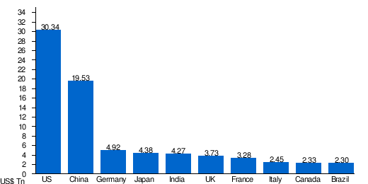

Gross Domestic Product (GDP) is a crucial indicator used to gauge the economic performance of countries. It represents the total monetary value of all goods and services produced within a nation's borders over a specified period. GDP serves as a comprehensive measure of a country's economic health, reflecting its productive capacity and influencing policy-making. In essence, it offers insights into the size, composition, and growth trajectory of economies, making it an indispensable tool for economists, policymakers, and investors alike.

Global GDP rankings are pivotal in understanding the comparative economic stature of countries worldwide. These rankings order nations by their GDP, providing insights into economic size and influence. High GDP rankings often correspond with increased political and economic clout on the international stage, as well as greater capacity for investment in infrastructure, education, and social services. By examining these rankings, stakeholders can assess economic power balances, trade dynamics, and potential shifts in global influence.

This article will explore key themes, including the largest economies, world economies, and the growing impact of algorithmic trading. The world's largest economies, such as the United States, China, and Germany, not only drive global economic growth but also significantly influence international trade and investment flows. These economies' relative positions can shift due to factors like innovation, technology, demographic changes, and geopolitical developments.

Algorithmic trading plays an increasingly significant role in modern global economies. This form of trading utilizes algorithms to make rapid trading decisions, contributing to market liquidity and efficiency. By analyzing vast amounts of data and executing trades at high speed, algorithmic trading can influence stock prices and, by extension, economic indicators like GDP. It has the potential to affect market stability and shape economic outcomes by optimizing capital allocation and facilitating price discovery.

The objective of this article is to examine the interplay between global GDP rankings and algorithmic trading. It aims to analyze how shifts in economic power might influence trading strategies and, conversely, how advancements in trading technologies can impact GDP outcomes. By understanding this intersection, stakeholders can better navigate evolving economic landscapes and harness the opportunities presented by these dynamic forces.

## Table of Contents

## Understanding Global GDP Rankings

Global GDP rankings are an evaluation of countries' economic performance, with GDP serving as a primary indicator. GDP, or Gross Domestic Product, quantifies the total market value of all goods and services produced within a country's borders in a given period, typically a year. It's calculated using the formula: 

$$
\text{GDP} = C + I + G + (X - M)
$$

where $C$ represents consumption, $I$ denotes investment, $G$ stands for government spending, and $(X - M)$ accounts for net exports (exports minus imports).

These rankings are vital for global economic analysis as they offer insights into the economic size and health of nations, influencing decisions in policymaking, international investments, and trade. High GDP rankings often translate to increased economic influence and investment attractiveness.

Organizations like the World Bank and the International Monetary Fund (IMF) are pivotal in compiling and publishing GDP data. They provide comprehensive data sets and analysis, ensuring the consistency and reliability necessary for global economic assessments.

Several factors impact GDP rankings, including economic growth rates, inflation, and international trade dynamics. Economic growth, measured by the increase in GDP, indicates a country's economic health and can shift rankings as different nations experience varying growth trajectories. Inflation, which affects the purchasing power and real output, can distort GDP figures and influence rankings if not accounted for with measures like GDP deflation. 

International trade plays a significant role, as countries with robust export sectors often record higher GDPs due to increased production capacities and foreign earnings. Trade policies, exchange rates, and global demand also influence exports and imports, subsequently impacting GDP rankings.

These factors can change over time, affecting the global economy. Economic growth is subject to technological advancements, demographic changes, and policy reforms. Inflation is influenced by monetary policy, fiscal measures, and external shocks such as oil price fluctuations. Trade dynamics can be altered by geopolitical events, trade agreements, and global market conditions.

In summary, global GDP rankings are determined by complex interactions of various economic factors and are monitored by key international organizations. These rankings offer a comparative snapshot of economic performance, guiding global economic policies and strategies. Understanding the intricacies of these rankings is essential for comprehending the economic environment and its evolution over time.

## The Largest Economies in the World

The largest economies in the world are ranked based on their Gross Domestic Product (GDP), a primary indicator used to gauge the economic performance of a country. As of the latest GDP rankings, the top 10 largest economies are the United States, China, Japan, Germany, India, the United Kingdom, France, Brazil, Italy, and Canada. These countries account for a substantial proportion of the global economy, and their economic activities significantly influence international markets and trade dynamics.

The United States holds the position of the world's largest economy, a status it has maintained for decades. The primary factors contributing to this position include a high level of consumer spending, technological innovation, and a strong service sector. U.S. financial markets are highly developed, making it a central hub for global investment.

China, the second-largest economy, has experienced tremendous growth over the past few decades, primarily due to its manufacturing capabilities and export-led development strategy. China's economic model is characterized by large-scale production and infrastructure investment, and it plays a critical role in global supply chains.

Japan ranks third, known for its advanced technology sector and significant contributions to automotive and electronics industries. Despite limited natural resources, Japan's economy thrives on its highly skilled labor force and strong industrial base.

Germany, positioned as the fourth-largest economy, is Europe's economic powerhouse. The country is famous for its engineering expertise, robust automotive industry, and strong focus on export. Its stability and economic policies contribute to Germany's high ranking.

India is the fifth-largest economy, driven by a diverse industrial base and a rapidly growing service sector, particularly in information technology. The country's demographic advantage with a youthful population positions it for future growth potential, although it faces challenges like infrastructure development and regulatory reforms.

The United Kingdom, France, Brazil, Italy, and Canada round out the top ten, each with unique economic strengths. The UK and France are notable for their financial and services sectors, while Brazil benefits from vast natural resources. Italy has a strong focus on manufacturing and design, and Canada has significant energy resources and a stable financial system.

Future shifts in the GDP rankings are influenced by numerous factors, including technological advancements, demographic changes, trade policies, and geopolitical developments. Rapidly growing economies like India and Brazil may climb higher due to population growth and economic reforms. Conversely, aging populations and economic stagnation could impact some of the current leading economies, such as Japan and certain European countries.

These largest economies significantly impact global markets and trade by shaping demand for commodities, goods, and services. Their monetary and fiscal policies, as well as trade agreements, can lead to fluctuations in global trade patterns, affecting everything from currency exchange rates to investment flows. As these economies evolve, they continue to drive global economic trends and influence the broader international landscape.

## Algorithmic Trading and Global Economies

Algorithmic trading, often referred to as algo trading, is a method of executing orders using automated and pre-programmed trading instructions. These instructions account for variables such as time, price, and [volume](/wiki/volume-trading-strategy), thereby leveraging computational power to maximize trading efficiency and profitability. Over recent years, [algorithmic trading](/wiki/algorithmic-trading) has become increasingly prevalent in global financial markets, driven by advancements in technology and data analytics. 

The impact of algorithmic trading on economies is substantial, particularly regarding [liquidity](/wiki/liquidity-risk-premium) and market efficiency. By enabling the rapid execution of trades, algorithms can enhance liquidity, making it easier for market participants to buy and sell securities. High liquidity tends to reduce the costs associated with trading and can lead to tighter bid-ask spreads. Algorithmic trading also contributes to market efficiency by quickly processing vast amounts of information and incorporating it into asset prices, thus reflecting the true value based on available data.

However, there is an intricate relationship between algorithmic trading and the stability of the largest economies. While increased liquidity and efficiency can stabilize markets, the speed and automation inherent in algo trading can also amplify systemic risks. For instance, the "Flash Crash" of May 6, 2010, when the Dow Jones Industrial Average plummeted nearly 1,000 points within minutes before recovering, showcased how algorithmic systems could exacerbate market [volatility](/wiki/volatility-trading-strategies). On this occasion, a large automated sell order triggered further automated selling by other trading algorithms, causing a brief but dramatic plunge in market prices.

Regulatory concerns over algorithmic trading focus on its potential to cause abrupt market disruptions and its fairness, given that only technologically advanced entities can fully exploit these systems. Governments and regulatory bodies, such as the U.S. Securities and Exchange Commission (SEC) and the European Securities and Markets Authority (ESMA), have considered numerous regulations to mitigate these risks. These measures include imposing circuit breakers to halt trading during extreme volatility and requiring firms to disclose their algorithmic strategies to regulators.

In the context of global GDP, algorithmic trading's influence extends beyond financial markets to impact broader economic indicators. Changes in GDP rankings can affect investor sentiment and consequently, algorithmic trading strategies. For example, a country gaining a higher GDP ranking might attract increased foreign investment, leading to strategic shifts in algorithms favoring that market. Conversely, algorithmic trading can impact GDP outcomes by influencing capital flows and contributing to economic growth or contraction depending on the trading dynamics.

Overall, while algorithmic trading has undeniably reshaped modern financial markets, it necessitates careful regulation and monitoring to ensure it bolsters economic stability rather than undermines it. Stakeholders must balance the benefits of efficiency and liquidity with the risks of potential market disruptions in an increasingly interconnected global economy.

## The Interplay Between GDP Rankings and Algorithmic Trading

Changes in global GDP rankings can have a substantial impact on algorithmic trading strategies. Algorithmic trading, which relies on mathematical models and automated processes to execute trades, often integrates economic data, including GDP figures, to calibrate its algorithms and execute trades. Shifts in GDP rankings may signal changes in a country's economic health or trajectory, prompting adjustments in trading algorithms to exploit new opportunities or mitigate risks associated with economic fluctuations.

Algorithmic trading impacts economic indicators and GDP outcomes, primarily by influencing market dynamics. High-frequency trading, a subtype of algorithmic trading, can significantly enhance market liquidity, resulting in more efficient capital allocation across the economy. However, this increased liquidity may also lead to volatility if not properly managed, impacting investor confidence and, by extension, economic growth indicators.

In some notable case studies, shifts in GDP rankings have led to observable changes in trading volumes and strategies. For instance, when China surpassed Japan to become the second-largest economy, trading algorithms globally adjusted to include a more significant focus on China's market data and economic policies. This shift catalyzed increased trading volumes in markets related to China, reflecting an updated assessment of risk and opportunity.

Looking to the future, algorithmic trading is expected to continue evolving in response to changes in global economic circumstances signaled by GDP rankings. As emerging economies climb the GDP rankings, algorithmic traders may adjust their focus to encompass these markets, requiring increasingly sophisticated models that account for unique market conditions in rising economies.

The potential synergies between rising economies and advancements in trading technologies are profound. As developing nations ascend the GDP rankings, they may create fertile ground for technological innovations in trading. This advancement could lead to more tailored algorithmic trading solutions that are better suited to the specific economic landscapes of these emerging powerhouses, ultimately contributing to a more dynamic and responsive global trading environment.

## Conclusion

Understanding global GDP rankings is vital for assessing the economic health of countries worldwide. These rankings provide a clear, quantitative picture of where economies stand on a global scale and highlight shifts in economic power and resource distribution. The insights gathered from GDP rankings help governments, investors, and policymakers make informed decisions.

Algorithmic trading plays a significant role in modern financial markets, offering benefits such as increased liquidity and market efficiency. Its rapid growth underscores a shift towards more automated and data-driven market practices, influencing trading volumes and pricing mechanisms.

The interconnectedness of the largest economies with trends in algorithmic trading reveals a complex dynamic. As large economies like the USA, China, and Germany dominate global trade, their economic performance influences and is influenced by algorithmic trading strategies. Changes in GDP rankings can affect trading patterns, leading to shifts in market strategies and economic outcomes.

The intricate relationship between global GDP rankings and algorithmic trading trends necessitates ongoing research and monitoring. Stakeholders and policymakers must continue to explore these interactions to navigate emerging challenges and opportunities effectively. By understanding these evolving dynamics, they can better anticipate market changes and implement policies that foster economic stability and growth.

## References

1. World Bank. "World Development Indicators." Available at: [World Bank WDI](https://datacatalog.worldbank.org/dataset/world-development-indicators).

2. International Monetary Fund. "World Economic Outlook: A Survey by the IMF Staff." Available at: [IMF World Economic Outlook](https://www.imf.org/en/Publications/WEO).

3. Organisation for Economic Co-operation and Development. "OECD Economic Outlook." Available at: [OECD Economic Outlook](https://www.oecd.org/economic-outlook/).

4. United Nations. "National Accounts Main Aggregates Database." Available at: [UN National Accounts](https://unstats.un.org/unsd/snaama/introduction.asp).

5. Bank for International Settlements. "BIS Quarterly Review." Available at: [BIS Quarterly Review](https://www.bis.org/publ/qtrpdf/r_qt2009.htm).

6. U.S. Securities and Exchange Commission. "Algorithmic Trading." Available at: [SEC Algorithmic Trading](https://www.sec.gov/developer-resources).

7. NASDAQ. "How Algorithmic Trading Dominates the Market." Available at: [NASDAQ Algorithmic Trading](https://www.nasdaq.com/articles/how-algorithmic-trading-dominates-the-market-2020-07-16).

8. World Economic Forum. "Global Economic Prospects and Policies." Available at: [World Economic Forum](https://www.weforum.org/reports/global-economic-prospects-and-policies/).

9. Academic journals and publications such as Elsevier's "Journal of Economic Behavior & Organization" and "Journal of Financial Markets" for research on algorithmic trading and economic performance.

10. Books such as Andrew Lo's "Adaptive Markets: Financial Evolution at the Speed of Thought" for insights into market dynamics and algorithmic trading.

## References & Further Reading

[1]: World Bank. "World Development Indicators." Available at: [World Bank WDI](https://databank.worldbank.org/reports.aspx?source=2&country=ARE).

[2]: International Monetary Fund. "World Economic Outlook: A Survey by the IMF Staff." Available at: [IMF World Economic Outlook](https://www.imf.org/en/Publications/WEO).

[3]: Organisation for Economic Co-operation and Development. "OECD Economic Outlook." Available at: [OECD Economic Outlook](https://www.oecd-ilibrary.org/economics/oecd-economic-outlook/volume-2023/issue-1_ce188438-en).

[4]: United Nations. "National Accounts Main Aggregates Database." Available at: [UN National Accounts](https://unstats.un.org/unsd/snaama/selectionbasic-Fast.asp).

[5]: U.S. Securities and Exchange Commission. "Algorithmic Trading." Available at: [SEC Algorithmic Trading](https://www.sec.gov/files/Algo_Trading_Report_2020.pdf).

[6]: NASDAQ. "How Algorithmic Trading Dominates the Market." Available at: [NASDAQ Algorithmic Trading](https://www.packtpub.com/en-us/product/machine-learning-for-algorithmic-trading-9781839216787).

[7]: "Advances in Financial Machine Learning" by Marcos Lopez de Prado. Available at: [Amazon](https://www.amazon.com/Advances-Financial-Machine-Learning-Marcos/dp/1119482089).

[8]: "Adaptive Markets: Financial Evolution at the Speed of Thought" by Andrew Lo.

[9]: "Machine Learning for Algorithmic Trading" by Stefan Jansen. Available at: [Amazon](https://www.amazon.com/Machine-Learning-Algorithmic-Trading-alternative/dp/1839217715).