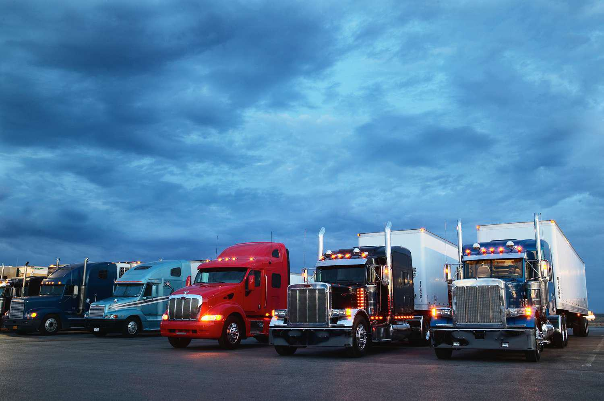

The trucking industry is a vital component of the global transportation sector, ensuring the efficient movement of goods across an intricate network of roads and highways. This segment of logistics is tasked with connecting producers to consumers and is integral to both local and international economies by facilitating trade and commerce. Trucking companies, by acting as the linchpins in the supply chain, ensure that products reach their destinations in a timely manner, which is crucial for market operations and consumer satisfaction.

In recent years, algorithmic trading, or algo trading, has begun to influence the financial landscape of the transportation industry. Traditionally associated with stock markets and other financial securities, algorithmic trading involves the use of computer algorithms to manage trading strategies. Its application in the trucking industry marks an innovative shift, affecting aspects such as market capitalization and financial transactions of trucking firms. By harnessing the power of big data and advanced analytics, trucking companies can potentially improve financial strategies, optimize pricing, and enhance operational efficiencies.

This article discusses the largest trucking firms globally and their significant role in shaping the industry. Moreover, it examines the emerging influence of algorithmic trading, highlighting its potential to transform financial market strategies within the trucking sector. Through exploring these dynamics, the article aims to provide insights into how trucking companies can leverage technological advancements for sustained growth and competitive advantage.

## Table of Contents

## Top Trucking Companies Worldwide

The trucking industry is an integral component of the global economy, with several key players driving its expansion and innovation. Among these, Old Dominion Freight Line, Inc., Saia, Inc., and TFI International Inc. stand out due to their substantial market capitalizations, which reflect their influence and scale in the industry.

**Old Dominion Freight Line, Inc.** is a leader in the less-than-truckload (LTL) segment, recognized for its operational efficiency and comprehensive service coverage across the United States. This company's strong market position is largely attributed to its investment in state-of-the-art logistics technology, enabling precise tracking and delivery. Moreover, Old Dominion maintains a robust financial performance, evidenced by consistent revenue growth and a formidable market capitalization, which is among the highest in the trucking sector.

**Saia, Inc.** has been another significant player, distinguished by its service diversity and expansive geographic reach. The firm's success is powered by its strategic expansion efforts and a customer-centric approach, offering customized freight solutions that cater to a wide range of clients. Saia's market capitalization reflects its steady growth trajectory, underpinned by its ability to adapt to market demands and its focus on sustainability, which resonates with contemporary consumer values.

**TFI International Inc.**, a Canadian-based conglomerate, encapsulates a diverse mix of transport and logistics services across North America. Its growth strategy includes acquisitions, optimizing its service portfolio, and expanding its market footprint. TFI's ability to effectively integrate new acquisitions has bolstered its operational capabilities, resulting in a competitive market capitalization. This diversification strategy helps mitigate risks associated with market fluctuations and economic downturns, contributing to its sustained financial health.

These companies face various challenges within the global trucking market, such as fluctuating fuel prices, regulatory hurdles, and evolving customer expectations. However, they also encounter significant opportunities, including technological advancements and increasing demand for efficient logistics solutions. By leveraging innovative technologies, optimizing their service offerings, and expanding their market reach, these top trucking companies continue to enhance their competitiveness and profitability in a rapidly changing industry landscape.

## Impact of Algo Trading in the Trucking Industry

Algorithmic trading, often known as algo trading, utilizes advanced mathematical models and computer algorithms to automate and optimize trading strategies. Within the trucking industry, algo trading's relevance has surged, particularly as financial markets become increasingly complex and competitive.

Algorithmic trading aids trucking companies by improving trading efficiency, reducing transaction costs, and enhancing [liquidity](/wiki/liquidity-risk-premium). Through automation, companies can execute trades at optimal times, minimizing human intervention and emotional biases. This precision ensures lower transaction costs by selecting the best times to buy or sell assets within the constraints of predefined conditions.

For instance, consider an algorithm designed to capitalize on short-term market inefficiencies. This algorithm might scan real-time data, identifying [arbitrage](/wiki/arbitrage) opportunities where discrepancies exist between the stock prices of two interlinked logistics companies. The algorithm could automatically execute trades to exploit these gaps, adjusting positions in milliseconds. The result is increased market liquidity as more trades occur swiftly and at various price points.

Major trucking companies have started incorporating algo trading into their financial strategies. While there is limited public documentation of specific case studies, the logic follows broader industry trends. For example, logistics firms might employ algo trading to hedge against fuel price fluctuations - a significant cost [factor](/wiki/factor-investing). By using derivative products like futures and options, companies can lock in favorable prices and protect against volatile market shifts. With algorithmic precision, such strategies can be executed efficiently and effectively, thereby stabilizing the company's financial performance.

However, integrating algo trading in the trucking industry also presents potential risks. First, the complexity of algorithms can lead to unintended consequences if not meticulously crafted and tested. Flash crashes, rapid declines in asset prices caused by automated, large-scale selling, highlight the potential dangers of poorly managed algorithms. Additionally, the opacity of some algorithmic strategies can pose challenges in regulation and compliance.

Moreover, significant capital is required to develop and maintain sophisticated trading algorithms, potentially presenting barriers for smaller firms without substantial financial resources. Companies must also consider the cybersecurity risks associated with digital trading systems, as vulnerabilities could be exploited, leading to financial losses or data breaches.

In conclusion, while algo trading provides significant benefits in terms of efficiency, cost reduction, and liquidity enhancement, trucking companies must approach its integration with careful consideration of associated risks. Keeping in mind regulatory compliance, algorithmic transparency, and security measures will be crucial in leveraging algo trading's full potential in the trucking industry.

## Financial Performance and Future Outlook

The financial performance of the largest trucking companies offers significant insights into the operational dynamics and economic health of the global transportation sector. Leading companies such as Old Dominion Freight Line, Inc., Saia, Inc., and TFI International Inc. have demonstrated robust growth in revenue, net income, and market capitalization, reflecting their strategic adaptability and operational efficiency.

Old Dominion Freight Line, with its focused approach on less-than-truckload (LTL) services, reported substantial revenue growth primarily due to their high service quality and customer satisfaction. The company's net income has consistently increased, supported by strong demand and effective cost management. Similarly, Saia, Inc. continues to leverage its comprehensive logistics solutions, resulting in notable market cap growth. Their expansion strategy, which includes increasing geographic reach and enhancing service diversity, has proven successful in capturing a larger market share.

TFI International Inc., recognized for its diversified service offerings across various segments including truckload, logistics, and package services, also showcases a solid financial trajectory. Their focus on strategic acquisitions and operational efficiency contributes to their robust financial results, with upward trends in both revenue and net income. Their market cap reflects the trust of investors in their growth strategy and operational resilience.

The trucking industry faces a complex array of market trends influencing its growth. Fluctuating fuel prices constantly alter operational costs, impacting profitability margins. Regulatory changes, particularly in emissions and driver safety, require significant adjustments in operational practices and investments in technology. Supply chain disruptions, further exacerbated by geopolitical tensions and pandemics, challenge the industry to maintain seamless operations.

Technological advancements, however, present both opportunities and challenges. The rise of autonomous trucking and electric vehicles promises improved efficiency and reduced environmental impact, yet it requires substantial capital investment and regulatory adjustments. Additionally, the integration of data analytics and IoT in fleet management systems offers improved logistics and operational efficiency, enhancing competitive advantage.

Looking to the future, the trucking industry is poised for continued growth, albeit with challenges to navigate. Companies investing in innovative technologies and sustainable practices are likely to lead the market. The ability to adapt to regulatory changes and manage operational costs effectively will be crucial for maintaining profitability. As the industry evolves, stakeholders must prioritize technological integration, strategic expansion, and financial agility to harness the full potential of unfolding market dynamics.

## Conclusion

The analysis of the trucking industry highlights the influence of large trucking firms, such as Old Dominion Freight Line, Inc., Saia, Inc., and TFI International Inc., which play pivotal roles in shaping the market landscape due to their substantial market capitalizations and comprehensive service offerings. These companies have effectively navigated the complexities of the global trucking market by leveraging efficient logistics systems and maintaining a robust market presence. Their ability to adapt to challenges, including regulatory shifts and supply chain disruptions, underscores their dominant position within the industry.

Simultaneously, the integration of [algorithmic trading](/wiki/algorithmic-trading) has emerged as a transformative force within the financial strategy framework of these trucking giants. Algo trading enhances trading efficiency, reduces costs, and bolsters market liquidity, thus providing a competitive edge. Despite potential risks, such as algorithm malfunction or market [volatility](/wiki/volatility-trading-strategies) exacerbation, the strategic use of algo trading can significantly boost financial performance when applied prudently.

Innovation and technology adoption remain critical for sustaining growth in the trucking industry. Companies must continually explore advancements in logistics technology, automation, and financial trading strategies to stay competitive. As technological infrastructures become more sophisticated, the capacity to integrate these tools will likely dictate the future success of trucking companies.

Stakeholders across the industry, from corporate decision-makers to financial strategists, are encouraged to embrace these trends. By leveraging innovation and adopting forward-thinking technologies, industry players can not only maintain their competitive positions but also drive unprecedented growth and efficiency in the ever-evolving transportation landscape.

## References & Further Reading

[1]: Old Dominion Freight Line, Inc. Annual Report 2022. Retrieved from: https://ir.odfl.com/financials/annual-reports

[2]: Saia, Inc. Annual Report 2022. Retrieved from: https://investors.saia.com/reports/annual-reports/default.aspx

[3]: TFI International Inc. Annual Report 2022. Retrieved from: https://tfiintl.com/investors

[4]: Narang, R. K. (2013). ["Inside the Black Box: A Simple Guide to Quantitative and High-Frequency Trading"](https://onlinelibrary.wiley.com/doi/book/10.1002/9781118662717). Wiley.

[5]: Aldridge, I. (2013). ["High-Frequency Trading: A Practical Guide to Algorithmic Strategies and Trading Systems"](https://books.google.com/books/about/High_Frequency_Trading.html?id=8QpIsVUMhmEC). Wiley.