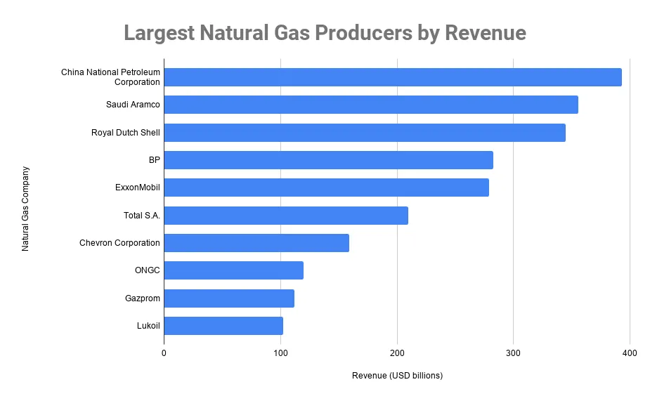

## Table of Contents

## What is natural gas and why is it important?

Natural gas is a type of fuel that comes from deep under the ground. It is made up mostly of a gas called methane, but it can also have other gases mixed in. People find natural gas by drilling into the earth, similar to how they find oil. It is a clean-burning fuel, which means it does not produce as much pollution as other fuels like coal or oil when it is burned.

Natural gas is important for many reasons. One big reason is that it is used to heat homes and cook food. Many people around the world use natural gas in their homes every day. It is also used to make electricity in power plants. This electricity helps run our lights, computers, and other machines. Because it burns cleaner than other fuels, using natural gas can help keep the air and environment healthier.

## How is natural gas extracted and processed?

Natural gas is extracted from the ground through a process called drilling. People use big machines to drill deep holes into the earth where the gas is trapped in rocks. Sometimes, they use a method called hydraulic fracturing, or "fracking," where they pump water, sand, and chemicals into the rock to break it and let the gas out. Once the gas is released, it flows up the well to the surface.

After the gas is extracted, it needs to be processed to remove impurities like water, sand, and other gases. This is done at processing plants where the natural gas is cleaned and separated into different parts. The main part, methane, is what we use for energy. The other parts, like propane and butane, can be used for other things. Once the gas is clean, it is sent through pipelines to homes, businesses, and power plants where it can be used for heating, cooking, and making electricity.

## What are the major uses of natural gas?

Natural gas is used in many ways. One of the main uses is to heat homes and buildings. People use natural gas in their furnaces to keep warm during cold months. It is also used for cooking. Many kitchens have natural gas stoves because they heat up quickly and are easy to control. Another important use is in water heaters. Natural gas can heat water for showers, baths, and washing dishes.

Natural gas is also used to make electricity. Power plants burn natural gas to turn big machines called turbines. These turbines create electricity that goes to homes and businesses. This electricity powers our lights, computers, and other devices. Besides heating and electricity, natural gas is used in industries. Factories use it to make things like plastics, fertilizers, and chemicals. It is also used as fuel for vehicles, especially big trucks and buses.

In some places, natural gas is used to make other fuels like propane and butane. These fuels can be used for heating, cooking, and in portable stoves or camping equipment. Natural gas is very versatile and important for many parts of our daily life.

## Who are the top global natural gas companies?

Some of the biggest natural gas companies in the world are ExxonMobil, Chevron, and ConocoPhillips. These companies are based in the United States and they find, extract, and sell natural gas all over the world. ExxonMobil is one of the largest, and it works in many countries to bring natural gas to people who need it. Chevron and ConocoPhillips are also very big and they help to make sure that homes and businesses have the natural gas they need.

Other important companies are Gazprom from Russia and Royal Dutch Shell from the Netherlands and the UK. Gazprom is one of the biggest in the world and it supplies a lot of natural gas to Europe and other places. Royal Dutch Shell is also very big and it works in many countries to find and sell natural gas. These companies are important because they help to make sure that people have the energy they need.

There are also big companies like PetroChina and Sinopec from China. These companies are very important in Asia and they help to find and sell natural gas in that part of the world. PetroChina and Sinopec are working to make sure that more people in China and other Asian countries can use natural gas for their homes and businesses.

## What criteria are used to rank natural gas companies?

Natural gas companies are ranked based on several important factors. One key criterion is the amount of natural gas they produce. Companies that produce a lot of natural gas are seen as more important because they can supply more energy to people. Another [factor](/wiki/factor-investing) is the size of their reserves, which means how much natural gas they have found but not yet used. Companies with big reserves are ranked higher because they can keep producing natural gas for a long time. The financial performance of the company is also important. Companies that make a lot of money and are good at managing their money are often ranked higher.

Another criterion is the company's market share, which means how much of the natural gas market they control. Companies with a large market share are seen as leaders in the industry. The geographic reach of the company is also considered. Companies that work in many countries and can supply natural gas to different parts of the world are ranked higher. Finally, the company's reputation and how well it follows rules and regulations can affect its ranking. Companies that are trusted and follow the law are often seen as better and ranked higher.

## How do these companies contribute to the global energy market?

Big natural gas companies like ExxonMobil, Chevron, and Gazprom help the global energy market by finding and selling a lot of natural gas. They look for natural gas deep in the ground and then bring it up to the surface. After cleaning it, they send it through big pipes to different places around the world. This helps people in many countries to have the energy they need for their homes and businesses. These companies make sure that there is enough natural gas for everyone, and they work hard to find new places where natural gas can be found.

These companies also help the energy market by making sure the natural gas is clean and safe to use. They use special machines to take out any bad stuff from the gas, so it burns better and does not harm the environment as much. They also help to make other things like electricity, plastics, and fertilizers using natural gas. This is important because it means they are not just selling gas, but also helping to make other products that people need. By doing all these things, these companies play a big role in keeping the world's energy supply strong and reliable.

## What are the production volumes and market shares of leading natural gas companies?

ExxonMobil is one of the biggest natural gas companies in the world. They produce a lot of natural gas, around 10 billion cubic feet per day. This makes them a very important player in the energy market. ExxonMobil has a big market share, about 5% of the global natural gas market. They work in many countries and help to make sure that people have the natural gas they need for their homes and businesses.

Chevron is another big company, producing about 4 billion cubic feet of natural gas every day. They have a market share of around 2% worldwide. Chevron also works in many countries and helps to supply natural gas to different parts of the world. Gazprom from Russia is even bigger, producing around 50 billion cubic feet of natural gas each day. They have a very large market share, about 15% of the global market. Gazprom supplies a lot of natural gas to Europe and other places, making them a key player in the energy market.

Royal Dutch Shell and ConocoPhillips are also important in the natural gas industry. Royal Dutch Shell produces about 6 billion cubic feet of natural gas daily and has a market share of around 3%. They work in many countries and help to make sure that people have the energy they need. ConocoPhillips produces around 2 billion cubic feet of natural gas each day and has a market share of about 1%. They also work hard to find and sell natural gas to different parts of the world. These companies all play a big role in making sure that the global energy market has enough natural gas.

## How do geopolitical factors affect the operations of natural gas companies?

Geopolitical factors can have a big impact on how natural gas companies work. For example, if two countries do not get along, it can be hard for a natural gas company to send gas from one country to another. This can happen if there are fights or if one country puts up rules that make it hard to move gas across borders. Also, if a country has a lot of natural gas and it is important to the world, that country can have more power in deciding how much gas to sell and at what price. This can affect how much money natural gas companies make and how they plan their business.

Another way geopolitical factors matter is through laws and rules that different countries have. Some countries might have strict rules about how to find and use natural gas, which can make it more expensive or difficult for companies to work there. Also, if a country changes its leaders or government, the new leaders might have different ideas about natural gas and could change the rules. This can make it hard for companies to plan for the future because they do not know if the rules will stay the same. All these things show how important it is for natural gas companies to think about the political situation in the countries where they work.

## What are the environmental impacts associated with natural gas production and consumption?

Natural gas production and consumption can have some bad effects on the environment. One big problem is methane leaks. Methane is the main part of natural gas, and if it leaks out during drilling or transport, it can go into the air. Methane is a strong greenhouse gas, which means it can make the Earth warmer. Also, when people use natural gas for energy, it makes carbon dioxide, another greenhouse gas. Too much carbon dioxide can also make the Earth warmer and change the weather. Another problem is that drilling for natural gas can use a lot of water and chemicals, which can pollute water and harm animals and plants.

Even though natural gas burns cleaner than coal or oil, it still has some bad effects. When natural gas is burned, it can make air pollution, like nitrogen oxides and sulfur dioxide. These can make the air dirty and bad for people to breathe. They can also make acid rain, which can harm trees, lakes, and buildings. Also, drilling for natural gas can change the land and harm where animals live. It can make noise and take up space, which can scare animals away from their homes. So, while natural gas is better than some other fuels, it still has some problems for the environment.

## How are leading natural gas companies investing in sustainable practices and technologies?

Leading natural gas companies are trying hard to be more friendly to the environment. They are investing in new technologies to stop methane leaks. Methane is the main part of natural gas, and if it leaks out, it can make the Earth warmer. Companies like ExxonMobil and Chevron are using special tools to find and fix these leaks quickly. They are also working on ways to use less water when they drill for natural gas. This helps to keep the water clean and safe for people and animals. By doing these things, these companies hope to make natural gas production better for the environment.

Another way these companies are trying to be more sustainable is by investing in renewable energy. Some big natural gas companies, like Royal Dutch Shell and BP, are putting money into wind and solar power. They are also looking into new ways to use natural gas that make less pollution. For example, they are working on carbon capture and storage technology, which can take the bad gases from burning natural gas and store them safely underground. By doing all these things, these companies are trying to make sure that natural gas can be a part of a cleaner, more sustainable future.

## What are the future trends and challenges facing the natural gas industry?

The natural gas industry is looking at some big changes in the future. One trend is that more people are using natural gas because it is cleaner than coal and oil. Countries are trying to use less coal to help the environment, so natural gas is becoming more popular. Another trend is that companies are working on new ways to get natural gas out of the ground, like fracking, which can help find more gas. Also, natural gas can be turned into a liquid and shipped around the world, which means more countries can use it. But, there is a challenge too. As more people care about the environment, they want natural gas companies to be cleaner and safer. This means companies need to spend money on new technology to stop leaks and use less water.

Another challenge is that renewable energy, like wind and solar power, is getting cheaper and more popular. This means that natural gas has to compete with these other types of energy. Some countries are setting goals to use more renewable energy, which could mean less demand for natural gas in the future. Also, there are political challenges. Countries that have a lot of natural gas can use it to have more power in the world, but this can cause problems if they do not get along with other countries. So, natural gas companies need to be smart about how they work with different countries and how they use new technology to stay important in the energy market.

## How do mergers and acquisitions influence the competitive landscape of the natural gas sector?

Mergers and acquisitions can change the way natural gas companies compete with each other. When two companies join together, they can become bigger and stronger. This means they can produce more natural gas and have more money to spend on finding new places to drill. They might also be able to sell natural gas in more places around the world. This can make it harder for smaller companies to compete because they do not have as much money or as many places to sell their gas. So, mergers and acquisitions can make the natural gas market less competitive because a few big companies might control more of the market.

But mergers and acquisitions can also help the natural gas industry in some ways. When companies join together, they can share their knowledge and technology. This can help them find new ways to get natural gas out of the ground more safely and with less harm to the environment. They can also work together to build bigger pipelines and other ways to move natural gas to where it is needed. This can make the supply of natural gas more reliable and help more people use it. So, while mergers and acquisitions can make the market less competitive, they can also help the industry grow and improve.

## Top Natural Gas Producers Worldwide

Saudi Arabian Oil Company (Aramco) dominates the global natural gas market by leveraging its abundant reserves in Saudi Arabia. As a national oil company, Aramco's significant natural gas production aligns with its strategy to balance oil and gas output, enhancing its role as a cornerstone in the international energy landscape. Aramco's extensive infrastructure and technological investments further solidify its leading position, providing a substantial contribution to the global energy supply chain.

In the United States, Exxon Mobil and Chevron distinguish themselves as major players in natural gas production. Their vast production capacities and advanced market operations underscore their leadership within the industry. Exxon Mobil's global reach and Chevron's strategic focus on technological innovation enable these companies to exploit complex gas fields effectively. These American oil giants maintain strategic partnerships and invest in research and development to optimize extraction and production processes, thereby strengthening their market positions.

China's strategic initiatives in energy security are exemplified by PetroChina and other leading Chinese enterprises. As a branch of the China National Petroleum Corporation (CNPC), PetroChina benefits from government-backed initiatives aimed at increasing domestic energy production. Beijing's concerted efforts to enhance natural gas output have led to substantial investments in infrastructure and overseas ventures, allowing Chinese companies to secure considerable stakes in the global market.

European and Indian firms like Shell and Reliance Industries LTD demonstrate significant global influence in natural gas markets. Shell, with its expansive global operations, integrates natural gas within its broader energy transition strategy. The company's substantial investment in liquefied natural gas (LNG) projects highlights its commitment to long-term growth within this segment. Meanwhile, Reliance Industries, as India's largest private sector enterprise, leverages its domestic market strength and international ventures to emerge as a competitive natural gas producer. These firms exemplify the diversity of strategic approaches adopted by companies in response to shifting energy demands.

Analyzing market capitalization and production capacities provides a window into the financial strength and operational execution of these leading natural gas producers. For instance, Exxon Mobil and Chevron, with billions in market cap, demonstrate resilience and adaptability in dynamic energy markets. Similarly, the financial metrics of Aramco, Shell, and Reliance underscore their robust performance and potential for future growth. These entities continuously enhance operational efficiencies through cutting-edge technologies and strategic market positioning, ensuring their pivotal role in a rapidly evolving energy sector.

## References & Further Reading

[1]: ["The Future of Natural Gas"](https://energy.mit.edu/research/future-natural-gas/) by the International Energy Agency

[2]: ["Advances in Financial Machine Learning"](https://www.amazon.com/Advances-Financial-Machine-Learning-Marcos/dp/1119482089) by Marcos Lopez de Prado

[3]: Watson, R., & Preedy, V. (Eds.). (2020). ["Natural Gas: A Commercial Perspective."](https://link.springer.com/referencework/10.1007/978-0-387-78665-0) Springer.

[4]: ["Energy Trading & Risk Management: A Practical Approach to Hedging, Trading and Portfolio Diversification"](https://books.google.com/books/about/Energy_Trading_and_Risk_Management.html?id=-gArAwAAQBAJ) by Iris Marie Mack 

[5]: Behrendt, S. (2018). ["Big Data in Algorithmic Trading."](https://www.tandfonline.com/doi/full/10.1080/15427560.2018.1506786) Springer.

[6]: ["Algorithmic Trading: Winning Strategies and Their Rationale"](https://www.wiley.com/en-us/Algorithmic+Trading%3A+Winning+Strategies+and+Their+Rationale-p-9781118460146) by Ernie Chan

[7]: ["Global Production and Supply Chain Management of Natural Gas."](https://www.energyinfrastructure.org/energy-101/natural-gas-supply-chain) by Nader Van Aken and Other

[8]: ["Economics of Natural Gas: Pricing, Markets and Strategy"](https://tradingeconomics.com/commodity/natural-gas) by Deon Hessels 

[9]: ["The Role of Natural Gas in a Low-Carbon Energy Economy"](http://large.stanford.edu/courses/2012/ph240/pratt2/docs/natural_gas_overview_april2010.pdf) in The Energy Journal by Henry Lee, Josephine Wolff