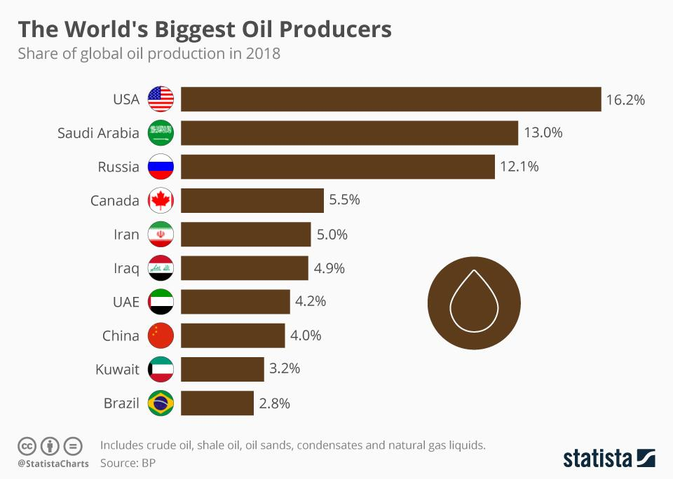

Oil production plays a pivotal role in the global economy, serving as the lifeblood for numerous sectors, including transportation, manufacturing, and energy generation. The availability and pricing of oil directly influence economic stability, inflation rates, and the cost of goods and services around the world. As one of the most traded commodities, oil is integral to the operational frameworks of diverse industries, underscoring its critical importance on a global scale.

In recent years, the concept of algorithmic trading has become increasingly significant within financial markets. Algorithmic trading involves the use of automated and complex systems for executing trades, relying on pre-defined strategies and quantitative models to analyze market data. Its rising prevalence is attributed to its advantages in speed, efficiency, and the ability to process vast amounts of information without human intervention. This method of trading minimizes human error, enhances decision-making, and has substantially transformed the way transactions are conducted across various asset classes, including commodities like oil.

The interconnection between oil production and algorithmic trading is an area of growing intrigue and importance. As algorithms become more sophisticated, they offer new opportunities for optimizing trading strategies specifically tailored to the oil market. Fluctuations in oil prices, driven by changes in production levels and geopolitical events, present both challenges and opportunities for algorithmic traders. Their ability to swiftly respond to market dynamics is crucial for capitalizing on short-term price movements and managing risks effectively.

This article is structured to explore several key aspects essential for understanding the current landscape and future outlook of oil markets. It will begin with an examination of the top global oil producers, highlighting the strategic importance and production capabilities of leading countries such as the United States, Saudi Arabia, and Russia. Following this, the discussion will shift to current trends in oil production, addressing technological advancements, sustainability efforts, and the influence of global events. The subsequent sections will delve into the role of algorithmic trading in the oil market, presenting case studies of successful strategies and considering the future integration of artificial intelligence and data analytics. 

For investors, traders, and industry stakeholders, comprehending these dynamics is crucial. The interplay between oil production, geopolitical factors, and advanced trading methodologies shapes market conditions and investment opportunities. By remaining informed and adaptable, stakeholders can better navigate the complexities of the oil market and leverage burgeoning technologies for enhanced trading success. As this article unfolds, it will provide deep insights into the evolving paradigms of oil production and trading, inviting further exploration and strategic consideration.

## Table of Contents

## Top Global Oil Producers

The global oil market is significantly influenced by the leading oil-producing nations, primarily the United States, Saudi Arabia, and Russia. These countries play a pivotal role in determining oil supply dynamics, prices, and overall market stability due to their vast production capacities and strategic geopolitical positions.

### United States

As of recent years, the United States has emerged as one of the largest oil producers globally, largely attributed to the boom in shale oil production. The technological advances in hydraulic fracturing (fracking) have enabled the extraction of oil from previously inaccessible shale formations. The U.S. produces over 11 million barrels per day, contributing significantly to the global oil supply and often acting as a swing producer—a role that can influence market prices by adjusting production levels in response to market conditions.

### Saudi Arabia

Saudi Arabia holds one of the largest proven oil reserves and is a leading member of the Organization of the Petroleum Exporting Countries (OPEC). The country's oil production is closely managed by the state-owned company Saudi Aramco, which has efficiently maximized production capabilities due to its vast reserves, estimated at 267 billion barrels. Saudi Arabia’s strategic significance lies in its ability to influence OPEC policies and stabilize markets through coordinated production adjustments, often in collaboration with other OPEC members.

### Russia

Russia is another top oil producer with significant influence on the global market. With a production capacity exceeding 10 million barrels per day, Russia, through its numerous oil fields and pipelines, supplies a considerable portion of oil to European and Asian markets. The energy sector is crucial to Russia's economy, and the country actively engages in strategic partnerships and production agreements, such as those with OPEC+, to manage oil output and prices.

### Shifts in Production Rankings

Recent shifts in oil production rankings are primarily driven by technological advancements, investments in oil infrastructure, and varying economic/political scenarios. The U.S. shale boom, for example, has dramatically altered traditional rankings, enabling it to surpass both Saudi Arabia and Russia in some instances. These changes reflect the dynamic nature of the oil market, where new discoveries and extraction technologies alter production landscapes.

### Geopolitical Impacts

Geopolitical events and international relations significantly impact oil production in these countries. Sanctions, trade agreements, and regional conflicts can disrupt supply chains and influence production decisions. For instance, imposed sanctions on countries like Iran and Venezuela limit their oil export capacity, thereby affecting global supply and indirectly enhancing the production relevance of the U.S., Saudi Arabia, and Russia in maintaining market equilibrium.

### Influence on Global Prices and Stability

The production policies and outputs of the United States, Saudi Arabia, and Russia heavily influence global oil prices and market stability. These countries' decisions regarding production caps, investment in oil technology, and reactions to international market signals dictate global supply levels, impacting everything from consumer fuel prices to national economic policies. Their strategic maneuvers and ability to adapt to shifting economic and political climates are crucial in maintaining not only their economic stability but also that of the global market. Understanding these dynamics is crucial for investors, traders, and policymakers engaged in the energy sector.

## Current Trends in Oil Production

Recent technological advancements have significantly transformed oil extraction and production processes, making them more efficient and cost-effective. Hydraulic fracturing, commonly known as fracking, has revolutionized the extraction of oil from shale formations. This technique involves injecting high-pressure fluid into subterranean rocks, creating fractures through which oil and gas can flow more freely. Fracking has unlocked vast reserves of shale oil, particularly in the United States, reshaping the global energy landscape and positioning the U.S. as one of the leading oil producers in the world.

In addition to fracking, deep-sea drilling has opened access to previously unreachable oil deposits beneath the ocean floor. Technological innovations such as enhanced drilling equipment, remotely operated underwater vehicles, and improved safety measures have enabled the exploration of these offshore reserves. Despite high operational costs and environmental concerns, deep-sea drilling continues to contribute significantly to global oil supply.

Renewable energy sources, notably wind and solar power, are increasingly influencing oil demand. As countries strive to meet climate goals and reduce carbon emissions, investments in renewable energy infrastructure are growing. This transition poses a long-term challenge to the oil industry by potentially reducing oil's share in the global energy mix. However, in the short to medium term, oil remains a dominant energy source, supported by its high energy density and established infrastructure.

Oil companies are gradually shifting toward sustainable practices to address environmental and social governance ([ESG](/wiki/esg-investing)) criteria. Initiatives like carbon capture and storage (CCS), energy efficiency improvements, and investment in low-carbon technologies reflect industry efforts to reduce carbon footprints while maintaining profitability. Companies are also exploring the production of blue and green hydrogen as alternative energy carriers, which could transform oil refineries into integrated energy hubs.

Internationally, environmental regulations continue to impact oil production strategies. For instance, the European Union's commitment to reducing greenhouse gas emissions and promoting clean energy has led to stringent policies affecting oil companies operating within its jurisdiction. Similarly, regulations in major oil-producing nations like Canada aim to balance resource development with environmental stewardship.

Global events such as pandemics and geopolitical conflicts also influence oil production levels. The COVID-19 pandemic, for example, led to unprecedented reductions in global oil demand due to travel restrictions and economic slowdowns, prompting producers to cut output. Similarly, conflicts in key oil-producing regions can disrupt supply chains, affect production capabilities, and lead to [volatility](/wiki/volatility-trading-strategies) in oil prices.

In conclusion, the current trends in oil production are shaped by technological innovations, a gradual shift towards renewable energy, sustainable practices, regulatory frameworks, and global socio-economic events. These dynamics present both challenges and opportunities for the oil industry as it navigates an evolving energy landscape.

## Algorithmic Trading in the Oil Market

Algorithmic trading is the use of computer algorithms to automate trading decisions and processes in financial markets. By leveraging technology, these algorithms can execute trades with high speed and efficiency, minimizing human intervention and error. The primary purpose of [algorithmic trading](/wiki/algorithmic-trading) is to exploit market opportunities through the systematic and rapid execution of trades based on predefined criteria.

In financial markets, the advantages of algorithmic trading are manifold. The speed at which algorithms can process market data and execute trades far surpasses human capabilities. This speed is critical in markets like oil, where price fluctuations can occur in mere milliseconds. Algorithmic trading also ensures consistent and disciplined execution of trading strategies, eliminating the potential for emotional decision-making that can lead to errors.

In the oil market, algorithmic trading is applied using various strategies. These include trend-following strategies that capitalize on price movements and mean-reversion strategies that exploit temporary price deviations from average levels. Arbitrage strategies are also common, where algorithms identify and act on price discrepancies between related markets or instruments. For example, an algorithm might simultaneously buy [crude oil](/wiki/crude-oil) futures while selling the equivalent amount of oil in the spot market if a price mismatch is detected.

Despite its benefits, algorithmic trading carries inherent risks. Flash crashes, sudden and significant market price drops due to algorithmic trading errors, highlight the potential for market disruption. These crashes can be exacerbated by the interconnectedness of trading systems, where the rapid sale of one asset may trigger further sales in a cascading effect. Market manipulation is another concern, where algorithms are used to create deceptive market signals that mislead other traders.

Regulatory bodies are actively developing frameworks to address these risks. Regulations focus on ensuring transparency, stability, and fairness in markets. Measures include mandating that trading systems have appropriate risk controls, requiring firms to conduct regular system testing, and increasing monitoring and reporting requirements for algorithmic trade activities. These regulatory efforts aim to enhance market integrity while still allowing the benefits of technological advances in trading. 

Overall, the integration of algorithmic trading into the oil market showcases the intersection of technology and finance, offering opportunities while necessitating careful oversight and risk management.

## Case Studies: Algorithmic Trading Success in Oil Markets

Algorithmic trading has revolutionized markets by leveraging advanced mathematical models and high-speed data processing to optimize trading decisions. In the oil markets, successful algorithmic trading strategies have employed a combination of technology, data analysis, and AI. This section will explore several case studies illustrating successful applications of algorithmic trading in the oil markets, highlighting key factors that contributed to their success and identifying lessons for future strategies.

### Case Study 1: High-Frequency Trading (HFT) and Market Efficiency

High-frequency trading firms have capitalized on the volatility and [liquidity](/wiki/liquidity-risk-premium) of the oil markets through ultra-fast execution speeds and sophisticated algorithms. One notable example involves a trading firm that implemented an [HFT](/wiki/high-frequency-trading-strategies) strategy focused on exploiting minor price discrepancies in oil futures across different exchanges. By employing co-location services, which place trading servers in close proximity to exchanges, the firm minimized latency, allowing trades to be executed in microseconds. This speed, combined with a robust [arbitrage](/wiki/arbitrage) algorithm, enabled the firm to profit from fleeting price differences.

**Factors of Success:**
- **Technology:** The use of cutting-edge hardware and network solutions to minimize latency.
- **Market Conditions:** The oil market's volatility provided numerous arbitrage opportunities.
- **Data Analysis:** Advanced algorithms to detect and act on price discrepancies.

**Lessons Learned:**
Future traders could benefit from understanding the critical importance of infrastructure investment and latency reduction in HFT. However, they should also be wary of regulatory scrutiny and potential market impact.

### Case Study 2: Quantitative Momentum Trading

A [quantitative trading](/wiki/quantitative-trading) firm developed a [momentum](/wiki/momentum)-based trading strategy tailored to the oil markets. The strategy involved identifying and capitalizing on upward or downward trends in oil prices. By using historical price data and applying [machine learning](/wiki/machine-learning) techniques, the firm created a predictive model to anticipate future price movements. The model included a feedback loop that recalibrated the algorithm's parameters based on its performance, ensuring continued adaptation to evolving market conditions.

**Factors of Success:**
- **Data Analysis:** Effective use of historical data to develop predictive models.
- **AI and Machine Learning:** Continuous learning and adjustment of trading models.
- **Technology:** Automated implementation of complex algorithms at scale.

**Lessons Learned:**
The importance of adaptive algorithms in volatile markets is crucial. Traders should continually update their models to integrate new data, thereby enhancing predictive accuracy. Additionally, understanding the limits of historical data in predicting future trends is paramount.

### Case Study 3: AI-Driven Sentiment Analysis

Another successful strategy involved the use of AI-powered sentiment analysis to gauge market sentiment around geopolitical events or major oil announcements. The trading firm employed natural language processing (NLP) to analyze news articles, social media posts, and financial reports, quantifying the market's mood regarding specific oil-related topics. The sentiment scores were then integrated into trading algorithms to inform buy or sell decisions.

**Factors of Success:**
- **AI and NLP Technology:** Advanced sentiment analysis tools capturing real-time market sentiment.
- **Data Integration:** Combining unstructured data with trading models.
- **Market Conditions:** Ability to swiftly react to news impacting oil prices.

**Lessons Learned:**
This case underlines the significant edge that sentiment analysis provides, particularly in a market heavily influenced by geopolitical news. Traders should explore integrating non-traditional data sources in their strategies to capture a broader picture of market drivers.

### Conclusion

These case studies reflect broader market trends and the increasing integration of AI and data-driven techniques in trading strategies. The success of these strategies in the oil markets underscores the critical role of technology, adaptive learning, and comprehensive data analysis in navigating complex financial environments. As algorithmic trading continues to advance, its application in oil markets will likely become even more sophisticated, demanding continuous innovation and adaptation from traders.

## Future Outlook for Oil Production and Trading

The future of global oil production is poised at a critical juncture, influenced by an amalgam of economic, technological, and regulatory factors. Economically, the fluctuating demand for oil, driven largely by emerging markets and changes in energy consumption patterns, will continue to shape production levels. Technological advancements, including enhanced oil recovery techniques and automation, promise to increase efficiency and reduce costs. However, these developments are tempered by regulatory pressures, particularly around environmental concerns, which could restrict production capabilities or incentivize shifts towards greener energy sources.

Geopolitical shifts present a significant variable in the oil production equation. As countries maneuver for strategic advantage, oil continues to play a pivotal role. Ongoing tensions and policy changes in major oil-producing regions, such as the Middle East or Russia, could disrupt supply chains, affecting global prices and distribution networks. The strategic decisions made by OPEC and non-OPEC countries will be critical in determining future production quotas and distribution strategies.

Algorithmic trading and AI technology are expected to integrate further into oil market strategies. As data analytics and machine learning models become more sophisticated, traders are likely to employ these technologies to anticipate market movements and optimize trading decisions. This integration could lead to more efficient pricing mechanisms and reduced market volatility as algorithms quickly respond to supply-demand dynamics.

Sustainability remains a key [factor](/wiki/factor-investing) influencing future practices in oil production and trading. With increasing global emphasis on reducing carbon footprints, oil companies may lean towards more sustainable extraction processes and diversify their energy portfolios to include renewables. This shift could alter trading approaches, as market players adjust to changing production landscapes and potentially volatile investment patterns.

Investors and stakeholders are encouraged to remain vigilant and adaptable to these unfolding trends. Staying informed about technological innovations, regulatory changes, and geopolitical developments is essential for strategic decision-making. Leveraging advancements in AI and algorithmic trading can provide a competitive edge, while a commitment to sustainability can ensure long-term viability in the evolving energy market landscape.

## Conclusion

The exploration of global oil production, the leading contributors to the oil market, and the dynamics of algorithmic trading underscores a complex and interdependent economic structure. Recognizing the pivotal roles of major oil producers like the United States, Saudi Arabia, and Russia gives us insight into how geopolitical and strategic considerations shape the global energy landscape. These countries not only determine the supply side of the market but also influence global oil prices and stability by responding to both domestic and international pressures.

Technological advancements and environmental concerns have fueled shifts in oil production practices. Innovative methods such as fracking and deep-sea drilling have expanded production capacity, while the growing emphasis on sustainable energy sources may redefine future demand for oil. Simultaneously, regulatory frameworks are steadily evolving to address environmental impacts, further affecting production dynamics. 

Algorithmic trading has emerged as a transformative force in the oil market, bringing about unprecedented speed and efficiency. By leveraging advanced computer algorithms, trading in oil markets has become more sophisticated, with significant reliance on data analytics and [artificial intelligence](/wiki/ai-artificial-intelligence). The associated benefits, such as reduced human error and enhanced execution speed, however, come with risks like market manipulation and flash crashes, prompting regulatory scrutiny.

The interconnectedness of these facets highlights a delicate balance in global markets. For investors and stakeholders, staying informed about current trends and technological advancements is crucial. Given the rapid pace of change, adapting trading strategies to incorporate both algorithmic and traditional methods remains imperative.

As the landscape of oil production and trading continually evolves, considering both present trends and future possibilities is essential. These dynamics invite further exploration and research, as the implications of today's decisions will undeniably shape tomorrow's markets. Understanding and navigation of these complex interrelationships will be key to successful engagement in the global oil economy.

## References & Further Reading

[1]: Yergin, D. (2009). ["The Prize: The Epic Quest for Oil, Money & Power."](https://www.amazon.com/Prize-Epic-Quest-Money-Power/dp/1439110123) Free Press.

[2]: ["The New Trading for a Living: Psychology, Discipline, Trading Tools and Systems, Risk Control, Trade Management"](https://www.amazon.com/New-Trading-Living-Psychology-Discipline/dp/1118443926) by Alexander Elder

[3]: Narang, R. K. (2013). ["Inside the Black Box: A Simple Guide to Quantitative and High-Frequency Trading."](https://www.amazon.com/Inside-Black-Box-Quantitative-Frequency/dp/1118362411) Wiley.

[4]: ["Handbook of Multi-Commodity Markets and Products"](https://www.wiley.com/en-us/Handbook+of+Multi+Commodity+Markets+and+Products%3A+Structuring%2C+Trading+and+Risk+Management-p-9780470745243) by Andrea Roncoroni, Gianluca Fusai, and Mark Cummins

[5]: Geman, H. (2005). ["Commodities and Commodity Derivatives: Modelling and Pricing for Agriculturals, Metals and Energy."](https://www.wiley.com/en-us/Commodities+and+Commodity+Derivatives%3A+Modeling+and+Pricing+for+Agriculturals%2C+Metals+and+Energy-p-9780470012185) Wiley.