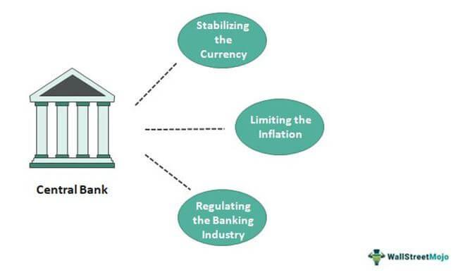

In the ever-evolving landscape of global finance, central banks are essential in shaping monetary policy and ensuring economic stability. These institutions, such as the U.S. Federal Reserve and the European Central Bank, exert significant influence over international financial systems through mechanisms such as interest rate adjustments and financial stability measures. The actions of central banks impact global markets, particularly through their role in currency management and as lenders of last resort during financial crises.

Alongside these pivotal financial institutions, algorithmic trading has emerged as a transformative force. Employing computer algorithms to automate and execute trading strategies, algorithmic trading enables rapid and precise trades, reducing human error and transaction costs. This technology, once primarily utilized by hedge funds, is now increasingly adopted by large financial institutions, including global banks, to enhance trading efficiency and performance.



This article explores the intricate interplay between major central banks, global financial institutions, and the role of algorithmic trading in modern finance. Understanding how these entities and technologies coalesce to drive international markets is crucial for both investors and policymakers. The fusion of these elements underscores the importance of staying informed about innovations and strategies that influence economic growth and stability. Readers will gain insight into the structure and influence of central banks, the rise of algorithmic trading, and their symbiotic relationship in shaping the future of financial markets.

## Table of Contents

## Understanding Major Central Banks

Central banks are fundamental institutions that bear the critical responsibility of formulating and implementing monetary policy, as well as ensuring the stability of the financial system. They are pivotal in maintaining economic stability and are integral to the overall health of a nation's economy. The most prominent players in this domain include the U.S. Federal Reserve, the European Central Bank, the Bank of England, the Bank of Japan, among others. Each of these institutions operates under unique mandates and frameworks, which influence how they interact with and affect both their domestic and the global economy.

The U.S. Federal Reserve (the Fed), for instance, is tasked with maximizing employment, stabilizing prices, and moderating long-term interest rates. Its decisions are highly influential, particularly because the U.S. dollar serves as the primary global reserve currency and is involved in a significant majority of international transactions. Thus, any adjustment in the Federal Reserve's policies, especially regarding interest rates, can have widespread implications, influencing currency valuations globally and affecting trade balances.

Similarly, the European Central Bank (ECB) aims to maintain price stability in the euro area by controlling inflation rates. The ECB’s policies significantly impact European Union member states and their trade partners. The Bank of England, with its longstanding history, focuses on maintaining monetary stability and overseeing financial regulations in the UK, while the Bank of Japan adopts measures primarily to combat deflation and stimulate economic growth.

These central banks exert control over monetary policy by adjusting interest rates—a primary tool used to either stimulate economic growth or cool down inflationary pressures. For example, lowering interest rates generally aims to encourage borrowing and investment, boosting economic activity, while raising rates can help contain inflation by reducing spending and borrowing. They also manage financial stability through measures such as banking oversight and microprudential regulations designed to prevent bank failures that could lead to broader economic crises.

In addition to monetary policy, central banks also play the crucial role of acting as lenders of last resort during times of financial distress. This function became particularly evident during the financial crises such as the 2008 financial meltdown, where central banks provided emergency [liquidity](/wiki/liquidity-risk-premium) support to financial institutions to prevent system-wide failures. By doing so, they help to stabilize the financial markets and restore confidence, underscoring their role as bulwarks against economic instability.

Furthermore, central banks are involved in currency management, which includes interventions in foreign exchange markets to stabilize or increase the value of their national currency relative to others. This can be crucial for countries experiencing excessive [volatility](/wiki/volatility-trading-strategies) or depreciations that could harm their trade competitiveness.

In summary, central banks are key players in shaping monetary policy and fostering economic stability. Through [interest rate](/wiki/interest-rate-trading-strategies) adjustments, financial stability measures, and acting as lenders of last resort, these institutions exert significant influence over global markets and economies, as exemplified by the pivotal role of the U.S. Federal Reserve in global currency valuations. Their operations reflect both their domestic priorities and their commitment to the broader international financial system.

## Algorithmic Trading: Transforming Financial Markets

Algorithmic trading, or algo trading, employs sophisticated computer algorithms to automate trading strategies, allowing for precise and rapid execution of trades. This approach has significantly transformed the financial markets by reducing the reliance on manual decision-making and minimizing human error. Initially garnering popularity among hedge funds, algo trading has since been widely adopted by large financial institutions, including global banks, seeking to enhance operational efficiency and mitigate potential risks associated with human intervention.

One of the primary benefits of [algorithmic trading](/wiki/algorithmic-trading) is the ability to implement complex strategies at a scale and speed unattainable by human traders. High-frequency trading ([HFT](/wiki/high-frequency-trading-strategies)) is a prominent algo trading strategy that capitalizes on ultra-fast execution to exploit minute price discrepancies. By conducting a large number of trades within microseconds, HFT firms aim to secure small, cumulative profits, thereby enhancing overall trading margins.

Statistical [arbitrage](/wiki/arbitrage) is another algorithmic strategy that utilizes quantitative models to identify pricing inefficiencies across different securities. By rapidly executing trades to exploit these inefficiencies, traders can achieve risk-adjusted returns that are not easily accessible through traditional trading methods.

Market making, another popular strategy, relies on algorithms to provide liquidity to financial markets by continuously quoting buy and sell prices for specific assets. This approach not only facilitates smoother market operations but also allows market makers to profit from the bid-ask spread, optimizing transaction costs for both the market maker and other participants.

The widespread adoption of algo trading is largely supported by advancements in data analytics and [machine learning](/wiki/machine-learning). These technologies enable the processing of vast amounts of financial data in real time, allowing for informed decision-making and timely execution of trades. Machine learning algorithms, in particular, can identify patterns and trends within the data, yielding insights that enhance predictive accuracy and refine trading strategies.

In Python, an example of a simple trading strategy implementation using moving averages is shown below:

```python
import pandas as pd
import numpy as np

# Sample data
data = {'prices': [100, 101, 102, 99, 98, 100, 102, 104]}
df = pd.DataFrame(data)

# Calculate moving averages
df['short_mavg'] = df['prices'].rolling(window=3).mean()
df['long_mavg'] = df['prices'].rolling(window=5).mean()

# Generate trading signals
df['signal'] = 0
df['signal'][3:] = np.where(df['short_mavg'][3:] > df['long_mavg'][3:], 1, -1)

# Display the DataFrame with signals
print(df)
```

This code demonstrates a simple moving average crossover strategy, where buy and sell signals are generated based on the crossover of short-term and long-term moving averages.

Ultimately, such automation empowers financial institutions to swiftly adapt to dynamic market conditions, leveraging both speed and precision in executing trades. As algorithmic trading continues to evolve, it holds the potential to further innovate and enhance the functionality of financial markets globally.

## Integration of Algorithmic Trading in Central Bank Operations

Central banks, traditionally characterized by their cautious approach towards new technologies, are recognizing the significant advantages offered by algorithmic trading. This technology has become integral for improving the management of their extensive financial portfolios and ensuring the precise execution of monetary policy. The essence of algorithmic trading lies in its ability to process vast amounts of data efficiently and execute trades with speed and accuracy, qualities that are invaluable for central banks operating in today's fast-paced financial environment.

Algorithmic trading assists central banks in conducting vital open market operations, a core component of monetary policy aimed at influencing short-term interest rates and liquidity in the economy. By automating the process, central banks can achieve greater precision and responsiveness in these operations. For instance, algorithms can rapidly adjust the buying and selling of government securities to manage liquidity effectively.

In managing currency reserves, algorithms offer enhanced decision-making capabilities. They can analyze market conditions in real time, helping central banks optimize the allocation and utilization of their foreign exchange reserves. By predicting exchange rate movements more accurately, central banks can better manage the risks associated with foreign currency fluctuations.

Furthermore, quantitative easing (QE) programs, which involve large-scale purchases of assets to inject liquidity into the economy, also benefit from algorithmic efficiencies. Algorithms can be programmed to execute asset purchases systematically, ensuring that the objectives of stabilizing financial markets and fostering economic growth are met with minimal disruption.

Beyond operational improvements, algorithmic tools offer predictive insights into market reactions to policy changes. By analyzing historical data and market sentiment, they can help forecast the potential impact of new policy measures, aiding central banks in crafting informed strategies that anticipate investor behavior and economic outcomes.

As financial markets continue to grow in complexity, the reliance on algorithmic insights by central banks to maintain stability and guide economic growth is expected to increase. The integration of these technologies represents a significant shift towards more data-driven and technology-enhanced operations in central banking, promising improved outcomes in monetary policy execution and financial system stability.

## Challenges and Opportunities

Algorithmic trading has profoundly transformed financial markets, offering unprecedented opportunities for efficiency and profitability. However, the adoption of these technologies is not without significant challenges. One of the foremost concerns is maintaining cybersecurity. As algorithmic systems deal with high-frequency trading data and execute numerous transactions within milliseconds, they become prime targets for cyber attacks. Securing these systems from potential threats requires robust cybersecurity measures to ensure the integrity and confidentiality of trading operations.

Additionally, the management of high-frequency data streams presents a complex challenge. The vast inflow of trading data, generated at incredibly high speeds, necessitates sophisticated data processing capabilities. This requires not only powerful computational resources but also innovative algorithms capable of processing and analyzing data in real-time. Technologies such as distributed computing and machine learning play a vital role in addressing these demands, enabling traders to discern patterns and make informed decisions without delay.

Compliance with regulatory standards poses another substantial hurdle for algorithmic trading. The opaque nature of algorithms can lead to skepticism and regulatory scrutiny. Regulators demand transparency in algorithmic trading systems to prevent market manipulation and ensure fairness. This necessitates the development of algorithms that are not only effective but also interpretable, allowing regulators and stakeholders to understand decision-making processes.

Despite these challenges, the potential for innovation within algorithmic trading is considerable. Advanced trading strategies and new financial instruments continue to emerge, offering financial institutions the chance to refine their operational methods. Successful integration of algorithmic trading solutions can yield substantial improvements in operational efficiency and decision-making processes. Furthermore, by embracing these technologies, central banks and financial institutions can cement their positions as pivotal actors within the global financial ecosystem. 

Overall, the challenges posed by algorithmic trading are significant but not insurmountable. With the proper investment in technology, security, and compliance, these challenges can be overcome, unlocking the vast opportunities that algorithmic trading presents for modern financial markets.

## Conclusion

The convergence of major central banks, global financial institutions, and algorithmic trading has ushered in a transformative phase in the dynamics of financial markets. Understanding how these entities collaborate and influence one another is essential for both investors and policymakers to navigate the intricacies of modern finance successfully. As technology continues to evolve, the role of algorithmic trading in central bank and institutional operations is expected to grow, prompting a need for ongoing innovation and adaptation.

Central banks, traditionally slow to adopt technological advancements, are increasingly recognizing the value of algorithmic trading for managing portfolios and executing monetary policies effectively. The integration of sophisticated algorithms into financial frameworks offers unprecedented opportunities for precise market interventions, efficient resource management, and enhanced decision-making processes. As these algorithms become more refined and capable of processing large datasets, they help financial institutions and central banks to quickly respond to market fluctuations and shifts.

This technological adaptation not only improves operational efficiency but also positions central banks and financial institutions to better capitalize on emerging market opportunities. The potential for growth and stability in the world economy is significantly enhanced as these financial powerhouses leverage algorithmic trading to optimize their activities and mitigate risks. Moreover, as regulatory standards evolve to accommodate technological changes, transparency and compliance will play a pivotal role in ensuring the sustainable integration of algorithmic trading in financial operations.

By embracing these advancements, central banks and global financial players can unlock new avenues for economic growth and maintain stability within the international financial ecosystem. The symbiotic relationship between technological innovation and traditional financial practices promises a future where economic resilience and opportunity are within reach for well-prepared financial institutions.

## References & Further Reading

[1]: Bernanke, B. (2005). ["The Global Saving Glut and the U.S. Current Account Deficit"](https://www.federalreserve.gov/boarddocs/speeches/2005/200503102/), Sandridge Lecture, Virginia Association of Economists, Richmond, Virginia. 

[2]: Cartea, Á., Jaimungal, S., & Penalva, J. (2015). ["Algorithmic and High-Frequency Trading."](https://assets.cambridge.org/97811070/91146/frontmatter/9781107091146_frontmatter.pdf) Cambridge University Press.

[3]: European Central Bank. (2010). ["The Monetary Policy of the ECB"](https://www.ecb.europa.eu/pub/pdf/other/monetarypolicy2011en.pdf).

[4]: Aldridge, I. (2013). ["High-Frequency Trading: A Practical Guide to Algorithmic Strategies and Trading Systems."](https://onlinelibrary.wiley.com/doi/pdf/10.1002/9781119203803.fmatter) John Wiley & Sons.

[5]: Federal Reserve. (2008). ["Monetary Policy Report" to Congress."](https://www.federalreserve.gov/monetarypolicy/files/20080715_mprfullreport.pdf)

[6]: Van der Heijden, T., Leeuwenburgh, O., & Redeker, D. (2020). ["Central Bank Digital Currencies and Algorithmic Monetary Policy: An Introduction."](https://www.semanticscholar.org/paper/HNF-HTPB-propellants%3A-Influence-of-HNF-particle-on-Heijden-Leeuwenburgh/82725348d97a43e4d4bc1a1e5347bd7a70de3da3)

[7]: Lo, A. W., & Mackinlay, A. C. (1999). ["A Non-Random Walk Down Wall Street."](https://www.jstor.org/stable/j.ctt7tccx) Princeton University Press.