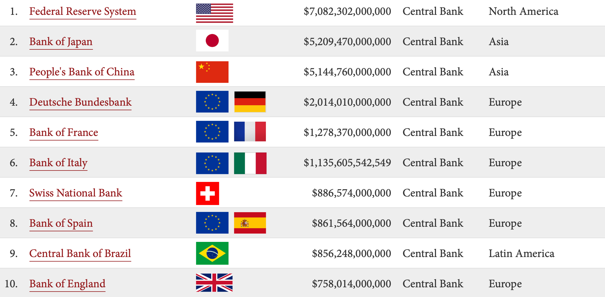

## Table of Contents

## What is a central bank?

A central bank is like a big boss bank for a country or a group of countries. It's in charge of making sure the money in the economy works well. The central bank controls things like how much money is out there, how much it costs to borrow money, and it tries to keep the economy stable so people can buy things and businesses can grow.

One of the main jobs of a central bank is to set interest rates. When the central bank changes these rates, it can make borrowing money cheaper or more expensive. This can help control inflation, which is when prices go up too fast. If the central bank sees that prices are going up too quickly, it might raise interest rates to slow things down. If the economy is not doing well, it might lower rates to help it grow.

Central banks also keep an eye on the whole financial system to make sure banks are safe and sound. They might step in to help if a bank is in trouble or if there's a big financial crisis. By doing all these things, central banks play a big role in keeping the economy running smoothly and helping people and businesses feel more secure about their money.

## What are the primary functions of a central bank?

A central bank has a few main jobs that help keep the economy running smoothly. One big job is to control the amount of money in the economy. They do this by setting interest rates, which is like the price people pay to borrow money. If the central bank thinks there's too much money around and prices are going up too fast, they might raise interest rates to slow things down. If the economy is not doing well and they want to help it grow, they might lower the rates to make borrowing cheaper.

Another important job of a central bank is to make sure the banking system is safe and sound. They keep an eye on other banks to make sure they're not taking too many risks. If a bank is in trouble, the central bank might step in to help. This helps prevent big problems that could hurt the whole economy. By doing these things, central banks try to keep the economy stable so people can buy things and businesses can grow without too many ups and downs.

Central banks also manage the country's money supply and foreign exchange reserves. This means they control how much of the country's currency is out there and how much foreign money they have. This is important for trading with other countries and keeping the value of their own money stable. All these jobs together help the central bank keep the economy on track and protect it from big shocks.

## How do central banks influence a country's economy?

Central banks have a big impact on a country's economy by controlling the amount of money in circulation and setting interest rates. When a central bank changes the [interest rate](/wiki/interest-rate-trading-strategies), it affects how much it costs for people and businesses to borrow money. If the central bank lowers the interest rate, borrowing becomes cheaper, which can encourage people to take out loans for things like buying a house or starting a business. This can help the economy grow because more money is being spent and invested. On the other hand, if the central bank raises the interest rate, borrowing becomes more expensive, which can slow down spending and help control inflation when prices are rising too quickly.

Central banks also keep the financial system stable by making sure banks are safe and sound. They watch over banks to make sure they're not taking too many risks that could lead to problems. If a bank is in trouble, the central bank can step in to help prevent a bigger crisis that could affect the whole economy. By doing this, central banks help build trust in the financial system, which is important for people and businesses to feel confident about saving and investing their money.

In addition to managing interest rates and overseeing banks, central banks handle the country's money supply and foreign exchange reserves. This means they control how much of the country's currency is available and how much foreign money they have. This is important for trading with other countries and keeping the value of their own money stable. By managing these aspects, central banks help make sure the economy can trade with the rest of the world smoothly and keep the value of money steady, which helps everyone from everyday shoppers to big businesses.

## What is the role of a central bank in monetary policy?

The central bank plays a big role in deciding the country's monetary policy. This means they control how much money is in the economy and how easy or hard it is to borrow money. They do this mainly by setting the interest rate. When the central bank lowers the interest rate, it becomes cheaper for people and businesses to borrow money. This can help the economy grow because more people will take out loans to buy things like houses or start businesses. If the central bank thinks the economy is growing too fast and prices are going up too quickly, they might raise the interest rate to make borrowing more expensive. This can slow down spending and help keep prices stable.

Another way the central bank influences monetary policy is by controlling the money supply. They can do this by buying or selling government bonds. When they buy bonds, they put more money into the economy, which can help it grow. When they sell bonds, they take money out of the economy, which can help slow it down. By doing these things, the central bank tries to keep the economy balanced, so it grows at a healthy pace without prices going up too fast. This helps make sure people can afford to buy things and businesses can plan for the future.

## Can you name some of the largest central banks in the world?

Some of the largest central banks in the world are the Federal Reserve in the United States, the European Central Bank, and the Bank of Japan. The Federal Reserve, often called the Fed, is responsible for the US economy. It sets interest rates and makes sure banks are safe. The European Central Bank looks after the economy of the countries that use the euro. It works to keep prices stable across these countries. The Bank of Japan manages Japan's money and tries to keep its economy growing smoothly.

Another big central bank is the People's Bank of China. It's in charge of China's money and helps the country's economy grow. The Bank of England is also important. It takes care of the UK's money and sets interest rates to keep the economy stable. These central banks have a big impact on their countries and the world because they control a lot of money and help keep their economies running well.

## How do central banks differ from commercial banks?

Central banks and commercial banks are different in what they do and how they work. A central bank is like the big boss of a country's money. It controls things like how much money is out there and sets the interest rates that everyone else follows. It also makes sure the whole financial system is safe and sound. For example, if a bank is in trouble, the central bank might step in to help. The main goal of a central bank is to keep the economy stable, so people can buy things and businesses can grow without too many ups and downs.

On the other hand, commercial banks are the ones people and businesses use every day. They take in money from people through savings accounts and give out loans to people who want to buy houses or start businesses. They also help people move money around by offering services like checking accounts and credit cards. Commercial banks make money by charging interest on the loans they give out and by fees for their services. Their main goal is to make a profit for their owners or shareholders, not to control the whole economy like a central bank does.

## What is the significance of central bank independence?

Central bank independence means that the central bank can make decisions about money and the economy without the government telling them what to do. This is important because it helps keep the economy stable. If the central bank can set interest rates and control the money supply without being influenced by politicians, they can focus on what's best for the economy in the long run. Politicians might want to change interest rates to help them win elections or to make people happy in the short term, but that can cause big problems later. By being independent, central banks can make tough decisions that might not be popular but are good for the economy over time.

Having an independent central bank also builds trust with people and businesses. When people know that the central bank is making decisions based on what's good for the economy, not on what politicians want, they feel more confident about saving and investing their money. This trust helps the economy grow because people are more likely to spend and invest when they think the money system is safe and stable. So, central bank independence is key to keeping the economy on track and making sure everyone can benefit from a strong and stable financial system.

## How do central banks manage inflation and interest rates?

Central banks manage inflation by controlling the amount of money in the economy and setting interest rates. When prices start to go up too fast, which is called inflation, the central bank might raise interest rates. This makes it more expensive for people and businesses to borrow money, so they spend less. When people spend less, prices don't go up as fast. On the other hand, if prices are not going up enough and the economy is slow, the central bank might lower interest rates. This makes borrowing cheaper, so people spend more, which can help the economy grow and push prices up a bit.

To set interest rates, central banks use a special rate called the "policy rate." This is the rate at which they lend money to other banks. When the policy rate goes up, other interest rates in the economy usually go up too. This makes it more expensive for everyone to borrow money. When the policy rate goes down, other rates usually go down as well, making borrowing cheaper. Central banks also watch other things like how much money is out there and how fast the economy is growing to decide if they need to change the interest rates. By doing all these things, central banks try to keep inflation at a level that's good for the economy, so prices don't go up too fast or too slow.

## What tools do central banks use to implement monetary policy?

Central banks use a few main tools to control the economy and keep it stable. One big tool is setting the interest rate, which they call the policy rate. This is the rate at which the central bank lends money to other banks. When the central bank raises this rate, it makes borrowing money more expensive for everyone, so people and businesses spend less. This can help slow down the economy if prices are going up too fast. If the economy is not doing well, the central bank might lower the policy rate to make borrowing cheaper, so people spend more and help the economy grow.

Another tool central banks use is called open market operations. This means they buy or sell government bonds. When the central bank buys bonds, they put more money into the economy, which can help it grow. When they sell bonds, they take money out of the economy, which can help slow it down. Central banks also have something called reserve requirements, which is the amount of money banks have to keep on hand. By changing these requirements, the central bank can control how much money banks can lend out. All these tools help central banks keep the economy balanced and prices stable.

## How do central banks respond to financial crises?

When there's a financial crisis, central banks step in to help calm things down and keep the economy from getting worse. They might lower interest rates to make borrowing money cheaper. This can encourage people and businesses to keep spending and investing, which helps the economy. Central banks also might buy government bonds or other assets to put more money into the economy. This is called quantitative easing, and it can help when normal ways of helping the economy aren't working well.

Central banks also work to make sure banks are safe during a crisis. They might give emergency loans to banks that are in trouble so they don't fail and cause bigger problems. This helps keep the financial system stable and stops people from losing trust in banks. By doing all these things, central banks try to stop the crisis from spreading and help the economy start to recover.

## What is the impact of central bank decisions on global financial markets?

Central bank decisions have a big impact on global financial markets because they control things like interest rates and the money supply. When a central bank changes its interest rates, it affects how much it costs to borrow money all over the world. If a big central bank like the Federal Reserve in the US raises interest rates, it can make the US dollar stronger. This might make it harder for other countries to sell their goods in the US because their products become more expensive. On the other hand, if the central bank lowers rates, it can make borrowing cheaper and encourage more spending and investment around the world.

Central banks also use tools like buying and selling government bonds to put more or less money into the economy. These actions can cause big changes in stock markets, bond markets, and currency values. For example, if a central bank starts buying a lot of bonds, it can push up bond prices and lower interest rates, which might make stocks go up because borrowing is cheaper. Investors all over the world watch what central banks do because their decisions can affect where they put their money and how much they can earn. So, central bank actions can create waves that move through the whole global financial system.

## How do central banks coordinate with each other internationally?

Central banks from different countries work together to keep the world's economy stable. They talk to each other a lot, especially during big meetings like the ones held by the Bank for International Settlements (BIS). At these meetings, they share information about what's happening in their own countries and discuss what they can do together to help the global economy. They might agree on things like setting similar interest rates or working together to help a country that's having financial trouble.

Sometimes, central banks also help each other out directly. For example, if one country is going through a crisis, other central banks might lend them money or buy their bonds to help them out. This kind of teamwork can stop problems in one country from spreading to others. By working together, central banks can make sure that the global financial system stays strong and that everyone can benefit from a stable economy.

## Major Central Banks

Central banks are fundamental institutions that bear the critical responsibility of formulating and implementing monetary policy, as well as ensuring the stability of the financial system. They are pivotal in maintaining economic stability and are integral to the overall health of a nation's economy. The most prominent players in this domain include the U.S. Federal Reserve, the European Central Bank, the Bank of England, the Bank of Japan, among others. Each of these institutions operates under unique mandates and frameworks, which influence how they interact with and affect both their domestic and the global economy.

The U.S. Federal Reserve (the Fed), for instance, is tasked with maximizing employment, stabilizing prices, and moderating long-term interest rates. Its decisions are highly influential, particularly because the U.S. dollar serves as the primary global reserve currency and is involved in a significant majority of international transactions. Thus, any adjustment in the Federal Reserve's policies, especially regarding interest rates, can have widespread implications, influencing currency valuations globally and affecting trade balances.

Similarly, the European Central Bank (ECB) aims to maintain price stability in the euro area by controlling inflation rates. The ECB’s policies significantly impact European Union member states and their trade partners. The Bank of England, with its longstanding history, focuses on maintaining monetary stability and overseeing financial regulations in the UK, while the Bank of Japan adopts measures primarily to combat deflation and stimulate economic growth.

These central banks exert control over monetary policy by adjusting interest rates—a primary tool used to either stimulate economic growth or cool down inflationary pressures. For example, lowering interest rates generally aims to encourage borrowing and investment, boosting economic activity, while raising rates can help contain inflation by reducing spending and borrowing. They also manage financial stability through measures such as banking oversight and microprudential regulations designed to prevent bank failures that could lead to broader economic crises.

In addition to monetary policy, central banks also play the crucial role of acting as lenders of last resort during times of financial distress. This function became particularly evident during the financial crises such as the 2008 financial meltdown, where central banks provided emergency [liquidity](/wiki/liquidity-risk-premium) support to financial institutions to prevent system-wide failures. By doing so, they help to stabilize the financial markets and restore confidence, underscoring their role as bulwarks against economic instability.

Furthermore, central banks are involved in currency management, which includes interventions in foreign exchange markets to stabilize or increase the value of their national currency relative to others. This can be crucial for countries experiencing excessive [volatility](/wiki/volatility-trading-strategies) or depreciations that could harm their trade competitiveness.

In summary, central banks are key players in shaping monetary policy and fostering economic stability. Through [interest rate](/wiki/interest-rate-trading-strategies) adjustments, financial stability measures, and acting as lenders of last resort, these institutions exert significant influence over global markets and economies, as exemplified by the pivotal role of the U.S. Federal Reserve in global currency valuations. Their operations reflect both their domestic priorities and their commitment to the broader international financial system.

## References & Further Reading

[1]: Bernanke, B. (2005). ["The Global Saving Glut and the U.S. Current Account Deficit"](https://www.federalreserve.gov/boarddocs/speeches/2005/200503102/), Sandridge Lecture, Virginia Association of Economists, Richmond, Virginia. 

[2]: Cartea, Á., Jaimungal, S., & Penalva, J. (2015). ["Algorithmic and High-Frequency Trading."](https://assets.cambridge.org/97811070/91146/frontmatter/9781107091146_frontmatter.pdf) Cambridge University Press.

[3]: European Central Bank. (2010). ["The Monetary Policy of the ECB"](https://www.ecb.europa.eu/pub/pdf/other/monetarypolicy2011en.pdf).

[4]: Aldridge, I. (2013). ["High-Frequency Trading: A Practical Guide to Algorithmic Strategies and Trading Systems."](https://onlinelibrary.wiley.com/doi/pdf/10.1002/9781119203803.fmatter) John Wiley & Sons.

[5]: Federal Reserve. (2008). ["Monetary Policy Report" to Congress."](https://www.federalreserve.gov/monetarypolicy/files/20080715_mprfullreport.pdf)

[6]: Van der Heijden, T., Leeuwenburgh, O., & Redeker, D. (2020). ["Central Bank Digital Currencies and Algorithmic Monetary Policy: An Introduction."](https://www.semanticscholar.org/paper/HNF-HTPB-propellants%3A-Influence-of-HNF-particle-on-Heijden-Leeuwenburgh/82725348d97a43e4d4bc1a1e5347bd7a70de3da3)

[7]: Lo, A. W., & Mackinlay, A. C. (1999). ["A Non-Random Walk Down Wall Street."](https://www.jstor.org/stable/j.ctt7tccx) Princeton University Press.