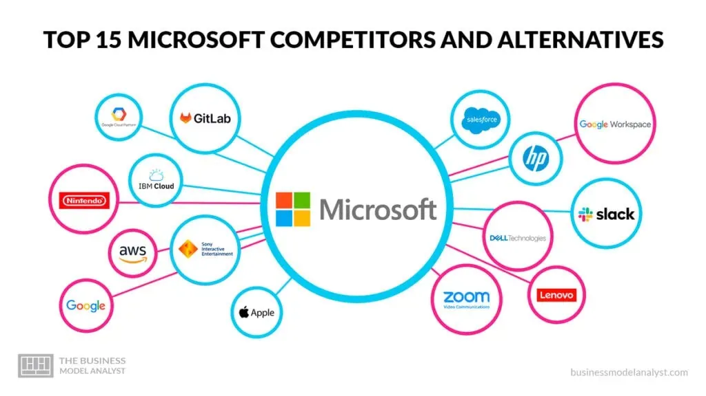

## Table of Contents

## What are Microsoft's main business areas?

Microsoft's main business areas are split into three big parts: productivity and business processes, intelligent cloud, and more personal computing. The productivity and business part includes things like Office, which many people use for work and school. It also has LinkedIn, a website where people find jobs and connect with others in their field. This part helps businesses and people work better and stay organized.

The intelligent cloud part is all about Microsoft's cloud services, like Azure. This is where companies can store their data and use Microsoft's computers to run their own software. It's a big deal because more and more businesses are moving their data to the cloud. This part also includes some server products that help businesses manage their systems.

The more personal computing part covers things like Windows, the operating system on many computers, and Xbox, which is for gaming. It also includes devices like Surface tablets and PCs. This part is about making technology that people use every day, both for fun and for getting things done.

## Who are the primary competitors in Microsoft's operating systems market?

In the operating systems market, Microsoft's main competitor is Apple with its macOS. macOS is used on Apple's Mac computers and laptops. It's known for being user-friendly and having a sleek design. Many people who like Apple's other products, like iPhones and iPads, choose macOS because it works well with them. Microsoft's Windows, on the other hand, is used on a much wider range of computers from different makers. This makes Windows more common in homes and offices around the world.

Another big competitor is Linux, but it's different because it's open-source. This means anyone can change and share Linux for free. Linux is popular with tech-savvy users and businesses that need a lot of control over their computers. It's not as easy to use as Windows or macOS, but it's very flexible. Some versions of Linux, like Ubuntu, try to be more user-friendly to attract more people. Even though Linux isn't as widely used as Windows or macOS, it's still an important player in the operating system market.

## Which companies compete with Microsoft in the productivity software sector?

In the productivity software sector, Microsoft's main competitor is Google. Google has a suite of tools called Google Workspace, which includes things like Google Docs, Sheets, and Slides. These tools are similar to Microsoft's Word, Excel, and PowerPoint. Google's big advantage is that everything works in the cloud, so you can easily share and work on documents with others online. Many schools and small businesses like Google's tools because they're free or cheap and easy to use on any device.

Another big competitor is Apple with its iWork suite, which includes Pages, Numbers, and Keynote. These are Apple's versions of word processing, spreadsheet, and presentation software. iWork works best on Apple's own devices like Macs, iPads, and iPhones. It's known for being simple and easy to use, which appeals to people who already use other Apple products. While iWork isn't as widely used as Microsoft's Office or Google Workspace, it's still important for people in the Apple ecosystem.

There are also smaller companies like Zoho and LibreOffice that compete with Microsoft. Zoho offers a suite of online tools similar to Google Workspace, but it's often used by small businesses looking for affordable options. LibreOffice is free and open-source, which means anyone can use it without paying and even change the software if they want to. It's popular among people who want to avoid paying for software and those who like to customize their tools. While these companies are smaller than Microsoft, Google, and Apple, they still provide options for different kinds of users.

## Who are Microsoft's rivals in the cloud computing industry?

In the cloud computing industry, Microsoft's biggest rival is Amazon with its Amazon Web Services (AWS). AWS started the cloud computing trend and is still the leader. Many big companies use AWS because it has a lot of different services and is very reliable. AWS is known for being easy to use and having a lot of options for storing data and running software. This makes it a strong competitor to Microsoft's Azure.

Another important rival is Google with Google Cloud Platform. Google Cloud is known for being good at handling big data and doing advanced computing tasks. It's popular with companies that need to analyze a lot of information quickly. Google Cloud also works well with other Google products, which can be a big plus for businesses already using Google's tools. While Google Cloud isn't as big as AWS or Azure, it's growing fast and is a serious competitor.

There are also other players in the cloud computing market, like IBM and Oracle. IBM's cloud services focus on helping big businesses and governments, offering strong security and support. Oracle's cloud is known for its database services, which are important for companies that need to manage a lot of data. While these companies aren't as big as Microsoft, Amazon, or Google in the cloud market, they still compete and offer specialized services that some businesses prefer.

## What are the key competitors in Microsoft's gaming division?

In the gaming world, Microsoft's biggest rival is Sony with its PlayStation. Sony's PlayStation has been around for a long time and has a lot of fans. People like the PlayStation because it has great games and good graphics. Sony also makes the PlayStation easy to use and adds new features that gamers enjoy. Microsoft's Xbox competes with the PlayStation by offering strong online services like Xbox Live and a growing list of exclusive games. Both companies are always trying to make their consoles better and attract more gamers.

Another big competitor is Nintendo. Nintendo is different because it focuses on fun and family-friendly games. Its consoles, like the Nintendo Switch, are popular because they're easy to take with you and play anywhere. Nintendo's games, like Mario and Zelda, are loved by people of all ages. Microsoft's Xbox doesn't compete directly with Nintendo in the same way it does with Sony, but it still has to think about how to attract gamers who might also be interested in Nintendo's unique style of gaming.

There are also smaller gaming companies and PC gaming that Microsoft has to keep an eye on. Companies like Valve, with its Steam platform, offer a lot of games for people who play on computers. PC gaming is big because you can often get better graphics and more control over your games. Microsoft has its own PC gaming service called Xbox Game Pass for PC, which helps it compete in this space. While these aren't direct console competitors, they still play a big role in the overall gaming market that Microsoft is part of.

## How does competition in the enterprise software market affect Microsoft?

Competition in the enterprise software market pushes Microsoft to keep improving its products. Other big companies like Salesforce, SAP, and Oracle offer software that helps businesses manage their work. These companies are always coming out with new features and better ways to help businesses. So, Microsoft has to keep up by making its own software, like Dynamics 365, even better. If Microsoft doesn't keep improving, businesses might choose to use software from these other companies instead.

This competition also means Microsoft has to listen to what businesses want and need. If a lot of businesses start using Salesforce because it's easier to use, Microsoft might need to make its software simpler too. Or if SAP has better tools for managing a company's money, Microsoft might need to add those kinds of tools to its own software. By paying attention to what its competitors are doing and what businesses are asking for, Microsoft can stay a strong player in the enterprise software market.

## What strategies do Microsoft's competitors use to challenge its market position?

Microsoft's competitors use different strategies to challenge its position in the market. One big strategy is to offer products that are cheaper or even free. For example, Google gives away its productivity tools like Google Docs for free to people and small businesses. This makes it hard for Microsoft to sell its Office software, which costs money. By offering free or low-cost options, competitors can attract users who might not want to pay for Microsoft's products.

Another strategy is to focus on making their products easier to use or better in specific ways. Apple, for example, makes its macOS and iWork suite very simple and nice to look at. This appeals to people who like easy-to-use technology. Also, companies like Salesforce and SAP add special features to their enterprise software that businesses really need. By making their products better in certain areas, competitors can pull customers away from Microsoft.

Some competitors also try to be more flexible or open. Linux, for instance, is open-source, which means anyone can change and share it. This is attractive to tech-savvy users and companies that want more control over their software. In the cloud computing space, Amazon's AWS and Google Cloud offer a lot of different services that businesses can pick and choose from. By being more flexible and open, these competitors can challenge Microsoft's more closed systems.

## How has the competition in the search engine market impacted Microsoft's Bing?

Competition in the search engine market has made it tough for Microsoft's Bing. The biggest competitor is Google, which is used by most people around the world. Google has been around for a long time and keeps getting better at finding what people are looking for. Because so many people use Google, websites want to show up in Google's search results, which makes Google even better. Bing has to work hard to make its search results just as good or better to get people to use it instead of Google.

Bing tries to stand out by doing things differently. For example, it puts a lot of effort into making its search results look nice and easy to understand. Bing also tries to be good at certain types of searches, like shopping or travel, to attract people who might need help with those things. Even though Bing has made some progress, it's still hard for it to get a lot more users because Google is so popular. But Bing keeps trying new things and improving to stay in the game.

## What are the emerging threats to Microsoft in the AI and machine learning fields?

In the AI and [machine learning](/wiki/machine-learning) fields, Microsoft faces new challenges from companies like OpenAI and Google. OpenAI, which Microsoft has worked with, is becoming a big name on its own. They're making AI tools that can do a lot of different things, like writing stories or answering questions. If OpenAI keeps getting better and more people start using their tools, it could make it harder for Microsoft to stay ahead in AI. Google is also a big threat because they're always working on new AI projects. They have a lot of smart people and a lot of data to help their AI learn and improve. If Google comes up with new AI tools that are better than what Microsoft has, it could make Microsoft's AI look less good.

Another emerging threat comes from smaller, fast-growing AI companies. These companies, like xAI and Anthropic, are working on new ways to use AI. They're trying to make AI that can think and solve problems in new ways. If these smaller companies come up with something really good, big businesses might start using their AI instead of Microsoft's. Also, there's a lot of talk about how AI can be used in different areas, like health care or self-driving cars. If other companies start using AI in these new areas before Microsoft does, it could make it harder for Microsoft to catch up. So, Microsoft needs to keep working on its AI to stay ahead of these new threats.

## How do open-source software initiatives pose a challenge to Microsoft?

Open-source software initiatives challenge Microsoft because they offer free alternatives to Microsoft's paid products. For example, Linux is a free operating system that anyone can use and change. This is different from Windows, which people have to pay for. When people and businesses can get software for free, they might choose not to buy Microsoft's products. Also, open-source projects like LibreOffice give people free tools that work like Microsoft Office. This can make it harder for Microsoft to sell its software, especially to people who don't want to spend money.

Another way open-source software challenges Microsoft is by being very flexible. Because open-source software can be changed by anyone, it can be made to fit exactly what a user needs. This is attractive to tech-savvy users and businesses that want control over their software. Microsoft's software, on the other hand, is more closed and can't be changed as easily. So, if people want software that they can customize a lot, they might choose open-source options over Microsoft's products. This makes Microsoft have to work harder to keep its customers happy and show that its software is worth paying for.

## What role do acquisitions and mergers play in the competitive landscape for Microsoft?

Acquisitions and mergers help Microsoft stay ahead in the tech world. When Microsoft buys other companies, it can add new technology and skills to its own business. For example, Microsoft bought LinkedIn, which helped it get better at social networking and job searching. Buying other companies also helps Microsoft grow faster. Instead of building new products from scratch, Microsoft can use what the other company already has. This makes it harder for competitors to catch up because Microsoft keeps adding new things to its business.

These deals also help Microsoft stop its competitors from growing. If Microsoft buys a company that makes a popular product, other companies can't buy that company and use its product to compete against Microsoft. This happened when Microsoft bought GitHub, a place where people share and work on code. By owning GitHub, Microsoft can make it better and keep it away from other companies that might want to use it. So, acquisitions and mergers are a big part of how Microsoft keeps its strong position in the market and makes it tough for other companies to challenge it.

## How does Microsoft's competition vary across different global markets?

Microsoft's competition changes depending on where you look in the world. In the United States, Microsoft faces strong competition from companies like Google, Apple, and Amazon. Google challenges Microsoft with its search engine and productivity tools, while Apple competes in the operating system and gaming markets. Amazon is a big rival in cloud computing with AWS. These companies are well-known and have a lot of users in the U.S., so Microsoft has to work hard to keep its customers happy and offer better products.

In other parts of the world, the competition can be different. In Europe, for example, Microsoft also faces competition from local companies like SAP in the enterprise software market. SAP is popular in Europe because it has been around for a long time and many businesses there use its software. In Asia, companies like Tencent and Alibaba challenge Microsoft in areas like cloud computing and gaming. These companies are big in their home countries and are growing quickly, so Microsoft needs to keep improving its products to stay ahead in these markets.

## Microsoft and its Key Competitors

Microsoft faces intense competition from several industry leaders, each vying for dominance across multiple technology sectors. Among its key competitors, Apple, Google, SAP SE, IBM, and Oracle stand out as formidable rivals. These companies are not only technologically advanced but also highly innovative, pushing boundaries in both software and hardware development.

Apple competes directly with Microsoft in personal computing and mobile operating systems. With products like the macOS and iOS, Apple offers a strong alternative to Microsoft's Windows and mobile solutions. Furthermore, Apple's robust ecosystem of devices and services, including the iPhone, iPad, and the App Store, creates a seamless user experience, challenging Microsoft's market presence.

Google presents another significant challenger, mainly through its dominance in web services, search engine technology, and cloud computing. Google Cloud competes with Microsoft's Azure, both vying for leadership in the cloud service industry. Google's Android operating system also competes with Microsoft's Windows in the mobile and tablet markets.

SAP SE, with its enterprise resource planning (ERP) software and database management systems, competes with Microsoft's software solutions aimed at the business and enterprise sectors. SAP's specialization in enterprise applications gives it an edge in certain industries, challenging Microsoft's business-focused applications like Microsoft Dynamics 365.

IBM is a longstanding competitor, particularly in the enterprise services market and cloud computing. IBM's focus on [artificial intelligence](/wiki/ai-artificial-intelligence) with Watson and its comprehensive suite of enterprise solutions competes head-on with Microsoft's offerings in data analytics and business intelligence.

Oracle stands as a major rival in the database management and cloud infrastructure sectors. Oracle's database systems and cloud services are direct competitors to Microsoft's SQL Server and Azure, posing significant competition in managing large-scale data environments.

Microsoft's diverse product line keeps it engaged across these competitive fronts. From its flagship Windows operating systems and Office productivity suite to cloud services via Azure, Microsoft remains a versatile player. This breadth of offerings requires Microsoft to continuously innovate and adapt, ensuring it stays competitive against these tech giants. Such dynamism and diversity enable Microsoft to maintain its position as a leading force in the technology sector.

## References & Further Reading

[1]: Bergstra, J., Bardenet, R., Bengio, Y., & Kégl, B. (2011). ["Algorithms for Hyper-Parameter Optimization."](https://dl.acm.org/doi/10.5555/2986459.2986743) Advances in Neural Information Processing Systems 24.

[2]: ["Advances in Financial Machine Learning"](https://www.amazon.com/Advances-Financial-Machine-Learning-Marcos/dp/1119482089) by Marcos Lopez de Prado

[3]: ["Evidence-Based Technical Analysis: Applying the Scientific Method and Statistical Inference to Trading Signals"](https://www.amazon.com/Evidence-Based-Technical-Analysis-Scientific-Statistical/dp/0470008741) by David Aronson

[4]: ["Machine Learning for Algorithmic Trading"](https://github.com/stefan-jansen/machine-learning-for-trading) by Stefan Jansen

[5]: ["Quantitative Trading: How to Build Your Own Algorithmic Trading Business"](https://www.amazon.com/Quantitative-Trading-Build-Algorithmic-Business/dp/1119800064) by Ernest P. Chan