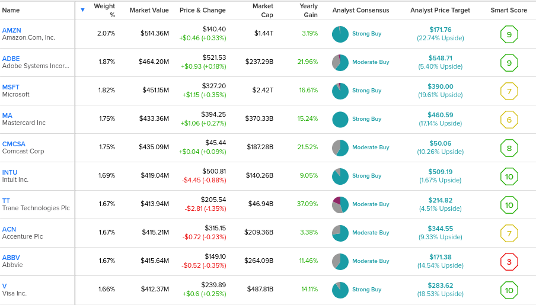

## Table of Contents

## What are ETFs and how do they work?

ETFs, or Exchange-Traded Funds, are a type of investment that works a lot like a mutual fund but trades on a stock exchange like a stock. You can buy and sell ETFs throughout the day at the current market price. ETFs usually aim to track the performance of a specific index, like the S&P 500, a sector, like technology, or even a commodity, like gold. This means if you invest in an ETF that tracks the S&P 500, your investment will go up or down based on how the S&P 500 performs.

When you buy shares of an ETF, you're actually buying a small piece of all the investments inside the ETF. This is great because it lets you diversify your investments easily without having to buy each stock or asset individually. ETFs are managed by professionals who make sure the ETF closely follows its target index or sector. This makes ETFs a popular choice for people who want to invest in the market but don't want to spend a lot of time picking individual stocks.

## What are dividend-paying ETFs?

Dividend-paying ETFs are a type of ETF that focuses on investing in companies that pay dividends. Dividends are payments made by a company to its shareholders, usually from its profits. When you invest in a dividend-paying ETF, you get to earn a part of these dividends. These ETFs can be a good choice if you're looking for a steady income from your investments, because they often pay out dividends regularly, like every month or every quarter.

These ETFs work by holding a collection of dividend-paying stocks. The [ETF](/wiki/etf-trading-strategies) manager picks stocks that have a history of paying good dividends and manages the fund to keep it focused on income generation. The dividends collected from these stocks are then distributed to the ETF's shareholders. This means you can enjoy the benefits of dividend income without having to pick individual stocks yourself. It's a simple way to get a regular income while also spreading your risk across many different companies.

## How do monthly dividend-paying ETFs differ from quarterly or annual ones?

Monthly dividend-paying ETFs are different from quarterly or annual ones because they pay out dividends every month instead of every three months or once a year. This can be good if you need a regular income from your investments. With monthly dividends, you get money more often, which can help with planning your budget or spending.

Quarterly and annual dividend-paying ETFs, on the other hand, pay out less often. Quarterly ETFs give you dividends every three months, and annual ETFs pay once a year. These might be better if you don't need the money right away and are okay with getting it less frequently. The choice between monthly, quarterly, or annual depends on what works best for your financial needs and how often you want to receive income from your investments.

## Why might someone choose to invest in monthly dividend-paying ETFs?

Someone might choose to invest in monthly dividend-paying ETFs because they want a regular income that comes every month. This can be really helpful for people who are retired or need money to cover their monthly expenses. Getting dividends every month helps them plan their budget better and know exactly when the money will come in.

Another reason is that monthly dividends can be reinvested more often. This means you can use the dividends to buy more shares of the ETF each month, which can help your investment grow faster over time. This is called compounding, and it can make a big difference in how much your investment grows in the long run.

## What are the benefits of receiving dividends monthly?

Receiving dividends every month can really help with planning your money. If you need money to pay bills or buy things every month, getting dividends monthly means you have a regular amount coming in. This can make it easier to know how much money you'll have and when you'll get it. It's like having a steady paycheck from your investments, which can be a big help if you're retired or just want to make sure you have money coming in all the time.

Another good thing about monthly dividends is that you can use them to buy more of the investment more often. This is called reinvesting, and it can help your money grow faster. When you get dividends every month, you can use that money to buy more shares right away. Over time, this can add up and make your investment bigger because you're [earning](/wiki/earning-announcement) on more and more shares. It's like planting a seed and watching it grow into a bigger and bigger tree.

## How can one identify monthly dividend-paying ETFs?

To find monthly dividend-paying ETFs, you can start by looking at websites that list ETFs and their details. Websites like Morningstar, ETF.com, or your broker's website often have search tools where you can filter ETFs by how often they pay dividends. Just type in "monthly" in the dividend frequency filter, and you'll see a list of ETFs that pay out every month. This makes it easy to find what you're looking for without having to look through lots of different ETFs.

Once you have a list of monthly dividend-paying ETFs, you can look at other details like how much they cost to own, what kinds of companies they invest in, and how well they've done in the past. This helps you pick the right ETF for you. Some ETFs might focus on different things, like big companies that pay good dividends or smaller companies that might grow faster. By checking all these details, you can find an ETF that fits your needs and gives you the monthly income you're looking for.

## What are some popular monthly dividend-paying ETFs available in the market?

Some popular monthly dividend-paying ETFs that people like to invest in are the JPMorgan Equity Premium Income ETF (JEPI) and the Global X SuperDividend ETF (SDIV). JEPI tries to give investors a good income every month by [picking](/wiki/asset-class-picking) stocks that pay dividends and also using options to boost the income. It's a favorite because it aims to give you a steady income while also trying to keep your money safe. SDIV, on the other hand, focuses on giving you a high dividend yield by investing in companies from all over the world that pay big dividends. This ETF can be good if you want to spread your investments across different countries and get a high income.

Another popular choice is the iShares Monthly Income ETF (XTR). This ETF is made for Canadian investors and it mixes different types of income-producing investments, like stocks and bonds, to give you a monthly income. It's a good pick if you live in Canada and want a simple way to get a regular income from your investments. All these ETFs are easy to find and buy if you have an account with a broker, and they can help you get a steady income every month.

## What are the risks associated with investing in monthly dividend-paying ETFs?

Investing in monthly dividend-paying ETFs can be a good way to get regular income, but there are some risks you should know about. One big risk is that the value of the ETF can go down. Even though you're getting dividends every month, the price of the ETF itself can drop if the companies it invests in do badly. This means you could lose money if you need to sell your shares when the price is low. Another risk is that the dividends might not stay the same. Companies can change how much they pay in dividends, and if they cut their dividends, the ETF's dividends could go down too. This could mean less money coming in every month than you expected.

Another thing to think about is the fees you have to pay to own the ETF. These fees can eat into your returns over time, making your investment worth less than you might hope. Also, if the ETF focuses on certain types of companies or industries, it might not be as spread out as you'd like. If those companies or industries do badly, the ETF could suffer more than one that's more diversified. So, while monthly dividend-paying ETFs can give you a steady income, it's important to think about these risks and how they might affect your investment goals.

## How does the performance of monthly dividend-paying ETFs compare to other investment options?

The performance of monthly dividend-paying ETFs can vary a lot when compared to other investment options like stocks, bonds, or mutual funds. These ETFs often aim to give you a steady income every month, which can be good if you need money regularly. But, they might not grow as fast as some stocks or other ETFs that don't pay dividends. That's because the companies in the ETF might be more focused on paying dividends than growing their business. Also, the fees you pay to own the ETF can take away some of your returns, making the overall growth less than other investments.

On the other hand, monthly dividend-paying ETFs can be safer than investing in single stocks because they spread your money across many different companies. This can help reduce the risk if one company does badly. But, they might not be as safe as bonds, which usually promise to pay you back your money plus interest. Bonds can give you a steady income too, but usually less than what you might get from dividend ETFs. So, choosing between monthly dividend-paying ETFs and other options depends on what you want from your investments, like more growth, less risk, or regular income.

## What are the tax implications of investing in monthly dividend-paying ETFs?

When you invest in monthly dividend-paying ETFs, you need to think about how taxes will affect your money. The dividends you get every month are usually considered taxable income. This means you have to pay taxes on them, just like you would on money you earn from a job. The tax rate you pay can depend on how much money you make overall and what kind of dividends you're getting. Some dividends might be taxed at a lower rate if they are qualified dividends, but you'll need to check with a tax professional to know for sure.

Another thing to consider is that if you sell your shares of the ETF, you might have to pay capital gains tax. This tax is based on how much your investment has grown since you bought it. If you've held the ETF for more than a year, you might pay a lower long-term capital gains tax rate. But if you sell it within a year, you'll pay a higher short-term capital gains tax rate, which is the same as your regular income tax rate. It's a good idea to talk to a tax advisor to understand all the tax rules and how they apply to your situation, so you can plan your investments wisely.

## How should one evaluate the fees and expenses of monthly dividend-paying ETFs?

When you're thinking about investing in monthly dividend-paying ETFs, it's really important to look at the fees and expenses. These ETFs charge something called an expense ratio, which is a yearly fee you pay just for owning the ETF. This fee is taken out of the ETF's assets, so it can make your investment worth less over time. To find out if the fees are too high, you can compare the expense ratio of different ETFs. A lower expense ratio means you keep more of your money, which is good. You can usually find this information on the ETF's website or on financial websites like Morningstar or your broker's site.

Another thing to think about is any other costs that might come up, like trading fees if you buy or sell the ETF through a broker. Some brokers charge you every time you trade, while others let you trade for free. Also, watch out for any extra fees the ETF might have, like management fees or fees for buying and selling the stocks inside the ETF. All these costs can add up and take away from the money you're getting from dividends. So, it's smart to look at all the fees and expenses before you decide to invest, to make sure you're getting a good deal.

## What advanced strategies can be used to optimize returns from monthly dividend-paying ETFs?

One advanced strategy to optimize returns from monthly dividend-paying ETFs is dividend reinvestment. When you get your monthly dividends, instead of spending them, you can use them to buy more shares of the ETF. This is called dividend reinvestment, and it can help your investment grow faster over time. The more shares you own, the more dividends you get, which you can then reinvest again. This cycle can lead to bigger returns because you're earning on a growing number of shares. Many brokers offer automatic dividend reinvestment plans, which makes it easy to do without having to think about it every month.

Another strategy is to use a technique called tax-loss harvesting. This means selling some of your ETF shares at a loss to reduce the taxes you owe on your gains. You can then buy back similar ETFs to keep your investment strategy the same. By doing this, you can lower your tax bill, which means you get to keep more of your money. It's a bit tricky, so you might want to talk to a tax advisor to make sure you're doing it right. But if you do it well, it can help you keep more of your returns from the ETFs.

A third strategy is to diversify your monthly dividend-paying ETFs across different sectors or regions. Instead of putting all your money into one ETF, you can spread it out across several ETFs that focus on different areas, like technology, healthcare, or international stocks. This way, if one sector or region does badly, the others might do better and help balance out your returns. Diversifying can help lower your risk and make your overall returns more stable over time.
## Monthly Dividend ETFs

Many investors prioritize regular income from their investments, and monthly dividend Exchange-Traded Funds (ETFs) have garnered significant attention in recent years for this reason. Unlike traditional dividend-paying ETFs, which typically distribute dividends on a quarterly or semi-annual basis, monthly dividend ETFs disburse income each month. This frequency can help investors better manage cash flow needs, providing a steady income stream that can be especially beneficial for retirees or those relying on investment income for regular expenses. Additionally, the frequent dividend payments allow investors to reinvest their dividends more frequently, potentially enhancing overall returns through compounding.

Monthly dividend ETFs have been designed to meet the needs of income-focused investors by holding a diversified portfolio of dividend-paying assets. The consistent income from these ETFs can serve as a cornerstone for a variety of financial goals, such as supplementing retirement income or providing funds for other immediate financial needs.

Two of the most popular monthly dividend ETFs are the Global X SuperDividend ETF (SDIV) and the Invesco Preferred ETF (PGX), both of which offer insights into the structure and performance expected from such funds:

1. **Global X SuperDividend ETF (SDIV):** SDIV seeks to provide high income by investing in 100 of the highest dividend-yielding equity securities globally. This diversification across countries and sectors aims to reduce risks associated with reliance on any single country or industry. The ETF's focus is on equities offering substantial dividends, making it attractive for investors eager for a higher yield. Moreover, the global nature of its holdings aids in distributing risk across various economic regions.

2. **Invesco Preferred ETF (PGX):** PGX is another prominent monthly dividend ETF, primarily investing in preferred securities. Preferred stocks often pay higher dividends than common stocks and exhibit less volatility, characteristic features leveraged by PGX to provide a stable dividend payout. An essential part of the ETF's strategy is to focus on the financial sector, which is where a significant portion of preferred securities is issued. This concentrated sector exposure can affect the fund's risk and return profile, particularly in fluctuating interest rate climates, yet it offers potential benefits from its usually higher yields.

These ETFs are structured to balance the need for regular income with the diversification imperative, reducing single-stock risk while capitalizing on diverse economic sectors. By incorporating monthly dividend ETFs, investors can aim to build a cash flow-oriented investment portfolio, enjoying both immediate income and potential capital appreciation.

Investors considering monthly dividend ETFs should evaluate factors such as the expense ratio, the sustainability of dividend yields, and the underlying asset quality. Understanding these components helps ensure that the ETFs chosen align with an investor's risk tolerance and financial objectives. By doing so, they can effectively utilize monthly dividend ETFs as a practical component of their broader investment strategy.

## References & Further Reading

[1]: Bergstra, J., Bardenet, R., Bengio, Y., & Kégl, B. (2011). ["Algorithms for Hyper-Parameter Optimization."](https://papers.nips.cc/paper/4443-algorithms-for-hyper-parameter-optimization) Advances in Neural Information Processing Systems 24.

[2]: ["Advances in Financial Machine Learning"](https://www.amazon.com/Advances-Financial-Machine-Learning-Marcos/dp/1119482089) by Marcos Lopez de Prado

[3]: ["Evidence-Based Technical Analysis: Applying the Scientific Method and Statistical Inference to Trading Signals"](https://www.amazon.com/Evidence-Based-Technical-Analysis-Scientific-Statistical/dp/0470008741) by David Aronson

[4]: ["Machine Learning for Algorithmic Trading"](https://github.com/stefan-jansen/machine-learning-for-trading) by Stefan Jansen

[5]: ["Quantitative Trading: How to Build Your Own Algorithmic Trading Business"](https://www.amazon.com/Quantitative-Trading-Build-Algorithmic-Business/dp/1119800064) by Ernest P. Chan