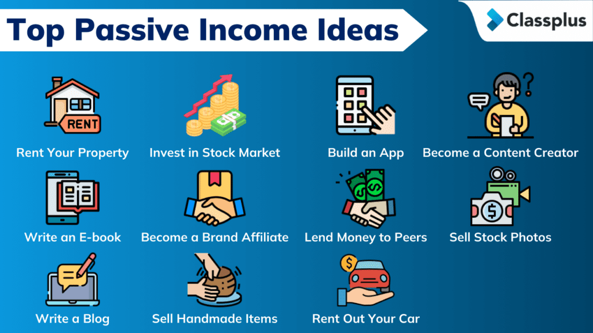

## Table of Contents

## What is passive income and why is it important in 2024?

Passive income is money you earn without having to work actively for it every day. This can come from things like rental properties, stock dividends, or online businesses that run mostly on their own. It's like setting up a system that keeps making money for you, even when you're not working. This is different from a regular job, where you get paid only when you work.

In 2024, passive income is more important than ever because it can help people feel more secure financially. With the economy changing and jobs sometimes being less stable, having another way to make money can really help. It can give you the freedom to spend more time with your family, pursue hobbies, or even retire early. By building up sources of passive income, you're creating a safety net that can make life less stressful and more enjoyable.

## What are the basic passive income ideas suitable for beginners?

One simple way for beginners to start earning passive income is by investing in dividend stocks. This means you buy shares in a company, and they pay you a part of their profits regularly. It's like getting a small paycheck from the company just for owning their stock. You don't need a lot of money to start, and over time, these payments can add up.

Another easy option is to create and sell digital products, like eBooks or online courses. Once you make the product, you can sell it over and over without much extra work. You can use websites like Amazon or Udemy to reach people all over the world. It might take some effort to create the product at first, but after that, it can keep making money for you.

Renting out a spare room or a property is also a good start for passive income. If you have extra space in your home, you can list it on sites like Airbnb. People can rent it when they're traveling, and you get paid for it. It's a bit more work than the other ideas because you have to keep the place nice and deal with guests, but it can bring in good money, especially if you're in a popular area.

## How can someone start earning passive income through investments?

One way to start [earning](/wiki/earning-announcement) passive income through investments is by buying dividend stocks. This means you invest in companies that pay out part of their profits to shareholders regularly. You can start with a small amount of money and choose stocks from companies that have a good history of paying dividends. Over time, these payments can grow, especially if you reinvest them to buy more shares. It's like planting a seed that grows into a tree that keeps giving you fruit without you having to do much work after the initial planting.

Another option is to invest in real estate investment trusts (REITs). REITs are companies that own or finance income-generating real estate. When you buy shares in a REIT, you're investing in properties without having to buy and manage them yourself. REITs are required by law to pay out most of their income as dividends to shareholders, so you can earn regular passive income this way. It's a bit like owning a piece of a big shopping mall or apartment building, but without the hassle of being a landlord.

## What are the tax implications of different passive income streams?

When you earn passive income, you need to think about taxes. Different types of passive income are taxed in different ways. For example, if you earn money from renting out a property, you'll need to report that income on your tax return. You can also deduct expenses like mortgage interest, property taxes, and maintenance costs, which can lower your tax bill. But if you make a profit, you'll pay taxes on that profit.

Another type of passive income is from investments like stocks or bonds. If you get dividends from stocks, those are usually taxed at a lower rate than regular income, which is good news. But if you sell stocks and make a profit, you might have to pay capital gains tax. The tax rate for capital gains can be different depending on how long you held the stock before selling it. So, it's important to keep track of when you buy and sell your investments.

Lastly, if you earn money from digital products like eBooks or online courses, that income is usually taxed as self-employment income. This means you'll need to pay self-employment taxes, which cover Social Security and Medicare. You can deduct business expenses related to creating and selling your digital products, but you'll still need to report all your earnings and pay taxes on them. Understanding these tax rules can help you plan better and keep more of your passive income.

## How can digital products be used to generate passive income?

Digital products like eBooks, online courses, and printables can be great for making passive income. Once you create a digital product, you can sell it over and over without much extra work. You can use websites like Amazon for eBooks, Udemy for courses, or Etsy for printables to reach people all around the world. It might take some time to create the product at first, but after that, it can keep making money for you. You just need to make sure it's something people want and that it's easy for them to buy.

To start, think about what you know or what you're good at. Maybe you love cooking and can write an eBook with your favorite recipes. Or maybe you're good at teaching and can create an online [course](/wiki/best-algorithmic-trading-courses) about a topic you know well. Once your digital product is ready, you can set it up for sale on a platform. After that, it's mostly about letting people know it's there. You can use social media, your own website, or even email lists to tell people about your product. The more people know about it, the more likely they are to buy it, and the more passive income you can earn.

## What are the risks associated with various passive income strategies?

When you try to make passive income, there are risks you need to know about. If you invest in stocks for dividends, the value of the stocks can go down, and you might lose money. Also, companies can change how much they pay in dividends or stop paying them altogether. If you put your money into real estate, like renting out a property, you might have times when you can't find renters, or you might need to spend a lot of money on repairs. These things can make it hard to earn the passive income you were hoping for.

Another risk is with digital products like eBooks or online courses. It can be hard to get people to buy them, and you might spend a lot of time and money making them without getting much back. Also, if you're selling digital products, you need to make sure they're good and useful, or people won't want to buy them. If you're not careful, you might not make as much money as you thought, and it might not be as passive as you hoped.

In the end, every way to make passive income has its own risks. It's important to think about these risks and maybe talk to someone who knows about money before you start. That way, you can make a plan that works for you and helps you reach your goals without losing too much.

## How can real estate be leveraged for passive income in 2024?

Real estate can be a great way to make passive income in 2024. One way to do this is by renting out properties. If you own a house or an apartment, you can find people who want to live there and charge them rent every month. This can be a good way to make money without working every day. You just need to make sure the property stays in good shape and that you have good renters. Another way is to invest in real estate investment trusts (REITs). These are companies that own lots of properties, like shopping malls or apartment buildings. When you buy shares in a REIT, you get a part of the money they make from renting out those properties, without having to manage them yourself.

There are also newer ways to use real estate for passive income in 2024. For example, you can rent out a room in your house on websites like Airbnb. This can be a good way to make extra money, especially if you live in a place where a lot of people visit. You might need to do a bit more work, like cleaning and meeting new people, but it can bring in good money. Another idea is to invest in vacation rentals. If you buy a place in a popular vacation spot, you can rent it out to people who are on holiday. This can make more money than regular renting, but it might also need more work to keep the place nice and handle bookings.

## What advanced techniques can be used to maximize returns from passive income?

To maximize returns from passive income, one advanced technique is to use leverage. This means borrowing money to invest in assets that can generate more income than the cost of the loan. For example, if you take out a mortgage to buy a rental property, the rent you collect can be more than your monthly mortgage payments. This way, you can use other people's money to make more money for yourself. But remember, using leverage can be risky because if the investment doesn't go well, you still have to pay back the loan.

Another technique is to diversify your passive income streams. Instead of putting all your money into one type of investment, like just stocks or just real estate, you can spread it out. This way, if one investment doesn't do well, you still have others that can make money. For example, you could invest in a mix of dividend stocks, rental properties, and digital products. This can help you make more money overall and also protect you from losing too much if one thing goes wrong.

## How can someone scale their passive income operations?

To scale your passive income operations, you need to think about growing what you already have and finding new ways to make money. If you're making money from renting out properties, you could buy more properties to rent out. Or if you're selling digital products, you could make more products or find new ways to sell them to more people. The key is to keep looking for ways to make your passive income bigger without having to work a lot more.

Another way to scale is to use technology and automation. For example, if you have a website selling digital products, you can use tools to help you reach more people and sell more without doing a lot more work. You can also use software to help manage rental properties, like keeping track of when rent is due and sending reminders to tenants. By using these tools, you can make your passive income operations bigger and more efficient.

## What role does technology play in enhancing passive income opportunities?

Technology makes it a lot easier to earn passive income. It helps you reach more people without working a lot more. For example, if you sell digital products like eBooks or courses, you can use websites like Amazon or Udemy to sell them all over the world. You can also use social media and email to tell more people about your products without spending too much time or money. Technology also lets you automate things, like sending out emails or managing payments, so you don't have to do everything yourself.

Another way technology helps is by making it easier to invest in things like stocks or real estate. You can use apps and websites to buy and sell stocks, and even get advice on what to invest in. If you're interested in real estate, you can use platforms like Airbnb to rent out a room or a whole property without having to meet people in person. Technology also helps you keep track of your investments and income, so you can see how well you're doing and make changes if you need to.

## How can one diversify their passive income sources to mitigate risk?

Diversifying your passive income means you spread your money across different ways to make money. This helps you not lose everything if one thing goes wrong. For example, instead of just putting all your money into rental properties, you could also invest in stocks that pay dividends and create digital products like eBooks. If the real estate market has a bad year, you might still make money from your stocks and eBooks. This way, you're not relying on just one thing to make money.

Another way to diversify is to think about different kinds of investments within each category. For example, if you're investing in stocks, you could choose stocks from different industries, like tech, healthcare, and energy. This way, if one industry has problems, the others might still do well. The same goes for real estate; you could invest in different types of properties, like apartments, vacation rentals, and commercial buildings. By spreading your money around, you can make your passive income more stable and less risky.

## What are the emerging trends in passive income for the expert investor in 2024?

In 2024, one big trend for expert investors looking to make passive income is investing in green energy and sustainable projects. More and more people want to put their money into things that are good for the planet, like solar farms or wind energy projects. These investments can give you regular income from the energy they produce, and they might also grow in value over time because more people are interested in them. It's a way to make money while helping the environment, which is becoming more important to a lot of investors.

Another trend is using technology to make passive income even easier. Things like [artificial intelligence](/wiki/ai-artificial-intelligence) and blockchain are being used to create new ways to invest and earn money without working every day. For example, you can use AI to pick stocks or manage your investments, which can help you make better choices and earn more money. Blockchain technology is also being used to create new types of investments, like cryptocurrencies and NFTs, which can be another way to earn passive income. These new technologies can help expert investors find new opportunities and make their passive income strategies even more effective.

## How can combining multiple strategies lead to optimal results?

Investors often combine multiple strategies to construct a diversified passive income portfolio, optimizing both security and returns. Diversification across various income avenues serves as a key risk management tool, reducing the impact of [volatility](/wiki/volatility-trading-strategies) and adverse events that might affect a single investment category. For example, the potentially high returns in equity markets can be balanced by the steady cash flow from real estate investments, smoothing the overall income stream.

The process of developing a well-rounded portfolio involves tailoring investments to align with an investor's individual risk tolerance, investment horizon, and financial objectives. An investor with a low risk tolerance might focus more on stable, income-generating assets such as bonds and dividend-paying stocks, whereas someone with a higher risk appetite might allocate more capital to high-growth opportunities such as equities and real estate.

Considerations such as the time horizon are crucial in this context. Long-term investments can benefit from the compounding effect, where reinvested earnings generate additional income over time:

$$
A = P \left(1 + \frac{r}{n}\right)^{nt}
$$

Where:
- $A$ is the amount of money accumulated after n years, including interest.
- $P$ is the principal investment amount.
- $r$ is the annual interest rate (decimal).
- $n$ is the number of times that interest is compounded per unit year.
- $t$ is the time in years.

For those interested in [algorithmic trading](/wiki/algorithmic-trading) as part of their strategy, leveraging technology to automate trading based on financial models can allow the investor to capitalize on small, consistent earnings over time while minimizing direct involvement. Here's a simple Python script example demonstrating a basic moving average crossover strategy, often used in algo trading:

```python
def simple_moving_average(prices, window):
    result = []
    for i in range(len(prices) - window + 1):
        window_average = sum(prices[i:i+window]) / window
        result.append(window_average)
    return result

prices = [120, 121, 122, 123, 124, 125, 126, 127, 128, 129, 130]
short_window = 3
long_window = 5

short_sma = simple_moving_average(prices, short_window)
long_sma = simple_moving_average(prices, long_window)

# Determine buy/sell signals
signals = ['Hold']
for i in range(1, len(short_sma)):
    if short_sma[i] > long_sma[i]:
        signals.append('Buy')
    elif short_sma[i] < long_sma[i]:
        signals.append('Sell')
    else:
        signals.append('Hold')

print(signals)
```

By implementing a mix of strategies, investors can create a passive income portfolio that not only aligns with their risk appetite but also maximizes returns. Tailored portfolio design, strategic allocation, and ongoing adjustments are key to ensuring sustained growth and security in passive income ventures.

## References & Further Reading

[1]: Bergstra, J., Bardenet, R., Bengio, Y., & Kégl, B. (2011). ["Algorithms for Hyper-Parameter Optimization."](https://dl.acm.org/doi/10.5555/2986459.2986743) Advances in Neural Information Processing Systems 24.

[2]: ["Advances in Financial Machine Learning"](https://www.amazon.com/Advances-Financial-Machine-Learning-Marcos/dp/1119482089) by Marcos Lopez de Prado

[3]: ["Evidence-Based Technical Analysis: Applying the Scientific Method and Statistical Inference to Trading Signals"](https://www.amazon.com/Evidence-Based-Technical-Analysis-Scientific-Statistical/dp/0470008741) by David Aronson

[4]: ["Machine Learning for Algorithmic Trading"](https://github.com/PacktPublishing/Machine-Learning-for-Algorithmic-Trading-Second-Edition) by Stefan Jansen

[5]: ["Quantitative Trading: How to Build Your Own Algorithmic Trading Business"](https://www.amazon.com/Quantitative-Trading-Build-Algorithmic-Business/dp/1119800064) by Ernest P. Chan