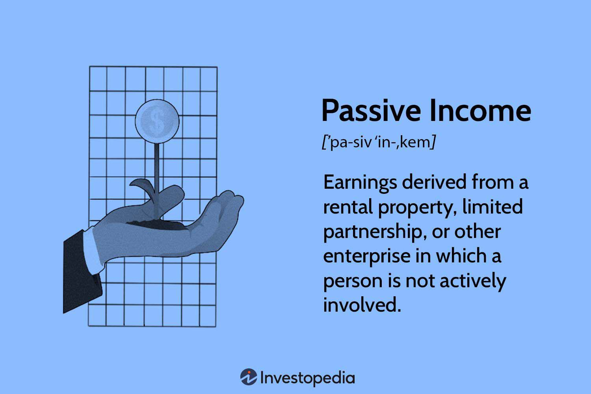

The quest for financial independence often leads individuals to explore various money-making avenues. One popular option is generating passive income, which can offer a path to financial stability without constant active effort. Passive income strategies cover a broad range of opportunities, from traditional investments like real estate and dividend-paying stocks to modern solutions such as algorithmic trading. These strategies, each with varying levels of risk tolerance and capital requirements, allow individuals to tailor their approaches based on personal financial goals and risk preferences.

The foundation of passive income lies in its ability to provide financial returns with minimal active involvement. This characteristic distinguishes it from active income, which typically demands continuous labor and time commitment. While active income is derived from salaries, wages, or businesses requiring ongoing participation, passive income sources generate revenue with less frequent engagement, allowing for greater flexibility and potential time freedom.



In exploring passive income possibilities, understanding its principles is crucial. It differs from portfolio income, primarily earned from selling investments at a profit. Passive income often involves an initial setup phase with higher effort to establish the income stream, but once operational, it tends to require less management. This balance of initial effort with subsequent ease of maintenance makes passive income an attractive prospect for many seeking to diversify their financial portfolios and reduce dependency on a single source of income.

Furthermore, one innovative method of generating passive income is through algorithmic trading, also known as algo trading. This technique leverages computer programs to automate trading processes, allowing for potential income generation with reduced manual intervention. Algo trading capitalizes on small market movements to execute trades efficiently, offering an intriguing option for those with a suitable understanding of financial markets or access to specialized platforms. Though it automates much of the trading process, ongoing oversight is essential to adapt to changing market conditions.

In this article, we will explore diverse passive income ideas, providing insights into their workings and potential returns. From real estate investments to algorithmic trading, these strategies present numerous opportunities for individuals looking to achieve financial independence through passive income.

## Table of Contents

## Understanding Passive Income

Passive income is a financial concept referring to earnings generated with minimal active participation from the income recipient. It contrasts with active income, where continuous effort and involvement are necessary to generate revenue, such as wages from employment. Passive income serves as a supplementary stream of earnings, enhancing financial stability and resilience against economic uncertainties.

The origins of passive income often lie in activities such as real estate investments, dividend income from stocks, and online content creation. Real estate investments, for instance, involve purchasing properties to earn rental income. Although managing real estate requires significant initial effort, including property acquisition and tenant management, the subsequent rental payments generally provide a steady income flow with reduced ongoing effort.

Dividend income is another prevalent source of passive earnings. Investors earn dividends from shares in corporations, which distribute a portion of their profits to shareholders. This income type relies on strategic stock market investments and offers a regular income stream, although it is subject to market fluctuations and corporate performance.

Additionally, passive income can stem from online ventures such as digital content creation or online courses. After establishing the initial content, such as writing eBooks, producing videos, or developing online courses, creators can earn royalties or sales revenue with minimal further involvement. 

The primary advantage of passive income is the continuous flow of revenue after completing the initial setup, reducing the need for ongoing effort and allowing individuals to pursue other activities or business opportunities. This setup can alleviate financial pressure and even lead to early retirement if managed effectively.

Nevertheless, generating passive income demands informed decision-making and strategic planning. Potential income sources must be evaluated for their risk-return profile, capital requirements, and alignment with individual financial goals. For instance, real estate investments require substantial upfront capital and [carry](/wiki/carry-trading) risks related to property values and occupancy rates, while dividend-paying stocks demand knowledge of financial markets and careful selection of stocks.

In summary, passive income is a powerful tool for achieving financial independence. Its advantages include reduced active involvement and the potential for stable, diversified revenue streams. However, successful passive income generation hinges on strategic planning, risk assessment, and continuous evaluation of investment opportunities.

## Top Passive Income Ideas

Passive income generation offers numerous avenues for individuals seeking to supplement their earnings without continuous active work. Several prominent strategies include real estate investing, dividend stocks, and peer-to-peer lending, each offering unique benefits and challenges.

### Real Estate

Investing in real estate, particularly rental properties, provides a stable income stream through tenant rent payments. However, this approach necessitates significant initial capital for property purchase and ongoing management effort. Real estate investment involves several considerations, such as location, property condition, and rental market demand, which can affect income potential and property value appreciation. Effective property management, either personally or via a professional service, is crucial to maintaining occupancy rates and overall property value. Real estate investment can be a relatively stable income source, offering tax benefits such as depreciation deductions and potential appreciation.

### Dividend Stocks

Dividend stocks are financial securities representing ownership in a company and entitling the shareholder to a portion of the company's earnings. Companies issue dividends as a way of distributing profits to shareholders, which can provide a regular income stream. The dividend yield, calculated as $\text{Dividend Yield} = \frac{\text{Annual Dividends per Share}}{\text{Price per Share}} \times 100$, is a crucial metric for evaluating the attractiveness of a dividend stock. While dividends can offer consistent returns, they are subject to market fluctuations, and dividends are not guaranteed payments. Investors should carefully select dividend-paying companies with a strong track record of stable earnings and dividend growth to mitigate risks.

### Peer-to-Peer Lending

Peer-to-peer (P2P) lending platforms, such as LendingClub, enable individual investors to provide loans directly to borrowers, often at higher interest rates than traditional savings accounts. This alternative investment strategy allows investors to earn passive income through interest payments while supporting small businesses or personal loans. P2P lending offers several advantages, including the ability to choose loan attributes such as credit rating and loan term, and the opportunity for higher returns compared to conventional banking products. However, it comes with inherent risks, including borrower default and platform stability. Diversifying across multiple loans can help reduce individual loan default risk.

Each of these passive income ideas presents different levels of risk, required capital, and management involvement, allowing individuals to tailor their investment approaches to their financial goals and risk tolerance.

## Algorithmic Trading as a Passive Income Strategy

Algorithmic trading, often referred to as algo trading, utilizes computer programs to execute trades according to pre-defined criteria, significantly reducing the need for human intervention. This automated trading strategy can potentially serve as a viable passive income source by exploiting small market fluctuations that occur throughout the trading day.

Algorithmic trading operates on the principles of analyzing market data and executing orders at speeds and frequencies that are impossible for human traders. By leveraging algorithms, traders can automate the trading process, engage in high-frequency trading, and implement sophisticated strategies like statistical [arbitrage](/wiki/arbitrage) or [market making](/wiki/market-making).

The core advantage of algo trading lies in its ability to generate consistent income with minimal active involvement once the trading system is developed and optimized. By analyzing historical data, traders can develop models to identify profitable trading opportunities. These models are then translated into algorithms that run on trading platforms to execute trades at opportune moments.

Although algo trading minimizes manual trading efforts, it is not entirely hands-free. Constant monitoring and periodic adjustments are necessary to ensure that the algorithms remain relevant in changing market conditions. This non-static nature of financial markets implies that an initially profitable algorithm may underperform or incur losses if it fails to adapt to new trends or [volatility](/wiki/volatility-trading-strategies) levels.

Implementing an [algorithmic trading](/wiki/algorithmic-trading) strategy necessitates a robust understanding of financial markets and programming skills, particularly in languages like Python or C++. For example, the following Python code snippet illustrates a simple moving average crossover strategy using the popular data analysis library, Pandas, and the trading library, Backtrader:

```python
import backtrader as bt

class SMACrossover(bt.SignalStrategy):
    def __init__(self):
        sma1 = bt.ind.SMA(period=10)  # 10-day moving average
        sma2 = bt.ind.SMA(period=30)  # 30-day moving average
        self.signal_add(bt.SIGNAL_LONG, sma1 > sma2)
        self.signal_add(bt.SIGNAL_SHORT, sma1 < sma2)

cerebro = bt.Cerebro()
cerebro.addstrategy(SMACrossover)
cerebro.run()
```

For traders not equipped with programming expertise, third-party platforms and trading bots offer a level of accessibility by providing pre-built algorithms and user-friendly interfaces for strategy customization.

Successful implementation of algo trading can yield substantial passive income. However, it's crucial to conduct thorough [backtesting](/wiki/backtesting) and risk assessment to avoid unforeseen market challenges. The complexity of these strategies underscores the necessity for both technological knowledge and a keen sense of market dynamics to maintain and iterate on trading algorithms effectively.

## Combining Multiple Strategies for Optimal Results

Investors often combine multiple strategies to construct a diversified passive income portfolio, optimizing both security and returns. Diversification across various income avenues serves as a key risk management tool, reducing the impact of volatility and adverse events that might affect a single investment category. For example, the potentially high returns in equity markets can be balanced by the steady cash flow from real estate investments, smoothing the overall income stream.

The process of developing a well-rounded portfolio involves tailoring investments to align with an investor's individual risk tolerance, investment horizon, and financial objectives. An investor with a low risk tolerance might focus more on stable, income-generating assets such as bonds and dividend-paying stocks, whereas someone with a higher risk appetite might allocate more capital to high-growth opportunities such as equities and real estate.

Considerations such as the time horizon are crucial in this context. Long-term investments can benefit from the compounding effect, where reinvested earnings generate additional income over time:

$$
A = P \left(1 + \frac{r}{n}\right)^{nt}
$$

Where:
- $A$ is the amount of money accumulated after n years, including interest.
- $P$ is the principal investment amount.
- $r$ is the annual interest rate (decimal).
- $n$ is the number of times that interest is compounded per unit year.
- $t$ is the time in years.

For those interested in algorithmic trading as part of their strategy, leveraging technology to automate trading based on financial models can allow the investor to capitalize on small, consistent earnings over time while minimizing direct involvement. Here's a simple Python script example demonstrating a basic moving average crossover strategy, often used in algo trading:

```python
def simple_moving_average(prices, window):
    result = []
    for i in range(len(prices) - window + 1):
        window_average = sum(prices[i:i+window]) / window
        result.append(window_average)
    return result

prices = [120, 121, 122, 123, 124, 125, 126, 127, 128, 129, 130]
short_window = 3
long_window = 5

short_sma = simple_moving_average(prices, short_window)
long_sma = simple_moving_average(prices, long_window)

# Determine buy/sell signals
signals = ['Hold']
for i in range(1, len(short_sma)):
    if short_sma[i] > long_sma[i]:
        signals.append('Buy')
    elif short_sma[i] < long_sma[i]:
        signals.append('Sell')
    else:
        signals.append('Hold')

print(signals)
```

By implementing a mix of strategies, investors can create a passive income portfolio that not only aligns with their risk appetite but also maximizes returns. Tailored portfolio design, strategic allocation, and ongoing adjustments are key to ensuring sustained growth and security in passive income ventures.

## Conclusion

Proper research and strategic execution are fundamental components for successfully generating passive income, providing significant assistance toward achieving financial goals. Opportunities abound across various domains, including traditional avenues like real estate and stocks as well as modern techniques such as algorithmic trading. Each method presents its own set of challenges and advantages, requiring a nuanced understanding and careful planning to maximize potential returns while minimizing risks.

Success in passive income endeavors often hinges on balancing risk and return, alongside active management, particularly during the initial setup phase. This involves not only selecting the right investments but also structuring them to produce sustainable revenue streams. For instance, real estate investments require upfront capital and proper property management, whereas dividend stocks necessitate a keen understanding of market dynamics and economic indicators. Algorithmic trading demands both financial acumen and technical expertise to create and maintain effective trading algorithms.

As financial landscapes continue to evolve, staying informed and adaptable is crucial for maintaining effective passive income streams. Monitoring economic trends, technological advancements, and regulatory changes can provide valuable insights that help refine strategies and enhance resilience against market volatilities. By being proactive in knowledge acquisition and flexible in approach, individuals can better navigate the complexities of passive income generation and safeguard their financial future.

## FAQs

**What is the difference between passive income and active income?**

Passive income and active income are distinguished primarily by the level of effort involved in generating earnings. Active income requires direct engagement, such as when someone is employed or operates a business. Earnings are directly tied to hours worked or specific tasks completed. Examples include salaries, wages, and freelance work. In contrast, passive income involves minimal active involvement once the initial setup is complete. Sources of passive income include rental earnings, dividends from investments, and profits from businesses in which one does not actively participate. The key distinction is that active income demands continuous work contribution, whereas passive income can generate revenue without ongoing labor.

**How much capital is necessary to start generating passive income?**

The capital required to initiate passive income streams varies greatly depending on the chosen strategy and desired earnings level. For instance, starting with dividend stocks might require an initial investment of a few hundred to several thousand dollars, depending on the stock's share price and dividend yield. Real estate investments generally demand higher capital, often starting with tens of thousands of dollars for down payments and closing costs. More affordable options exist, such as peer-to-peer lending or creating digital products, which can be initiated with lower upfront costs. Ultimately, the amount of capital required is contingent on the specific passive income avenue and one's financial goals and risk tolerance.

**Are there any tax implications I should be aware of with passive income?**

Yes, passive income has specific tax considerations that vary based on the type of income and jurisdiction. Dividend income, for example, may be subject to different tax rates compared to ordinary income. In the United States, qualified dividends are taxed at a lower rate, whereas non-qualified dividends are taxed at ordinary income rates. Real estate income might be eligible for certain deductions, such as mortgage interest and depreciation, reducing the taxable income. However, taxes on passive income can be complex, and tax liabilities can differ based on local and national regulations. It's advisable to consult with a tax professional to understand the specific tax requirements related to one's passive income endeavors.

**What resources can I use to learn more about algo trading?**

For those interested in algorithmic trading, a wealth of resources is available to acquire knowledge and skills. Books like "Algorithmic Trading: Winning Strategies and Their Rationale" by Ernest P. Chan offer foundational insights. Online courses, such as those available on platforms like Coursera and Udemy, provide structured learning paths. Websites like QuantConnect and Alpaca offer practical resources for coding and backtesting strategies using Python, facilitating hands-on learning. Additionally, participation in forums such as Quantitative Finance Stack Exchange and communities like Subreddits dedicated to algo trading can provide peer support and expert advice. These resources collectively help in understanding both the theoretical and practical aspects of algorithmic trading.

## References & Further Reading

[1]: Bergstra, J., Bardenet, R., Bengio, Y., & Kégl, B. (2011). ["Algorithms for Hyper-Parameter Optimization."](https://dl.acm.org/doi/10.5555/2986459.2986743) Advances in Neural Information Processing Systems 24.

[2]: ["Advances in Financial Machine Learning"](https://www.amazon.com/Advances-Financial-Machine-Learning-Marcos/dp/1119482089) by Marcos Lopez de Prado

[3]: ["Evidence-Based Technical Analysis: Applying the Scientific Method and Statistical Inference to Trading Signals"](https://www.amazon.com/Evidence-Based-Technical-Analysis-Scientific-Statistical/dp/0470008741) by David Aronson

[4]: ["Machine Learning for Algorithmic Trading"](https://github.com/PacktPublishing/Machine-Learning-for-Algorithmic-Trading-Second-Edition) by Stefan Jansen

[5]: ["Quantitative Trading: How to Build Your Own Algorithmic Trading Business"](https://www.amazon.com/Quantitative-Trading-Build-Algorithmic-Business/dp/1119800064) by Ernest P. Chan