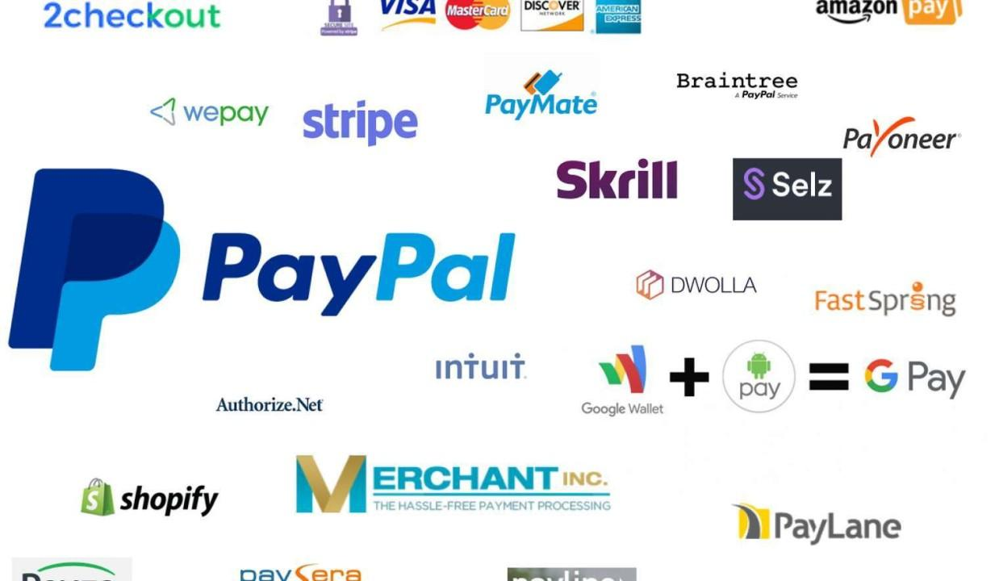

The rise of digital payments has markedly reshaped the landscape of financial transactions for both businesses and consumers. As technology continues to advance, the traditional paradigms of cash and check payments have been supplanted by more sophisticated, efficient, and secure online payment solutions. Among these, PayPal has emerged as a longstanding giant within the online payment industry, renowned for its convenience and reliability. 

However, over time, a significant portion of users has begun seeking alternatives. This shift is driven by a quest for unique features and lower fees—elements that are becoming increasingly crucial in a competitive market. PayPal's dominance is challenged by a range of emerging digital payment solutions that promise not only cost-effectiveness but also enhanced functionalities and user experiences tailored to specific needs.

This article aims to explore the diverse array of online payment alternatives available today. In doing so, we will examine the burgeoning field of algorithmic trading, an area where the speed and efficiency of financial transactions hold paramount importance. By evaluating some popular PayPal alternatives, the article seeks to provide a comprehensive analysis of their advantages and potential drawbacks. This will enable you to make informed decisions in selecting the best payment solution to meet your individual or business requirements, fostering better efficiency and possibly reducing transaction costs.

## Table of Contents

## Understanding the Digital Payment Landscape

As technology advances, the demand for secure and efficient online payment solutions continues to grow exponentially. This growth is driven by the increasing reliance on digital transactions in various sectors, including e-commerce, app-based services, and brick-and-mortar businesses transitioning to digital sales platforms. The shift towards digital payments is largely due to the convenience and speed they offer over traditional payment methods, facilitating seamless transaction experiences for both businesses and consumers.

Digital payments are essential for e-commerce platforms, acting as the backbone that enables online retailers to conduct transactions across borders with ease. For app-based services, digital payments streamline processes, allowing users to make quick in-app purchases without leaving the application interface. Similarly, brick-and-mortar businesses have started integrating digital payment solutions to adapt to the growing preference for contactless payments among consumers.

Several companies now offer comprehensive digital payment solutions tailored to meet diverse business models and customer preferences. These solutions range from simple peer-to-peer payment apps to complex systems that integrate with existing business infrastructure. The variety of options ensures that businesses can choose a provider that best suits their operational requirements and customer demographics.

When selecting a digital payment provider, businesses must consider several key features. Security is paramount; ensuring that the payment solution adheres to the highest security standards is crucial for protecting both business and customer data from fraud and cyber threats. Moreover, fees play a significant role in the decision-making process, as transaction costs can affect a business's profitability, especially for small businesses and start-ups. Therefore, understanding a provider's fee structure, including any hidden fees, is essential.

Ease of integration with existing systems is another critical [factor](/wiki/factor-investing). Businesses should look for payment solutions that offer straightforward integration with their current platforms and software to minimize disruptions and ensure a smooth transition to digital payments. This consideration is especially important for businesses with complex or unique operational needs, as custom integration can enhance the efficiency and effectiveness of the payment system.

In conclusion, the digital payment landscape is constantly evolving, offering numerous solutions that cater to various business needs. By prioritizing security, evaluating fees, and ensuring ease of integration, businesses can select a digital payment provider that not only meets their immediate requirements but also positions them for future growth in the dynamic digital economy.

## Why Consider Alternatives to PayPal?

PayPal, a stalwart in the online payment industry, is often praised for its widespread recognition and ease of use. However, numerous users are increasingly considering alternatives due to several prevalent issues. One of the most significant drawbacks of PayPal for small and high-[volume](/wiki/volume-trading-strategy) businesses is its relatively high transaction fees. As of late 2023, PayPal charges 2.9% plus a fixed fee per transaction in the United States. For international transactions, the fees can be higher, and exchange rates may not be as favorable, potentially eroding profit margins.

Another substantial concern for PayPal users is its customer service and the stringent account restrictions that can be imposed. Reports of frozen accounts or sudden holds on funds are not uncommon, often catching users by surprise and disrupting cash flow. The resolution of such issues may require extensive time and communication, causing frustration and hindering business operations.

Moreover, PayPal's generic service model does not always cater to specific industry needs. Businesses requiring unique features, such as subscription billing, advanced fraud prevention mechanisms, or enhanced customization, might find PayPal's offerings inadequate. This limitation prompts businesses to seek diversified and specialized services that align more closely with their operational requirements.

By exploring alternatives, businesses have the opportunity to select a solution that is tailored to their specific needs. Many competitors offer lower fees, which can significantly reduce operational costs, especially for high-volume or small-margin transactions. Enhanced features like advanced analytics, customizable payment gateways, and superior fraud prevention tools are often available, providing businesses a competitive edge.

Additionally, better customer support and flexible account handling can lead to a more reliable and satisfying user experience. By shifting to an alternative provider, businesses can potentially achieve improved financial outcomes, operational efficiency, and customer satisfaction. Thus, considering alternatives to PayPal is increasingly seen as a strategic move for businesses aiming to optimize their payment processing systems.

## Top PayPal Alternatives

Venmo is a widely recognized PayPal alternative, especially favored for its social networking aspect. It allows users to transfer funds quickly and without fees when sending money to peers, provided the transfer is funded through a Venmo balance, bank account, or debit card. This fee-free option, along with its user-friendly interface, makes Venmo ideal for small personal transactions among friends and family.

Stripe is another prominent alternative, celebrated primarily for its developer-friendly API. This characteristic makes it an appealing option for businesses that require significant customization in their payment processing systems. Stripe supports a wide range of programming languages and provides detailed documentation, enabling companies to create tailored payment solutions that fit their unique operational needs.

Square stands out for its versatile offerings designed to support both online and physical retail environments. In addition to robust payment processing capabilities, Square offers hardware solutions like point-of-sale systems, enabling seamless integration for brick-and-mortar stores. Its services include invoicing, inventory tracking, and customer relationship management tools, making Square a comprehensive solution for various business models.

Apple Pay provides a streamlined payment solution, particularly for users within the Apple ecosystem. It facilitates secure, contactless transactions on Apple devices, such as iPhones, iPads, and Macs. For consumers, Apple Pay charges no additional fees and is compatible with a wide array of retailers worldwide. The biometric authentication features, such as Face ID and Touch ID, enhance the security and convenience of using Apple Pay.

Amazon Pay leverages Amazon's trusted brand and extensive user base to deliver a secure payment solution characterized by ease of use. Shoppers can use their Amazon account details to make purchases on third-party websites, simplifying the checkout process and reducing the friction often associated with entering payment and shipping information repeatedly.

Skrill and Payoneer cater to businesses engaging in international transactions. These platforms are noted for their low fees associated with cross-border payments, making them particularly attractive to global businesses. Skrill offers a prepaid card option and supports multiple currencies, whereas Payoneer provides mass payout services, global accounts, and local receiving accounts in various currencies, facilitating easy management of international funds.

## Algorithmic Trading and Payment Solutions

Algorithmic trading involves the use of automated, pre-programmed instructions to execute trading orders efficiently and accurately. This trading method leverages advanced mathematical models and software to make high-speed decisions, often executing trades at a frequency and speed impossible for human traders. The core advantage of [algorithmic trading](/wiki/algorithmic-trading) is its capability to handle substantial volumes of trading activity with precision and minimal delay.

The integration of secure and efficient payment solutions is paramount for algorithmic trading. To sustain the rapid pace of trading activities, payment systems must process transactions swiftly, securely, and with minimal latency. Fast payment processing ensures that funds can be reallocated and reinvested quickly, maintaining [liquidity](/wiki/liquidity-risk-premium) and enabling traders to capitalize on transient market opportunities.

Financial platforms supporting algorithmic trading often necessitate payment solutions that can seamlessly integrate with complex trading algorithms and provide robust security measures. Such payment systems must adhere to stringent security protocols to protect sensitive financial data and ensure compliance with relevant regulatory standards. This security is critical in preventing unauthorized transactions and maintaining the integrity of the trading platform.

In addition to security, latency is a key consideration. The time taken for a transaction to be processed, known as latency, can significantly impact trading outcomes. High latency can result in delayed execution of trade orders, potentially leading to missed opportunities or financial losses in volatile markets. Therefore, financial technology systems that facilitate algorithmic trading prioritize ultra-low latency payment solutions to enhance performance and profitability.

Exploring various payment solutions available in the financial technology sector reveals a range of options tailored to meet these demanding requirements. For instance, integrating blockchain technology in payment systems can provide enhanced security features, reduce processing times, and lower costs. Other innovative solutions focus on optimizing transaction speeds and ensuring compliance with global standards to bolster the efficiency of algorithmic trading operations.

Choosing the right payment solution involves evaluating aspects like transaction fees, speed, security, and global reach. A sophisticated algorithmic trading platform benefits from a payment solution that not only meets technical requirements but also aligns with its strategic financial goals, optimizing transaction processes to support continuous and profitable trading activities.

## Factors to Consider When Choosing a Digital Payment Solution

When selecting a digital payment solution, it's crucial to consider several key factors that can significantly impact your business operations and customer experience. Here's an overview of these factors:

### Transaction Fees

Transaction fees can vary significantly among different digital payment providers and can directly affect your business's profitability. Providers typically charge either a flat fee per transaction, a percentage of the transaction amount, or a combination of both. For instance, a fee structure might look like $0.30 + 2.9% of the transaction. For businesses processing high volumes of small transactions, a flat fee could be costlier, whereas a percentage fee structure might be more economical for larger transactions. Carefully evaluate the fee structures in relation to your transaction volume and value to determine the most cost-effective option for your business.

### Security

Security is paramount in digital transactions to protect both business and customer data from fraud and cyber threats. Essential security features include encryption, tokenization, and secure socket layer (SSL) certification. Compliance with standards such as the Payment Card Industry Data Security Standard (PCI DSS) is mandatory for secure credit and debit card processing. Additionally, implementing two-factor authentication (2FA) can protect user accounts by requiring a second form of identification at login, thereby enhancing security.

### User Experience

A seamless user interface is critical for retaining customers and ensuring successful transaction completions. The payment process should be intuitive, with minimal steps from product selection to checkout completion. Moreover, responsive customer support ensures help is readily available for users encountering issues, increasing trust and satisfaction. Design elements such as clear instructions, progress indicators, and mobile optimization also contribute to a positive user experience.

### Global Reach

For businesses operating on a global scale, the ability to process various currencies and facilitate cross-border transactions is vital. Choose a provider that offers multi-currency support and has partnerships with financial institutions in different countries. This capability not only reduces currency conversion fees but also caters to a wider audience. Understanding the international tax and regulatory implications of using specific payment solutions is also necessary to ensure compliance and seamless operations across borders. 

Considering these factors allows businesses to choose a digital payment solution that aligns with their operational requirements and customer expectations, ultimately contributing to business success and growth in a competitive market.

## Conclusion

The digital payment solution landscape offers numerous alternatives to PayPal, each with unique strengths. Choosing the right provider is crucial for businesses of various sizes and industries, including those engaged in algorithmic trading. This selection process involves matching the specific needs of your operation with a provider that can enhance efficiency and potentially reduce costs. For instance, small businesses might prioritize low transaction fees, while large enterprises may focus on global reach and seamless integration capabilities.

Evaluating the options requires a comprehensive understanding of key factors like fee structures, security measures, ease of use, and customer support. These considerations help ensure that the selected payment solution not only meets current needs but is also adaptable to future growth and innovations. The reliability and speed of transactions are particularly important for algorithmic trading platforms, where rapid fund movements are essential to capitalize on market opportunities.

By leveraging the appropriate digital payment tools, businesses can place themselves at the forefront of the digital economy, effectively managing transactions and improving user experiences. This strategic alignment with the right payment provider can translate into significant operational benefits, setting the stage for sustained success in an increasingly digital and competitive market.

## References & Further Reading

[1]: Bergstra, J., Bardenet, R., Bengio, Y., & Kégl, B. (2011). ["Algorithms for Hyper-Parameter Optimization."](https://papers.nips.cc/paper/4443-algorithms-for-hyper-parameter-optimization) Advances in Neural Information Processing Systems 24.

[2]: ["Advances in Financial Machine Learning"](https://www.amazon.com/Advances-Financial-Machine-Learning-Marcos/dp/1119482089) by Marcos Lopez de Prado

[3]: ["Evidence-Based Technical Analysis: Applying the Scientific Method and Statistical Inference to Trading Signals"](https://www.amazon.com/Evidence-Based-Technical-Analysis-Scientific-Statistical/dp/0470008741) by David Aronson

[4]: ["Machine Learning for Algorithmic Trading"](https://github.com/stefan-jansen/machine-learning-for-trading) by Stefan Jansen

[5]: ["Quantitative Trading: How to Build Your Own Algorithmic Trading Business"](https://www.amazon.com/Quantitative-Trading-Build-Algorithmic-Business/dp/1119800064) by Ernest P. Chan