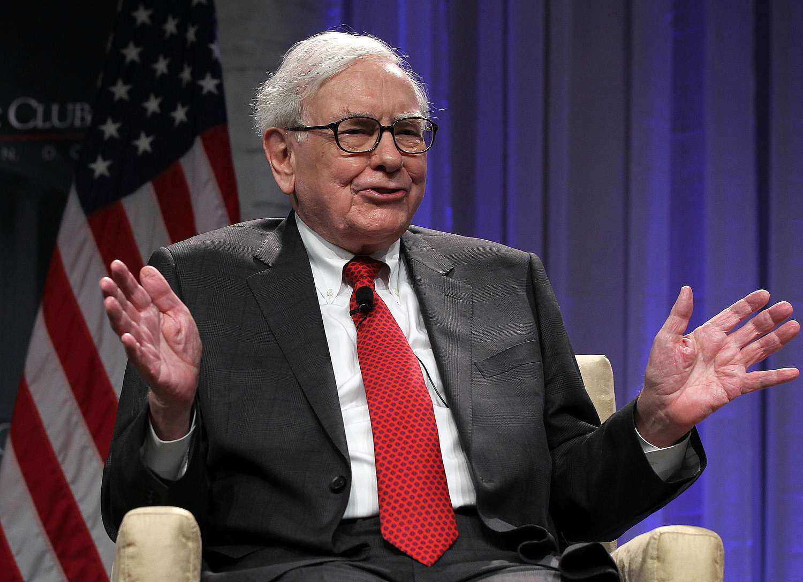

In the ever-evolving world of finance, the influence of investment leaders and famous investors is unmatched. These individuals have shaped the financial landscape through their innovative strategies, rigorous analysis, and often, their ability to see potential where others cannot. This article explores the strategies and successes of the greatest investors in history, highlighting the enduring principles that continue to guide investment practices today. From the steadfast value investing philosophy of Warren Buffett to the groundbreaking economic theories of Benjamin Graham, the legacies of these investment titans offer invaluable insights into time-tested strategies.

The advent of algorithmic trading represents a significant shift in how investments are executed and managed. By utilizing complex algorithms and substantial computational power, algorithmic trading enhances the precision and speed at which trades are performed. This technological advancement reduces human error and optimizes market timing, playing a pivotal role in modern investing. As we uncover the secrets to these investors' success, it is essential to understand how algorithmic trading is reshaping the investment landscape, providing both challenges and opportunities.



This comprehensive guide is designed for both novice and seasoned investors seeking to enhance their understanding of investment strategies. By learning from the experiences and innovations of past and present investors, and by staying attuned to the influence of modern technology, individuals can equip themselves with the knowledge necessary to navigate the complexities of today's financial markets.

## Table of Contents

## The Legacy of Investment Leaders

Investment leaders such as Warren Buffett and Benjamin Graham have profoundly influenced the world of finance, leaving a lasting legacy that continues to guide investors today. Their strategies are extensively studied and revered across the globe, forming the backbone of many modern investment practices.

Warren Buffett, often referred to as the "Oracle of Omaha," is renowned for his value investing philosophy. This approach, rooted in buying undervalued stocks and holding them for the long term, is grounded in thorough market analysis and the pursuit of intrinsic value. Buffett's investment philosophy emphasizes patience and discipline, advocating for investments in companies with strong fundamentals, competitive advantages, and competent management. His principle of acquiring businesses at a price below their intrinsic value resonates with investors seeking sustainable wealth creation. This strategy is widely regarded as a testament to the importance of a long-term investment horizon and an unwavering commitment to sound financial judgment.

Benjamin Graham, often considered the father of value investing, has laid the foundational principles that have shaped the practices of countless investors, including Buffett. His seminal works, "The Intelligent Investor" and "Security Analysis," introduce the concept of intrinsic value and emphasize the significance of margin of safety—essentially the practice of investing in securities priced well below their intrinsic worth to minimize risk. Graham's focus on financial analysis, rigorous scrutiny of balance sheets, and the separation of investment from speculation are key tenets that continue to inspire prudent investment decisions.

Exploring the legacies of Buffett and Graham provides invaluable insights into time-tested investment strategies that stress the significance of patience, discipline, and comprehensive market analysis. Their successes highlight the crucial role these elements play in achieving sustained financial growth and stability. Emulating their strategies involves cultivating a deep understanding of financial markets, adopting a methodical approach to stock evaluation, and prioritizing investments in companies that demonstrate long-term potential.

In conclusion, the enduring impact of Warren Buffett and Benjamin Graham on the world of finance is evidenced by their ability to navigate complex market conditions and generate significant returns over time. Their principles remain relevant in today's dynamic investment landscape, serving as guiding lights for both novice and seasoned investors aspiring to enhance their understanding of investment strategies and achieve enduring financial success.

## Famous Investors: Visionaries Who Changed the Markets

Famous investors like George Soros and Peter Lynch have significantly influenced financial markets through their distinct investment philosophies and strategies. George Soros is renowned for his bold and strategic investment decisions, such as the famous bet against the British pound in 1992. This event, referred to as Black Wednesday, played a crucial role in devaluing the pound and earned Soros and his Quantum Fund a reported profit of over $1 billion. Soros' approach exemplified high-risk, high-reward tactics, showcasing his ability to analyze macroeconomic factors and act decisively.

Peter Lynch, on the other hand, is celebrated for his tenure at the Magellan Fund from 1977 to 1990, where he achieved an annualized return of 29.2%, outperforming the S&P 500 Index consistently. Lynch's strategy focused on identifying undervalued stocks and was characterized by thorough research and a deep understanding of the companies he invested in. His "invest in what you know" philosophy encouraged investors to look beyond quantitative data and engage with businesses on a more intuitive level.

The profiles of Soros and Lynch offer valuable lessons in investing. Soros' career emphasizes the importance of critical thinking and the ability to anticipate the impact of global events on the market. His success underscores the necessity of adapting swiftly to changing economic conditions. Meanwhile, Lynch's achievements illustrate the power of informed intuition and a meticulous approach to stock selection. By understanding the market trends and consumer behaviors, he was able to identify growth opportunities before they became apparent to others.

These investors exemplify the impact of visionaries on the financial markets, demonstrating that success is often a combination of innovative thinking, strategic implementation, and a willingness to take calculated risks. Their stories continue to inspire investors by revealing the potential of combining critical analysis with adaptive strategies to achieve significant returns.

## The Rise of Algorithmic Trading

Algorithmic trading represents a significant advancement in the financial markets, employing complex algorithms and the extensive computational power of modern computers to execute trade orders under optimal conditions. Algorithmic trading has transformed traditional trading methods by significantly reducing human errors and enhancing efficiency. By relying on predefined criteria regarding timing, price, quantity, or other mathematical models, [algorithmic trading](/wiki/algorithmic-trading) minimizes emotional human interventions, thus achieving greater precision and consistency.

The appeal of algorithmic trading lies in its ability to process vast amounts of market data far quicker than any human, identifying trading opportunities and executing trades within fractions of a second. This efficiency is particularly beneficial in high-frequency trading ([HFT](/wiki/high-frequency-trading-strategies)), where profitability depends on exploiting minute price discrepancies that require rapid execution across various markets. HFT firms capitalize on these opportunities to secure profits in timeframes as brief as milliseconds, underscoring the importance of speed and algorithm optimization.

In addition to high-frequency trading, algorithms are also employed in long-term investment strategies. For instance, algorithmic models analyze extensive financial data, market indicators, and historical trends to make informed predictions about asset behavior. By incorporating [machine learning](/wiki/machine-learning) techniques, these models can adapt over time, refining investment strategies to enhance performance and manage risk effectively.

In contemporary finance, hedge funds and investment firms increasingly rely on these algorithmic strategies to gain competitive advantages. By automating complex trading processes, firms can operate around the clock, managing vast portfolios and reacting instantaneously to market changes that might otherwise result in missed opportunities.

Understanding the intricacies of algorithmic trading is crucial for participants in modern financial markets. As technology evolves, the influence of algorithms in trading will only become more pronounced, shaping the strategies and outcomes of investment activities across the globe. Proficiency in algorithmic trading thus represents not merely an advantage but a necessity for success in the fast-paced world of finance.

## Greatest Investors and Their Use of Technology

In the contemporary investment landscape, successful investors are increasingly leveraging technology to refine and enhance their strategies. The integration of [artificial intelligence](/wiki/ai-artificial-intelligence) (AI) and machine learning has particularly transformed trading by enabling new levels of analytical precision and efficiency. These technologies allow investors to process large volumes of data, identify patterns, and predict market movements with unprecedented accuracy.

Ray Dalio, the founder of Bridgewater Associates, exemplifies the use of data-driven methodologies in investment decision-making. Dalio's approach involves a systematic analysis of economic data and market trends, supported by sophisticated algorithms that guide his investment choices. This blend of human insight and technological prowess helps in managing risk and optimizing portfolio performance.

AI and machine learning algorithms can analyze historical data to detect subtle correlations and trends that might be overlooked by conventional analysis. For instance, machine learning models can be trained to predict asset prices using techniques such as neural networks and decision trees. Here is a simple Python example using a decision tree algorithm for financial forecasting:

```python
import pandas as pd
from sklearn.model_selection import train_test_split
from sklearn.tree import DecisionTreeRegressor
from sklearn.metrics import mean_squared_error

# Load financial data
data = pd.read_csv('stock_data.csv')
features = data[['feature1', 'feature2', 'feature3']]  # example features
target = data['stock_price']

# Split data into training and test sets
X_train, X_test, y_train, y_test = train_test_split(features, target, test_size=0.2, random_state=42)

# Create and train the model
model = DecisionTreeRegressor()
model.fit(X_train, y_train)

# Predict and evaluate
predictions = model.predict(X_test)
mse = mean_squared_error(y_test, predictions)
print(f'Mean Squared Error: {mse}')
```

This approach underscores how cutting-edge technology is bridging traditional investing methods with modern innovation. Technologies such as AI and machine learning facilitate agile and informed decision-making, enabling investors to swiftly respond to changing market conditions.

Ultimately, the most successful investors today are those who can adeptly integrate technology with time-tested investment principles. They strike a balance between automated systems and the critical human oversight needed to interpret complex financial environments. By embracing technological advancements while adhering to core investment philosophies, these investors continue to achieve competitive returns and redefine strategies for wealth creation.

## The Future of Investing: What Lies Ahead?

As technology continues to advance, the landscape of investing is set to undergo significant transformations. Algorithmic trading, which harnesses complex algorithms and high computational power, is expected to expand its influence, potentially overshadowing traditional methods. This evolution is driven by the pursuit of efficiency, accuracy, and speed in executing trades, which algorithmic systems adeptly provide. According to a report by the Bank for International Settlements, algorithmic trading accounted for a substantial portion of equity trading across major financial markets, highlighting its growing prominence.

Investors are increasingly required to stay informed and adapt to this evolving environment to remain competitive. The dynamic nature of financial markets necessitates a willingness to embrace technological advancements and incorporate them into investment strategies. A flexible approach can provide investors with a competitive edge, allowing them to navigate the complexities of modern markets more effectively.

Emerging trends such as quantum computing and decentralized finance (DeFi) also have the potential to redefine market dynamics significantly. Quantum computing, with its unparalleled processing power, could revolutionize the speed and complexity of financial modeling, risk assessment, and investment simulations. While still in its nascent stages, its future applications in finance may offer unprecedented precision and insights.

Decentralized finance, driven by blockchain technology, is introducing novel pathways for investing and funding, disintermediating traditional financial institutions. DeFi platforms enable peer-to-peer transactions, smart contracts, and decentralized exchanges, promoting transparency and efficiency. These developments could substantially alter how assets are traded, valued, and secured.

The exploration of future advancements in technology and finance equips investors to anticipate and leverage emerging opportunities and challenges. Staying abreast of these changes facilitates informed decision-making and strategic planning, ultimately fostering resilience in a rapidly evolving investment landscape. As the intersection of technology and finance continues to expand, preparing for these shifts will be crucial for investors aiming to thrive in the future.

## Conclusion

Investment leaders, famous investors, and algorithmic trading have profoundly influenced the financial markets, setting a foundation upon which modern investing thrives. Their collective experiences and pioneering approaches offer invaluable lessons, steering investors toward making more informed and strategic decisions. By examining the methodologies of renowned figures such as Warren Buffett and Benjamin Graham, investors can glean insights into value investing and the importance of patience and thorough market analysis. Similarly, the bold strategies employed by investors like George Soros and Peter Lynch highlight the significance of critical thinking and adaptability.

The intersection of historical wisdom with contemporary technological advancements presents promising avenues for wealth creation. The integration of algorithmic trading, alongside traditional strategies, enhances efficiency and decision-making precision. Leveraging artificial intelligence and machine learning algorithms, investors like Ray Dalio exemplify how technology can be harnessed to optimize investment strategies.

Staying informed about industry trends is crucial for maintaining a competitive edge in the dynamic field of investing. The rapid advancement of technology and its application in finance necessitates continual learning and adaptation. As emerging trends such as quantum computing and decentralized finance begin to reshape market structures, investors who remain vigilant and adaptive will be well-positioned to seize new opportunities.

Ultimately, the lessons derived from the world's greatest investors serve as a roadmap for financial success. By combining time-honored investment principles with modern innovations, individuals can chart a prosperous path in their financial endeavors. This dual approach not only fortifies current investment strategies but also equips investors to tackle future challenges with confidence and foresight.

## References & Further Reading

[1]: Graham, B. (2003). *The Intelligent Investor: The Definitive Book on Value Investing.* Harper Business. 

[2]: Graham, B., & Dodd, D. (2008). *Security Analysis: Sixth Edition, Foreword by Warren Buffett.* McGraw-Hill Education.

[3]: Buffett, W. E., & Cunningham, L. A. (2008). *The Essays of Warren Buffett: Lessons for Corporate America.* The Cunningham Group.

[4]: Soros, G. (2003). *The Alchemy of Finance.* Wiley.

[5]: Lynch, P. (2000). *One Up On Wall Street: How To Use What You Already Know To Make Money In The Market.* Simon & Schuster.

[6]: Dalio, R. (2017). *Principles: Life and Work.* Simon & Schuster.

[7]: Lopez de Prado, M. (2018). *Advances in Financial Machine Learning.* Wiley.

[8]: Aldridge, I. (2013). *High-Frequency Trading: A Practical Guide to Algorithmic Strategies and Trading Systems.* Wiley.

[9]: Chan, E. (2008). *Quantitative Trading: How to Build Your Own Algorithmic Trading Business.* Wiley.