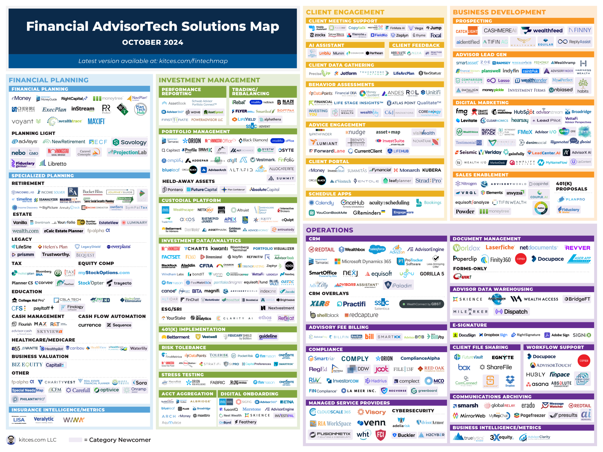

## Table of Contents

## What is a robo-advisor and how does it work?

A robo-advisor is a type of financial service that uses computer algorithms to manage your investments. It's like having a robot help you with your money. You tell the robo-advisor what your financial goals are and how much risk you're willing to take, and then it creates a personalized investment plan for you. This plan usually involves investing your money in a mix of stocks, bonds, and other assets.

Robo-advisors work by using the information you provide to automatically buy and sell investments on your behalf. They do this based on the algorithms they have, which are designed to help your money grow while keeping it safe according to your risk level. They also often adjust your investments over time to keep them in line with your goals. This means you don't have to spend a lot of time managing your investments yourself, making it a convenient option for many people.

## What are the benefits of using a robo-advisor for beginners?

Using a robo-advisor can be really helpful for beginners because it makes investing easy and less scary. You don't need to know a lot about the stock market or how to pick the right investments. The robo-advisor does all that work for you. It asks you simple questions about your goals and how much risk you're okay with, and then it builds a plan that fits you. This means you can start investing without feeling overwhelmed.

Another big benefit is that robo-advisors are usually cheaper than working with a human financial advisor. They don't charge as much because they use computers to do the work, so you can save money while still getting good advice. Plus, they handle all the buying and selling of investments for you, so you don't have to keep an eye on the market all the time. This makes it easier for beginners to start investing and feel confident about their money.

## How do robo-advisors manage investments?

Robo-advisors manage investments by using computer programs called algorithms. These algorithms take the information you give them about your money goals and how much risk you want to take. Then, they pick a mix of investments like stocks and bonds that fit what you want. The robo-advisor automatically buys these investments for you, so you don't have to do it yourself.

After setting up your investments, robo-advisors keep an eye on them all the time. If the market changes or if it's time to adjust your plan, the robo-advisor will sell some investments and buy new ones without you having to do anything. This helps keep your money growing in a way that matches your goals and risk level. It's like having a helper that makes sure your investments are always working hard for you.

## What fees should I expect when using a robo-advisor?

When you use a robo-advisor, you'll usually have to pay a fee. This fee is often a percentage of the money you have invested with them. It's usually around 0.25% to 0.50% per year. So, if you have $10,000 invested, you might pay between $25 and $50 each year for the robo-advisor's services. This fee is for managing your investments and making sure they match your goals.

Besides the management fee, there might be other costs too. For example, the investments the robo-advisor picks for you, like ETFs or mutual funds, might have their own fees. These are called expense ratios and they're usually pretty small, often less than 0.10% per year. So, it's good to look at all the fees together to understand the total cost of using a robo-advisor.

## How do I choose the right robo-advisor for my needs?

Choosing the right robo-advisor starts with figuring out what you need. Think about your money goals, like saving for a house or for retirement, and how much risk you're okay with. Some robo-advisors are good for people who don't want to take big risks, while others might be better if you're okay with more ups and downs. Also, look at the fees they charge. Some robo-advisors are cheaper than others, and you want to make sure you're not paying too much for the help you're getting.

Once you know what you need, compare different robo-advisors. Check if they offer things like tax help or ways to save for college, which might be important to you. It's also good to read reviews and see what other people say about their experiences. Make sure the robo-advisor is easy to use and has good customer support, so you can get help if you need it. By looking at all these things, you can pick a robo-advisor that fits your needs and helps you reach your money goals.

## What are the minimum investment requirements for different robo-advisors?

Different robo-advisors have different minimum investment amounts that you need to start using their services. Some robo-advisors let you start with just $1 or $10, which is great if you don't have a lot of money to invest right away. Others might need you to have at least $500 or even $1,000 before you can begin. It's important to check this before you choose a robo-advisor because you want to make sure you can meet their minimum.

For example, popular robo-advisors like Betterment and Wealthfront often have low minimums, sometimes as little as $500. But if you're looking at robo-advisors from big banks or financial firms, they might ask for more, like $5,000 or even higher. Knowing the minimum investment requirement can help you narrow down your choices and find a robo-advisor that fits your budget.

## Can robo-advisors provide tax optimization strategies?

Robo-advisors can help with tax optimization by using strategies like tax-loss harvesting. This means they sell investments that have lost value to help lower your taxes. They do this automatically, so you don't have to think about it. This can be really helpful if you want to keep more of your money instead of giving it to the government in taxes.

Not all robo-advisors offer tax optimization, so it's important to check if this is something you need. Some robo-advisors, like Betterment and Wealthfront, are known for their tax-loss harvesting features. If you care about saving on taxes, make sure to pick a robo-advisor that has these tools.

## How do robo-advisors compare to traditional financial advisors?

Robo-advisors and traditional financial advisors both help you manage your money, but they do it in different ways. Robo-advisors use computer programs to make investment decisions for you. They ask you about your goals and how much risk you want to take, and then they pick investments that fit your needs. They are usually cheaper than human advisors because they don't need to pay people to do the work. Plus, they can manage your investments automatically, so you don't have to spend a lot of time on it.

Traditional financial advisors, on the other hand, are real people who give you personal advice. They can meet with you face-to-face or talk to you on the phone to understand your financial situation better. They can help you with more than just investments, like planning your estate or saving for your kids' college. But because they offer more personalized service, they usually charge more. So, if you want someone to hold your hand through the process and give you advice on a lot of different things, a traditional advisor might be better for you.

## What advanced features do top robo-advisors offer in October 2024?

By October 2024, top robo-advisors have added some really cool features to help you with your money. They now offer things like tax-smart investing, which means they try to save you money on taxes by selling investments that have lost value. They also have tools to help you plan for big life events, like buying a house or saving for retirement. Some robo-advisors even let you invest in things like real estate or [cryptocurrency](/wiki/cryptocurrency), which can be exciting if you want to try something new. 

Another neat thing is that these robo-advisors now use [artificial intelligence](/wiki/ai-artificial-intelligence) to give you better advice. They look at a lot of data to figure out the best way to grow your money while keeping it safe. Plus, they have better ways to talk to you, like chatbots that can answer your questions anytime. All these new features make using a robo-advisor even easier and more helpful for managing your money.

## How do robo-advisors handle market volatility and risk management?

Robo-advisors handle market [volatility](/wiki/volatility-trading-strategies) and risk management by using smart computer programs. These programs look at how the market is doing and make changes to your investments to keep them safe. If the market goes up and down a lot, the robo-advisor might move your money into safer investments, like bonds, to protect it. It does this automatically, so you don't have to worry about it.

They also use something called diversification, which means spreading your money across different types of investments. This way, if one investment does badly, it won't hurt your whole plan. Robo-advisors keep an eye on how much risk you want to take and adjust your investments to match that. This helps make sure your money is growing but not taking too many chances.

## What are the latest trends and innovations in robo-advisory services for 2024?

In 2024, robo-advisory services are getting even smarter with the help of artificial intelligence (AI). They're using AI to look at a lot of data and make better decisions about where to invest your money. This means they can give you advice that's more personalized to your needs. They're also adding new ways to invest, like in real estate or cryptocurrency, which can be exciting if you want to try something different. Plus, they're making it easier to talk to them with chatbots that can answer your questions anytime.

Another big trend is that robo-advisors are focusing more on helping you with big life goals, like buying a house or planning for retirement. They're using tools to show you how your money could grow over time and help you reach these goals. They're also working on making their services cheaper, so more people can use them. All these new features are making robo-advisors a great choice for anyone looking to manage their money in a simple and smart way.

## How can I evaluate the performance of a robo-advisor over time?

To evaluate the performance of a robo-advisor over time, you can start by looking at how much your money has grown. Check the returns on your investments and compare them to what you expected or to the overall market. Many robo-advisors have tools that show you how your investments are doing, so you can see if they're meeting your goals. It's also helpful to look at the fees you're paying, because high fees can eat into your returns. Make sure the robo-advisor is giving you good value for the money you're spending on their services.

Another way to evaluate a robo-advisor is by looking at how well it handles risk. See if it adjusts your investments when the market goes up and down a lot, and if it's keeping your money safe according to the level of risk you're okay with. You can also read reviews and see what other people say about their experiences with the robo-advisor. Over time, you'll get a good sense of whether the robo-advisor is helping you reach your financial goals and if it's worth sticking with.

## References & Further Reading

[1]: Bergstra, J., Bardenet, R., Bengio, Y., & Kégl, B. (2011). ["Algorithms for Hyper-Parameter Optimization."](https://proceedings.neurips.cc/paper/2011/file/86e8f7ab32cfd12577bc2619bc635690-Paper.pdf) Advances in Neural Information Processing Systems 24.

[2]: ["Advances in Financial Machine Learning"](https://www.amazon.com/Advances-Financial-Machine-Learning-Marcos/dp/1119482089) by Marcos Lopez de Prado

[3]: ["Evidence-Based Technical Analysis: Applying the Scientific Method and Statistical Inference to Trading Signals"](https://www.amazon.com/Evidence-Based-Technical-Analysis-Scientific-Statistical/dp/0470008741) by David Aronson

[4]: ["Machine Learning for Algorithmic Trading"](https://github.com/PacktPublishing/Machine-Learning-for-Algorithmic-Trading-Second-Edition) by Stefan Jansen

[5]: ["Quantitative Trading: How to Build Your Own Algorithmic Trading Business"](https://books.google.com/books/about/Quantitative_Trading.html?id=j70yEAAAQBAJ) by Ernest P. Chan