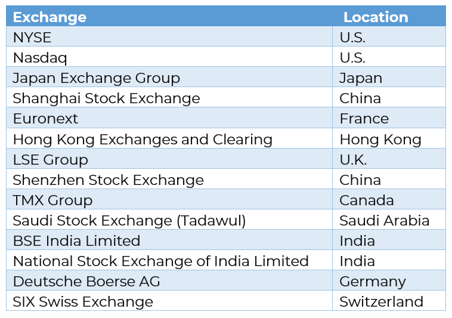

## Table of Contents

## What is a stock exchange?

A stock exchange is a place where people buy and sell shares of companies. These shares represent a small piece of ownership in a company. When someone buys a share, they are investing in that company and hoping it will grow in value. Stock exchanges help companies raise money by selling parts of themselves to the public. This money can be used to grow the business, create new products, or pay off debts.

There are many stock exchanges around the world, like the New York Stock Exchange and the Tokyo Stock Exchange. Each exchange has rules and regulations to make sure trading is fair and safe. People can trade stocks through brokers, who are like middlemen that help with the buying and selling. Stock prices can go up and down based on how well the company is doing and what's happening in the economy. This makes investing in stocks both exciting and risky.

## How many stock exchanges are there in the Americas?

There are several stock exchanges in the Americas. The biggest one is the New York Stock Exchange (NYSE) in the United States. It's very famous and lots of big companies trade there. Another important one in the U.S. is the NASDAQ, which is known for technology companies. Canada has the Toronto Stock Exchange (TSX), which is the main exchange for Canadian companies.

In Latin America, there are also many stock exchanges. For example, Brazil has the B3 (Brasil Bolsa Balcão), which is the largest in South America. Mexico has the Mexican Stock Exchange (BMV), and Argentina has the Buenos Aires Stock Exchange (BYMA). Each country has its own exchange where local companies can sell their shares.

Overall, there are about 20 stock exchanges in the Americas. They help companies from different countries raise money and let people invest in them. Each exchange has its own rules, but they all work to make trading fair and safe.

## What are the largest stock exchanges in the Americas by market capitalization?

The largest stock exchange in the Americas by market capitalization is the New York Stock Exchange (NYSE). It's in the United States and has a huge amount of money in the companies listed there. Lots of big and famous companies trade on the NYSE, like Apple, Microsoft, and Walmart. The total value of all these companies together is more than $20 trillion. That's a lot of money!

The second largest stock exchange in the Americas is the NASDAQ, also in the United States. It's known for having lots of technology companies, like Amazon, Google, and Tesla. The total market value of all the companies on NASDAQ is around $15 trillion. It's a bit smaller than the NYSE, but still very big and important. Both the NYSE and NASDAQ help companies raise money and let people invest in them.

## What is the history of the New York Stock Exchange?

The New York Stock Exchange, or NYSE, started a long time ago in 1792. A group of 24 men got together under a buttonwood tree on Wall Street in New York City. They made an agreement called the Buttonwood Agreement. This agreement said they would only trade with each other and set rules for their trades. This was the start of the NYSE. At first, they traded stocks and bonds of the new United States government and some companies. Over time, the NYSE grew bigger and moved into a building to keep trading.

As the years went by, the NYSE became very important. It helped many companies raise money by selling shares to the public. This money helped companies grow and create jobs. The NYSE also faced some tough times, like the big stock market crash in 1929 that started the Great Depression. But it always came back stronger. Today, the NYSE is the biggest stock exchange in the world by the total value of all the companies listed there. It's still in New York City, but now it's in a big, modern building with lots of technology to help people trade stocks quickly and safely.

## How does the Toronto Stock Exchange operate?

The Toronto Stock Exchange, or TSX, is the main stock market in Canada. It's where people buy and sell shares of Canadian companies. The TSX helps these companies raise money by letting them sell pieces of their business to the public. When someone buys a share, they own a small part of that company. The TSX makes sure all trades are fair and safe by having rules everyone must follow. People usually buy and sell stocks through brokers, who are like helpers that do the trading for them.

The TSX is open for trading from Monday to Friday, but not on weekends or holidays. During the day, the prices of stocks can go up or down based on how well the companies are doing and what's happening in the economy. The TSX has a big screen that shows all the prices and how they're changing. It's important for the TSX to keep everything running smoothly so people can trust it. The TSX also has different ways for companies to raise money, like selling new shares or bonds. This helps the Canadian economy grow because companies can use the money to make new products or expand their business.

## What are the main differences between the NASDAQ and the New York Stock Exchange?

The NASDAQ and the New York Stock Exchange (NYSE) are both big stock markets in the United States, but they work a bit differently. The NYSE is an older exchange and uses a system where people called "specialists" help with trading. They stand on the trading floor and make sure trades happen smoothly. The NYSE is known for having lots of big, traditional companies listed there, like banks and big stores. On the other hand, the NASDAQ is a newer exchange and uses a computer system for trading. There's no trading floor, and all trades happen electronically. The NASDAQ is famous for having lots of technology companies, like Apple and Google.

Another big difference is how they list companies. The NYSE has strict rules that companies must follow to be listed there. It can be harder for smaller companies to get on the NYSE. The NASDAQ has rules too, but they're a bit easier for smaller and newer companies to meet. This means the NASDAQ often has more startups and smaller companies listed. Both exchanges help companies raise money and let people invest in them, but they attract different kinds of companies and use different ways to trade.

## What role do stock exchanges in Latin America play in the global economy?

Stock exchanges in Latin America, like the B3 in Brazil and the Mexican Stock Exchange, are important for the global economy. They help companies in Latin America raise money by selling shares to people all over the world. When companies get this money, they can grow their business, create new products, or pay off debts. This helps the economy in their country and can also help the global economy because these companies might trade with other countries or invest in them. Investors from around the world can also buy shares in these companies, which can bring more money into Latin America and help it grow.

These stock exchanges also show how the economy in Latin America is doing. When the stock prices go up, it can mean that the economy is doing well. When they go down, it might mean there are problems. This information is useful for people and businesses everywhere because it helps them understand what's happening in Latin America. It can affect how they trade with these countries or decide to invest there. So, stock exchanges in Latin America are not just important for their own countries, but for the whole world too.

## How do regulations vary across different stock exchanges in the Americas?

Regulations for stock exchanges in the Americas can be different from one country to another. In the United States, the New York Stock Exchange (NYSE) and the NASDAQ have strict rules set by the Securities and Exchange Commission (SEC). These rules make sure that companies tell the truth about their business and that trading is fair. For example, companies have to share important information with everyone at the same time, so no one gets an unfair advantage. The rules also say how much money a company needs to have before it can be listed on these exchanges. This helps keep the market safe and trustworthy.

In Canada, the Toronto Stock Exchange (TSX) also has its own set of rules. The TSX is regulated by the Ontario Securities Commission (OSC) and other provincial regulators. The rules are similar to those in the U.S., but they can be a bit different. For instance, the TSX might have different requirements for how much money a company needs to have to be listed. The TSX also focuses a lot on making sure companies follow rules about the environment and social responsibility. This shows how each country can have its own special rules to fit its needs.

In Latin America, stock exchanges like the B3 in Brazil and the Mexican Stock Exchange (BMV) have their own regulations too. These rules are made by local government agencies, like the Comissão de Valores Mobiliários (CVM) in Brazil and the Comisión Nacional Bancaria y de Valores (CNBV) in Mexico. The rules can be less strict than in the U.S. or Canada, which might make it easier for smaller companies to list their shares. But they still aim to keep trading fair and protect investors. Each country's regulations reflect its unique economic situation and goals, showing how diverse the rules can be across the Americas.

## What are the technological advancements being implemented in stock exchanges in the Americas?

Stock exchanges in the Americas are using new technology to make trading faster and safer. One big change is using computers for trading, which is called electronic trading. The NASDAQ was one of the first to do this, and now even the New York Stock Exchange uses computers a lot. This means trades can happen in seconds, which is much faster than when people had to shout and use hand signals on the trading floor. Another cool thing is using [artificial intelligence](/wiki/ai-artificial-intelligence) (AI) to watch for anything strange or risky in the market. AI can find problems quickly and help keep trading fair.

Another important advancement is blockchain technology. Some stock exchanges are starting to use it to make sure records of trades are safe and can't be changed. This helps stop fraud and makes people trust the market more. Also, many stock exchanges are working on better ways to connect with traders around the world. They're using high-speed internet and special systems to make sure trading can happen smoothly, no matter where someone is. These changes are helping stock exchanges in the Americas stay at the front of the global market.

## How do stock exchanges in the Americas contribute to economic development?

Stock exchanges in the Americas help the economy grow by giving companies a place to raise money. When a company wants to get bigger, it can sell pieces of itself, called shares, on the stock exchange. People buy these shares, and the money the company gets can be used to build new factories, make new products, or hire more workers. This helps the company grow, and it also creates jobs and makes the economy stronger. For example, when a company in Brazil sells shares on the B3, it can use that money to expand its business and help the Brazilian economy.

Stock exchanges also make it easier for people to invest their money. When people buy shares, they are investing in companies they believe will do well. This is good for the economy because it means more money is being used to help businesses grow. Stock exchanges also show how the economy is doing. If stock prices are going up, it usually means the economy is doing well, and if they are going down, it might mean there are problems. This information helps businesses and governments make better decisions, which can lead to more economic development in countries like the United States, Canada, and across Latin America.

## What are the future trends and predictions for stock exchanges in the Americas?

Stock exchanges in the Americas are likely to keep using new technology to make trading faster and safer. They will use more computers and artificial intelligence to watch the market and find any problems quickly. Blockchain technology might become more common because it helps keep records safe and stops fraud. This could make people trust the stock market more. Also, stock exchanges will try to connect better with traders around the world using high-speed internet and special systems. This will make it easier for people everywhere to buy and sell shares, which could bring more money into the Americas and help the economy grow.

In the future, stock exchanges might also see more companies from new industries, like technology and green energy, listing their shares. This could attract more investors and bring more money into the market. The rules for trading might change too, to make sure the market stays fair and safe. Stock exchanges will also focus on helping smaller companies get listed, which could help these companies grow and create more jobs. Overall, these changes could make the stock exchanges in the Americas even more important for the global economy, helping countries in the region grow and develop.

## How do international investors access and trade on stock exchanges in the Americas?

International investors can access and trade on stock exchanges in the Americas by using a broker. A broker is like a helper who does the buying and selling for them. To start, investors need to open an account with a broker that can trade on the stock exchanges they're interested in, like the New York Stock Exchange or the Toronto Stock Exchange. Once they have an account, they can put money into it and use that money to buy shares of companies listed on these exchanges. The broker will handle all the details of the trade, making sure everything follows the rules of the exchange.

Trading on these stock exchanges can be done online, which makes it easy for investors from anywhere in the world. They can use the broker's website or app to see the prices of stocks, decide which ones to buy or sell, and place their orders. The broker's system will then send these orders to the stock exchange, where they are matched with other orders. This all happens very quickly, often in just seconds. By using technology and brokers, international investors can easily take part in the stock markets in the Americas and invest in companies they believe will do well.

## Stock Exchanges in North America

The stock exchanges in North America are critical components of the global financial market, serving as platforms where stocks, bonds, and other securities are traded. In Canada, the Toronto Stock Exchange (TSX) stands out as one of the world's largest exchanges. It lists more mining and oil and gas companies than any other stock exchange, reflecting Canada's rich natural resources. TSX supports multiple financial products, including equities, [ETF](/wiki/etf-trading-strategies)s, income trusts, and investment funds. Algorithmic trading, which involves the use of computer algorithms to execute trades, plays a significant role in TSX by enhancing liquidity and enabling faster transaction times. According to the Canadian Securities Administrators, [algorithmic trading](/wiki/algorithmic-trading) represents a substantial portion of trading volume on Canadian exchanges.

In the United States, the New York Stock Exchange (NYSE) and Nasdaq are two pillars of the financial sector. The NYSE, known for its significant physical trading floor, lists many of the world’s largest corporations and is famed for its market capitalization. Meanwhile, Nasdaq, an electronic exchange, is renowned for its high-tech listings and cutting-edge trading technology. Algorithmic trading is particularly prevalent here, with Nasdaq being a pioneer in electronic trading since its inception.

Both NYSE and Nasdaq facilitate algorithmic trading by offering advanced technological frameworks that support high-frequency trading strategies. Algorithmic trading contributes to market efficiency by reducing spreads and increasing the speed at which transactions occur. It relies on mathematical models and computational power to analyze market data, making rapid trading decisions based on pre-set criteria.

In Mexico, the Bolsa Mexicana de Valores (BMV) is the key stock exchange. Though smaller compared to its North American counterparts, BMV is integral to the region's financial ecosystem. It has gradually adopted algorithmic trading technologies to improve market accessibility and trading efficiency. As algorithmic trading grows, the BMV's collaboration with international technology providers seeks to enhance infrastructure and integrate more sophisticated trading solutions.

Overall, North America's stock exchanges are essential in facilitating global trade, with algorithmic trading significantly influencing their operations. By enabling higher liquidity and efficiency, these exchanges support dynamic and competitive financial markets across the continent.

## Stock Exchanges in Central America

Examining the stock exchanges in Central America reveals a mosaic of developing financial systems that are steadily integrating modern trading practices. These exchanges are significant to regional economic growth and offer unique opportunities for both local and international investors.

### Costa Rica

Costa Rica's primary exchange is the Bolsa Nacional de Valores (BNV). The BNV plays a critical role in the country's economy by providing a platform for trading government securities, corporate bonds, and equities. Despite its smaller size compared to larger global exchanges, the BNV has made efforts to modernize its operations and attract more investors by embracing technology. Algorithmic trading has started to influence the BNV, albeit slowly, with a focus on improving market liquidity and efficiency.

### El Salvador

El Salvador operates the Bolsa de Valores de El Salvador (BVES), which primarily facilitates the trading of debt instruments. Like Costa Rica, El Salvador's market is relatively small but shows potential for growth. The BVES is exploring the implementation of algorithmic trading systems to enhance market operations, reduce costs, and increase trade volumes. These advancements are at preliminary stages, with continued development dependent on broader economic reforms and technological investments.

### Guatemala

Guatemala's Bolsa de Valores Nacional, S.A. (BVN) serves as the country's main exchange. The BVN's focus is on fixed-income securities, mainly due to the underdeveloped equity market. The adoption of algorithmic trading in Guatemala is limited, primarily due to infrastructural and regulatory challenges. However, efforts are underway to foster technological advancements, with a strategic focus on attracting international investors and offering more sophisticated trading products.

### Panama

Panama is unique in the region, owing to its International Financial Center status. The Bolsa de Valores de Panamá (BVP) is one of the most developed exchanges in Central America, offering a diverse range of financial instruments, including equities, corporate bonds, and government securities. The BVP has been more progressive in adopting algorithmic trading technologies, contributing to enhanced efficiency and broader market participation. The Panamanian exchange's openness to innovation has positioned it as a regional leader in integrating advanced trading systems.

## References & Further Reading

[1]: López de Prado, M. (2018). ["Advances in Financial Machine Learning."](https://books.google.com/books/about/Advances_in_Financial_Machine_Learning.html?id=oU9KDwAAQBAJ) Wiley.

[2]: Aronson, D. R. (2006). ["Evidence-Based Technical Analysis: Applying the Scientific Method and Statistical Inference to Trading Signals."](https://www.amazon.com/Evidence-Based-Technical-Analysis-Scientific-Statistical/dp/0470008741) Wiley.

[3]: Jansen, S. (2018). ["Machine Learning for Algorithmic Trading: Predictive models to extract signals from market and alternative data for systematic trading strategies with Python."](https://www.amazon.com/Machine-Learning-Algorithmic-Trading-alternative/dp/1839217715) Packt Publishing.

[4]: Chan, E. P. (2009). ["Quantitative Trading: How to Build Your Own Algorithmic Trading Business."](https://github.com/ftvision/quant_trading_echan_book) Wiley.

[5]: Securities and Exchange Commission. (2010). [Findings Regarding the Market Events of May 6, 2010.](https://www.sec.gov/news/studies/2010/marketevents-report.pdf) 

[6]: International Organization of Securities Commissions. (2013). [Regulatory Issues Raised by the Impact of Technological Changes on Market Integrity and Efficiency.](https://www.iosco.org/library/pubdocs/pdf/IOSCOPD354.pdf)

[7]: Bank for International Settlements. (2016). [Electronic Trading in Fixed Income Markets.](https://www.bis.org/publ/mktc07.pdf)