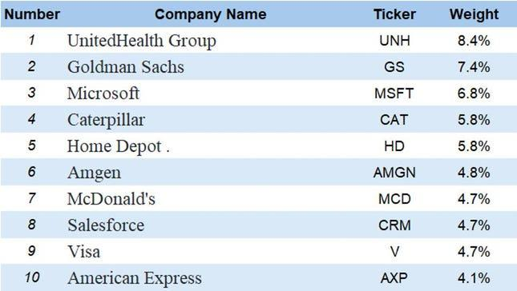

The Dow Jones Industrial Average (DJIA) stands as a pivotal measure in the world of financial markets, closely tracked by investors globally. Encompassing 30 major publicly traded companies, the DJIA functions as a critical indicator of the U.S. economic climate. As technology continuously reshapes the landscape of financial transactions, the adoption of algorithmic trading in the DJIA context becomes increasingly pertinent. This article sheds light on algorithmic trading, addressing its potential effects on these key stocks. Furthermore, an examination of the benefits and hurdles present in implementing such strategies within the DJIA is undertaken. The fusion of technological advances and financial strategies has not only altered trading practices but also promises a strategic advantage for those adept in leveraging this blend. Understanding this intersection is crucial for anyone looking to excel in today's dynamic market environment.

## Table of Contents



## Understanding the Dow Jones Industrial Average

The Dow Jones Industrial Average (DJIA) is a pivotal stock market index that comprises 30 significant companies listed on U.S. stock exchanges. It is distinctively a price-weighted index, which means that each component company's influence on the index is proportional to its stock price rather than its market valuation. This calculation method contrasts with the market-cap weighted methodology of other indices such as the S&P 500, where companies with larger market capitalizations have greater influence.

The formula for calculating the DJIA is straightforward:

$$

\text{DJIA} = \frac{\sum_{\text{all stocks}} \text{Price of stock}}{\text{Dow Divisor}} 
$$

The sum of the prices of the 30 companies is divided by the Dow Divisor, a figure adjusted to maintain consistency when stock splits or other structural changes occur.

Historically, the DJIA has been regarded as a robust indicator of market trends due to its long-standing components, which are typically leaders in their respective industry sectors. These firms often have a longstanding history of stability and performance. By tracking these 30 companies, the DJIA provides a quick, accessible gauge of the market's overall health.

The DJIA's composition, encompassing all pivotal sectors of the economy including technology, finance, consumer goods, and health care, allows it to provide a comprehensive view of economic performance. This broad representation ensures that movements in the index reflect changes across the economic spectrum, rather than being overly influenced by any single industry. Consequently, the DJIA remains an integral tool for investors, policymakers, and analysts who monitor economic activity and market conditions.

## What is Algorithmic Trading?

Algorithmic trading, or algo trading, involves the use of sophisticated computer programs to automate the decision-making process for initiating trades in financial markets. These programs operate on a set of predefined rules or algorithms, which are devised to evaluate various market conditions and implement buy or sell orders based on this evaluation.

At the core of [algorithmic trading](/wiki/algorithmic-trading) is the reliance on algorithms that are crafted considering numerous factors including, but not limited to, timing, price levels, and complex mathematical models. For instance, an algorithm may be designed to execute a trade when the stock price reaches a certain level, or when it observes a recurring pattern in historical trading data. 

One of the major advantages of algorithmic trading is its capacity to perform trades with remarkable speed and accuracy. Unlike human traders, algorithms can process large datasets and execute transactions at speeds that are measured in milliseconds. This efficiency enables traders to exploit short-lived trading opportunities that would be nearly impossible to capture manually.

Moreover, algorithmic trading allows investors to react instantaneously to market conditions, adjusting their strategies based on real-time data. This is particularly beneficial in fast-moving markets where conditions can change rapidly. The ability to integrate large volumes of data and execute orders without human intervention offers a significant edge in terms of reducing emotional bias and increasing the precision of trades.

Investors and traders deploy algorithmic trading strategies across various asset classes, seeking to benefit from [arbitrage](/wiki/arbitrage) opportunities, [market making](/wiki/market-making), and [trend following](/wiki/trend-following). By leveraging the speed and computational power of algorithms, traders can capture profitable opportunities that arise from the inefficiencies in the market, which would typically be arduous to identify through manual trading efforts. 

Overall, algorithmic trading represents a powerful advancement in financial technology, allowing market participants to enhance their trading efficiency and effectiveness substantially.

## Algorithmic Trading in DJIA Stocks

Given the stable performance of its components, the Dow Jones Industrial Average (DJIA) presents an appealing target for algorithmic trading strategies. The relatively predictable behavior of its constituent stocks provides a fertile ground for algorithms to detect and capitalize on market inefficiencies.

Algorithms offer the ability to programmatically identify buy and sell signals within the DJIA by analyzing intricate patterns in historical stock data. These patterns might include price trends, [volume](/wiki/volume-trading-strategy) spikes, or statistical deviations from the norm. For instance, moving averages, which smooth out price data to identify trends, can be programmed into trading algorithms to generate buy or sell signals when short-term averages cross long-term averages.

```python
# Example of a simple moving average crossover strategy
def moving_average(data, window_size):
    return data.rolling(window=window_size).mean()

# Assuming 'data' is a pandas DataFrame with DJIA stock prices
short_window = 40
long_window = 100

data['short_mavg'] = moving_average(data['Close'], short_window)
data['long_mavg'] = moving_average(data['Close'], long_window)

data['signals'] = np.where(data['short_mavg'] > data['long_mavg'], 1.0, 0.0)
data['signals'] = data['signals'].diff()
```

Algo trading also enables the capture of short-lived trends and optimizes earnings by taking advantage of the [volatility](/wiki/volatility-trading-strategies) of high-priced DJIA stocks. This involves executing trades with a speed and precision unattainable through manual trading, leveraging minor price fluctuations that occur within seconds or minutes.

However, the development of such sophisticated trading systems can be cost-prohibitive for individual investors. The complexities lie in the creation and constant refinement of accurate algorithms that can adapt to evolving market conditions. This requires substantial investments in technology infrastructure, data acquisition, and expertise in quantitative finance. Furthermore, maintaining these systems involves continuous monitoring and adjustment, which may not be feasible for all investors without substantial resources. Despite these challenges, for those who can overcome the initial barriers, algorithmic trading offers significant opportunities to enhance returns on DJIA stocks.

## Challenges of Algo Trading with DJIA Stocks

Market conditions can change rapidly, and an algorithm may outlive its relevance if not adjusted timely. This dynamic nature means that algorithms, which are designed based on historical data and trends, need constant refinement. If an algorithm is not recalibrated to align with the latest market conditions, it risks becoming obsolete, potentially leading to financial losses.

The DJIA, being a price-weighted index, could skew the perceived performance, affecting algorithmic strategies. In a price-weighted index like the DJIA, the stocks with higher prices have a more significant impact on the index movement than those with lower prices, regardless of the company size. This characteristic can lead to distortions, as algorithms may overemphasize high-priced stocks in their trading decisions. For example, if a high-priced stock experiences a fluctuation, it disproportionately influences the algorithm's perception of overall market movement, possibly leading to misguided trading actions.

Regulatory compliance and the ethical concerns of high-frequency trading ([HFT](/wiki/high-frequency-trading-strategies)) remain major considerations. Algorithmic trading, especially HFT, must comply with stringent regulatory frameworks that exist to maintain market integrity and protect investors. Regulatory bodies scrutinize algorithmic trading to prevent unfair practices such as market manipulation. Additionally, ethical concerns arise around HFT's potential to exacerbate market volatility and disadvantage individual investors compared to institutional traders who have access to advanced technology.

Despite its efficiency, algo trading still requires oversight to handle unexpected market events or technical glitches. While algorithms can process vast amounts of data quickly and execute trades with precision, they are not infallible. Technical glitches, such as software bugs or hardware failures, can lead to substantial financial losses. Furthermore, unexpected market events—like geopolitical tensions or natural disasters—can cause market conditions to deviate significantly from historical patterns, negating the outputs of algorithms based on typical market behavior. As a result, continuous human supervision is necessary to intervene when anomalies occur and to ensure that the trading systems are operating as intended.

## Future of Algorithmic Trading in DJIA

The evolution of algorithmic trading within the Dow Jones Industrial Average (DJIA) is anticipated to be significantly influenced by advancements in [artificial intelligence](/wiki/ai-artificial-intelligence) (AI) and [machine learning](/wiki/machine-learning) (ML). These technologies offer the potential to greatly refine and enhance trading strategies through more sophisticated data analysis and pattern recognition capabilities. As the availability of financial data continues to expand exponentially, these algorithms can be optimized to better predict and respond to intricate market dynamics.

AI and ML frameworks help enable algorithms to process vast volumes of data more efficiently. Machine learning models can learn from historical data to identify subtle market trends and respond to real-time information quickly, reducing latency and improving the accuracy of trade execution. For example, advanced predictive analytics can assess a stock's past behavior to predict future price movements or volatility based on similar historical patterns.

The integration of big data analytics into algorithmic trading promises to enhance decision-making processes. By leveraging extensive datasets, which include unstructured data from news articles, market sentiment analysis, and social media feeds, algorithms can gain a fuller picture of market dynamics. This comprehensive approach allows for a more nuanced understanding of factors influencing stock prices within the DJIA and other indices, potentially increasing the profitability of trades.

In the technological landscape, ongoing innovation could democratize access to algorithmic trading tools, thus reaching a broader spectrum of investors. As technology becomes more transparent and accessible, smaller investors might bypass traditional barriers and engage in algorithmic trading through user-friendly platforms. This enhanced accessibility also highlights the importance of developing transparent, ethical, and secure automated trading systems to foster trust and reliability among users.

Python, a commonly used programming language in algorithmic trading, supports AI and ML model development. Here is a simple illustration of how machine learning might be employed to predict stock prices using historical data:

```python
import numpy as np
import pandas as pd
from sklearn.model_selection import train_test_split
from sklearn.linear_model import LinearRegression

# Load dataset
data = pd.read_csv('djia_stock_data.csv')

# Feature selection
X = data[['Open', 'High', 'Low', 'Volume']]
y = data['Close']

# Split data into training and testing sets
X_train, X_test, y_train, y_test = train_test_split(X, y, test_size=0.2, random_state=42)

# Initialize and train the model
model = LinearRegression()
model.fit(X_train, y_train)

# Predict
predictions = model.predict(X_test)

# Evaluate
accuracy = model.score(X_test, y_test)
print(f'Accuracy: {accuracy:.2f}')
```

This code snippet demonstrates a basic predictive model using linear regression, one of the simplest forms of AI, to forecast stock closing prices based on various input features within the DJIA dataset. As algorithms grow more complex and incorporate more sophisticated technologies, they will undoubtedly reshape the landscape of trading strategies, providing investors with sharper tools to navigate financial markets.

## Conclusion

Algorithmic trading stands as a formidable tool for managing the intricacies of financial markets, such as the Dow Jones Industrial Average (DJIA). By automating the decision-making process, it enhances the potential for timely and precise trades. The rapid execution and accuracy associated with algorithmic solutions provide significant advantages, allowing investors to respond to market conditions more effectively than manual trading could achieve.

Despite these benefits, adopting algorithmic trading involves navigating certain challenges. Foremost among these is the need to balance speed and precision with the inherent risks involved in automated strategies. These risks include algorithmic errors, susceptibility to rapidly changing market conditions, and potential regulatory scrutiny. Additionally, the complexity of developing and maintaining these systems demands a significant initial investment in both technology and expertise.

Investors aiming to capitalize on algorithmic trading must exercise caution and discernment. It is imperative to maintain a robust understanding of market fundamentals alongside technological advancements. This dual approach ensures that algorithmic trading strategies are both innovative and grounded in sound financial principles.

Ultimately, the key to leveraging algorithmic trading lies in the sophisticated integration of cutting-edge technology with deep financial acumen. As the financial landscape continues to evolve, those who manage to harness these elements will likely secure a competitive advantage in navigating the complexities of indices like the DJIA.

## References & Further Reading

[1]: ["Advances in Financial Machine Learning"](https://www.amazon.com/Advances-Financial-Machine-Learning-Marcos/dp/1119482089) by Marcos Lopez de Prado

[2]: Aronson, David R. ["Evidence-Based Technical Analysis: Applying the Scientific Method and Statistical Inference to Trading Signals"](https://www.amazon.com/Evidence-Based-Technical-Analysis-Scientific-Statistical/dp/0470008741)

[3]: Jansen, Stefan. ["Machine Learning for Algorithmic Trading"](https://github.com/stefan-jansen/machine-learning-for-trading)

[4]: Chan, Ernest P. ["Quantitative Trading: How to Build Your Own Algorithmic Trading Business"](https://github.com/ftvision/quant_trading_echan_book)

[5]: ["Algorithmic and High-Frequency Trading"](https://www.amazon.com/Algorithmic-High-Frequency-Trading-Mathematics-Finance/dp/1107091144) by Álvaro Cartea, Sebastian Jaimungal, and José Penalva