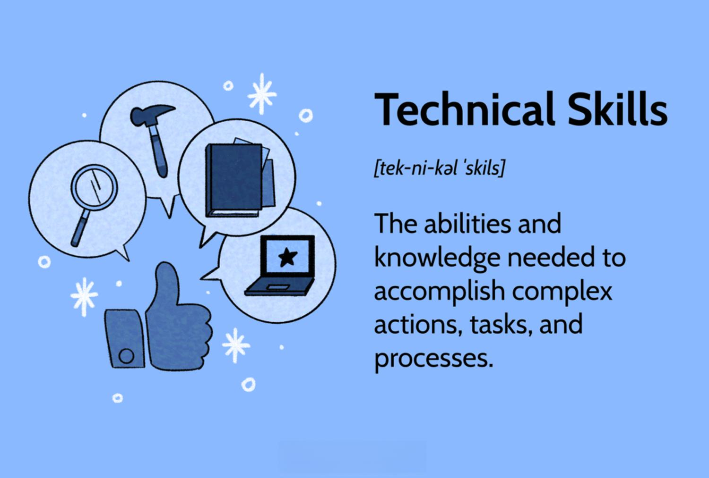

## Table of Contents

## What are technical skills and why are they important for a resume?

Technical skills are specific abilities and knowledge needed to perform tasks related to a certain job or field. These skills can include things like using computer software, understanding coding languages, or operating machinery. They are different from soft skills, which are more about how you work with others and communicate. Technical skills are often learned through education, training, or hands-on experience.

Having technical skills on your resume is important because it shows employers that you have the specific knowledge and abilities needed for the job. When employers look at resumes, they want to see that you can do the work they need done. By listing your technical skills, you help them see that you are a good fit for the position. This can make you stand out from other applicants and increase your chances of getting an interview.

## How can beginners identify their technical skills?

Beginners can start by thinking about what they have learned in school or through any courses they have taken. For example, if they took a computer class, they might have learned how to use Microsoft Word or Excel. These are technical skills. They should also think about any hobbies or projects they have worked on. If they built a website or fixed a computer, those are technical skills too. Writing down everything they know how to do, even if it seems small, can help them see what their technical skills are.

Another way to identify technical skills is by looking at job descriptions for positions they are interested in. These descriptions often list the skills needed for the job. Beginners can compare these lists to their own abilities and see where they match up. They might also talk to teachers, friends, or family members who can help them recognize skills they might not have thought of. By doing these things, beginners can get a clear picture of their technical skills and feel more confident when they apply for jobs.

## What are some basic technical skills that beginners should include on their resume?

Beginners should start by including skills they learned in school or from courses. For example, if they know how to use Microsoft Word or Excel, they should put that on their resume. These programs are used a lot in many jobs. Knowing how to use them can show that a beginner can do basic tasks on a computer. They should also include any skills they learned from hobbies or projects. If they built a simple website or fixed a computer, these are good skills to list. These skills show that they can learn new things and solve problems.

Another important skill is knowing how to use the internet and email. Most jobs need people who can search for information online and communicate by email. If beginners are good at using search engines like Google or sending clear emails, they should mention this on their resume. Basic skills like these can make a big difference. They show that a beginner can handle common tasks that many jobs need. By listing these skills, beginners can show they are ready to start working and learning more.

## How can intermediate users enhance their technical skills for better job prospects?

Intermediate users can enhance their technical skills by taking online courses or attending workshops. Many websites offer free or low-cost classes on topics like coding, data analysis, or using new software. By completing these courses, intermediate users can learn new skills that are in demand in the job market. They can also join online communities or forums where they can ask questions and learn from others. This way, they can keep up with the latest trends and technologies in their field.

Another way to improve technical skills is by working on personal projects or contributing to open-source projects. This hands-on experience helps intermediate users apply what they've learned and build a portfolio of their work. Employers like to see real examples of what someone can do, so having projects to show can make a big difference. Intermediate users should also look for internships or part-time jobs where they can use their skills in a real work setting. This not only helps them gain experience but also gives them something to talk about in job interviews. By doing these things, intermediate users can make their resumes stronger and increase their chances of getting better job offers.

## What are common technical skills required in the IT industry?

In the IT industry, some common technical skills include knowing how to code in languages like Python, Java, or C++. These languages are used to create software and websites. People in IT also need to understand how to work with databases, like MySQL or MongoDB. This means they can store and manage data for businesses. Another important skill is knowing how to use operating systems like Windows, Linux, or macOS. IT workers need to set up and fix problems on these systems.

Another set of skills involves working with networks and cybersecurity. IT professionals should know how to set up and maintain networks, which means connecting computers and devices so they can share information. They also need to know about cybersecurity to protect data from hackers. This includes using tools to find and fix security problems. Lastly, many IT jobs require skills in cloud computing, like using services from Amazon Web Services (AWS) or Microsoft Azure. These services help businesses store data and run applications online, making them more efficient.

## How do you list programming languages on a resume?

When listing programming languages on your resume, start with the ones you know best. Put them at the top of your list. This shows employers which languages you are good at. For each language, you can say how much experience you have, like "Proficient in Python" or "Familiar with Java." If you have used these languages in projects or jobs, you can mention that too. This helps show that you can use these skills in real work.

It's also good to be honest about your skill level. Don't say you are an expert if you are not. Employers will find out during interviews or on the job. If you are learning a new language, you can list it as "Currently learning C++" or "Basic knowledge of Ruby." This shows that you are trying to improve your skills. Keep your list short and clear so employers can see your skills quickly.

## What are advanced technical skills that can set a candidate apart from others?

Advanced technical skills can really help a candidate stand out from others. One important skill is [machine learning](/wiki/machine-learning). This means using computers to learn from data and make predictions. People who know how to use machine learning can help businesses make better decisions. Another advanced skill is working with big data. This means handling and understanding huge amounts of information. Companies need people who can make sense of all this data to find useful patterns and trends.

Another skill that sets candidates apart is knowing how to use DevOps tools. DevOps is about making software development and operations work better together. Tools like Docker and Kubernetes help manage and deploy applications more efficiently. Being good at these tools shows that a candidate can help a company improve its software processes. Also, knowing how to do ethical hacking can be a big plus. This means finding and fixing security problems in a system to keep it safe from attacks. Companies really value people who can protect their data and systems.

## How should someone with expert-level technical skills showcase them on their resume?

Someone with expert-level technical skills should highlight their advanced abilities clearly on their resume. They can do this by listing specific projects they have worked on and the impact those projects had. For example, if they developed a machine learning model that improved a company's sales predictions, they should mention this. They can also include any patents they hold or publications they have authored. This shows they are leaders in their field. It's important to use keywords from their industry so that their resume stands out to recruiters and applicant tracking systems.

In addition to listing projects and achievements, experts should include any advanced certifications they have earned. Certifications like Certified Information Systems Security Professional (CISSP) or Google Cloud Engineer can show they have mastered complex skills. They should also mention any teaching or mentoring they have done, as this shows they can share their knowledge with others. By showcasing these expert-level skills and experiences, candidates can demonstrate to employers that they are not just skilled, but also valuable leaders in their field.

## What are the latest technical skills in demand across various industries?

The latest technical skills in demand across various industries include skills in [artificial intelligence](/wiki/ai-artificial-intelligence) (AI) and machine learning. Many companies want to use AI to make their work easier and faster. They need people who can build and use AI tools to help with things like predicting what customers will do next or sorting through lots of data quickly. Another important skill is working with cloud computing. More businesses are using the cloud to store their information and run their apps. They need people who know how to use cloud services like Amazon Web Services (AWS) or Microsoft Azure to keep their data safe and their apps running smoothly.

Cybersecurity is another skill that is very much in demand. With more work happening online, companies need to protect their data from hackers. They look for people who can find and fix security problems to keep their information safe. Data analysis is also a big skill that many industries need. Companies have a lot of data and they need people who can look at it and find useful information. This helps them make better decisions about their business. Knowing how to use tools like Python or R for data analysis can make someone very valuable to a company.

## How can one keep their technical skills updated and relevant?

Keeping your technical skills updated and relevant is important for staying competitive in your job. One way to do this is by taking online courses. Websites like Coursera, Udemy, and LinkedIn Learning offer classes on many different topics. These can help you learn new skills or improve the ones you already have. It's a good idea to focus on skills that are in demand in your industry. This way, you can make sure your skills are useful to employers.

Another way to keep your skills current is by joining online communities and forums. Places like Stack Overflow, GitHub, or Reddit can be great for this. You can ask questions, share what you know, and learn from others. This helps you stay up-to-date with the latest trends and technologies. Also, working on personal projects or contributing to open-source projects can help. This gives you hands-on experience and shows employers that you are always learning and improving.

## What role do certifications play in demonstrating technical skills on a resume?

Certifications are important for showing your technical skills on a resume. They tell employers that you have learned specific skills and passed a test to prove it. For example, if you have a certification in Python, it shows you know how to use that programming language well. Certifications can make your resume stand out because they show you are serious about your skills and willing to learn more.

Having certifications can also help you get better job opportunities. Many companies look for people with certain certifications because it makes it easier for them to see if you have the skills they need. For example, a certification in cybersecurity can show that you know how to keep data safe. By including these certifications on your resume, you can show employers that you are ready to do the job and have the skills they are looking for.

## How can experts effectively communicate their technical expertise to non-technical recruiters?

When experts want to show their technical skills to non-technical recruiters, they should use simple words and examples. Instead of using big technical words, they can explain what they do in a way that anyone can understand. For example, if they work with machine learning, they can say they help computers learn from data to make better decisions. This makes it easier for recruiters to see how their skills can help the company.

Experts can also share stories about their work. They can talk about a project they did and how it helped the business. For example, they might say they built a tool that saved the company time and money. By using these stories, experts can show the value of their skills without getting too technical. This way, recruiters can see how the expert's skills can solve real problems and help the company grow.

## References & Further Reading

[1]: Bergstra, J., Bardenet, R., Bengio, Y., & Kégl, B. (2011). ["Algorithms for Hyper-Parameter Optimization."](https://papers.nips.cc/paper/4443-algorithms-for-hyper-parameter-optimization) Advances in Neural Information Processing Systems 24.

[2]: ["Advances in Financial Machine Learning"](https://www.amazon.com/Advances-Financial-Machine-Learning-Marcos/dp/1119482089) by Marcos Lopez de Prado

[3]: ["Evidence-Based Technical Analysis: Applying the Scientific Method and Statistical Inference to Trading Signals"](https://www.amazon.com/Evidence-Based-Technical-Analysis-Scientific-Statistical/dp/0470008741) by David Aronson

[4]: ["Machine Learning for Algorithmic Trading"](https://github.com/PacktPublishing/Machine-Learning-for-Algorithmic-Trading-Second-Edition) by Stefan Jansen

[5]: ["Quantitative Trading: How to Build Your Own Algorithmic Trading Business"](https://www.amazon.com/Quantitative-Trading-Build-Algorithmic-Business/dp/1119800064) by Ernest P. Chan