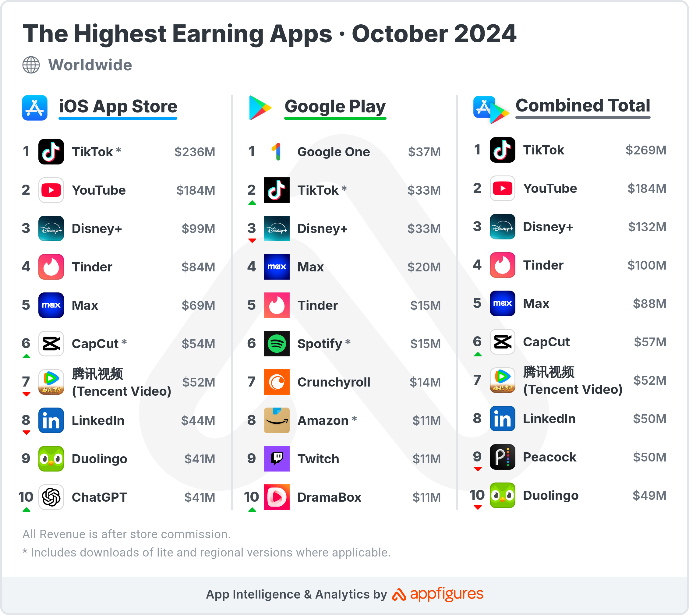

## Table of Contents

## What are investment apps and why are they important for beginners?

Investment apps are mobile applications that help people buy and sell investments like stocks, bonds, and funds right from their smartphones. They make it easy for anyone to start investing without needing to go to a bank or use a computer. These apps often have simple designs and tools that help users understand investing better. Some popular investment apps include Robinhood, E*TRADE, and Charles Schwab.

For beginners, investment apps are important because they make investing less scary and more accessible. Many apps offer features like free stock trading, educational resources, and easy-to-use interfaces that can help new investors learn as they go. This means beginners can start with small amounts of money and gradually learn more about the market without feeling overwhelmed. By using these apps, beginners can build their confidence and knowledge, which is crucial for making smart investment choices in the future.

## How do I choose the right investment app as a beginner?

When you're just starting out with investing, picking the right app can feel a bit tricky. You should look for apps that are easy to use and understand. A good app for beginners will have a simple design and clear instructions. It should also let you start with small amounts of money, so you don't have to worry about losing a lot if you make a mistake. Some apps even offer practice accounts where you can try investing without using real money. This can be a great way to learn before you start using your own cash.

Another important thing to consider is whether the app offers educational resources. Learning about investing is just as important as actually doing it. Look for apps that have guides, tutorials, or even short videos that explain things like stocks, bonds, and how the market works. It's also good to check if the app has low fees or if it offers free trading. This can help you save money as you learn. Lastly, make sure the app is safe and trusted by other users. Reading reviews and checking if the app is regulated by financial authorities can give you peace of mind as you start your investing journey.

## What are the key features to look for in an investment app for someone starting out?

When you're starting out with investing, you want an app that's easy to use. Look for one with a simple design and clear instructions. It should let you start with small amounts of money, so you don't have to worry about losing a lot if you make a mistake. Some apps even let you practice with fake money first, which is a great way to learn without risking your own cash.

Another important thing is educational resources. A good app for beginners will have guides, tutorials, or videos that explain things like stocks, bonds, and how the market works. Also, check if the app has low fees or offers free trading, which can help you save money as you learn. Make sure the app is safe and trusted by other users. Reading reviews and seeing if it's regulated by financial authorities can help you feel more confident as you begin your investing journey.

## Can you recommend the top 3 investment apps suitable for beginners in October 2024?

In October 2024, one of the best investment apps for beginners is Robinhood. It's easy to use and lets you start investing with just a few dollars. Robinhood has a simple design and offers free stock trading, which can help you save money as you learn. They also have a feature called "Robinhood Learn" with lots of educational resources like articles and videos to help you understand investing better.

Another great app for beginners is Acorns. Acorns is perfect if you want to start with very small amounts of money. It rounds up your everyday purchases to the nearest dollar and invests the change for you. This makes investing automatic and easy. Acorns also has educational content and a simple interface that's great for new investors.

Lastly, consider using the Charles Schwab app. It's known for being user-friendly and offers a lot of tools to help you learn about investing. Charles Schwab lets you practice with a fake account before using real money, which can be really helpful if you're new to investing. They also have low fees and a lot of resources to guide you as you start your investing journey.

## What are the costs associated with using investment apps, and how do they vary for different user levels?

The costs of using investment apps can vary a lot. For beginners, many apps offer free trading of stocks and ETFs, which means you don't pay any money to buy or sell these investments. However, some apps might charge fees for other types of investments like options or mutual funds. There can also be account maintenance fees if you don't meet certain balance requirements, and some apps charge for things like real-time data or advanced trading tools. It's important to read the fine print to know what you might have to pay.

For more experienced users, the costs can be different. They might use more advanced features that come with higher fees, like access to real-time market data or more complex trading tools. Some apps offer premium services with monthly or yearly subscription fees that give you more features and better tools. Experienced investors might also trade more often, so even small transaction fees can add up over time. It's good to compare different apps to see which one offers the best value for the level of service you need.

## How do investment apps cater to intermediate investors looking to diversify their portfolios?

Investment apps help intermediate investors by offering more advanced tools and options to diversify their portfolios. These apps often include features like fractional shares, which let you buy small pieces of expensive stocks or ETFs, making it easier to spread your money across different investments. They also provide access to a wider range of investment types, such as mutual funds, bonds, and even cryptocurrencies, which can help you build a more balanced portfolio. Some apps have tools for setting up automatic investments, so you can regularly add money to different assets without having to remember to do it yourself.

Additionally, many investment apps offer research tools and real-time market data that can be useful for intermediate investors. These tools help you analyze different investments and make more informed decisions about where to put your money. Some apps also let you set up different types of accounts, like retirement or taxable investment accounts, which can be part of a smart diversification strategy. By using these features, intermediate investors can manage and grow their portfolios more effectively, taking advantage of the flexibility and resources that modern investment apps provide.

## What advanced features should an experienced investor look for in an investment app?

Experienced investors should look for investment apps that offer advanced features like customizable charts and technical analysis tools. These tools help you study market trends and make better decisions about buying and selling. You might also want an app that lets you set up alerts for specific price points or news events, so you can act quickly when something important happens. Some apps even offer [backtesting](/wiki/backtesting), where you can see how your investment strategies would have worked in the past, which can help you fine-tune your approach.

Another important feature for experienced investors is the ability to trade options and other complex financial products. Options can be a way to manage risk or increase potential returns, but they need special tools and data to use effectively. Look for apps that provide detailed options analytics and risk management features. Additionally, experienced investors might benefit from integration with other financial tools, like tax software or portfolio management systems, to keep everything organized and working together smoothly.

## Which investment apps offer the best tools for technical analysis in October 2024?

In October 2024, one of the top apps for technical analysis is TradingView. This app is great because it has lots of charts and tools that help you see how stocks and other investments are doing. You can draw lines on the charts, add indicators, and even share your ideas with other investors. It's easy to use but powerful enough for experienced investors who want to dive deep into the numbers.

Another good app for technical analysis is Thinkorswim by TD Ameritrade. This app has a lot of advanced features that let you study the market in detail. You can use different kinds of charts, set up custom indicators, and even backtest your trading strategies to see how they might have worked in the past. It's a bit more complex, but if you're serious about technical analysis, it's worth learning how to use it.

## How can expert investors utilize API access and automation features in investment apps?

Expert investors can use API access and automation features in investment apps to make their investing easier and more efficient. APIs, or Application Programming Interfaces, let you connect the app to other software and tools. This means you can set up your own custom programs to automatically buy or sell investments based on certain rules you set. For example, you could write a program that buys a stock when it reaches a certain price or sells it when it drops too much. This can save you a lot of time and help you stick to your investing plan without having to watch the market all day.

Automation features in investment apps also help expert investors manage their portfolios better. These features let you set up automatic trades, so you don't have to do everything by hand. You can tell the app to invest a certain amount of money every month or to rebalance your portfolio to keep it in line with your goals. This can be really helpful for managing a lot of different investments at once. By using APIs and automation, expert investors can focus on bigger decisions and let the app handle the smaller, routine tasks.

## What are the security measures implemented by top investment apps to protect user data and investments?

Top investment apps use strong security measures to keep your data and money safe. They use encryption to protect your information when you're using the app or sending it over the internet. This means your personal details and account information are scrambled so that only the app can understand them. They also use two-[factor](/wiki/factor-investing) authentication, which means you need more than just a password to log in. You might get a code sent to your phone or have to use a fingerprint or face ID. This makes it much harder for someone else to get into your account, even if they know your password.

These apps also keep an eye out for anything suspicious. They use special systems to watch for strange activity, like someone trying to log in from a new place or making a lot of trades at once. If they see something that doesn't look right, they might ask you to confirm it's really you or even lock your account until you can check it. Plus, they have insurance to protect your money if something goes wrong. So, even if there's a big problem, your investments are still safe.

## How do the top investment apps of October 2024 support tax optimization and planning?

In October 2024, the top investment apps help with tax optimization and planning by letting you set up different types of accounts, like retirement accounts. These accounts can have special tax benefits. For example, with a Roth IRA, you pay taxes on the money you put in, but you don't pay taxes when you take the money out later. This can help you keep more of your money over time. Some apps also let you see how much you might owe in taxes based on your investments, so you can plan better.

Apps like Charles Schwab and Fidelity also offer tools that help you with tax-loss harvesting. This means selling investments that have lost value to offset the taxes you owe on your gains. They can do this automatically for you, which makes it easier to save on taxes without having to think about it all the time. By using these features, you can make smarter choices about your investments and keep more of your earnings.

## What are the future trends in investment apps that experts should be aware of for strategic investment planning?

In the future, investment apps are likely to use more [artificial intelligence](/wiki/ai-artificial-intelligence) (AI) to help investors make better decisions. AI can look at a lot of data quickly and find patterns that humans might miss. This means the apps could give you personalized advice based on your investing goals and how the market is doing. They might also use AI to automatically adjust your investments to keep them in line with your plan, making it easier for you to stay on track without having to watch the market all the time.

Another trend to watch out for is the growth of social investing features. More and more apps are letting you see what other investors are doing and even copy their strategies. This can be helpful because you can learn from others and see what's working for them. But it's important to remember that everyone's financial situation is different, so what works for someone else might not be the best for you. Keeping an eye on these trends can help you plan your investments better and take advantage of new tools as they come out.

## Top Investment Apps Embracing Algo Trading

As of October 2024, a number of investment apps have integrated algorithmic trading features, transforming how users engage with financial markets. These apps are designed to enhance investment strategies through sophisticated algorithms that facilitate timely and efficient trades. In this analysis, we will explore some of the top investment apps that are harnessing the power of algorithmic trading.

**1. Robinhood**

Robinhood has been at the forefront of democratizing investment access. In 2024, it has expanded its functionalities to include algorithmic trading options for retail investors. Users can create their own trading algorithms using a user-friendly interface, allowing for a customized trading experience. 

**Functionality and Features:** Robinhood supports a range of trading algorithms which users can access via API integration. This feature provides flexibility for developers and tech-savvy investors to implement and test their own strategies.

**User Experience:** The app maintains its signature easy-to-navigate interface, which is particularly appealing to novice traders. Robinhood also offers a comprehensive help center and responsive customer service, ensuring robust support for users.

**Security and Fees:** Robinhood employs industry-standard security measures, including two-factor authentication and data encryption. The app remains commission-free, although premium features like margin trading require a subscription.

**Customer Reviews:** Robinhood continues to receive strong reviews for its ease of use and low cost of entry, though some users have reported challenges in executing more complex strategies due to limitations in the app's algorithmic trading capabilities.

**2. E*TRADE**

E*TRADE, a veteran in online trading services, offers a powerful platform featuring algorithmic trading options tailored for more experienced investors.

**Functionality and Features:** E*TRADE provides an advanced desktop platform, E*TRADE Pro, which includes customizable algo trading solutions and real-time market data analysis.

**User Experience:** The app caters to a wide range of users, from beginners to professionals, offering extensive educational resources and tools to optimize trading strategies. The mobile app is highly rated for its robust functionality and seamless performance.

**Security and Fees:** E*TRADE ensures secure transactions with encryption and biometric login features. The platform charges a competitive commission structure, particularly attractive to frequent traders.

**Customer Reviews:** Users commend E*TRADE for its rich feature set and dependability, though some find the platform's learning curve steep compared to more simplified apps.

**3. QuantConnect**

QuantConnect stands out by offering a more specialized service focused entirely on algorithmic trading. It provides a quantitative algorithm library, facilitating the development and [backtesting](/wiki/backtesting) of sophisticated trading strategies.

**Functionality and Features:** QuantConnect is designed for quantitative analysts and developers, providing an open-source algorithm framework and a multi-asset trading platform that includes equities, futures, cryptocurrencies, and more.

**User Experience:** The platform is highly technical and best suited for individuals with a programming background. It provides a coding environment (Python and C#) and extensive documentation to support algorithm development.

**Security and Fees:** QuantConnect offers secure API connections and data protection measures. The fee structure is tiered based on the services used, with a focus on providing transparency and flexibility for various user needs.

**Customer Reviews:** QuantConnect is praised for its powerful analytical capabilities and community-driven approach. Successful case studies often highlight the platform's role in fostering innovation and personalized trading strategies.

**4. Interactive Brokers**

[Interactive Brokers](/wiki/interactive-brokers-api) is renowned for its comprehensive suite of trading tools, including sophisticated algorithmic trading capabilities available through its Trader Workstation (TWS).

**Functionality and Features:** The TWS platform supports custom algorithmic trading and numerous pre-built algorithms for executing trades across multiple global markets.

**User Experience:** Interactive Brokers targets professional and institutional investors, offering extensive market research, advanced analytics, and a customizable interface. Their 24/7 customer service supports users across time zones.

**Security and Fees:** The app offers robust security protocols and a transparent, low-cost fee structure. Volume discounts are available for high-frequency traders.

**Customer Reviews:** Clients often speak highly of Interactive Brokers for its broad market access and substantial research offerings, though the platform's complexity may be daunting for less experienced users.

These investment apps demonstrate varied approaches to integrating algorithmic trading, ranging from user-friendly interfaces to advanced analytical tools. As investors seek efficiency and precision in trading, choosing the right platform will depend on individual needs, from ease of use to depth of technical resources.

## Choosing the Right Tool for Your Investment Needs

Selecting the right investment app is crucial to aligning personal financial goals with market opportunities. Each investor has unique priorities, whether it’s maximizing return, minimizing risk, or expanding market horizons. Aligning app features with specific investment strategies and risk tolerances is fundamental to achieving these objectives.

Investors should first consider their investment strategy. For instance, a long-term growth-oriented investor might prioritize apps offering comprehensive analytics and stock screening tools, while a day trader may value real-time data and quick execution capabilities. Assessing an app's robustness in providing algorithmic trading can significantly impact an investor's ability to tailor strategies based on automation and data-driven insights.

Risk tolerance is another critical [factor](/wiki/factor-investing). Users with low risk tolerance should seek apps with portfolio diversification tools, risk assessment features, and options for low-risk investments. In contrast, those with higher risk appetites might benefit from apps that offer access to derivatives or margin trading.

Cost considerations are equally important. Investment apps often have fee structures including subscription fees, transaction costs, and commissions. These can accumulate and erode investment returns over time. Understanding the total cost of app usage is paramount. Apps with zero or low-fee transactions might appeal to cost-sensitive users. However, lower fees often come with trade-offs in features or customer support.

The learning curve associated with a new investment app is a crucial factor for user adoption and proficiency. Novice investors should consider platforms with intuitive interfaces, robust educational resources, and user-friendly dashboards. In contrast, seasoned investors might prefer apps with advanced functionalities and customization options, even if they require a steeper learning process.

Market access is another critical factor to consider. Some apps offer broader access to international markets, commodities, or cryptocurrencies, which may align with investors looking to diversify globally. Ensuring the app supports the asset classes and exchanges an investor is interested in is vital.

Testing apps through free trials or demo accounts is an advantageous approach. These options allow users to evaluate the app’s features, user interface, and overall functionality without financial commitment. It serves as a practical method to determine if an app can meet an investor’s specific needs in a real-world setting.

Finally, it is essential to regularly review app performance to ensure it continues to meet evolving investment needs. The dynamic nature of financial markets, alongside personal financial goals, necessitates periodic re-evaluation of the tools employed. Investing time in ongoing learning about new features and updates can unlock additional value and optimize investment outcomes.

In conclusion, choosing the right investment app involves careful consideration of various factors, from alignment with personal strategies and risk tolerance to cost and market access. Regular reviews and leveraging trial opportunities can lead to more informed decisions and, ultimately, enhanced investment performance.

## References & Further Reading

[1]: Bergstra, J., Bardenet, R., Bengio, Y., & Kégl, B. (2011). ["Algorithms for Hyper-Parameter Optimization."](https://papers.nips.cc/paper/4443-algorithms-for-hyper-parameter-optimization) Advances in Neural Information Processing Systems 24.

[2]: ["Advances in Financial Machine Learning"](https://www.amazon.com/Advances-Financial-Machine-Learning-Marcos/dp/1119482089) by Marcos Lopez de Prado

[3]: ["Evidence-Based Technical Analysis: Applying the Scientific Method and Statistical Inference to Trading Signals"](https://www.amazon.com/Evidence-Based-Technical-Analysis-Scientific-Statistical/dp/0470008741) by David Aronson

[4]: ["Machine Learning for Algorithmic Trading"](https://github.com/PacktPublishing/Machine-Learning-for-Algorithmic-Trading-Second-Edition) by Stefan Jansen

[5]: ["Quantitative Trading: How to Build Your Own Algorithmic Trading Business"](https://books.google.com/books/about/Quantitative_Trading.html?id=j70yEAAAQBAJ) by Ernest P. Chan