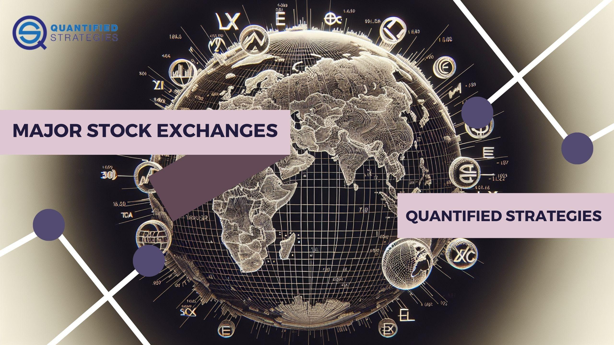

Stock exchanges hold a pivotal position in global financial markets, acting as organized venues where securities, including stocks and bonds, are bought and sold. Their significance is underscored by their ability to provide liquidity, price discovery, and a secure environment for transactions, which are essential elements that maintain investor confidence and facilitate economic activities.

At the core, stock exchanges operate as intermediaries that facilitate the buying and selling of financial instruments. By matching buy and sell orders, they ensure that securities are traded efficiently and transparently. This system allows businesses to raise capital by issuing shares to the public, through processes like Initial Public Offerings (IPOs). Furthermore, exchanges like the New York Stock Exchange (NYSE) and NASDAQ offer platforms for trading equities, while other exchanges may deal in derivatives, commodities, and bonds. Their structured environments establish rules and regulations that protect investors and ensure that market activity is conducted fairly.

The impact of stock exchanges extends beyond mere trading activities. They are integral to economic growth and investment by channeling savings into productive investments. By facilitating the redistribution of capital towards sectors with high potential for development, they effectively contribute to economic innovation and productivity improvements. Furthermore, as stock prices are often viewed as indicators of economic health, they can influence economic policy-making and investor sentiment. The sustained growth of stock exchanges often correlates with the expansion and deepening of a nation's or region's economy, highlighting their role as barometers of financial stability and confidence.

In summary, stock exchanges serve as cornerstones of modern financial systems, driving economic progress and facilitating investment on a global scale. Their efficient functioning ensures the alignment of individual and institutional interests, fostering an environment conducive to growth and innovation.

## Table of Contents

## New York Stock Exchange (NYSE)

The New York Stock Exchange (NYSE) stands as one of the most iconic symbols of global finance. Established in 1792, its historical significance is deeply rooted in the evolution of the U.S. financial system and, by extension, the global market. Its humble beginnings under the Buttonwood Tree in Manhattan have grown into the world's largest stock exchange by market capitalization, a testament to its enduring influence and adaptability.

The NYSE facilitates the trading of a wide range of securities, including stocks, bonds, and exchange-traded funds ([ETF](/wiki/etf-trading-strategies)s). It is home to some of the largest and most influential companies in the world. Listing requirements on the NYSE are stringent, designed to ensure only the most stable and promising companies gain access to the vast pool of [liquidity](/wiki/liquidity-risk-premium) and investor attention available at the exchange. For instance, companies must meet minimum thresholds for [earning](/wiki/earning-announcement)s, market capitalization, and share distribution. This ensures that both the financial health and governance of listed companies meet high standards.

In the current global market, the NYSE remains at the forefront, crucial to the dynamics of international finance. It lists over 2,400 companies from more than 45 countries, generating a market capitalization of around $30 trillion. Notable companies listed on the NYSE include multinational giants like Apple Inc., Microsoft, and Berkshire Hathaway, each representing significant sectors of the economy such as technology and consumer goods. This diversity underscores the NYSE's role not just as an American exchange, but as a centerpiece of the global economic landscape.

The NYSE's ongoing influence is augmented by its structure, where an auction market with human oversight complements advanced technological platforms to ensure efficient and transparent trading. This blend of tradition and innovation helps maintain high investor confidence and positions the NYSE as a leading force in capital markets, perpetually shaping the future trajectory of businesses worldwide.

## NASDAQ

The NASDAQ (National Association of Securities Dealers Automated Quotations) represents a groundbreaking advancement in stock trading technology, primarily due to its fully electronic trading system. Unlike traditional stock exchanges with physical trading floors, NASDAQ operates through a network of computers that enables real-time, high-speed trading over the internet. This digital approach streamlines the buying and selling of securities, facilitating greater accessibility and efficiency for traders and investors worldwide.

One of the standout features of NASDAQ's electronic trading system is its ability to offer continuous trading. This is in contrast to the auction-based systems of traditional exchanges like the New York Stock Exchange (NYSE), where trades often occur in discrete time intervals. With such an infrastructure, NASDAQ provides a level playing field for all market participants by eliminating geographical barriers, allowing for immediate order execution and enhancing price transparency.

Comparing NASDAQ to traditional stock exchanges reveals significant differences in their operation. While traditional exchanges may rely on open outcry or auction models where designated market makers interact face-to-face on a trading floor, NASDAQ's market operates through a dealer network, often referred to as a market maker system. Market makers undertake the role of ensuring liquidity by buying and selling securities from their own accounts, hence allowing for seamless trade execution. This flexibility and efficiency of NASDAQ's electronic platform have made it particularly attractive to technology and growth-oriented companies. 

In terms of technological advancements, NASDAQ has integrated several key innovations to maintain its competitive edge. These include sophisticated order routing systems and data analytics tools that help optimize trade executions and risk management. Additionally, NASDAQ's market surveillance technology ensures fair trading practices by monitoring and analyzing market activity continuously.

NASDAQ hosts a plethora of major companies, particularly cementing its status as a hub for technology-driven organizations. Some of the world's largest and most influential tech giants, including Apple, Microsoft, and Amazon, are listed on this exchange, underscoring NASDAQ's reputation as the premier venue for tech sector equities. This concentration of technology firms is a testament to the appeal of NASDAQ's efficient, transparent, and highly liquid marketplace, which caters well to the fast-paced nature of modern tech industries.

In conclusion, NASDAQ's electronic trading system highlights the shift towards digital finance, offering market participants unparalleled efficiency and access. Its technology-driven ecosystem not only distinguishes it from traditional exchanges but also attracts some of the most innovative and rapidly growing companies globally. This unique amalgamation of technology and finance solidifies NASDAQ's role as a cornerstone of modern electronic trading.

## Tokyo Stock Exchange (TSE)

The Tokyo Stock Exchange (TSE) stands as Japan's largest and most significant stock exchange, playing a crucial role in the economic framework of Asia. Established in 1878, the TSE has grown to become a vital component in the region, facilitating capital flow and investment across various sectors.

The TSE is divided into several market segments, each catering to different scales and types of companies. The main board is divided into two sections: the First Section, which includes large companies, and the Second Section, which consists of medium-sized firms. Additionally, the TSE operates the Mothers (Market of the High-growth and Emerging Stocks) and the JASDAQ market, which target startups and venture businesses, encouraging innovation and economic growth.

Key indices such as the Nikkei 225 and the TOPIX (Tokyo Stock Price Index) are instrumental in tracking the performance and economic health of Japanese equities on the TSE. The Nikkei 225 is a price-weighted average of 225 top-rated Japanese companies listed in the First Section, while the TOPIX covers all domestic companies listed in the First Section, offering a broader market perspective.

Several key industries are prominently represented on the TSE, reflecting Japan's economic strengths. Notable sectors include automotive, technology, electronics, and manufacturing. Major corporations like Toyota Motor Corporation, Sony Group Corporation, and Mitsubishi UFJ Financial Group are among the top companies listed on the TSE. These firms not only drive Japan's economy but also have substantial influence in global markets, impacting international trade and investment dynamics.

As Japan continues to play a significant role in global economics, the Tokyo Stock Exchange's influence and contributions remain vital. It facilitates the flow of capital necessary for economic advancement and serves as a bridge connecting investors and businesses across Asia and the world.

## London Stock Exchange (LSE)

The London Stock Exchange (LSE) stands as one of the oldest and most esteemed stock exchanges globally, with its origins dating back to 1698. Its historical context is rich, having played a pivotal role in financing industrial growth and facilitating international trade during the British Empire's prominence. This legacy has cemented its status as a critical international financial hub.

The market structure of the LSE is designed to accommodate a diverse range of investment activities. It is composed of several key segments including the Main Market, which lists large companies adhering to stringent disclosure regulations, and the Alternative Investment Market (AIM), designed for smaller, growing companies seeking more relaxed listing criteria. Trading on the LSE occurs between 8:00 am and 4:30 pm GMT, with the exchange employing a hybrid system of electronic and traditional trading methods to ensure efficiency and transparency.

In terms of European and global influence, the LSE is a powerhouse, serving as a barometer for economic health and business confidence across Europe. Its influence extends beyond the continent, with international investors keenly watching the LSE for opportunities and trends that mirror global economic conditions. The exchange facilitates investment flows and acts as a pivotal center for raising capital, underpinning significant economic growth and development.

Furthermore, the global reach of the LSE is amplified through its connections with the London Clearing House, offering robust clearing and settlement mechanisms, which enhance market confidence. Its integration and alliances with other financial institutions and exchanges further solidify its standing as a central node in the global financial network. This connectivity positions the LSE as an indispensable component in the execution of international trade and investment strategies.

## Shanghai Stock Exchange (SSE)

The Shanghai Stock Exchange (SSE) is a pivotal platform in China's financial landscape and a significant player on the world stage. As one of China's leading stock exchanges, SSE has transformed the way domestic and international investors interact with Chinese capital markets.

The market size of the SSE is impressive, with the exchange consistently ranking among the largest globally in terms of market capitalization. As of 2023, the SSE's total market capitalization exceeds $7 trillion, demonstrating its substantial influence. This large scale is a reflection of the SSE's ability to attract a diverse range of companies and investors, both individual and institutional. Consequently, it plays a critical role in channeling savings into productive investments, thereby contributing significantly to China's economic growth.

The economic impact of the SSE is substantial, as it serves as a barometer for the Chinese economy. The exchange facilitates [capital raising](/wiki/hedge-fund-capital-raising) for companies, allowing them to expand, innovate, and even go global. This, in turn, fuels job creation and technological advancements within China, reinforcing the SSE's role in the nation's economic development.

Important indices on the SSE include the SSE Composite Index and the SSE 50 Index. The SSE Composite Index, one of the most-watched indices, is a reflection of the overall Shanghai stock market, comprising all listed stocks, including A-shares and B-shares. In contrast, the SSE 50 Index includes the top 50 companies by market capitalization and liquidity, offering insights into the performance of the largest corporations in China.

Several notable companies are listed on the Shanghai Stock Exchange, representing crucial sectors such as finance, energy, and technology. Companies like the Industrial and Commercial Bank of China (ICBC), PetroChina, and China Life Insurance highlight the SSE's role in listing major state-owned enterprises. Additionally, the inclusion of technology firms, such as Semiconductor Manufacturing International Corporation (SMIC), underscores the exchange's growing emphasis on innovation-driven growth.

Overall, the Shanghai Stock Exchange stands as a cornerstone of China's financial system, with its market size and economic impact echoing the dynamic growth of the Chinese economy. Through its key indices and diverse company listings, the SSE not only supports domestic economic activities but also enhances China's financial integration into the global economy.

## Hong Kong Stock Exchange (HKEX)

Hong Kong's status as a leading financial hub is integral to its economy, with the Hong Kong Stock Exchange (HKEX) playing a pivotal role. The city's strategic location, acting as a gateway between the East and West, enhances its appeal for businesses and investors worldwide. This unique positioning makes HKEX a significant player in global finance.

HKEX's international importance and connectivity are underscored by its seamless integration with global markets. The Stock Connect programs with Shanghai and Shenzhen exemplify this connectivity by allowing international investors access to mainland China's capital markets and vice-versa. These programs represent a significant shift toward greater market liberalization and cross-border trading, fostering an environment of international investment cooperation.

The companies hosted on HKEX are a testament to its prominence. It lists a diverse array of firms, from local powerhouses to multinational corporations. Some of the most recognized names include Tencent, HSBC Holdings, and AIA Group, showcasing the Exchange's capacity to attract leading players from varied sectors. Notably, the introduction of dual-class shares has further drawn high-profile tech companies looking to tap into the Asian market while maintaining their unique governance structures.

The major indices, such as the Hang Seng Index, provide valuable insights into the performance of key sectors driving the Hong Kong economy. This index includes 50 of the largest and most liquid companies, serving as a barometer for the health of its market. Additionally, it reflects broader economic conditions and investor sentiment, acting as an essential tool for market analysis.

In summary, the Hong Kong Stock Exchange's status as an international financial nexus, its strategic partnerships, and the diversity and strength of its listed companies and indices highlight its central role in facilitating global commerce and investment. As it continues to evolve, HKEX remains a cornerstone of financial operations and innovation in Asia and beyond.

## Euronext

Euronext is a leading pan-European stock exchange that serves as a pivotal financial hub across multiple countries. Established in 2000 as a result of the merger of the Amsterdam, Brussels, and Paris exchanges, Euronext has significantly expanded its reach and influence. It now includes markets in Lisbon, Dublin, Milan, and Oslo, making it one of the largest stock exchange groups in Europe. This multi-country operation allows Euronext to offer a diverse array of financial products and services, ensuring it meets the investment needs of a broad clientele.

Operating across several key markets, Euronext facilitates trading in equities, bonds, exchange-traded funds (ETFs), derivatives, commodities, and indices. This variety makes it attractive to a wide range of investors, from individuals to large institutional entities. A notable feature of Euronext is its role in the integration of European stock exchanges, providing a unified platform that enhances liquidity and transparency for investors. This integration has made the exchange more resilient and adaptive to the rapid changes in global financial markets.

The sectors represented on Euronext are critical to understanding its market dynamics. It prominently features companies from industries such as technology, healthcare, energy, financial services, and consumer goods. Major companies listed on Euronext include global giants such as Airbus, L'Oréal, TotalEnergies, and Unibail-Rodamco-Westfield. These sectors and companies contribute to Euronext’s position as a key player in European and global finance.

Euronext also distinguishes itself through its commitment to innovation and sustainability. By incorporating cutting-edge technologies and focusing on responsible investment practices, Euronext addresses the growing demand for sustainable financial products. This forward-thinking approach ensures that Euronext remains competitive and relevant in a rapidly evolving financial landscape.

In summary, Euronext plays a crucial role in the European financial ecosystem, providing a platform for diverse markets and sectors. Its expansion and integration of multiple regional exchanges offer investors numerous opportunities while fostering a more interconnected financial market across Europe.

## Bombay Stock Exchange (BSE)

The Bombay Stock Exchange (BSE), established in 1875, holds the distinguished title of being Asia's oldest stock exchange. Initially known as "The Native Share & Stock Brokers' Association," the BSE has been a pivotal institution in shaping the Indian financial markets. Its establishment marked the beginning of formalized trading in securities in India, laying the groundwork for the country's modern financial ecosystem.

The BSE significantly influences both the Indian economy and global financial markets. In India, it serves as a crucial platform for raising capital, enabling economic growth, and fostering corporate governance. Internationally, the BSE attracts foreign investment, evidenced by numerous multinational corporations listing their stocks to capitalize on India's burgeoning market potential. This influence extends to the derivatives and commodities markets, where the BSE's comprehensive product offerings cater to a diverse set of investors, both domestic and international.

Central to the BSE's operations is the S&P BSE Sensex, its flagship index. The Sensex comprises 30 financially stable and well-established companies across various sectors. As a barometer of the Indian stock market's health, the Sensex provides investors with a platform to gauge market trends and make informed investment decisions. It closely reflects the economic performance and investor sentiment in India, thereby attracting attention from global investors seeking to tap into the country's growth narrative.

Major companies listed on the BSE include industry giants such as Reliance Industries, Tata Consultancy Services (TCS), and Hindustan Unilever. These companies represent key sectors of the Indian economy, including energy, information technology, and consumer goods, underscoring the exchange's vital role in mirroring the country's industrial landscape.

In summary, the BSE's historical legacy, robust market structure, and influential indices make it a cornerstone of both the Indian and global financial sectors. Its continuous evolution and adaptability ensure its pivotal position in facilitating capital flows and supporting economic development.

## Major Stock Exchanges

As of 2016, 21 stock exchanges across the globe boasted a market capitalization of over US$1 trillion each, accounting for 87% of global market capitalization. This list provides insight into the leading stock exchanges by market capitalization, trading [volume](/wiki/volume-trading-strategy)s, and operating hours.

The table below details the top 20 stock exchanges in the world by market capitalization as of 2024, focusing on those with a market cap of over USD 1 trillion.

| Year | Stock Exchange                                    | MIC                           | Region      | City                     | Market Cap (USD tn) | Monthly Trade Volume (USD bn) | Time Zone | UTC Offset | DST | Open Hours (Local Time) | Open (UTC) | Close (UTC) |
|------|---------------------------------------------------|-------------------------------|-------------|--------------------------|--------------------:|-----------------------------:|-----------|------------|-----|--------------------------|------------|-------------|
| 2024 | New York Stock Exchange                           | XNYS                          | United States | New York City            | 28.33               | 1,452                       | EST/EDT   | −5:00      | Yes | 09:30–16:00              | 14:30      | 21:00       |
| 2024 | Nasdaq (US)                                       | XNAS                          | United States | New York City            | 26.62               | 1,262                       | EST/EDT   | −5:00      | Yes | 09:30–16:00              | 14:30      | 21:00       |
| 2024 | Shanghai Stock Exchange                           | XSHG                          | China        | Shanghai                 | 7.40                | 536                         | CST       | +8:00      | No  | 09:30–15:00              | 01:30      | 07:00       |
| 2024 | Euronext                                           | XAMS, XBRU, XMSM, XLIS, etc.  | Europe       | Amsterdam, Brussels, etc.| 7.22                | 174                         | CET/CEST  | +1:00      | Yes | 09:00–17:30              | 08:00      | 16:30       |
| 2024 | Japan Exchange Group (Tokyo Stock Exchange)       | XJPX (TYO)                    | Japan        | Tokyo                    | 6.94                | 797                         | JST       | +9:00      | No  | 09:00–15:00              | 00:00      | 06:00       |
| 2024 | Bombay Stock Exchange                             | XBOM                          | India        | Mumbai                   | 5.67                |                             | IST       | +5:30      | No  | 09:15–15:30              | 03:45      | 10:00       |
| 2024 | National Stock Exchange of India                  | XNSE                          | India        | Mumbai                   | 5.66                | 481                         | IST       | +5:30      | No  | 09:15–15:30              | 03:45      | 10:00       |
| 2024 | Shenzhen Stock Exchange                           | XSHE                          | China        | Shenzhen                 | 4.60                |                             | CST       | +8:00      | No  | 09:30–15:00              | 01:30      | 07:00       |
| 2024 | Hong Kong Stock Exchange                          | XHKG                          | Hong Kong    | Hong Kong                | 4.06                | 182                         | HKT       | +8:00      | No  | 09:30–16:00              | 01:30      | 08:00       |
| 2024 | Toronto Stock Exchange                            | XTSE                          | Canada       | Toronto                  | 3.35                | 97                          | EST/EDT   | −5:00      | Yes | 09:30–16:00              | 14:30      | 21:00       |
| 2024 | London Stock Exchange                             | XLON                          | United Kingdom | London                 | 3.24                | 219                         | GMT/BST   | +0:00      | Yes | 08:00–16:30              | 08:00      | 16:30       |
| 2024 | Saudi Stock Exchange (Tadawul)                    | XSAU                          | Saudi Arabia | Riyadh                   | 2.72                |                             | AST       | +3:00      | No  | 10:00–15:00              | 07:00      | 12:00       |
| 2024 | Deutsche Börse                                    | XFRA                          | Germany      | Frankfurt                | 2.25                | 140                         | CET/CEST  | +1:00      | Yes | 08:00–17:30              | 07:00      | 16:30       |
| 2024 | Nasdaq Nordic and Baltic Exchanges                | XCSE, XSTO, XHEL, etc.        | Europe       | Copenhagen, Stockholm, etc.| 2.17              | 72                          | CET/CEST  | +1:00      | Yes | Various                  | Various    | Various     |
| 2024 | Taiwan Stock Exchange                             | XTAI                          | Taiwan       | Taipei                   | 2.17                | 75                          | NST       | +8:00      | No  | 09:00–13:30              | 01:00      | 05:30       |
| 2024 | SIX Swiss Exchange                                | XSWX                          | Switzerland  | Zürich                   | 1.95                | 77                          | CET/CEST  | +1:00      | Yes | 09:00–17:30              | 08:00      | 16:30       |
| 2024 | Australian Securities Exchange                    | XASX                          | Australia    | Sydney                   | 1.88                |                             | AEST/AEDT | +10:00     | Yes | 10:00–16:00              | 00:00      | 06:00       |
| 2024 | Korea Exchange                                    | XKOS                          | South Korea  | Seoul, Busan             | 1.87                | 277                         | KST       | +9:00      | No  | 09:00–15:30              | 00:00      | 06:30       |
| 2024 | Johannesburg Stock Exchange                       | XJSE                          | South Africa | Johannesburg             | 1.87                | 29                          | SAST      | +2:00      | No  | 09:00–17:00              | 07:00      | 15:00       |
| 2024 | Tehran Stock Exchange                             | XTEH                          | Iran         | Tehran                   | 1.52                |                             |            |            |     |                            |            |             |

**Note**: The UTC offsets and open/close times listed correspond to standard time. During daylight saving time (DST), the UTC times will shift accordingly.

## Conclusion

Each major stock exchange plays a crucial role in shaping the global economy by facilitating the trade of securities, thereby fostering economic growth, liquidity, and investment opportunities. The New York Stock Exchange (NYSE) is a powerhouse, renowned for its large market capitalization and listing of blue-chip companies, hence contributing significantly to global financial stability. Conversely, NASDAQ champions innovation, predominantly featuring technology and biotech firms, thereby driving advancements in tech-centric sectors.

The Tokyo Stock Exchange (TSE) serves as Asia's financial lynchpin, representing a diverse array of industries that underscore Japan’s economic stature. It is critical in bridging Eastern and Western economic activities. The London Stock Exchange (LSE) is influential in Europe, offering a gateway for international companies to access European capital, which solidifies its role in fostering cross-border investments.

In Asia, the Shanghai Stock Exchange (SSE) underscores China’s burgeoning economic influence and acts as a barometer for the nation's economic policies and growth. Similarly, the Hong Kong Stock Exchange (HKEX) is pivotal due to its unique position in connecting Chinese markets with the global economy.

Euronext, as a pan-European exchange, is quintessential for its multi-country integration, enabling harmonized trading practices across Europe. The Bombay Stock Exchange (BSE) in India is not only the oldest in Asia but also a cornerstone for Indian economic activities, with indices like Sensex serving as critical benchmarks for market performance.

For investors navigating international stock exchanges, considerations include understanding each market's regulatory environment, currency exchange risks, and economic policies. Engaging with diverse exchanges can offer portfolio diversification, but it necessitates thorough research and awareness of global economic indicators.

Looking forward, the landscape of stock exchanges is poised for transformative shifts. Technological advancements such as AI and blockchain are expected to streamline trading processes and enhance transparency. Additionally, increased environmental, social, and governance ([ESG](/wiki/esg-investing)) considerations are influencing market dynamics, with exchanges encouraging sustainable practices. As globalization progresses, stock exchanges may further amplify collaboration and integration, fostering a more interconnected global financial ecosystem.

## References & Further Reading

[1]: Mishkin, F. S., & Eakins, S. G. (2018). ["Financial Markets and Institutions."](https://www.pearson.fr/fr/book/?GCOI=27440100980610) Pearson Education.

[2]: Fabozzi, F. J., & Modigliani, F. (2009). ["Capital Markets: Institutions and Instruments."](https://www.amazon.com/Capital-Markets-Institutions-Frank-Fabozzi/dp/0136014364) Pearson Prentice Hall.

[3]: NYSE. ["About the NYSE."](https://www.nyse.com/index) New York Stock Exchange.

[4]: NASDAQ. ["About Us."](https://www.nasdaq.com/about) NASDAQ.

[5]: Tokyo Stock Exchange. ["Outline of Tokyo Stock Exchange."](https://www.jpx.co.jp/english/equities/products/foreign/outline/index.html) Japan Exchange Group.

[6]: London Stock Exchange. ["History of the Exchange."](https://www.londonstockexchange.com/discover) London Stock Exchange.

[7]: Shanghai Stock Exchange. ["Introduction."](https://english.sse.com.cn/aboutsse/overview/) Shanghai Stock Exchange.

[8]: Hong Kong Exchanges and Clearing Limited. ["About HKEX."](https://www.hkex.com.hk/?sc_lang=en) HKEX.

[9]: Euronext. ["About Euronext."](https://www.euronext.com/en/about) Euronext.

[10]: Bombay Stock Exchange. ["About BSE."](https://www.bseindia.com/) BSE India.