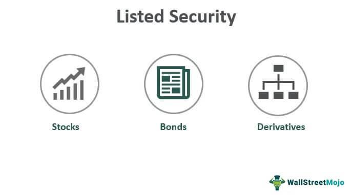

Financial markets represent a crucial component of the global economy, facilitating the allocation of resources, enabling risk management, and providing liquidity to businesses and investors. They encompass a variety of exchanges and platforms where financial instruments like stocks, bonds, currencies, and derivatives are traded. These markets are fundamental in fostering economic growth and development by allowing for efficient capital distribution and risk-sharing across borders.

Stock exchanges are integral to the function of financial markets. They provide a structured and regulated environment for the buying and selling of stocks and other securities. By doing so, stock exchanges ensure liquidity, transparency, and fair pricing, fostering investor confidence. Historical figures like the Amsterdam Stock Exchange, established in 1602, demonstrate the pivotal role stock exchanges have played through centuries in financial market development. Today, major exchanges, such as the New York Stock Exchange (NYSE) and the Nasdaq, continue to influence global financial dynamics.



Publicly traded companies stand as the centerpiece of stock exchanges. These are businesses that have issued shares to the public through a process known as an Initial Public Offering (IPO). Going public allows companies to raise capital from a broad base of investors, fostering growth and expansion opportunities. In exchange for the benefits of raised capital, these companies are subject to increased regulatory scrutiny and a requirement to maintain transparency with their shareholders.

Algorithmic trading introduces a technological dimension to the financial markets. By employing complex algorithms and powerful computing systems, algorithmic traders can execute orders at speeds and frequencies far beyond human capabilities. This form of trading enhances market efficiency by quickly adjusting prices to new information, although it may also introduce new risks, such as increased market volatility during times of stress.

The purpose of this article is to explore the interconnectedness of stock exchanges, publicly traded companies, and algorithmic trading, highlighting the ways in which each component contributes to and transforms the broader financial market landscape. Through a comprehensive examination of these elements, this article aims to shed light on their collective impact on the global economy.

## Table of Contents

## Understanding Financial Markets

Financial markets are critical infrastructures that facilitate the exchange of financial instruments, thereby aiding in the mobilization of capital and promoting economic growth. These markets can be broadly classified into three categories: stock markets, bond markets, and derivatives markets.

**Stock Markets** are platforms where shares of publicly traded companies are issued and traded among investors. These markets enable companies to raise capital by providing opportunities for investors to purchase equity stakes in them. Companies issuing shares for the first time go through a process called an Initial Public Offering (IPO), which occurs in the primary market. Once issued, these shares are traded between investors in the secondary market.

**Bond Markets** involve the issuance and trading of debt securities. Governments, municipalities, and corporations issue bonds to raise money, promising to pay back the principal amount along with interest at a specified future date. Bond markets provide a crucial mechanism for securing long-term funding and help in the maintenance of liquidity in the financial system.

**Derivatives Markets** are specialized platforms where financial contracts, whose value is derived from underlying assets like stocks, bonds, commodities, or interest rates, are traded. Common derivatives include futures, options, and swaps. These instruments allow investors to hedge against risk or speculate on the future prices of underlying assets.

Financial markets play a pivotal role in facilitating capital flow and fostering economic growth by enabling the efficient allocation of resources. They achieve this by connecting savers who have surplus capital with borrowers who require capital, thereby driving investment and consumption. A well-functioning financial market ensures [liquidity](/wiki/liquidity-risk-premium), reduces transaction costs, and supports optimal price discovery — the method by which the market value of a security is established.

The differences between primary and secondary markets are fundamental to understanding financial markets. The primary market is where new financial securities are issued directly from the issuer to investors. In contrast, the secondary market involves the trading of securities that were previously issued and are now held by investors. While the primary market facilitates initial funding for issuers, the secondary market provides liquidity, allowing investors to buy and sell securities with ease and contributing to the overall stability and attractiveness of the financial market environment.

By providing platforms for trading and investment, financial markets lay the foundation for investor decision-making and wealth generation. They encourage transparency, enforce regulatory compliance, and foster an environment conducive to innovation and economic expansion. Understanding these markets' structures and functions is crucial for comprehending the broader financial ecosystem's impact on global economic dynamics.

## The Stock Exchange: A Key Player

Stock exchanges are organized markets where securities, such as stocks and bonds, are bought and sold. Their primary function is to facilitate the smooth transfer of securities between buyers and sellers, ensuring liquidity, price discovery, and the efficient allocation of capital. The concept of stock exchanges dates back several centuries. One of the earliest recognized stock exchanges was established in Antwerp, Belgium, in the 16th century, where traders gathered to engage in various commercial transactions. However, the more structured form of stock exchanges began in the 17th century with the Amsterdam Stock Exchange, which played a significant role in setting the foundations for modern financial markets.

Stock exchanges serve several key functions within financial markets. They act as intermediaries, providing a regulated environment in which securities transactions can occur. They enable price discovery, where the forces of supply and demand determine the price of securities. Exchanges also ensure transparency by mandating public disclosure of critical financial information, which helps investors make informed decisions. Additionally, they contribute to market liquidity, allowing investors to buy and sell securities with relative ease.

Several major stock exchanges have emerged globally, exerting significant influence on the world economy. The New York Stock Exchange (NYSE), established in 1792, is one of the largest and most prestigious exchanges worldwide, playing a pivotal role in US financial markets. The London Stock Exchange (LSE), dating to the late 17th century, serves as a major hub for European and international trading. The Tokyo Stock Exchange (TSE) holds a key position in Asia, reflecting Japan’s strong post-war economic growth. These exchanges not only facilitate domestic trading but also have a substantial impact on global financial systems, influencing investment trends and economic policies.

The process of listing a company on a stock exchange involves several steps, collectively known as an Initial Public Offering (IPO). Companies prepare detailed prospectuses that disclose financial health, business strategies, and potential risks. Upon meeting regulatory requirements, the company issues its shares to the public, becoming a publicly traded entity. Listing on a stock exchange offers numerous benefits, such as access to capital, increased visibility, and credibility. By raising capital through share issuance, companies can finance expansion projects, pay off existing debts, or invest in new technologies.

In summary, stock exchanges have evolved significantly over the centuries, becoming integral components of global financial markets. Their key functions—from facilitating price discovery to ensuring market liquidity and transparency—are crucial for the effective operation of financial systems. Major exchanges like the NYSE, LSE, and TSE not only serve their respective regions but also have a considerable influence on global economic activities. Listing on these exchanges offers companies an opportunity to access capital and enhance their market presence, all of which contribute to the broader objective of economic growth.

## Publicly Traded Companies

Publicly traded companies, also referred to as publicly held or public companies, are businesses that have sold a portion of their equity to the public via stock exchanges. This status allows these companies to raise capital from the general public through the sale of shares.

### Definition and Characteristics

Publicly traded companies have several defining characteristics. Primary among these is their listing on a stock exchange, enabling the trade of their shares in the public market. As public entities, they are subject to continual oversight and are required to disclose financial and operational information regularly. This transparency obligation is enforced by regulatory bodies such as the Securities and Exchange Commission (SEC) in the United States. 

Additionally, a public company is typically governed by a board of directors elected by the shareholders. Shareholders have voting rights on significant company matters, typically proportional to the number of shares they own. 

### Initial Public Offering (IPO)

An Initial Public Offering (IPO) is the process by which a private company offers its shares to the public for the first time. Companies often pursue an IPO to raise capital to fuel growth, pay off debt, or fund other business activities. The IPO process involves several steps, including:

1. **Preparation**: Companies must prepare comprehensive documentation, including financial statements and a prospectus, which outlines the company's business model, market, and financial performance.

2. **Filing**: This documentation is filed with, and must be approved by, securities regulators.

3. **Roadshows**: These are marketing efforts to attract potential investors.

4. **Pricing**: Based on investor feedback and market conditions, a price is set for the shares.

5. **Listing**: Finally, the company lists its shares on a stock exchange, making them available for trading by the public.

The implications of an IPO are significant. For the company, it often results in a substantial influx of capital. However, this [capital raising](/wiki/hedge-fund-capital-raising) comes with increased scrutiny and regulatory compliance obligations. The process can also be costly and time-consuming.

### Advantages and Disadvantages

**Advantages**:  
- **Capital Access**: Public companies have increased access to capital through stock sales.
- **Visibility and Prestige**: Being listed on a stock exchange can raise a company's profile and credibility.
- **Liquidity**: Publicly traded shares provide a mechanism for early investors and founders to exit and monetize their investments.

**Disadvantages**:  
- **Reporting Requirements**: There is a significant administrative burden associated with regulatory filings and shareholder communications.
- **Market Pressure**: Public companies face pressure to meet quarterly earnings expectations, which can affect long-term strategy.
- **Loss of Control**: The original owners and management often lose some control over company decisions due to the board and shareholder structure.

### Impact on Governance and Transparency

Becoming publicly traded significantly impacts corporate governance. There is a legal obligation to adhere to strict standards of accountability and transparency. Governance structures such as audit committees, compliance officers, and robust internal controls become essential. 

Transparency is enhanced as companies are required to disclose their financial conditions, material developments, and other significant corporate actions. This requirement not only protects investors but also increases the level of trust among stakeholders. Enhanced transparency can lead to improved governance practices as companies align their actions with shareholder interests, fostering a culture of accountability.

In summary, while being a publicly traded company can provide access to substantial resources and visibility, it necessitates rigorous governance and transparency practices and introduces significant pressures and obligations that private companies do not face.

## Algorithmic Trading: The Technological Edge

Algorithmic trading refers to the use of computer algorithms to automate trading decisions in financial markets. These algorithms analyze market data and execute orders at speeds and frequencies impossible for human traders. The primary goal is to leverage speed and computational power to identify and capitalize on trading opportunities, often within fractions of a second.

### Types of Algorithmic Trading Strategies

Several strategies are employed in [algorithmic trading](/wiki/algorithmic-trading):

1. **High-Frequency Trading (HFT):** Characterized by extremely high speeds and order rates. HFT capitalizes on small price discrepancies and can execute thousands of trades in milliseconds. This strategy relies on colocated servers to minimize latency and requires significant technological infrastructure.

2. **Arbitrage:** Exploits price differences of the same asset across different markets or forms. For instance, if a stock is trading at $100 on one exchange and $101 on another, an algorithm can buy the stock on the cheaper exchange and sell it on the more expensive one, capturing the spread.

3. **Trend Following:** This strategy involves algorithms that analyze historical market data to identify the direction of market momentum. Once a trend is detected, the algorithm places trades in the direction of the trend.

4. **Market Making:** Algorithms post simultaneous buy and sell orders to capture the spread between them. This strategy provides liquidity to the market and profits from the bid-ask spread.

### Advantages of Algorithmic Trading

Algorithmic trading offers several advantages:

- **Market Efficiency:** By executing strategies swiftly and consistently, algorithmic trading can help correct mispricings and improve price discovery in markets.

- **Reduced Transaction Costs:** Algorithms execute trades more efficiently than humans, minimizing market impact and reducing slippage.

- **Removal of Human Emotion:** Automated trading eliminates emotional biases from trading decisions, ensuring consistent strategy execution.

### Challenges and Risks

Despite its advantages, algorithmic trading presents several challenges:

- **Market Volatility:** The speed and volume of trades can exacerbate market volatility. Events like the "Flash Crash" of 2010 highlight the potential market disruptions caused by algorithmic trading.

- **Technical Glitches:** Bugs in algorithms or failures in infrastructure can result in unintended trades or losses.

- **Regulatory Concerns:** The rapid nature of algorithmic trading can pose challenges for market regulators in ensuring the integrity and fairness of financial markets.

Algorithmic trading continues to shape modern financial markets, offering both opportunities and challenges to participants and regulators.

## The Intersection of Stock Exchanges and Algo Trading

Algorithmic trading, often referred to as algo trading, has significantly transformed the operations of modern stock exchanges. By utilizing pre-programmed trading instructions based on variables such as time, price, and [volume](/wiki/volume-trading-strategy), algo trading enables rapid decision-making that exceeds human capabilities. This automation enhances both the speed and efficiency of trade execution, making it a cornerstone of contemporary financial markets.

### The Role of Technology in Trade Efficiency

The implementation of cutting-edge technology within stock exchanges has led to a paradigm shift in trade execution. High-frequency trading ([HFT](/wiki/high-frequency-trading-strategies)), a subset of algorithmic trading, exemplifies this change by executing a large number of orders at incredibly fast speeds. This is made possible through sophisticated algorithms that continuously scan market data, identifying optimal trading opportunities and executing trades in fractions of a second. The infrastructure supporting these activities, such as low-latency data feeds and co-location services (where traders place their systems as close as possible to exchange servers), has further accelerated trading capabilities.

For example, exchanges like NASDAQ and the New York Stock Exchange (NYSE) have invested heavily in upgrading their trading platforms to accommodate the demand for ultra-fast execution. They have partnered with technology providers to enhance the capacity and speed of their systems, thus fostering an environment that supports algo trading.

### Regulatory Challenges and Fair Trading Practices

While algo trading brings efficiency, it also poses regulatory challenges. The potential for market manipulation, such as spoofing (placing and then canceling orders to mislead other traders about demand), necessitates stringent regulatory oversight. To mitigate such risks, regulatory bodies like the U.S. Securities and Exchange Commission (SEC) and the European Securities and Markets Authority (ESMA) have implemented regulations designed to ensure fair trading practices.

One regulatory measure includes the imposition of circuit breakers, which temporarily halt trading in the event of excessive [volatility](/wiki/volatility-trading-strategies), allowing the market to stabilize. Additionally, there are rules requiring greater transparency in trading algorithms to prevent unfair practices and maintain market integrity.

### Case Studies of Major Stock Exchanges

Several major stock exchanges have adapted to the demands of algorithmic trading through strategic upgrades and policy changes. For instance, the London Stock Exchange (LSE) implemented the MillenniumIT trading platform, known for its high performance and low latency, to attract algo traders. This system allows for rapid order processing and supports a broad range of asset classes.

Another example is the Tokyo Stock Exchange (TSE), which upgraded its Arrowhead trading system to reduce order processing times significantly. The adoption of such systems underscores the commitment of these exchanges to facilitate and regulate algorithmic trading, ensuring they remain competitive and efficient.

In summary, the integration of algorithmic trading within stock exchanges represents a significant evolution in financial markets. Although it offers remarkable efficiency and opportunities, it also requires ongoing regulatory vigilance to address the challenges that come with such rapid technological advancement.

## The Future of Financial Markets with Algo Trading

Algorithmic trading continues to shape the landscape of financial markets, driven by advancements in technology and changing regulatory frameworks. Emerging trends indicate a dynamic evolution towards more efficient and complex trading systems that could significantly alter the functioning of stock exchanges globally.

One of the leading technological advancements influencing algorithmic trading is the integration of high-speed network infrastructure. These networks, including the deployment of fiber optics and microwave technology, are reducing latencies and making real-time data processing possible. Lower latency not only enhances execution speed but also improves the accuracy of trading strategies that depend on micro-second decision-making.

Artificial intelligence (AI) is playing an increasingly crucial role in developing sophisticated trading strategies. AI systems, particularly those using [machine learning](/wiki/machine-learning) and [deep learning](/wiki/deep-learning) algorithms, are capable of analyzing vast datasets to identify patterns and predict market movements. These systems can adaptively learn from new data, enhancing their predictive accuracy over time. For instance, [reinforcement learning](/wiki/reinforcement-learning), a branch of machine learning, is particularly useful in optimizing trading strategies by learning from the rewards and penalties of previous trades.

Here's a simplified example of a reinforcement learning algorithm for algorithmic trading in Python:

```python
import numpy as np

class TradingAgent:
    def __init__(self, num_states, num_actions):
        self.q_table = np.zeros((num_states, num_actions))
        self.learning_rate = 0.1
        self.discount_factor = 0.9
        self.exploration_rate = 1.0
        self.exploration_decay = 0.995

    def choose_action(self, state):
        if np.random.rand() < self.exploration_rate:
            return np.random.choice(len(self.q_table[state]))
        return np.argmax(self.q_table[state])

    def update_q_table(self, state, action, reward, next_state):
        best_next_action = np.argmax(self.q_table[next_state])
        td_target = reward + self.discount_factor * self.q_table[next_state][best_next_action]
        td_error = td_target - self.q_table[state][action]
        self.q_table[state][action] += self.learning_rate * td_error
        self.exploration_rate *= self.exploration_decay
```

This code snippet creates an agent that learns from trading actions and adapts over time to optimize its strategy, which reflects the type of innovation AI brings to the field.

As algorithmic trading becomes more prevalent, regulatory bodies are faced with the challenge of establishing policies that safeguard against systemic risks while promoting innovation. Regulators are focusing on measures such as transparency requirements, oversight of trading algorithms, and controls to prevent market abuse resulting from high-frequency trading. The development of circuit breakers, which halt trading in excessive volatility scenarios, is another regulatory tool aimed at stabilizing markets.

Looking forward, the financial market's integration with technology necessitates a balanced approach where growth is encouraged, yet market integrity and investor protection remain paramount. This involves continuous monitoring and updating of regulatory frameworks to keep pace with technological changes. A comprehensive regulatory environment, combined with innovative trading technologies, suggests a future where financial markets operate more efficiently, fluidly, and securely.

## Conclusion

The evolution of stock exchanges and algorithmic trading has significantly transformed the landscape of financial markets. Historically, stock exchanges served as physical venues where buyers and sellers convened to trade securities. However, with advances in technology, these exchanges have transitioned into electronic platforms that facilitate high-speed trading on a global scale. Algorithmic trading, the practice of using computer algorithms to execute trades, has further revolutionized these exchanges by introducing unprecedented speed and efficiency.

The current state of stock exchanges is characterized by increased reliance on technology to handle vast volumes of trades at fractions of a second. This evolution has brought about enhanced market liquidity and reduced transaction costs, benefiting both institutional and retail investors. However, it has also introduced complexities and challenges, such as the potential for market volatility and flash crashes triggered by automated trading systems.

Balancing technological innovation with regulatory oversight remains crucial. Regulators must ensure that markets operate fairly and transparently, mitigating risks associated with algorithmic trading. This involves implementing measures such as circuit breakers to curtail extreme price volatility and scrutinizing trading algorithms to prevent market abuse. Striking the right balance will foster a stable financial environment conducive to growth and investment.

Looking to the future, financial markets are poised to further integrate cutting-edge technologies. Artificial intelligence and machine learning are expected to play pivotal roles in developing sophisticated trading algorithms that can analyze vast data sets and execute complex trading strategies with minimal human intervention. These advancements hold the potential to enhance market efficiency and open new avenues for investors.

Policymakers and market participants must work in tandem to ensure that technological progress is met with sound regulatory frameworks that protect market integrity. By fostering innovation while safeguarding stability, the financial markets can continue to thrive and adapt to the ever-evolving technological landscape. This careful balance will be instrumental in shaping the future trajectory of financial markets, ensuring sustainable growth and robust economic prosperity.

## References & Further Reading

[1]: Bergstra, J., Bardenet, R., Bengio, Y., & Kégl, B. (2011). ["Algorithms for Hyper-Parameter Optimization."](https://dl.acm.org/doi/10.5555/2986459.2986743) Advances in Neural Information Processing Systems 24.

[2]: ["Advances in Financial Machine Learning"](https://www.amazon.com/Advances-Financial-Machine-Learning-Marcos/dp/1119482089) by Marcos Lopez de Prado

[3]: ["Evidence-Based Technical Analysis: Applying the Scientific Method and Statistical Inference to Trading Signals"](https://www.amazon.com/Evidence-Based-Technical-Analysis-Scientific-Statistical/dp/0470008741) by David Aronson

[4]: ["Machine Learning for Algorithmic Trading"](https://github.com/stefan-jansen/machine-learning-for-trading) by Stefan Jansen

[5]: ["Quantitative Trading: How to Build Your Own Algorithmic Trading Business"](https://www.amazon.com/Quantitative-Trading-Build-Algorithmic-Business/dp/1119800064) by Ernest P. Chan