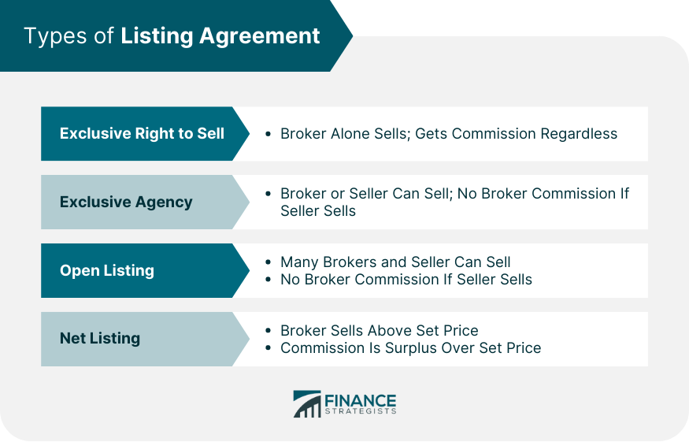

## Table of Contents

## What is a listing agreement?

A listing agreement is a contract between a homeowner and a real estate agent. It gives the agent the right to sell the home. The agreement says how much the agent will be paid, usually a percentage of the sale price. It also says how long the agent has to sell the home.

The agreement can be exclusive or non-exclusive. An exclusive agreement means only that agent can sell the home. A non-exclusive agreement means the homeowner can work with other agents too. The agreement helps both the homeowner and the agent know what to expect during the home selling process.

## What are the different types of listing agreements?

There are several types of listing agreements that homeowners can use when selling their property. The most common type is the exclusive right-to-sell agreement. This means that the homeowner hires one real estate agent to sell their home, and no matter who actually sells the home, the agent gets paid a commission. This is the most popular type because it gives the agent the most motivation to work hard to sell the home.

Another type is the exclusive agency listing. With this agreement, the homeowner hires one agent, but if the homeowner finds a buyer on their own, they don't have to pay the agent a commission. This can be good for homeowners who think they might be able to find a buyer themselves. A third type is the open listing, which is not exclusive. This means the homeowner can work with multiple agents at the same time, and only the agent who brings a buyer gets paid. This type is less common because it can be confusing and less motivating for agents.

Lastly, there's the net listing, which is less common and sometimes controversial. In a net listing, the homeowner sets a minimum price they want to get from the sale, and the agent keeps anything above that amount as their commission. This can be risky because it might encourage the agent to sell the home for more than it's worth to get a bigger commission. Each type of listing agreement has its own pros and cons, so it's important for homeowners to choose the one that best fits their needs.

## What is an exclusive right to sell listing agreement?

An exclusive right to sell listing agreement is a contract between a homeowner and a real estate agent. In this agreement, the homeowner gives one agent the right to sell their home. No matter who sells the home, even if the homeowner finds the buyer themselves, the agent gets paid a commission. This type of agreement is the most common because it gives the agent a strong reason to work hard to sell the home quickly.

The agreement includes details like how much the agent will be paid, usually a percentage of the sale price, and how long the agreement lasts. This helps both the homeowner and the agent know what to expect. The exclusive right to sell agreement is good for homeowners who want one agent to handle everything and for agents who want to be sure they will get paid for their work.

## What is an exclusive agency listing agreement?

An exclusive agency listing agreement is a contract between a homeowner and a real estate agent. In this agreement, the homeowner hires one agent to sell their home. The big difference from an exclusive right to sell agreement is that if the homeowner finds a buyer on their own, they don't have to pay the agent a commission. The agent only gets paid if they or another agent working with them finds the buyer.

This type of agreement can be good for homeowners who think they might be able to find a buyer themselves. It gives them the chance to save on the commission if they do. But, it might not motivate the agent as much as an exclusive right to sell agreement because the agent knows they might not get paid if the homeowner finds a buyer. So, it's important for the homeowner to choose the right type of agreement based on what they think will work best for them.

## What is an open listing agreement?

An open listing agreement is a contract where a homeowner can work with many real estate agents at the same time. Only the agent who finds a buyer for the home gets paid a commission. This means the homeowner can hire as many agents as they want, and they only pay the one who actually sells the house.

This type of agreement is less common because it can be confusing for both the homeowner and the agents. Agents might not work as hard to sell the home because they know other agents are also trying to sell it. But, it can be good for homeowners who want to keep their options open and work with multiple agents.

## What is a net listing agreement?

A net listing agreement is when a homeowner agrees with a real estate agent that the homeowner wants to get a certain amount of money from selling their home. The agent can then keep any extra money they get above that amount as their commission. For example, if the homeowner says they want at least $200,000, and the agent sells the home for $220,000, the agent keeps the extra $20,000.

This type of agreement can be risky because it might make the agent want to sell the home for more than it's really worth just to get a bigger commission. It's not very common because it can cause problems. Homeowners need to be careful and understand how it works before they agree to a net listing.

## How does a listing agreement function in real estate transactions?

A listing agreement is a contract that helps a homeowner and a real estate agent work together to sell a home. When someone wants to sell their house, they sign this agreement with an agent. The agreement says how much the agent will be paid, usually a percentage of the sale price, and how long the agent has to sell the house. It also says what kind of agreement it is, like exclusive right-to-sell, exclusive agency, open listing, or net listing. This helps both the homeowner and the agent know what to expect during the selling process.

The agreement makes sure the agent works hard to sell the home. For example, in an exclusive right-to-sell agreement, the agent gets paid no matter who finds the buyer. This gives the agent a big reason to do a good job. In an exclusive agency agreement, the agent only gets paid if they find the buyer, so they might not work as hard. An open listing lets the homeowner work with many agents, but only the one who sells the home gets paid. A net listing can be risky because the agent might try to sell the home for more than it's worth to get a bigger commission. Each type of agreement helps the homeowner and agent understand their roles and responsibilities in selling the home.

## What are the key components of a listing agreement?

A listing agreement is a contract between a homeowner and a real estate agent that helps them work together to sell a home. The agreement includes the commission the agent will get, which is usually a percentage of the sale price. It also says how long the agent has to sell the house. This time period is important because it tells the agent how long they have to find a buyer. Another key part is the type of listing agreement, like exclusive right-to-sell, exclusive agency, open listing, or net listing. Each type has different rules about who gets paid and when.

The agreement also explains what the agent needs to do to sell the home. This can include things like listing the home on a real estate website, showing the home to potential buyers, and helping with the paperwork. The homeowner agrees to let the agent do these things and to pay them if they sell the home. The agreement makes sure both the homeowner and the agent know what to expect and what they need to do to sell the home successfully. It's important for both sides to understand the agreement so they can work together well.

## How long does a listing agreement typically last?

A listing agreement usually lasts for a certain amount of time. Most of the time, it lasts for three to six months. This gives the real estate agent enough time to find a buyer for the home. The length of time can be different depending on what the homeowner and the agent agree on. Sometimes, they might choose a shorter time, like one month, or a longer time, like a year.

The length of the agreement is important because it tells the agent how long they have to sell the home. If the home doesn't sell by the end of the agreement, the homeowner can decide if they want to keep working with the same agent or try someone new. This helps make sure everyone knows what to expect and can plan their next steps.

## Can a listing agreement be terminated early, and if so, how?

Yes, a listing agreement can be terminated early. The way to do this depends on what the agreement says. Usually, the agreement will have rules about how to end it early. For example, the homeowner might need to give the agent a written notice saying they want to end the agreement. Sometimes, the agreement might say the homeowner has to pay a fee if they end it early.

It's important for the homeowner to read the agreement carefully before signing it. They should look for any rules about ending the agreement early. If they want to end it, they should talk to the agent and follow the rules in the agreement. This helps avoid any problems or disagreements later on.

## What are the legal implications of breaching a listing agreement?

If someone breaks a listing agreement, there can be legal problems. The agreement is a contract between the homeowner and the real estate agent. If the homeowner doesn't follow the rules in the agreement, like trying to end it early without following the right steps, the agent might take them to court. The agent could ask for money to cover what they lost because the homeowner broke the agreement. This could be the commission they would have earned if the home was sold, or other costs they had while trying to sell the home.

On the other hand, if the agent breaks the agreement, the homeowner could also take legal action. For example, if the agent doesn't do what they promised, like not listing the home on real estate websites or not showing it to potential buyers, the homeowner might sue. The homeowner could ask for money to cover any harm they suffered because the agent didn't follow the agreement. It's important for both the homeowner and the agent to understand the agreement and follow it to avoid these legal issues.

## How do listing agreements vary by state or country?

Listing agreements can be different in different states or countries. Each place has its own rules about how real estate works. For example, in some states in the U.S., the laws might say that a listing agreement has to be in writing to be legal. In other places, the agreement might need to be signed by both the homeowner and the agent. The length of the agreement can also be different. Some places might have a standard time, like six months, while others might let the homeowner and agent choose any length of time they want.

These differences can also affect what kind of listing agreements are used. In some countries, certain types of agreements, like net listings, might not be allowed at all because they can be risky. Other places might have rules about how much commission an agent can charge. It's important for homeowners and agents to know the rules in their area before they sign a listing agreement. This helps them make sure they are following the law and that the agreement will work well for both of them.

## What is Algorithmic Trading in Real Estate?

Algorithmic trading, traditionally linked to financial markets such as stocks and [forex](/wiki/forex-system), is finding its footing in the real estate industry. This advanced method involves the use of algorithms—self-contained, step-by-step sets of operations performed by a computer—to automate and optimize real estate transactions. The integration of [algorithmic trading](/wiki/algorithmic-trading) in real estate is primarily used to forecast market trends and streamline transactions, thereby enhancing decision-making processes and operational efficiencies.

The application of algorithmic trading in real estate hinges on predictive analytics, which involves the analysis of historical and current data to make predictions about future states. Real estate markets are influenced by numerous factors, including interest rates, economic indicators, and regional developments. Algorithms can be designed to process these vast datasets to identify patterns and trends that human analysts might overlook. For instance, [machine learning](/wiki/machine-learning) models can be trained to recognize price movement patterns based on prior market behavior, allowing investors to determine optimal times to buy or sell properties.

One example of algorithmic trading in real estate is the use of hedonic pricing models, which help in estimating the market value of a property by considering variables that impact its price such as location, size, and amenities. By feeding data into a regression model, real estate investors can predict the fair market value of a property, thus informing pricing and investment decisions:

$$
P = \beta_0 + \beta_1X_1 + \beta_2X_2 + \ldots + \beta_nX_n
$$

Where $P$ is the predicted property price, $\beta_0$ is the intercept, $\beta_1, \beta_2, \ldots, \beta_n$ are coefficients, and $X_1, X_2, \ldots, X_n$ are the characteristics and attributes of the property.

Moreover, high-frequency trading ([HFT](/wiki/high-frequency-trading-strategies)) algorithms, while more commonly used in stock trading, are being adapted to execute real estate transactions swiftly when market conditions are favorable. Such algorithms enable rapid execution of deals, leveraging slight variations in interest rates or economic news that might affect real estate prices.

Algorithmic approaches also improve the [liquidity](/wiki/liquidity-risk-premium) of real estate investments. Real estate is typically known for its lack of liquidity compared to stocks or bonds, but algorithms facilitate quicker buying and selling decisions, helping to bridge this gap. Furthermore, blockchain technology can be integrated with algorithms to ensure transparency, efficiency, and security in transactions.

The onset of digital platforms that incorporate algorithmic trading mechanisms illustrates an evolution toward more data-driven real estate markets. Despite the potential for increased efficiency and accuracy, the deployment of algorithmic trading in real estate still faces challenges, including regulatory hurdles and the need for substantial data infrastructure. However, as technology continues to advance and more sophisticated data analytics tools become available, algorithmic trading is poised to become a pivotal component of the real estate industry.

## References & Further Reading

[1]: Cummings, G. D., & Meeks, F. R. (1975). ["The Law of Real Estate Brokers."](https://www.mayoclinicproceedings.org/article/S0025-6196(12)61473-6/fulltext) Warren Gorham & Lamont.

[2]: Lopez de Prado, M. (2018). ["Advances in Financial Machine Learning."](https://www.amazon.com/Advances-Financial-Machine-Learning-Marcos/dp/1119482089) Wiley.

[3]: Aronson, D. R. (2006). ["Evidence-Based Technical Analysis: Applying the Scientific Method and Statistical Inference to Trading Signals."](https://www.amazon.com/Evidence-Based-Technical-Analysis-Scientific-Statistical/dp/0470008741) Wiley.

[4]: Chan, E. P. (2009). ["Quantitative Trading: How to Build Your Own Algorithmic Trading Business."](https://github.com/egorpe/EPChan-QuantitativeTrading/blob/master/example7_6.m) Wiley.

[5]: Jansen, S. (2020). ["Machine Learning for Algorithmic Trading - Second Edition: Predictive models to extract signals from market and alternative data for systematic trading strategies with Python."](https://thuvienso.hoasen.edu.vn/bitstream/handle/123456789/12260/Contents.pdf?sequence=1) Packt Publishing.

[6]: Miller, J. (2020). ["Algorithmic Trading in Real Estate."](https://www.luxuryestate.com/italy/umbria/provincia-di-perugia/passignano-sul-trasimeno) Forbes.

[7]: Phipps, R. (2016). ["The Real Estate Wholesalers Checklist."](https://onlinelibrary.wiley.com/doi/abs/10.1111/1756-2171.12163) National Association of Realtors (NAR).