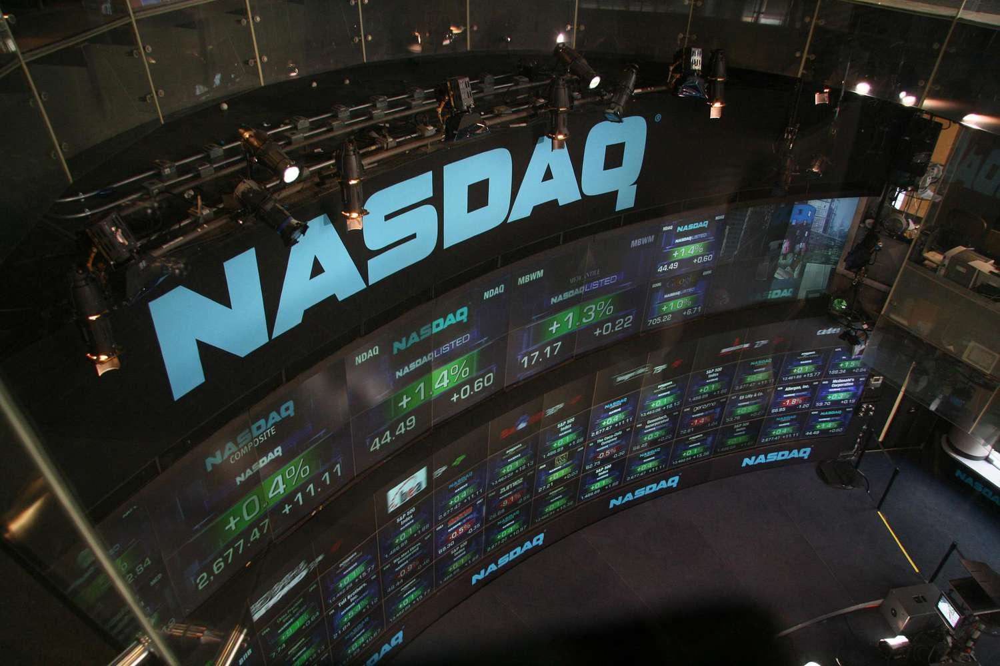

Understanding the complexities of stock market operations is crucial for investors and companies alike. Stock markets are dynamic ecosystems where companies, investors, and regulators interact under a set of defined rules and standards that ensure orderly trading and market integrity. Central to this is the concept of stock exchange listing criteria and the rapidly evolving role of algorithmic trading.

Stock exchange listing criteria are a foundational element of stock market structure. These criteria include financial metrics, governance standards, and liquidity measures that companies must adhere to in order to list their shares on an exchange. By meeting these requirements, companies gain access to a larger pool of capital and enjoy increased visibility among investors. Different exchanges, such as the New York Stock Exchange (NYSE) and the Nasdaq, have unique listing requirements, reflecting their distinct market philosophies and operational frameworks.



The rise of algorithmic trading, or algo trading, has added another layer of complexity to modern markets. Utilized extensively by institutional investors and increasingly by retail traders, algo trading involves using computer algorithms to execute trades based on predefined conditions. This method promises enhanced execution speed and efficiency while mitigating the emotional biases often associated with trading decisions. Yet, it also poses significant challenges, from the technical requirements needed for implementation to the regulatory concerns regarding its impact on market stability.

This article aims to provide a comprehensive understanding of these crucial components of stock market operations. We will explore how listing criteria uphold market integrity and how algo trading influences market dynamics, both positively and negatively. By the end, readers will have gained insights into the strategies and processes that define successful stock trading and company listing in today's markets.

## Table of Contents

## Understanding Stock Exchange Listing Criteria

Listing requirements define the standards a company must meet to list its shares on a stock exchange, such as the New York Stock Exchange (NYSE) or Nasdaq. These criteria encompass a range of financial metrics, governance standards, and liquidity measures designed to maintain market integrity and provide investor protection.

### Financial Metrics

Financial metrics serve as foundational criteria for listing on a stock exchange. For instance, the NYSE mandates a company to demonstrate a minimum market value for publicly held shares, while Nasdaq's requirements may include thresholds for earnings, assets, and market capitalizations. These metrics ensure that only companies with notable financial stability can participate in the marketplace, thereby promoting transparency and investor confidence.

### Governance Standards

Corporate governance standards ensure that companies adhere to ethical management practices and provide transparency in their operations. Organizations seeking listing must comply with governance structures like having independent board members, transparent reporting mechanisms, and effective internal controls. Such standards are critical in safeguarding investor interests and fostering trust in the financial markets.

### Liquidity Measures

Liquidity measures refer to a company's ability to meet its short-term obligations and facilitate trading without causing significant price changes. Exchanges often require a minimum number of publicly held shares and shareholders to ensure adequate [liquidity](/wiki/liquidity-risk-premium). This accessibility enables investors to buy and sell shares efficiently, contributing to the smooth functioning and dynamism of the stock market.

### Benefits of Meeting Listing Requirements

Companies that meet these listing requirements benefit from increased visibility and access to capital. Being listed on a major stock exchange elevates a company's profile, improves credibility, and attracts potential investors. Additionally, the ability to raise funds through new stock issuances provides listed companies with the capital needed for expansion, research, and development.

Overall, the stringent listing requirements of exchanges like the NYSE and Nasdaq play a fundamental role in maintaining a robust and reliable stock market, protecting investors, and enhancing the overall economic ecosystem.

## Stock Market Requirements Across Different Exchanges

Each stock exchange has a distinctive set of requirements and standards that govern the listing of companies. These requirements are meticulously designed to ensure that only companies with sufficient financial robustness and operational stability are allowed to list their shares, thereby maintaining the quality and integrity of the market.

The New York Stock Exchange (NYSE), for example, is known for its stringent listing criteria. A key requirement for companies wishing to list on the NYSE is the minimum market value for publicly held shares. This criterion ensures that only companies with substantial market presence and credibility can access the exchange. Specifically, NYSE mandates that a company must have at least 1.1 million publicly held shares with a collective value of no less than $40 million. Additionally, the company must meet specific earnings standards, demonstrating consistent profitability over the years.

In contrast, the Nasdaq Stock Market employs a different approach by categorizing listings into different tiers, such as the Nasdaq Global Select Market, Nasdaq Global Market, and Nasdaq Capital Market. Each tier has its own set of financial and liquidity standards. For instance, companies aiming for the Nasdaq Global Select Market must meet higher financial thresholds compared to those listing on the Nasdaq Capital Market. Factors such as income, market capitalization, and cash flow are taken into account, with requirements set to ensure that listing companies possess solid financial health.

These differentiated and tiered requirements across exchanges like NYSE and Nasdaq serve the common purpose of fostering transparency, enhancing investor confidence, and ensuring that the marketplace attracts only those companies with significant financial strength and operational competence. This filtering process is crucial for maintaining the quality of the market and protecting investors from potential financial risks associated with underperforming or unstable companies. 

References:
- NYSE. (n.d.). Listing Requirements. Retrieved from [NYSE website](https://www.nyse.com/listing-information/listing-standards)
- Nasdaq. (n.d.). Initial Listing Guide. Retrieved from [Nasdaq website](https://listingcenter.nasdaq.com/assets/initialguide.pdf)

## Algorithmic Trading: Overview and Technical Requirements

Algorithmic trading employs computer algorithms to automate the buying and selling of securities based on pre-defined conditions. By leveraging advanced mathematical models, [algorithmic trading](/wiki/algorithmic-trading) (also known as algo trading) enhances speed and efficiency, allowing for trading decisions to be executed in milliseconds, far quicker than human traders.

One of the primary advantages of algorithmic trading is its ability to execute trades at optimal prices without the emotional biases that often affect human decision-making. By pre-programming strategies, traders can avoid impulsive decisions based on market [volatility](/wiki/volatility-trading-strategies) or misinformation, ensuring more disciplined investment practices.

To effectively engage in algo trading, a robust technical setup is paramount. This setup typically includes high-performance computing systems capable of handling substantial data flow and executing trades swiftly. Essential components of the setup involve:

1. **Advanced Software**: Trading algorithms require sophisticated software platforms that can develop, backtest, and execute trading strategies. These platforms should allow for quick adaptation to changing market conditions and seamless integration with trading systems.

2. **Coding Capabilities**: A strong proficiency in programming languages such as Python, C++, and Java is crucial, as these languages are commonly used in developing trading algorithms. For example, a simple moving average crossover strategy can be implemented in Python as follows:

    ```python
    import pandas as pd

    def moving_average_strategy(prices, short_window=40, long_window=100):
        signals = pd.DataFrame(index=prices.index)
        signals['signal'] = 0.0

        signals['short_mavg'] = prices['Close'].rolling(window=short_window, min_periods=1).mean()
        signals['long_mavg'] = prices['Close'].rolling(window=long_window, min_periods=1).mean()

        signals['signal'][short_window:] = np.where(signals['short_mavg'][short_window:] > signals['long_mavg'][short_window:], 1.0, 0.0)
        signals['positions'] = signals['signal'].diff()

        return signals
    ```

3. **Market Data Access**: Access to quality and timely market data is vital for algo trading. This includes historical data for backtesting strategies and real-time data to execute trades with minimal latency. Many trading platforms offer API services to facilitate direct access to market data.

In conclusion, the convergence of high-speed computing, advanced software, and skilled programming enables algorithmic trading to significantly transform how market operations are conducted. As technology continues to evolve, the sophistication and scope of algo trading are expected to expand, presenting new opportunities and challenges for traders and market participants. Understanding and implementing these technical requirements effectively are essential for exploiting the benefits of algorithmic trading.

## Common Strategies in Algorithmic Trading

Algorithmic trading (algo trading) employs various strategies to capitalize on market efficiencies and opportunities. These strategies leverage mathematical models and rapid execution capabilities to optimize trading outcomes.

Trend following is a common strategy where algorithms seek to exploit moments when the market is trending strongly in one direction. This approach relies on statistical indicators like moving averages to identify and confirm trends. For instance, a basic moving average crossover strategy involves buying when a shorter-term moving average crosses above a longer-term moving average, signaling an upward trend, and selling when the opposite occurs. This strategy presumes that trends, once established, will persist.

Mean reversion is another widely used strategy premised on the idea that asset prices will revert to their historical mean or average price. An algorithm identifies assets that have deviated significantly from their average price and executes trades in anticipation of a return to the mean. This strategy often involves sophisticated statistical models to determine the degree of deviation that represents a trading signal. For example, algorithms might use a z-score calculated as follows:

$$
\text{Z-score} = \frac{(P_t - \mu)}{\sigma}
$$

where $P_t$ is the current price, $\mu$ is the mean price, and $\sigma$ is the standard deviation of historical prices. A high absolute z-score may indicate a strong potential for mean reversion.

Volume Weighted Average Price (VWAP) is a strategy often utilized by institutional traders to execute large orders with minimal market impact. VWAP is calculated as the ratio of the value traded (price times [volume](/wiki/volume-trading-strategy)) to total volume over a specified period. Algorithms aim to execute trades throughout the day at prices close to the VWAP, ensuring that their trades reflect the average market price over the given time period. The formula for VWAP is:

$$
\text{VWAP} = \frac{\sum_{i} P_i \times Q_i}{\sum_{i} Q_i}
$$

where $P_i$ is the price of the trade and $Q_i$ is the quantity of the trade.

An understanding of these strategies is crucial for traders who wish to leverage algorithmic trading effectively. By tailoring strategies to specific market conditions, traders can maximize profitability and achieve diverse market objectives.

## Impact of Algorithmic Trading on Stock Market Dynamics

Algorithmic trading, often referred to as algo trading, has a profound impact on stock market dynamics. It utilizes sophisticated algorithms and high-speed data processing to execute trades. While it enhances market liquidity and operational efficiency, it is essential to examine both its positive and negative effects on market behavior.

One of the primary advantages of algorithmic trading is its ability to enhance market liquidity. By rapidly executing large volumes of trades, algo trading significantly reduces bid-ask spreads, facilitating more efficient price discovery. This improvement in liquidity aids in creating more stable market conditions, benefiting both individual and institutional investors. Additionally, algo trading improves market efficiency by minimizing errors associated with human decision-making. The automation involved in executing trades based on predetermined criteria helps reduce emotional biases, leading to more rational trading practices.

However, algorithmic trading introduces substantial risks, including increased market volatility. High-frequency trading ([HFT](/wiki/high-frequency-trading-strategies)), a subset of algo trading, can amplify price fluctuations due to abrupt and large-scale trade executions. The rapid pace of HFT may lead to flash crashes, where prices collapse suddenly, disrupting market stability. Such events highlight the need for robust market supervision and the implementation of circuit breakers to prevent excessive volatility.

Regulatory concerns arise due to the potential for market manipulation through algo trading. Algorithms can be designed to exploit market inefficiencies, potentially leading to practices like spoofing—where false orders are placed to manipulate market prices. To mitigate these risks, regulators have established stringent guidelines to ensure fair trading practices and maintain market integrity. Enhanced transparency and monitoring measures are essential to prevent manipulative activities and maintain investor confidence.

The impact of algorithmic trading is also characterized by the debate over high-frequency trading's effect on market stability. While HFT contributes to liquidity and efficient pricing, its aggressive trading strategies can result in market imbalances. The reliance on speed and technology creates a technological arms race, leading to increased operational costs and potentially widening the gap between technologically advanced firms and traditional investors.

In summary, algorithmic trading profoundly affects stock market dynamics, offering significant benefits in terms of liquidity and efficiency while posing challenges related to volatility and market integrity. Striking a balance between innovation and regulation is crucial. As technology continues to evolve, ongoing regulatory oversight and adaptive trading strategies are necessary to ensure a stable and equitable market environment.

## Conclusion

Stock exchange listing criteria and algorithmic trading are pivotal elements that shape the operations and structure of modern stock markets. Listing criteria establish a baseline for the quality and credibility of companies entering public markets. By enforcing stringent financial, governance, and liquidity standards, these criteria serve to protect investors and uphold market integrity. Companies that successfully meet these demands not only enhance their visibility but also gain increased access to capital, facilitating growth and stability in the financial ecosystem.

Algorithmic trading, on the other hand, plays a transformative role in how trading activities are conducted. By leveraging sophisticated computer algorithms, traders can execute large volumes of transactions at speeds and efficiencies unattainable by humans alone. This advancement fosters market liquidity and can help achieve optimal trade execution. However, it also introduces complexities, such as potential volatility and regulatory challenges, which must be managed to ensure stable market operations.

For companies and investors, understanding stock exchange listing criteria and the dynamics of algorithmic trading becomes crucial. Companies seeking to list must assess and fulfill the necessary requirements to ensure a successful public offering. Meanwhile, investors who wish to harness the benefits of algorithmic trading must continually update their strategies and technologies to align with market changes.

As stock markets continue to evolve with technological advancements and regulatory updates, staying informed about these elements is essential. This knowledge enables stakeholders to make strategic decisions that align with their investment objectives and adapt to the ever-changing landscape of the financial markets. Such awareness is key to thriving in the complex and competitive world of stock trading and listing.

## References & Further Reading

[1]: NYSE. (n.d.). ["Listing Requirements."](https://www.nyse.com/listings-process) Retrieved from NYSE website.

[2]: Nasdaq. (n.d.). ["Initial Listing Guide."](https://listingcenter.nasdaq.com/assets/initialguide.pdf) Retrieved from Nasdaq website.

[3]: Bergstra, J., Bardenet, R., Bengio, Y., & Kégl, B. (2011). ["Algorithms for Hyper-Parameter Optimization."](https://dl.acm.org/doi/10.5555/2986459.2986743) Advances in Neural Information Processing Systems 24.

[4]: ["Advances in Financial Machine Learning"](https://www.wiley.com/en-us/Advances+in+Financial+Machine+Learning-p-9781119482086) by Marcos Lopez de Prado

[5]: ["Evidence-Based Technical Analysis: Applying the Scientific Method and Statistical Inference to Trading Signals"](https://www.amazon.com/Evidence-Based-Technical-Analysis-Scientific-Statistical/dp/0470008741) by David Aronson

[6]: ["Machine Learning for Algorithmic Trading"](https://github.com/PacktPublishing/Machine-Learning-for-Algorithmic-Trading-Second-Edition) by Stefan Jansen

[7]: ["Quantitative Trading: How to Build Your Own Algorithmic Trading Business"](https://books.google.com/books/about/Quantitative_Trading.html?id=j70yEAAAQBAJ) by Ernest P. Chan