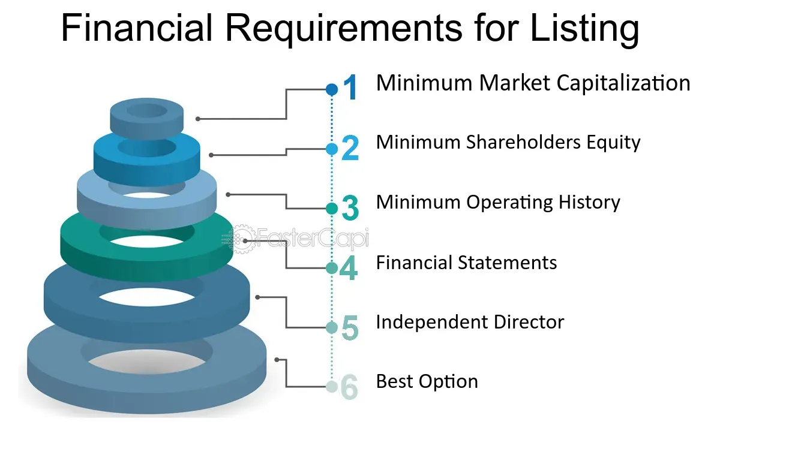

## Table of Contents

## What are stock exchanges and why are they important?

Stock exchanges are places where people can buy and sell shares of companies. These shares represent a small piece of ownership in a company. When you buy a share, you become a part-owner of that company. Stock exchanges make it easy for people to trade these shares quickly and safely. Some famous stock exchanges are the New York Stock Exchange and the London Stock Exchange.

Stock exchanges are important because they help companies raise money. When a company wants to grow, it can sell shares to the public through a stock exchange. The money from selling these shares can be used to build new factories, hire more workers, or develop new products. Stock exchanges also help the economy by letting people invest their money. When people buy and sell shares, it can help the economy grow and create jobs.

## What are listing requirements and why do stock exchanges have them?

Listing requirements are the rules that a company must follow to be able to sell its shares on a stock exchange. These rules can include things like how much money the company makes, how long it has been in business, and how many shares it wants to sell. Each stock exchange has its own set of listing requirements, and they can be different from one exchange to another.

Stock exchanges have listing requirements to make sure that only good companies can sell their shares on the exchange. This helps protect people who want to buy shares. If a company meets the listing requirements, it shows that the company is stable and trustworthy. This makes people feel more confident about buying its shares. By having these rules, stock exchanges can keep the market fair and safe for everyone.

## Can you list the general categories of listing requirements?

Listing requirements are the rules a company must follow to sell its shares on a stock exchange. These rules fall into different categories. The first category is financial requirements. This means the company needs to show it makes enough money and has enough assets. Another category is corporate governance. This includes having a good board of directors and clear company rules. The last category is about the shares themselves, like how many shares the company wants to sell and how much they cost.

These categories help make sure that only strong and honest companies can list their shares. Financial requirements check if a company is doing well financially. Corporate governance rules make sure the company is run in a fair way. And the rules about shares help keep the market working smoothly. By having these categories, stock exchanges can protect people who want to buy shares and keep the market safe and fair for everyone.

## What are the financial criteria for a company to be listed on a major stock exchange?

To be listed on a major stock exchange, a company needs to meet certain financial criteria. This means the company must show that it makes enough money and has enough assets. For example, it might need to have a certain amount of earnings before it can be listed. This is to make sure the company is financially stable and can handle being on the stock exchange.

Another important financial criterion is the company's market value. This is how much the whole company is worth based on the price of its shares. The stock exchange might set a minimum market value that the company must reach. This helps make sure that the company is big enough and important enough to be on the exchange. By meeting these financial criteria, a company can show that it is strong and ready to be listed on a major stock exchange.

## How do governance and compliance requirements affect a company's eligibility for listing?

Governance and compliance requirements are important rules that a company must follow to be listed on a stock exchange. These rules are about how the company is run and how it follows the law. For example, a company needs to have a good board of directors. The board helps make sure the company does things in a fair and honest way. Also, the company must have clear rules about how it makes decisions and reports its financial information. If a company follows these governance and compliance rules well, it shows that it is trustworthy and well-managed.

These requirements can affect a company's eligibility for listing because they help the stock exchange decide if the company is safe for people to invest in. If a company doesn't follow these rules, it might not be allowed to list its shares. This is because the stock exchange wants to protect people who buy shares. By making sure companies follow governance and compliance rules, the exchange can keep the market fair and honest. So, meeting these requirements is a big part of getting listed on a major stock exchange.

## What role do market capitalization and shareholder equity play in listing criteria?

Market capitalization, or market cap, is how much a company is worth based on the total value of all its shares. It's like the price tag on the whole company. Stock exchanges often have a rule that says a company needs to have a certain market cap to be listed. This rule helps make sure that only big and important companies can sell their shares on the exchange. If a company's market cap is too small, it might not be allowed to list its shares because it might not be stable enough or important enough for the exchange.

Shareholder equity is another important thing for listing. It's the money that the company has after paying off all its debts. It shows how much the company is really worth to its owners, the shareholders. Stock exchanges want to see that a company has enough shareholder equity before it can be listed. This makes sure that the company is financially strong and can handle being on the stock exchange. If a company doesn't have enough shareholder equity, it might not be allowed to list its shares because it might not be able to stay in business for a long time.

## How do different stock exchanges (e.g., NYSE, NASDAQ, LSE) vary in their listing requirements?

Different stock exchanges like the New York Stock Exchange (NYSE), NASDAQ, and the London Stock Exchange (LSE) have their own rules for companies that want to list their shares. For example, the NYSE has strict rules about how much money a company needs to make and how much its shares are worth. A company needs to have at least $10 million in earnings before taxes over the last three years and a market value of at least $100 million. NASDAQ also has rules about earnings and market value, but they are a bit different. A company needs to have at least $11 million in earnings over the last three years and a market value of at least $50 million. The LSE has its own set of rules, which can be different depending on which market a company wants to list on, like the Main Market or the Alternative Investment Market (AIM).

These differences in listing requirements can affect which stock exchange a company chooses to list on. For example, a smaller company might find it easier to list on NASDAQ because its market value requirement is lower than the NYSE's. On the other hand, a bigger company might prefer the NYSE because it is seen as more prestigious. The LSE's AIM has less strict rules, which can be good for smaller or newer companies that want to list their shares. By having different rules, each stock exchange can attract different types of companies and help them grow in different ways.

## What are the ongoing reporting obligations for companies listed on stock exchanges?

Companies that are listed on stock exchanges have to follow certain rules about sharing information. They need to tell the public about their money situation regularly. This means they have to share reports every three months, called quarterly reports, and a big report once a year, called an annual report. These reports show how much money the company made, how much it spent, and other important details. This helps people who own shares in the company know how it is doing.

Besides the regular reports, listed companies also have to tell the public about big changes or important events right away. This could be things like a new CEO, a merger with another company, or any news that could affect the company's value. This is called a material event, and it's important for the company to share this information quickly so that everyone knows what's going on. By doing this, the company keeps the market fair and honest for everyone who owns its shares.

## How does a company's industry sector influence the specific listing criteria it must meet?

A company's industry sector can change the rules it has to follow to list on a stock exchange. Different industries have different ways of making money and different risks. For example, a tech company might have to show more about its new ideas and how it makes money from them. A company in the energy sector might need to prove it has enough resources and can keep making money even if prices change a lot. Stock exchanges look at these industry differences to make sure the rules fit what each company does.

Because of these differences, stock exchanges might ask for special reports or information from companies in certain sectors. For example, a bank might need to share more about its loans and how much money it has to cover risks. A healthcare company might have to show it follows rules about medicine and patient safety. By having these special rules, stock exchanges can make sure companies in different sectors are safe and honest for people to invest in.

## What are the processes and timelines involved in applying for a listing on a stock exchange?

When a company wants to list its shares on a stock exchange, it has to go through a few steps. First, the company needs to pick which stock exchange it wants to list on, like the NYSE or NASDAQ. Then, it has to make sure it meets all the rules for that exchange, like having enough money and a good board of directors. The company will work with lawyers and bankers to get all the paperwork ready. This includes a big document called a prospectus that tells people about the company and its shares. Once everything is ready, the company sends its application to the stock exchange.

After the company sends its application, the stock exchange will check everything to make sure the company follows all the rules. This can take a few months. If everything looks good, the stock exchange will approve the listing. Then, the company can start selling its shares to the public. This is called an Initial Public Offering, or IPO. The whole process from starting the application to the IPO can take about six months to a year, depending on how fast the company can get everything ready and how long the stock exchange takes to check it.

## How do international companies navigate listing requirements on foreign stock exchanges?

When an international company wants to list its shares on a foreign stock exchange, it has to follow the rules of that country's exchange. This can be hard because the rules might be different from what the company is used to at home. The company needs to work with lawyers and bankers who know the rules of the foreign exchange. They help the company get all the right paperwork ready, like a prospectus that explains the company to people in the new country. The company also has to make sure it meets the financial and governance rules of the foreign exchange, which might be stricter or just different from what they are used to.

Once the company has everything ready, it sends its application to the foreign stock exchange. The exchange will check the application to make sure the company follows all the rules. This can take a few months. If the exchange says yes, the company can start selling its shares in the new country. This is called a dual listing if the company is already listed in its home country. The whole process can take about six months to a year, depending on how fast the company can get everything ready and how long the foreign exchange takes to check it.

## What are the potential consequences for a company that fails to meet listing standards after being listed?

If a company does not meet the listing standards after it is already listed on a stock exchange, it can face some serious problems. The stock exchange might give the company a warning and some time to fix the issues. If the company still doesn't meet the standards, the exchange could stop the company from trading its shares. This is called delisting, and it can make it hard for the company to raise money because people can't buy or sell its shares easily anymore.

Delisting can also hurt the company's reputation. People might think the company is not doing well or that it is not honest. This can make it harder for the company to get loans or find new investors. If the company wants to list its shares again, it has to go through the whole process of applying to the stock exchange again, which can take a lot of time and money.

## What are common strategies in algorithmic trading?

Algorithmic trading (algo trading) employs various strategies to capitalize on market efficiencies and opportunities. These strategies leverage mathematical models and rapid execution capabilities to optimize trading outcomes.

Trend following is a common strategy where algorithms seek to exploit moments when the market is trending strongly in one direction. This approach relies on statistical indicators like moving averages to identify and confirm trends. For instance, a basic moving average crossover strategy involves buying when a shorter-term moving average crosses above a longer-term moving average, signaling an upward trend, and selling when the opposite occurs. This strategy presumes that trends, once established, will persist.

Mean reversion is another widely used strategy premised on the idea that asset prices will revert to their historical mean or average price. An algorithm identifies assets that have deviated significantly from their average price and executes trades in anticipation of a return to the mean. This strategy often involves sophisticated statistical models to determine the degree of deviation that represents a trading signal. For example, algorithms might use a z-score calculated as follows:

$$
\text{Z-score} = \frac{(P_t - \mu)}{\sigma}
$$

where $P_t$ is the current price, $\mu$ is the mean price, and $\sigma$ is the standard deviation of historical prices. A high absolute z-score may indicate a strong potential for mean reversion.

Volume Weighted Average Price (VWAP) is a strategy often utilized by institutional traders to execute large orders with minimal market impact. VWAP is calculated as the ratio of the value traded (price times [volume](/wiki/volume-trading-strategy)) to total volume over a specified period. Algorithms aim to execute trades throughout the day at prices close to the VWAP, ensuring that their trades reflect the average market price over the given time period. The formula for VWAP is:

$$
\text{VWAP} = \frac{\sum_{i} P_i \times Q_i}{\sum_{i} Q_i}
$$

where $P_i$ is the price of the trade and $Q_i$ is the quantity of the trade.

An understanding of these strategies is crucial for traders who wish to leverage [algorithmic trading](/wiki/algorithmic-trading) effectively. By tailoring strategies to specific market conditions, traders can maximize profitability and achieve diverse market objectives.

## References & Further Reading

[1]: NYSE. (n.d.). ["Listing Requirements."](https://www.nyse.com/listings-process) Retrieved from NYSE website.

[2]: Nasdaq. (n.d.). ["Initial Listing Guide."](https://listingcenter.nasdaq.com/assets/initialguide.pdf) Retrieved from Nasdaq website.

[3]: Bergstra, J., Bardenet, R., Bengio, Y., & Kégl, B. (2011). ["Algorithms for Hyper-Parameter Optimization."](https://dl.acm.org/doi/10.5555/2986459.2986743) Advances in Neural Information Processing Systems 24.

[4]: ["Advances in Financial Machine Learning"](https://www.wiley.com/en-us/Advances+in+Financial+Machine+Learning-p-9781119482086) by Marcos Lopez de Prado

[5]: ["Evidence-Based Technical Analysis: Applying the Scientific Method and Statistical Inference to Trading Signals"](https://www.amazon.com/Evidence-Based-Technical-Analysis-Scientific-Statistical/dp/0470008741) by David Aronson

[6]: ["Machine Learning for Algorithmic Trading"](https://github.com/PacktPublishing/Machine-Learning-for-Algorithmic-Trading-Second-Edition) by Stefan Jansen

[7]: ["Quantitative Trading: How to Build Your Own Algorithmic Trading Business"](https://books.google.com/books/about/Quantitative_Trading.html?id=j70yEAAAQBAJ) by Ernest P. Chan