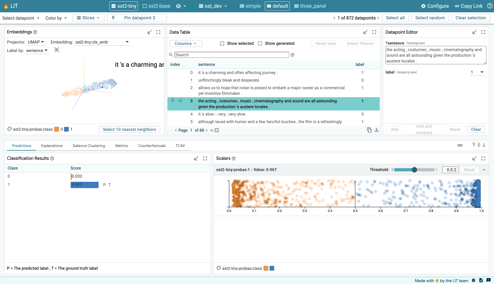

## Table of Contents

## What is Lit in the context of machine learning?

In the context of machine learning, "Lit" refers to a lightweight library for TensorFlow that makes it easier to train models. It's designed to simplify the process of setting up and running machine learning experiments. With Lit, you can quickly prototype and test different models without getting bogged down in the complexities of TensorFlow's lower-level API. This means you can focus more on the actual machine learning tasks, like choosing the right model architecture or tuning hyperparameters, rather than worrying about the underlying code.

Lit is particularly useful for researchers and developers who want to experiment with new ideas quickly. It provides a more user-friendly interface to TensorFlow, allowing you to write less code and get results faster. For example, you can define a model, set up your data pipeline, and start training with just a few lines of code. This makes it easier to iterate and refine your models, leading to better performance and more efficient use of your time.

## How does Lit help in understanding and improving machine learning models?

Lit helps in understanding and improving machine learning models by providing tools that make it easier to analyze and visualize what the model is doing. For example, Lit includes features like model interpretation, which lets you see how the model makes its predictions. This can be really helpful because you can look at individual examples and see which parts of the input the model is focusing on. If you're working on a text classification task, Lit can show you which words in a sentence are most important for the model's decision. This kind of insight helps you understand if the model is learning the right things or if it's making mistakes.

In addition to understanding the model, Lit also helps in improving it. By making it easy to experiment with different model architectures and hyperparameters, Lit allows you to quickly try out new ideas and see if they work better. For example, if you think changing the number of layers in your [neural network](/wiki/neural-network) might help, you can easily test this with Lit. It also supports techniques like transfer learning, where you can use a pre-trained model and fine-tune it for your specific task. This can save a lot of time and often leads to better performance. Overall, Lit makes the process of improving [machine learning](/wiki/machine-learning) models faster and more efficient, helping you get the best results possible.

## What are the key features of Lit that make it useful for machine learning practitioners?

Lit is a tool that helps machine learning practitioners by making it easier to work with TensorFlow. One of the key features of Lit is its simplicity. It lets you set up and run experiments quickly, so you don't have to write a lot of code. This means you can focus more on the important parts of your project, like choosing the right model or adjusting settings to make it work better. For example, if you want to try a different model, you can do it with just a few lines of code, which saves a lot of time.

Another important feature of Lit is its ability to help you understand and improve your models. It has tools that let you see how your model makes decisions. This is helpful because you can look at specific examples and see what the model is focusing on. If you're working on a project where you classify text, Lit can show you which words in a sentence are most important to the model. This helps you figure out if the model is learning the right things or if it needs to be changed. With Lit, you can also try different model setups and settings easily, which helps you find the best way to make your model work better.

## Can you explain how to set up and use Lit for a basic machine learning project?

To set up Lit for a basic machine learning project, you first need to make sure you have TensorFlow installed on your computer. Once you have TensorFlow, you can install Lit using pip, which is a tool for installing Python packages. Just type `pip install lit` in your command line, and it will download and set up Lit for you. After installation, you can start using Lit in your Python code. To do this, you'll need to import the necessary modules from Lit. For example, you might start your script with `from lit import LitModel, Trainer`.

Once you have Lit set up, you can use it to create and train a simple machine learning model. Let's say you want to build a model to classify images. You would first define your model using Lit's `LitModel` class. This involves specifying the architecture of your model, like how many layers it has and what type of layers they are. For example, you might write something like `model = LitModel(input_shape=(28, 28, 1), num_classes=10)`. After defining your model, you need to set up your data and a trainer. You can use Lit's `Trainer` class to manage the training process. You would prepare your dataset and then create a trainer like this: `trainer = Trainer(model, train_loader, val_loader)`. Finally, you can start training your model by calling `trainer.fit()`. This will run the training process, and you can monitor how well your model is doing.

Using Lit makes it easier to experiment with different model setups and settings. For example, if you want to try a different number of layers in your model, you can quickly change the `LitModel` definition and run the training again. Lit also provides tools to help you understand how your model is making decisions, which can be really helpful for improving your model's performance. By following these steps, you can use Lit to build and improve a basic machine learning project without getting bogged down in the complexities of TensorFlow's lower-level API.

## What types of machine learning models are compatible with Lit?

Lit is designed to work with a wide range of machine learning models, making it a versatile tool for many different types of projects. It supports common types of models like neural networks, which are used for tasks like image classification or natural language processing. For example, you can use Lit to build and train convolutional neural networks (CNNs) for recognizing objects in images or recurrent neural networks (RNNs) for understanding sequences of text. Lit also works well with simpler models like linear regression or logistic regression, which are often used for predicting numerical values or classifying data into categories.

In addition to these traditional models, Lit is compatible with more advanced architectures like transformers, which are popular in natural language processing tasks. Transformers are good at understanding the context of words in a sentence, making them useful for tasks like machine translation or text generation. If you're working on a project that involves time series data, Lit can handle models like Long Short-Term Memory (LSTM) networks, which are designed to remember information over long periods. Overall, Lit's flexibility means you can use it for a variety of machine learning tasks, from simple to complex, without needing to switch to different tools.

## How does Lit assist in visualizing and interpreting model predictions?

Lit makes it easier to understand what your machine learning model is doing by showing you how it makes predictions. For example, if you're working on a project where you classify text, Lit can highlight which words in a sentence are most important to the model's decision. This helps you see if the model is focusing on the right things or if it's making mistakes. You can look at individual examples and see how the model interprets them, which is really helpful for figuring out how to improve your model.

In addition to showing you which parts of the input the model cares about, Lit also lets you see how changing the input affects the model's predictions. This is useful because you can experiment with different inputs and see how the model reacts. For instance, if you change a word in a sentence, Lit can show you how the model's prediction changes. This kind of visualization helps you understand the model's behavior better and make better decisions about how to tweak it for better performance.

## What are some common use cases for Lit in machine learning?

Lit is really helpful for people who want to quickly try out different machine learning models. For example, if you're working on a project where you need to classify images, Lit makes it easy to set up and train a [convolutional neural network](/wiki/convolutional-neural-network) (CNN). You can change the number of layers or the type of layers in your model and see how it affects the results without writing a lot of code. This is great for experimenting and finding the best model for your task.

Another common use for Lit is in natural language processing (NLP) projects. If you're trying to understand or generate text, Lit can help you build and test models like transformers. These models are good at understanding the context of words in a sentence. With Lit, you can see which words the model thinks are important and how changing the words affects the model's predictions. This helps you improve your model and get better results.

Lit is also useful for projects that involve time series data, like predicting stock prices or weather patterns. You can use Lit to set up and train models like Long Short-Term Memory (LSTM) networks, which are designed to remember information over long periods. This makes it easier to experiment with different model setups and find the best way to predict future values based on past data.

## How can Lit be integrated into a machine learning workflow?

To integrate Lit into a machine learning workflow, you first need to install it using pip by running `pip install lit` in your command line. Once installed, you can import Lit's modules into your Python script. For example, you might start with `from lit import LitModel, Trainer`. This allows you to define your model using the `LitModel` class, where you can specify the model's architecture, like the number of layers and the type of layers. For instance, if you're working on an image classification task, you might define your model like this: ```model = LitModel(input_shape=(28, 28, 1), num_classes=10)```. After setting up your model, you prepare your data and create a trainer using the `Trainer` class, then start the training process with `trainer.fit()`. This simple setup lets you quickly experiment with different model configurations and see how they perform.

Once your model is trained, Lit provides tools to help you understand and improve it. You can use Lit's visualization features to see which parts of the input your model focuses on when making predictions. For example, in a text classification project, Lit can highlight the most important words in a sentence, helping you understand if the model is learning the right things. Additionally, you can experiment with different inputs and see how the model's predictions change, which is useful for fine-tuning your model. By integrating Lit into your workflow, you can iterate quickly, test new ideas, and improve your model's performance without getting bogged down in complex code.

## What advanced functionalities does Lit offer for expert users in machine learning?

For expert users in machine learning, Lit offers advanced functionalities that go beyond basic model training and visualization. One key feature is the ability to easily implement and experiment with transfer learning. This means you can take a model that's already been trained on a large dataset, like a pre-trained transformer, and fine-tune it for your specific task. With Lit, you can do this with just a few lines of code, making it easier to leverage the power of large pre-trained models. For example, if you're working on a text classification task, you can use a pre-trained model and adapt it to your dataset, which often leads to better performance and faster training times.

Another advanced functionality of Lit is its support for custom model architectures. If you have a unique problem that requires a specialized model, Lit allows you to define and implement these custom models easily. You can specify the layers, their connections, and even add custom loss functions or optimization algorithms. This flexibility is crucial for experts who need to tailor their models to specific needs. Additionally, Lit provides tools for advanced model interpretation, allowing you to dive deep into how your model makes decisions. You can analyze the model's attention mechanisms, see how different inputs affect the output, and even visualize the model's internal representations. This level of insight helps experts refine their models and push the boundaries of what's possible in machine learning.

## How does Lit handle large datasets and complex model architectures?

Lit is designed to handle large datasets and complex model architectures efficiently. When working with big datasets, Lit integrates well with TensorFlow's data loading and preprocessing tools. This means you can easily set up data pipelines to feed your model with batches of data, even if the dataset is too large to fit into memory. For example, you can use TensorFlow's `tf.data` API to create a dataset and then pass it to Lit's `Trainer` class. This setup allows you to train your model on large amounts of data without running into memory issues.

When it comes to complex model architectures, Lit offers a lot of flexibility. You can define custom models with many layers and different types of connections using the `LitModel` class. For instance, if you want to build a model with multiple convolutional layers followed by dense layers, you can specify this architecture easily. Lit also supports advanced techniques like transfer learning, where you can use a pre-trained model and fine-tune it for your specific task. This is particularly useful for complex models, as it can save time and improve performance. With Lit, you can experiment with different model setups and see how they work with your large datasets, making it easier to find the best solution for your project.

## Can you discuss any limitations or challenges when using Lit for machine learning?

While Lit is a powerful tool that makes it easier to work with TensorFlow, it does have some limitations. One challenge is that Lit is built on top of TensorFlow, so if you run into issues with TensorFlow itself, you might find it hard to fix them using Lit alone. For example, if TensorFlow has a problem with handling very large datasets, Lit won't be able to solve that problem by itself. Also, Lit might not have all the advanced features that you can get from using TensorFlow directly, so if you need to do something very specific or complex, you might need to go back to TensorFlow's lower-level API.

Another limitation is that Lit is still a relatively new tool, so it might not have as much support or as many resources available as more established libraries. If you have a question or run into a problem, you might find fewer tutorials or community answers compared to other tools. This can make it harder to learn and use Lit, especially if you're new to machine learning. However, as Lit continues to grow and gain popularity, these challenges are likely to become less significant over time.

## What future developments or enhancements are expected for Lit in the machine learning community?

In the future, the machine learning community expects Lit to become even more user-friendly and powerful. One big enhancement could be better support for different types of data and models. For example, Lit might add more tools to handle things like audio or video data, making it easier to build models for tasks like speech recognition or video classification. Another expected development is improved integration with other popular machine learning tools and frameworks. This would make it easier to use Lit alongside other tools you might already be using, like scikit-learn or PyTorch, allowing you to switch between them smoothly.

Another area where Lit could see improvements is in its ability to help users understand and explain their models. The community hopes that Lit will add more advanced visualization and interpretation tools. These tools could help you see not just which parts of the input your model focuses on, but also why it makes certain decisions. This would be really helpful for making sure your model is fair and unbiased, and for explaining its predictions to others. As Lit continues to grow, these enhancements could make it an even more valuable tool for both beginners and experts in machine learning.