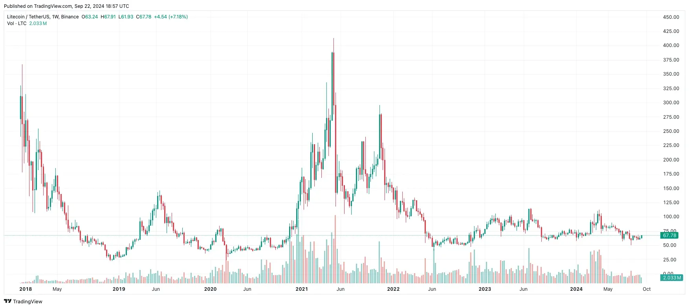

## Table of Contents

## What is Litecoin and how does it differ from Bitcoin?

Litecoin is a type of digital money, similar to Bitcoin. It was created in 2011 by a person named Charlie Lee. People use Litecoin to buy things online or send money to others quickly and cheaply. Like Bitcoin, Litecoin uses a technology called blockchain to keep track of all transactions. This makes it secure and transparent.

Litecoin differs from Bitcoin in a few ways. First, Litecoin can process transactions faster. This means that when you send Litecoin, it usually gets to the other person quicker than Bitcoin. Second, Litecoin has a different way of making new coins. Bitcoin uses a method called "mining," which can be hard and needs powerful computers. Litecoin uses a method that is easier and more people can do it. Overall, Litecoin is seen as a lighter and quicker version of Bitcoin.

## How does Litecoin function as a cryptocurrency?

Litecoin functions as a cryptocurrency by allowing people to send and receive money over the internet without needing a bank. It uses a technology called blockchain, which is like a big public notebook where every Litecoin transaction is recorded. This makes Litecoin secure because everyone can see the transactions, and it's hard for anyone to cheat the system. When you want to send Litecoin to someone, you use a special code called a "wallet address" to make sure the money goes to the right person. The transaction is then checked by people called "miners" who use computers to solve puzzles and add the transaction to the blockchain.

Litecoin is different from regular money because it's not controlled by any government or bank. Instead, it's managed by the people who use it. This means that Litecoin can be used anywhere in the world, as long as the other person also uses Litecoin. It's also cheaper to send Litecoin than to send money through a bank, especially if you're sending it to another country. This makes it a good choice for people who need to send money quickly and cheaply.

## Who created Litecoin and what was the motivation behind its creation?

Litecoin was created by a person named Charlie Lee. He used to work at a company called Google before he started working on Litecoin. Charlie wanted to make a digital currency that was like Bitcoin but better in some ways. He thought Bitcoin was too slow and hard to use for everyday things, so he made Litecoin to be faster and easier.

Charlie's main goal was to make a [cryptocurrency](/wiki/cryptocurrency) that more people could use. He wanted it to be easier for people to send money to each other without needing a bank. Litecoin was designed to be a lighter version of Bitcoin, which is why it's called "Lite"coin. By making it faster and easier to mine, Charlie hoped that more people would start using it and it would become a popular way to pay for things online.

## What are the key historical milestones in the development of Litecoin?

Litecoin was created in 2011 by Charlie Lee. He used to work at Google before he started working on Litecoin. Charlie wanted to make a digital currency that was like Bitcoin but better in some ways. He thought Bitcoin was too slow and hard to use for everyday things, so he made Litecoin to be faster and easier. Litecoin started being used in October 2011, and it quickly became popular among people who liked cryptocurrencies.

Over the years, Litecoin has had many important moments. In 2013, Litecoin was added to a big website called Coinbase, which made it easier for more people to buy and use Litecoin. In 2017, Litecoin was the first cryptocurrency to use a new technology called SegWit, which made transactions even faster and cheaper. This showed that Litecoin could try new things and improve, which helped it stay popular.

## How is Litecoin mined and what makes it different from Bitcoin mining?

Litecoin is mined using a process that's a bit different from Bitcoin. People who mine Litecoin use their computers to solve math puzzles. When they solve a puzzle, they get to add a new block of transactions to the Litecoin blockchain. This is called "mining" because it's like digging for treasure. The miners get rewarded with new Litecoins for their work. Litecoin uses a mining method called Scrypt, which is easier for regular computers to handle compared to Bitcoin's method.

Bitcoin mining uses a method called SHA-256, which needs very powerful computers. These computers use a lot of electricity and can be expensive to run. Because of this, Bitcoin mining is often done by big companies with lots of money and special equipment. Litecoin's Scrypt method, on the other hand, was designed so that more people could mine it using regular computers. This makes Litecoin mining more accessible to everyday people and less dominated by big companies.

## What are the current trends in Litecoin adoption and usage?

Litecoin is becoming more popular as more people learn about it and start using it. Many businesses and online stores now accept Litecoin as a way to pay for things. This makes it easier for people to use Litecoin for everyday purchases. Also, more people are using Litecoin to send money to friends and family, especially when they live in different countries. It's fast and cheap, which makes it a good choice for sending money overseas.

Another trend is that Litecoin is being used more in new technologies like the Lightning Network. This technology makes Litecoin transactions even faster and cheaper. It's like a special highway for Litecoin that helps it move quickly. More developers are working on projects that use Litecoin, which means it's becoming a bigger part of the world of digital money. Overall, Litecoin is growing in popularity and is being used in more ways as time goes on.

## How does Litecoin's transaction speed and cost compare to other cryptocurrencies?

Litecoin is known for being fast and cheap when you send money to someone. It usually takes about 2.5 minutes for a Litecoin transaction to be confirmed. This is faster than Bitcoin, which can take around 10 minutes for a transaction to be confirmed. Litecoin's speed makes it good for everyday purchases because you don't have to wait long for your payment to go through. Also, the fees for sending Litecoin are usually low, which means it costs less to send money to someone than with some other cryptocurrencies.

Compared to other cryptocurrencies, Litecoin often has lower fees and faster transaction times. For example, Ethereum transactions can be slower and more expensive, especially during busy times when a lot of people are using the network. Some newer cryptocurrencies like Stellar or Ripple are even faster than Litecoin, but they might not be as widely used or accepted. Litecoin tries to find a good balance between speed, cost, and being easy to use, which is why it's popular for people who want to send money quickly and cheaply.

## What role does Litecoin play in the broader cryptocurrency ecosystem?

Litecoin plays an important role in the broader cryptocurrency ecosystem by acting as a testing ground for new technologies that can later be used by other cryptocurrencies like Bitcoin. For example, Litecoin was the first major cryptocurrency to implement Segregated Witness (SegWit), a technology that makes transactions faster and cheaper. This helped show that SegWit could work well, and it encouraged other cryptocurrencies to adopt it too. By trying out new ideas first, Litecoin helps the whole ecosystem grow and improve.

Litecoin also helps make digital money more accessible to more people. It's easier to mine than Bitcoin, which means more people can participate in the network without needing expensive equipment. This makes Litecoin more decentralized and helps keep the power in the hands of everyday users. Additionally, Litecoin's fast and cheap transactions make it a good choice for everyday purchases and sending money to friends and family, especially across borders. This helps spread the use of cryptocurrencies and makes them a more practical part of everyday life.

## What are the technical advantages and limitations of Litecoin?

Litecoin has some good technical advantages. It's faster than Bitcoin, with transactions usually taking about 2.5 minutes to confirm. This makes it better for everyday purchases because you don't have to wait long. Litecoin also uses less energy to mine because it uses a method called Scrypt, which lets more people mine with regular computers. This makes Litecoin more accessible and helps keep the network decentralized. Another advantage is that Litecoin was the first big cryptocurrency to use SegWit, a technology that makes transactions even faster and cheaper. This shows that Litecoin is good at trying new things and can help the whole cryptocurrency world improve.

However, Litecoin also has some limitations. Even though it's faster than Bitcoin, there are newer cryptocurrencies like Stellar and Ripple that can process transactions even quicker. Litecoin's value can also go up and down a lot, which can be risky for people who want to use it as money. Another limitation is that Litecoin isn't as widely accepted as Bitcoin yet, so you might not be able to use it everywhere. But overall, Litecoin's technical advantages help make it a strong and useful part of the cryptocurrency world.

## How have Litecoin's price and market performance evolved over time?

Litecoin's price and market performance have gone through many ups and downs since it started in 2011. At first, Litecoin didn't cost much, but as more people learned about it and started using it, its price began to grow. In 2013, Litecoin's price jumped a lot, going from just a few dollars to over $50. This happened because more people were getting interested in cryptocurrencies. After that, Litecoin's price went up and down a lot, just like other cryptocurrencies. In 2017, during a big boom in the crypto world, Litecoin's price hit over $300 for the first time. But then, like other cryptocurrencies, it fell back down.

Over the years, Litecoin has kept growing and changing. In 2021, Litecoin's price went up again, reaching over $400 at one point. This was because more people were using it and new technologies like the Lightning Network made it even better. But Litecoin's price can still be very unpredictable. It goes up when people are excited about cryptocurrencies and down when they're worried. Even with all these ups and downs, Litecoin has stayed one of the top cryptocurrencies. It's still used by a lot of people and businesses, and its market performance shows that it's a strong part of the digital money world.

## What are the future developments planned for Litecoin?

Litecoin is always trying to get better and stay useful. One big thing they're working on is making transactions even faster and cheaper with something called the Lightning Network. This is like a special highway for Litecoin that helps it move quickly. More and more people are using this, and it's making Litecoin even better for sending money. Also, Litecoin's team is always looking at new ideas and technologies to see if they can help Litecoin. They want to keep trying new things to make Litecoin faster, cheaper, and easier to use.

Another thing Litecoin is working on is making it more popular and easier to use. They want more stores and businesses to accept Litecoin so people can use it more in everyday life. Litecoin also wants to make it easier for people to buy and sell Litecoin, maybe even on their phones. By doing these things, Litecoin hopes to keep growing and becoming a bigger part of the world of digital money. They want to make sure Litecoin stays fast, cheap, and easy to use for everyone.

## What are the predictions and outlook for Litecoin in the coming years?

Litecoin is expected to keep growing and becoming more popular in the coming years. More people and businesses are likely to start using it because it's fast and cheap. Litecoin is also trying out new technologies like the Lightning Network, which makes it even faster and cheaper to send money. This could help Litecoin become a big part of everyday life, like using it to buy things online or send money to friends and family. As more people learn about Litecoin and start using it, its value might go up, but it can still go up and down a lot like other cryptocurrencies.

In the future, Litecoin might also be used in new ways that we can't even think of yet. The people who work on Litecoin are always trying new things and looking for ways to make it better. They want to make sure Litecoin stays easy to use and helpful for everyone. Even though the world of digital money can be unpredictable, Litecoin has a good chance of staying strong and useful because it's always trying to get better and more people are using it.

## References & Further Reading

[1]: ["Algorithms for Hyper-Parameter Optimization"](https://dl.acm.org/doi/10.5555/2986459.2986743) by Bergstra, J., Bardenet, R., Bengio, Y., & Kégl, B., published in Advances in Neural Information Processing Systems 24 (2011).

[2]: ["Advances in Financial Machine Learning"](https://www.amazon.com/Advances-Financial-Machine-Learning-Marcos/dp/1119482089) by Marcos Lopez de Prado. This book provides insights into the use of machine learning techniques in financial markets.

[3]: ["Evidence-Based Technical Analysis: Applying the Scientific Method and Statistical Inference to Trading Signals"](https://www.amazon.com/Evidence-Based-Technical-Analysis-Scientific-Statistical/dp/0470008741) by David Aronson. This book explores the use of rigorous scientific methods in technical analysis.

[4]: ["Machine Learning for Algorithmic Trading"](https://github.com/stefan-jansen/machine-learning-for-trading) by Stefan Jansen. This book covers the application of machine learning techniques to trading strategies.

[5]: ["Quantitative Trading: How to Build Your Own Algorithmic Trading Business"](https://www.amazon.com/Quantitative-Trading-Build-Algorithmic-Business/dp/1119800064) by Ernest P. Chan. This resource provides a guide to building a successful algorithmic trading business.