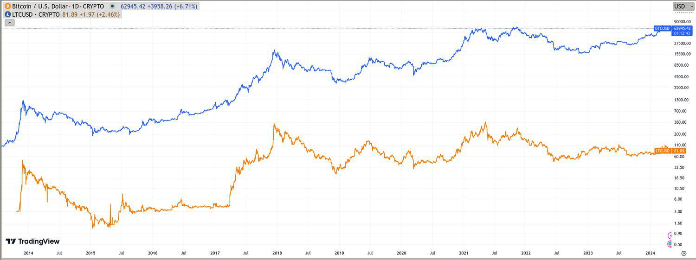

In recent years, cryptocurrency trading has gained immense popularity, with Bitcoin and Litecoin emerging as two of the most traded digital currencies. Bitcoin, the pioneering cryptocurrency, introduced blockchain technology and set the foundation for decentralized and secure digital transactions. Litecoin followed, providing faster transaction times and diversified hashing algorithms, contributing to the broad appeal of digital currencies. As these two cryptocurrencies solidify their positions in financial markets, they offer unique trading opportunities and challenges.

Algorithmic trading, commonly known as algo trading, is transforming how traders engage with these digital assets. By leveraging pre-programmed software to execute trades based on specific criteria and strategies, algo trading enhances both speed and precision, minimizing human error—a crucial advantage in the highly volatile cryptocurrency markets. This technological advancement allows traders to efficiently capitalize on rapid market fluctuations, offering a competitive edge that manual trading often lacks.



This article examines the intersection of Litecoin, Bitcoin, and algorithmic trading, illustrating how these elements combine to improve trading efficiency. By exploring this synergy, readers will gain insights into the benefits, challenges, and strategies inherent to algo trading in the cryptocurrency sector. A deeper understanding of these dynamics equips traders with the knowledge to make informed decisions, potentially increasing their profitability in the fast-evolving cryptocurrency landscape. As the crypto market continues to grow and evolve, staying informed about these advancements will become increasingly vital for traders aiming for success.

## Table of Contents

## Understanding Cryptocurrency: Litecoin and Bitcoin

Bitcoin, created by an anonymous entity known as Satoshi Nakamoto in 2009, was the first application of blockchain technology, revolutionizing the financial industry by enabling secure and decentralized digital transactions. Blockchain, the underpinning technology, functions as a distributed ledger recording all Bitcoin transactions chronologically and publicly, ensuring transparency and immutability. Bitcoin's consensus algorithm, Proof of Work (PoW), requires miners to solve complex mathematical problems to validate transactions and secure the network, a process that inherently consumes significant computational resources.

Litecoin, developed by Charlie Lee in 2011, aimed to address some of Bitcoin's perceived limitations, primarily focusing on transaction speed and scalability. Often dubbed the "silver to Bitcoin's gold," Litecoin employs a similar PoW consensus mechanism but with notable differences. It utilizes the Scrypt hashing algorithm, which is memory-intensive and allows for faster transaction processing times compared to Bitcoin's SHA-256 algorithm. This results in a block generation time of approximately 2.5 minutes for Litecoin, significantly faster than Bitcoin's 10 minutes. Consequently, Litecoin enjoys a higher transaction throughput capacity, rendering it a more suitable option for routine transactions.

Both Bitcoin and Litecoin play pivotal roles in the digital asset ecosystem, each offering unique advantages that cater to different segments of the market. Bitcoin, with its first-mover advantage and significant market capitalization, is often viewed as a store of value akin to digital gold. Its finite supply of 21 million coins bolsters this narrative, fostering investor confidence against inflationary pressures. Conversely, Litecoin's design emphasizes transactional efficiency, making it preferable for users requiring swift and cost-effective transfers.

The decision to trade Bitcoin or Litecoin can be influenced by various factors, each rooted in their foundational differences. Traders might opt for Bitcoin to benefit from its market stability and [liquidity](/wiki/liquidity-risk-premium), factors critical to large-scale trades or long-term investments. On the other hand, Litecoin's rapid transaction confirmation and lower fees may attract traders and users who prioritize speed and cost, particularly in microtransactions or frequent daily trades.

Understanding the technical and economic distinctions between Bitcoin and Litecoin equips traders with the necessary insights to navigate the [cryptocurrency](/wiki/cryptocurrency) market judiciously. As both cryptocurrencies continue to evolve, being informed about their respective features and potential use cases supports strategic decision-making, thereby enhancing trading efficacy and potentially increasing profitability.

 to Algorithmic Trading

Algorithmic trading involves employing software to automate the execution of trades based on pre-established criteria and methods within financial markets. In cryptocurrencies, this approach provides traders with enhanced speed and precision, essential attributes given the market's notorious [volatility](/wiki/volatility-trading-strategies). By reducing the potential for human error, [algorithmic trading](/wiki/algorithmic-trading) systems are better positioned to seize opportunities presented by rapid market fluctuations more effectively than manual trades.

The mechanics behind algorithmic trading encompass various algorithms adapted specifically for the cryptocurrency market, each suited to different trading styles and objectives. Commonly employed algorithms in this context include:

1. **Trend-Following Algorithms**: These algorithms are designed to capitalize on identifiable trends within cryptocurrency price movements. By analyzing historical data to detect uptrends or downtrends, they execute trades that align with the current direction of the market.

2. **Arbitrage Algorithms**: Arbitrage opportunities arise when price discrepancies occur between various markets or exchanges for the same asset. These algorithms exploit such inefficiencies, simultaneously buying and selling an asset across platforms to secure risk-free profits.

3. **Market-Making Algorithms**: These are used by traders who aim to provide liquidity to markets by placing both buy and sell orders simultaneously. The objective is to profit from the bid-ask spread while maintaining a neutral market position.

4. **Mean Reversion Algorithms**: These calculate the average price of an asset over a particular period and predict that its price will eventually revert to this mean. Trades are executed when prices deviate significantly from their expected average, assuming they will return to it over time.

Algorithmic trading systems often integrate advanced technologies such as [machine learning](/wiki/machine-learning) and [artificial intelligence](/wiki/ai-artificial-intelligence) to refine these strategies and enhance predictive accuracy. These technologies can process vast amounts of data at high speed, unveiling patterns and insights that may not be immediately apparent through traditional analysis.

For traders focusing on Bitcoin, Litecoin, or other cryptocurrencies, understanding these strategies is key to optimizing trading performance. Python, a popular programming language in financial markets, can be used to implement these algorithms. A basic Python script for a simple moving average crossover strategy, which is a type of trend-following algorithm, might look like this:

```python
import pandas as pd
import numpy as np

# Sample historical data
data = {'Price': [100, 102, 101, 105, 107, 110, 115]}
df = pd.DataFrame(data)

# Calculate short and long moving averages
short_window = 3
long_window = 5
df['Short_MA'] = df['Price'].rolling(window=short_window, min_periods=1).mean()
df['Long_MA'] = df['Price'].rolling(window=long_window, min_periods=1).mean()

# Generate trading signals
df['Signal'] = np.where(df['Short_MA'] > df['Long_MA'], 1, 0)

print(df)
```

This script computes short-term and long-term moving averages from historical price data and generates buy signals when the short-term average exceeds the long-term average.

Understanding these simple strategies forms the baseline from which traders can develop more complex and adaptive systems tailored to the unique challenges of the cryptocurrency market. Mastery of algorithmic trading requires continuous learning and adaptation to practice effective strategies in the Bitcoin and Litecoin markets.

## Benefits of Algo Trading for Bitcoin and Litecoin

Algorithmic trading offers distinct advantages for trading Bitcoin and Litecoin, bringing efficiency and sophistication to the cryptocurrency market. One of the foremost benefits is the capability to operate continuously, 24/7, without manual intervention. The cryptocurrency market does not adhere to traditional trading hours, making round-the-clock trading essential. Algorithms can consistently monitor and execute trades based on predefined criteria, ensuring opportunities are not missed when human traders are unavailable.

Another crucial benefit is the reduction of emotional trading decisions. The cryptocurrency market is notoriously volatile, and emotionally driven trading can result in significant losses. Algorithms execute trades based on logical parameters, eliminating emotions from the decision-making process. This approach helps in making rational trading decisions that are less influenced by sudden market swings or trader sentiment.

Algorithmic trading also enhances operational efficiency by allowing the execution of multiple trades simultaneously. By optimizing the use of computational resources, traders can swiftly [carry](/wiki/carry-trading) out numerous transactions across different markets or trading pairs. This capability is particularly beneficial for strategies like [arbitrage](/wiki/arbitrage), where capturing minute price differences across exchanges is key.

Furthermore, algorithms facilitate the [backtesting](/wiki/backtesting) of trading strategies using historical data. This functionality enables traders to evaluate the performance of their strategies under various market conditions before they are applied in live markets. By analyzing how a strategy would have performed historically, traders can identify and refine weaknesses, potentially improving their real-world effectiveness.

The sophistication of algorithms also extends to enhanced data analysis capabilities, an invaluable asset for risk management. Algorithms can process vast amounts of data, identifying trends and anomalies that might be overlooked in manual trading. This analytical depth aids in constructing more robust risk management frameworks, allowing traders to better anticipate and mitigate potential losses.

Overall, algo trading empowers both novice and experienced traders by providing tools that enhance efficiency, reduce psychological biases, and improve data-driven decision-making. These benefits are particularly crucial in the cryptocurrency market, where volatility and non-stop operations pose unique challenges.

## Challenges and Risks in Algorithmic Crypto Trading

Algorithmic trading, despite its many advantages, is not devoid of challenges and risks. This reality is pronounced in the highly volatile environment of cryptocurrency markets, where fluctuations can occur at an unprecedented pace. Notably, market manipulation, flash crashes, and unforeseen technical problems represent substantial risks that can undermine algorithmic strategies. 

**Market Manipulation and Flash Crashes**

Cryptocurrency markets are notoriously susceptible to manipulation due to their relative youth and lack of regulation compared to traditional financial markets. Pump-and-dump schemes, where asset prices are artificially inflated and subsequently dropped, can significantly disrupt algorithmic systems that rely on price signals for trading decisions. Flash crashes, where prices plummet and recover within minutes or even seconds, can also result in substantial financial losses. These rapid changes can mislead algorithms, especially those not equipped with real-time data analysis or adaptive capabilities.

**Technical Expertise and Resource Demands**

Developing and maintaining efficient trading algorithms demands a high degree of technical expertise and significant resource allocation. The algorithms need to be meticulously coded, tested, and optimized for performance under various market conditions. Furthermore, they require continuous monitoring and adjustment. A lack of technical skills or adequate resources can lead to suboptimal algorithms that fail to capitalize on market opportunities or, worse, incur losses.

**Regulatory Challenges**

The regulatory landscape for cryptocurrency varies widely between jurisdictions and is constantly evolving. Changes in regulations can directly affect the legality and effectiveness of certain trading strategies. For instance, regulations that impact data privacy, exchange operation, or trading practices might necessitate immediate modifications to existing algorithms. Traders and developers must remain vigilant, keeping abreast of regulatory changes to ensure compliance and adapt strategies accordingly.

**Over-reliance on Algorithms**

An over-reliance on algorithmic trading poses risks, as no algorithm is infallible. While algorithms can process data at speeds unattainable by human traders, they lack the nuanced understanding of market sentiment and unforeseen variables influencing market moves. Therefore, a balance must be maintained, integrating human oversight with algorithmic execution to ensure adaptability to unique market conditions.

In conclusion, while algorithmic trading can significantly enhance trading efficiency and profitability, it is incumbent upon traders to recognize and mitigate these inherent risks. Understanding and preparing for market manipulation, technical challenges, regulatory developments, and algorithmic limitations are critical for successful engagement in cryptocurrency markets.

## Strategies for Successful Algo Trading in Cryptocurrency

Successful algo trading strategies in cryptocurrency often leverage a combination of technical analysis, machine learning, and artificial intelligence to enhance predictive capabilities. This integration allows algorithms to process vast amounts of data and recognize patterns that may be indicative of future market movements. Here, we explore several popular algorithmic trading strategies utilized in the cryptocurrency market, specifically focusing on Bitcoin and Litecoin, while discussing the importance of adaptability and collaboration.

### Arbitrage

Arbitrage involves the simultaneous purchase and sale of a cryptocurrency across different markets to exploit price discrepancies. For instance, if Bitcoin is priced lower on one exchange compared to another, a trader can buy on the cheaper exchange and sell on the more expensive one, profiting from the difference. Python's `ccxt` library can be used to interface with multiple exchanges, enabling automated detection and execution of such opportunities. The following simplified code snippet illustrates how one might use this library:

```python
import ccxt

exchange_A = ccxt.binance()
exchange_B = ccxt.kraken()

ticker_A = exchange_A.fetch_ticker('BTC/USD')
ticker_B = exchange_B.fetch_ticker('BTC/USD')

if ticker_A['ask'] < ticker_B['bid']:
    # Buy from exchange_A and sell on exchange_B
    print("Arbitrage opportunity detected")
```

### Market Making

Market making involves placing both buy and sell orders to profit from the bid-ask spread. This strategy requires maintaining a presence on both sides of the [order book](/wiki/order-book-trading-strategies), thus providing liquidity to the market. Market makers adjust their orders based on real-time information, and algorithms can rapidly modify prices to remain competitive. However, this strategy requires significant capital and may include risks from sudden price volatility.

### Momentum Trading

Momentum trading strategies capitalize on the continuation of existing price trends. Algorithms designed for this strategy typically identify securities showing upward or downward trends and make trades based on the assumption that these trends will persist. This requires precise calibration to balance between following genuine trends and avoiding false signals. Machine learning models, such as support vector machines or neural networks, can enhance this strategy's effectiveness by better analyzing historical price data and identifying trend continuations.

### Mean Reversion

The mean reversion strategy is based on the belief that prices and returns eventually move back towards the mean or average level of the entire dataset. Algorithms can be programmed to identify deviations from the average price and execute trades anticipating a return to the mean. This strategy depends heavily on statistical analysis and can be enhanced by using time series models to predict mean values accurately.

### Continuous Monitoring and Adaptation 

Cryptocurrency markets are highly volatile, and conditions can change rapidly. It is crucial for traders to continuously monitor their algorithms and make necessary adjustments to adapt to evolving market conditions. This may involve recalibrating models, revising parameters, or even switching strategies based on quantitative performance analysis.

### Diversification and Risk Management

Diversifying algorithmic strategies across different cryptocurrencies like Bitcoin and Litecoin helps spread risk and can enhance potential returns. By not relying on a single strategy or currency, traders can mitigate losses that might occur from a specific market anomaly. Proper risk management protocols are essential for maintaining capital and ensuring long-term success.

### Collaboration and Platforms

Collaborating with experienced developers or utilizing established trading platforms can significantly benefit traders looking to optimize their algo trading systems. These platforms often provide robust infrastructures, advanced APIs, and high-frequency trading capabilities that are difficult to develop independently. Engaging in such collaborations can streamline the implementation and refinement of algorithmic strategies.

By integrating these strategies and considerations, traders can effectively navigate the complexities of the cryptocurrency market, leveraging technology to maximize their trading efficacy and profitability.

## Conclusion

Algorithmic trading serves as a formidable toolset for engaging with cryptocurrency trading, particularly with prominent assets like Bitcoin and Litecoin. The compelling advantage of algorithmic trading lies in its ability to execute trades with enhanced efficiency, minimizing the uncertainties associated with human emotions and leveraging advanced data analysis techniques. Despite its numerous benefits, algorithmic trading also presents its own set of challenges in the volatile and unpredictable cryptocurrency markets.

Mastering algorithmic trading requires a comprehensive understanding of its intricacies and a commitment to continuously improving strategies. By refining approaches and adapting to the ever-evolving market conditions, traders can effectively utilize the power of algorithmic trading to progress in their cryptocurrency ventures. Maintaining competitiveness in this rapidly changing environment demands staying informed about the latest trends and technological advancements. 

The right combination of strategic insight and technological aptitude can significantly improve outcomes in the dynamic crypto trading spaces. By integrating sophisticated algorithms and leveraging computational advancements, traders can potentially increase their success and profitability. Therefore, those who embrace algorithmic trading with a thorough understanding and adaptable strategies stand to benefit considerably in the world of cryptocurrency trading.

## References & Further Reading

[1]: Bergstra, J., Bardenet, R., Bengio, Y., & Kégl, B. (2011). ["Algorithms for Hyper-Parameter Optimization."](https://papers.nips.cc/paper/4443-algorithms-for-hyper-parameter-optimization) Advances in Neural Information Processing Systems 24.

[2]: ["Advances in Financial Machine Learning"](https://www.amazon.com/Advances-Financial-Machine-Learning-Marcos/dp/1119482089) by Marcos Lopez de Prado

[3]: ["Evidence-Based Technical Analysis: Applying the Scientific Method and Statistical Inference to Trading Signals"](https://www.amazon.com/Evidence-Based-Technical-Analysis-Scientific-Statistical/dp/0470008741) by David Aronson

[4]: ["Machine Learning for Algorithmic Trading"](https://github.com/stefan-jansen/machine-learning-for-trading) by Stefan Jansen

[5]: ["Quantitative Trading: How to Build Your Own Algorithmic Trading Business"](https://www.amazon.com/Quantitative-Trading-Build-Algorithmic-Business/dp/1119800064) by Ernest P. Chan