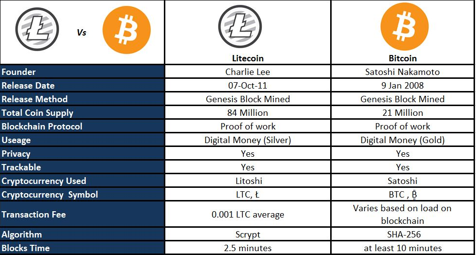

## Table of Contents

## What is Litecoin and who created it?

Litecoin is a type of digital money, similar to Bitcoin. It was created to make online payments faster and cheaper. People can use Litecoin to buy things on the internet or send money to others quickly. It uses special technology to keep transactions safe and secure.

Litecoin was created by a person named Charlie Lee in 2011. Charlie Lee used to work at a big company called Google before he started Litecoin. He wanted to make a digital currency that was easier to use and more accessible to everyone. Since then, Litecoin has grown a lot and many people around the world use it.

## How does Litecoin differ from Bitcoin in terms of creation and purpose?

Litecoin and Bitcoin are both digital currencies, but they have some key differences in how they were created and what they aim to do. Litecoin was created by Charlie Lee in 2011, while Bitcoin was created by an unknown person or group using the name Satoshi Nakamoto in 2009. Litecoin was designed to improve on some of Bitcoin's features, making transactions faster and cheaper. It uses a different algorithm called Scrypt, which makes it easier for regular computers to mine Litecoin compared to Bitcoin, which uses the SHA-256 algorithm that favors more powerful, specialized hardware.

In terms of purpose, Bitcoin was created as a new form of money that could be used without banks or governments controlling it. It aimed to be a secure and decentralized way to send and receive money anywhere in the world. Litecoin, on the other hand, was created with the goal of being a more practical and everyday digital currency. It focuses on faster transaction times and lower fees, making it more suitable for small, everyday purchases. While Bitcoin is often seen as a store of value, similar to digital gold, Litecoin is more focused on being used as a currency for daily transactions.

## What are the key technical specifications of Litecoin?

Litecoin uses something called the Scrypt algorithm for its mining process. This is different from Bitcoin, which uses SHA-256. The Scrypt algorithm makes it easier for regular computers to mine Litecoin. Litecoin also has a total supply limit of 84 million coins, which is four times more than Bitcoin's 21 million. This means there will be more Litecoin in the world than Bitcoin. Litecoin's block time is about 2.5 minutes, which is faster than Bitcoin's 10 minutes. This makes transactions on Litecoin happen quicker.

Litecoin also uses a system called Segregated Witness, or SegWit for short. This helps make transactions even faster and cheaper. It does this by changing how data is stored in each block, making the network more efficient. Litecoin also supports something called the Lightning Network, which is a way to make transactions even faster and cheaper by moving them off the main blockchain. All these things together make Litecoin good for everyday use, like buying things online or sending money to friends.

## How does Litecoin's mining process work, and how does it compare to Bitcoin's?

Litecoin's mining process works by using a special math problem called the Scrypt algorithm. Miners use their computers to solve these problems, and when they do, they get to add a new block of transactions to the Litecoin blockchain. This is how new Litecoins are created and how transactions are verified. The Scrypt algorithm is designed to be easier for regular computers to solve, so more people can join in the mining process without needing super expensive equipment. When a miner successfully adds a block, they are rewarded with new Litecoins, which encourages them to keep mining.

Compared to Bitcoin, Litecoin's mining process is different because it uses the Scrypt algorithm instead of Bitcoin's SHA-256 algorithm. Bitcoin's SHA-256 is harder for regular computers to solve, so it often requires special, expensive machines called ASICs (Application-Specific Integrated Circuits). This makes Bitcoin mining more centralized because only people with these machines can really compete. Litecoin's Scrypt algorithm was meant to be more fair, allowing more people to mine with regular computers. Also, Litecoin's blocks are added to the blockchain faster, about every 2.5 minutes, while Bitcoin's blocks take about 10 minutes. This makes Litecoin transactions quicker and more suitable for everyday use.

## What is the total supply of Litecoin and how does it compare to Bitcoin's?

The total supply of Litecoin is 84 million coins. This means that once all the Litecoins are mined, there will never be more than 84 million in existence. This limit is set to control the amount of Litecoin and to make it more valuable as more people use it.

Compared to Bitcoin, Litecoin has a much larger total supply. Bitcoin's total supply is only 21 million coins. This means that there will be four times more Litecoin than Bitcoin when all the coins are mined. Both cryptocurrencies have a fixed supply to help keep them valuable, but Litecoin's larger supply makes it different from Bitcoin.

## How is Litecoin used in transactions and what are its transaction speeds?

Litecoin is used in transactions to buy things online or to send money to others quickly. When someone wants to use Litecoin, they send it from their digital wallet to someone else's wallet. This is like sending an email but with money. Litecoin uses a special system called a blockchain to keep track of all the transactions. This makes sure that the money goes to the right place and can't be spent twice.

Litecoin's transactions are faster than Bitcoin's. A Litecoin transaction usually takes about 2.5 minutes to be added to the blockchain, while a Bitcoin transaction takes about 10 minutes. This means that if you're buying something or sending money, you'll get a confirmation that the transaction went through much quicker with Litecoin. This makes Litecoin good for everyday use, like buying a coffee or paying for a meal, because you don't have to wait long for the payment to be confirmed.

## What are the advantages of using Litecoin over Bitcoin for everyday transactions?

Litecoin has some big advantages over Bitcoin when it comes to everyday transactions. One of the main benefits is that Litecoin transactions are faster. They only take about 2.5 minutes to be confirmed, while Bitcoin transactions can take up to 10 minutes. This means if you're buying something online or sending money to a friend, you don't have to wait as long with Litecoin. It's great for things like buying a coffee or paying for a quick meal because you get your confirmation quickly.

Another advantage is that Litecoin often has lower transaction fees than Bitcoin. When you use Litecoin, you usually pay less money to send it, which is good for small, everyday purchases. Litecoin also uses a mining algorithm called Scrypt, which is easier for regular computers to mine. This makes it more accessible for more people to join in and use Litecoin for their daily needs. Overall, Litecoin is designed to be more practical for everyday use, making it a better choice for quick and cheap transactions.

## How has the market performance of Litecoin compared to Bitcoin over time?

Litecoin and Bitcoin have both been around for a while, and their market performance has been different over time. Litecoin was created in 2011, two years after Bitcoin, and it has often followed Bitcoin's price movements but with its own ups and downs. Sometimes Litecoin goes up in value when Bitcoin does, but it can also have big jumps or drops on its own. For example, Litecoin had a big price increase in 2017 when the whole crypto market was doing well, but it didn't go as high as Bitcoin did during that time.

Over the years, Litecoin has usually been seen as less valuable than Bitcoin, but it can be more stable at times. Litecoin's price is affected by the same things that affect Bitcoin, like news about regulations, new technology, and how people feel about cryptocurrencies in general. But because Litecoin is used more for everyday transactions, its price can react differently to changes in the market. Overall, Litecoin has been a good choice for people who want a digital currency that's a bit more steady and easier to use for daily purchases, while Bitcoin is often seen as more of an investment.

## What are the security features of Litecoin and how do they stack up against Bitcoin?

Litecoin has strong security features to keep your money safe. It uses something called a blockchain, which is like a big, public record book that keeps track of all the transactions. This makes it very hard for anyone to cheat or spend the same Litecoin twice. Litecoin also uses a special way of checking transactions called the Scrypt algorithm. This helps make sure that only people with enough computer power can add new blocks to the blockchain, which keeps the network secure. Another security feature is something called Segregated Witness, or SegWit, which helps make transactions faster and more secure by changing how data is stored in each block.

Compared to Bitcoin, Litecoin's security features are similar but work a bit differently. Bitcoin uses the SHA-256 algorithm, which is harder for regular computers to solve and often needs special machines. This can make Bitcoin's network more secure because it's harder for bad actors to take over. Litecoin's Scrypt algorithm, on the other hand, is designed to be easier for regular computers, which can make it more accessible but also a bit less secure against very powerful computers. Both Litecoin and Bitcoin use a blockchain and have strong security measures, but Bitcoin's network might be a bit more secure because of its tougher mining algorithm.

## What are the future developments planned for Litecoin and how might they impact its functionality?

Litecoin has some exciting plans for the future that could make it even better for everyday use. One big project is working on something called the MimbleWimble upgrade. This upgrade could make Litecoin transactions more private and could help lower the fees even more. It would do this by changing how transactions are recorded on the blockchain, making them harder to track and taking up less space. This could make Litecoin more attractive for people who want to keep their financial activities private and could make it easier and cheaper to use Litecoin for small, everyday purchases.

Another future development is improving the Lightning Network, which Litecoin already supports. The Lightning Network is a way to make transactions even faster and cheaper by moving them off the main blockchain. By working on this, Litecoin could become even better for quick payments, like buying a coffee or paying for a ride. These improvements could help Litecoin grow and be used by more people around the world, making it a strong choice for everyday digital money.

## How does Litecoin integrate with other technologies like the Lightning Network, and how does this compare to Bitcoin?

Litecoin works well with other technologies like the Lightning Network. The Lightning Network is like a special path that lets Litecoin transactions happen very quickly and cheaply. It does this by moving some transactions off the main Litecoin blockchain. This makes it easier and faster to use Litecoin for things like buying a coffee or sending money to a friend. Litecoin was one of the first cryptocurrencies to use the Lightning Network, which shows it's always trying to get better and easier to use.

Compared to Bitcoin, Litecoin's integration with the Lightning Network is similar but a bit different. Both Litecoin and Bitcoin can use the Lightning Network to make their transactions faster and cheaper. But Litecoin started using it earlier, so it has had more time to make it work well. Also, because Litecoin's transactions are already faster and cheaper than Bitcoin's, using the Lightning Network with Litecoin can make it even better for everyday use. Both cryptocurrencies are trying to improve how they work with new technology, but Litecoin is often seen as more focused on being easy to use every day.

## What are the expert opinions on the long-term viability and potential of Litecoin compared to Bitcoin?

Experts have different opinions about the long-term viability and potential of Litecoin compared to Bitcoin. Some experts think that Litecoin has a good future because it's easier to use for everyday things like buying coffee or sending money to friends. They say Litecoin's faster transaction times and lower fees make it a good choice for people who want to use digital money every day. These experts believe that as more people start using cryptocurrencies, Litecoin could become more popular because it's practical and easy to use.

Other experts think that Bitcoin might be a better long-term investment because it's more well-known and seen as a store of value, like digital gold. They worry that Litecoin might not grow as much as Bitcoin because it doesn't have the same level of attention and investment. However, some of these experts also see Litecoin as a good way to test new technology before it's used on Bitcoin. They think that Litecoin's focus on being a practical currency could help it stay relevant, even if it doesn't grow as fast as Bitcoin.

## References & Further Reading

[1]: Bergstra, J., Bardenet, R., Bengio, Y., & Kégl, B. (2011). ["Algorithms for Hyper-Parameter Optimization."](https://papers.nips.cc/paper/4443-algorithms-for-hyper-parameter-optimization) Advances in Neural Information Processing Systems 24.

[2]: ["Advances in Financial Machine Learning"](https://www.amazon.com/Advances-Financial-Machine-Learning-Marcos/dp/1119482089) by Marcos Lopez de Prado

[3]: ["Evidence-Based Technical Analysis: Applying the Scientific Method and Statistical Inference to Trading Signals"](https://www.amazon.com/Evidence-Based-Technical-Analysis-Scientific-Statistical/dp/0470008741) by David Aronson

[4]: ["Machine Learning for Algorithmic Trading"](https://github.com/stefan-jansen/machine-learning-for-trading) by Stefan Jansen

[5]: ["Quantitative Trading: How to Build Your Own Algorithmic Trading Business"](https://www.amazon.com/Quantitative-Trading-Build-Algorithmic-Business/dp/1119800064) by Ernest P. Chan