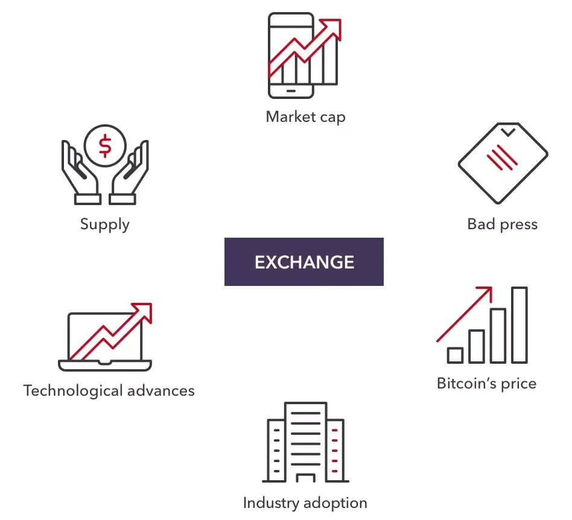

## Table of Contents

## What is Litecoin and how does it differ from Bitcoin?

Litecoin is a type of digital money, similar to Bitcoin. It was created in 2011 by a man named Charlie Lee. People use Litecoin to buy things online or to send money to others quickly and cheaply. Like Bitcoin, Litecoin uses a special technology called blockchain to keep track of all the transactions. This makes it safe and secure because no one can change the records once they are made.

Litecoin differs from Bitcoin in a few important ways. First, Litecoin can process transactions faster. This means that when you send Litecoin, it gets to the other person more quickly than Bitcoin. Second, there will be more Litecoins in total than Bitcoins. Bitcoin will only ever have 21 million coins, but Litecoin will have 84 million. This difference might affect their value in the future. Lastly, Litecoin uses a different way to create new coins, called Scrypt, which is different from Bitcoin's method. This makes it easier for regular people to mine Litecoin using their computers.

## What are the basic principles of trading Litecoin?

Trading Litecoin involves buying and selling the cryptocurrency on an exchange platform. The basic principle is to buy Litecoin when its price is low and sell it when the price goes up. This is similar to buying something cheap and selling it for a higher price later. To do this, traders need to keep an eye on the market to see how the price of Litecoin is changing. They can use tools like charts and graphs to help them decide when to buy or sell. It's important to have a plan and not to let emotions like fear or excitement make decisions for you.

Another key principle of trading Litecoin is understanding and managing risk. Because the price of Litecoin can go up and down a lot, there's a chance you could lose money. To manage this risk, traders often use strategies like setting a stop-loss order, which automatically sells Litecoin if the price drops to a certain level. This can help limit losses. It's also a good idea to only invest money that you can afford to lose, as trading cryptocurrencies can be risky. Learning about the market and staying updated with news can also help in making better trading decisions.

## How can beginners start trading Litecoin safely?

To start trading Litecoin safely, beginners should first choose a reputable [cryptocurrency](/wiki/cryptocurrency) exchange. This is a website where you can buy and sell Litecoin. Make sure to pick an exchange that is well-known and has good security. Once you have an account, you'll need to add money to it, usually by linking your bank account or using a credit card. Always use strong passwords and enable two-[factor](/wiki/factor-investing) authentication to keep your account safe. It's also smart to start with a small amount of money that you can afford to lose, as trading can be risky.

After setting up, beginners should learn how to use the trading platform. Most exchanges have tools like charts and graphs that can help you decide when to buy or sell Litecoin. It's important to watch these carefully and understand how the price is moving. To keep your trading safe, consider setting a stop-loss order. This is a way to tell the exchange to sell your Litecoin if the price drops too much, which can help you not lose too much money. Remember, trading Litecoin can be exciting, but it's important to stay calm and not let your emotions control your decisions.

## What are the common trading strategies for Litecoin?

One common trading strategy for Litecoin is called "buy and hold." This means you buy Litecoin and keep it for a long time, hoping its price will go up. People who use this strategy believe that Litecoin will become more valuable in the future. They don't worry about the small ups and downs in the price every day. Instead, they wait patiently for the price to grow over months or years.

Another strategy is called "[day trading](/wiki/day-trading-spy)." This is when you buy and sell Litecoin within the same day, trying to make money from small changes in the price. Day traders watch the price of Litecoin very closely and make quick decisions. They might use tools like charts to help them decide when to buy or sell. This strategy can be exciting but also risky because the price can change a lot in a short time.

A third strategy is "swing trading." This is somewhere in between buy and hold and day trading. Swing traders hold onto Litecoin for a few days or weeks, trying to catch bigger price movements. They look for patterns in the price that might show when it's going to go up or down. This strategy needs less time watching the market than day trading but still involves more action than just holding onto Litecoin for the long term.

## How does technical analysis apply to Litecoin trading?

Technical analysis is a way to study the price of Litecoin by looking at charts and patterns. Traders use this to try and guess where the price might go next. They look at things like moving averages, which show the average price of Litecoin over a certain time, and support and resistance levels, which are prices where Litecoin often stops going down or up. By studying these, traders hope to find good times to buy or sell Litecoin.

For example, if the price of Litecoin is going up and it's above its moving average, a trader might think it's a good time to buy because the price seems to be getting stronger. On the other hand, if the price is going down and it breaks through a support level, a trader might decide to sell to avoid losing more money. Technical analysis isn't perfect, but it gives traders a way to make decisions based on what the price has done in the past, rather than just guessing.

## What role does fundamental analysis play in Litecoin trading?

Fundamental analysis is another way to look at Litecoin, but instead of just looking at the price, it looks at the bigger picture. It tries to understand if Litecoin is a good investment by looking at things like how many people are using it, how it's being developed, and what's happening in the world that might affect its value. For example, if more stores start accepting Litecoin, that could be a good sign that its value might go up because more people will want to use it.

Traders use [fundamental analysis](/wiki/fundamental-analysis) to decide if Litecoin is a good long-term investment. They might look at news about Litecoin, like new updates or partnerships, to see if it's getting more popular or useful. If they think Litecoin has a bright future, they might decide to buy it and hold onto it for a long time, hoping its value will grow. Fundamental analysis helps traders make decisions based on more than just the ups and downs of the price chart.

## What are the risks associated with Litecoin trading and how can they be mitigated?

Trading Litecoin can be risky because its price can go up and down a lot. This means you could lose money if the price goes down after you buy it. Another risk is that the exchange you use to buy and sell Litecoin might not be safe. If the exchange gets hacked, you could lose your Litecoin. Also, sometimes the rules about cryptocurrencies can change, and that might make the price of Litecoin go down.

To make trading Litecoin safer, start by using a well-known and secure exchange. Make sure to use strong passwords and turn on two-factor authentication to keep your account safe. It's also a good idea to only use money you can afford to lose, so if the price goes down, it won't hurt you too much. Setting a stop-loss order can help too, as it will sell your Litecoin if the price drops to a certain level, which can limit how much money you lose. Finally, always do your research and stay calm, don't let your emotions make your trading decisions for you.

## How can traders use leverage in Litecoin trading, and what are the associated risks?

Leverage in Litecoin trading means borrowing money from the exchange to trade with more than you have. It's like using a loan to buy more Litecoin than you could with just your own money. If the price of Litecoin goes up, you can make more money because you're trading with a bigger amount. But if the price goes down, you can lose more money too, because you have to pay back the loan even if the Litecoin you bought with it is worth less.

The main risk with using leverage is that you can lose more money than you started with. If the price of Litecoin drops a lot, you might not have enough money to cover your losses, and you'll still owe the exchange the money you borrowed. This is called a margin call, and it can be very stressful. To be safer, only use a little bit of leverage, and always have a plan for what you'll do if the price goes against you. Remember, trading with leverage can be exciting, but it's also very risky, so be careful.

## What are some advanced Litecoin trading strategies used by experienced traders?

Experienced traders often use a strategy called "[scalping](/wiki/gamma-scalping)" when trading Litecoin. Scalping means making lots of small trades to take advantage of tiny changes in the price. They might buy and sell Litecoin many times in a single day, trying to make a little bit of money each time. To do this well, they need to watch the market very closely and use tools like charts to help them decide when to buy or sell. Scalping can be exciting but also stressful because it needs a lot of attention and quick decisions.

Another advanced strategy is "arbitrage." This means buying Litecoin on one exchange where the price is low and selling it on another exchange where the price is higher. The idea is to make money from the difference in prices between the two places. To do this, traders need to be fast and have accounts on different exchanges. They also need to be careful because the prices can change quickly, and there are fees for moving Litecoin between exchanges. Arbitrage can be a good way to make money if you're good at finding these price differences and acting fast.

## How do market trends and news affect Litecoin trading?

Market trends and news can have a big impact on Litecoin trading. When there's good news about Litecoin, like new updates or more places starting to accept it, the price might go up because more people want to buy it. On the other hand, if there's bad news, like a security problem or new rules that make it harder to use Litecoin, the price might go down because people get worried and want to sell. Traders need to keep an eye on the news and understand how it might change what people think about Litecoin.

Trends in the market also matter a lot. If the whole cryptocurrency market is doing well, Litecoin's price might go up too, even if there's no specific news about it. But if the market is doing badly, Litecoin's price could go down with it. Traders often look at what's happening with other cryptocurrencies like Bitcoin to get an idea of where Litecoin might be headed. By staying informed about both the news and the general trends, traders can make better decisions about when to buy or sell Litecoin.

## What tools and platforms are recommended for effective Litecoin trading?

For effective Litecoin trading, it's good to use a reliable exchange like Coinbase or Binance. These platforms are popular and have strong security to keep your Litecoin safe. They also have easy-to-use tools that help you buy and sell Litecoin. You can set up stop-loss orders to limit your losses, and they often have charts and graphs that show you how the price of Litecoin is moving. Using a well-known exchange helps you trade safely and makes it easier to keep track of your Litecoin.

Another helpful tool for Litecoin trading is trading software like TradingView or MetaTrader. These programs give you more advanced charts and indicators that can help you understand the market better. They let you see patterns in the price of Litecoin and make it easier to decide when to buy or sell. Some traders also use mobile apps from their exchange, so they can keep an eye on the market and make trades even when they're not at their computer. Using these tools can make your trading more effective and help you make smarter decisions.

## How can one develop a personalized Litecoin trading strategy?

To develop a personalized Litecoin trading strategy, start by understanding your own goals and how much risk you're willing to take. Are you looking to make quick profits, or do you want to hold onto Litecoin for a long time? Knowing this will help you decide which trading strategies to use. For example, if you want to make quick profits, you might try day trading or scalping, where you buy and sell Litecoin many times in a day. If you're more interested in long-term growth, you might choose a buy-and-hold strategy, where you keep your Litecoin for months or years.

Next, learn about the different tools and indicators that can help you make better trading decisions. Use charts and graphs to see how the price of Litecoin is moving, and look at things like moving averages and support and resistance levels. These can help you find good times to buy or sell. Also, keep up with the news and market trends, as they can affect the price of Litecoin. By combining your personal goals with the right tools and knowledge, you can create a trading strategy that works best for you.

## What is Risk Management in Algo Trading?

Risk management is a crucial component of [algorithmic trading](/wiki/algorithmic-trading), especially when dealing with volatile assets like cryptocurrencies, including Litecoin. Effective risk management strategies are key to mitigating potential losses and ensuring long-term profitability. Incorporating these strategies into your trading plan can make a significant difference in the overall success of your algo trading endeavors.

### Incorporating Risk Management into Your Trading Plan

A well-structured risk management plan begins with setting clear risk parameters within your algorithm. This includes defining stop-loss and take-profit levels, which help automate the selling of Litecoin once a certain price is reached, thereby minimizing losses or securing profits. Additionally, position sizing is a fundamental aspect; it determines the amount of Litecoin traded and ensures that no single trade significantly impacts your overall portfolio.

### Risk Management Strategies for Litecoin

1. **Diversification:** Diversifying your algorithmic trading strategy by incorporating varied market instruments can reduce the risk associated with a single asset class. Although this section focuses on Litecoin, consider developing algorithms that interact with other cryptocurrencies or fiat currency pairs to spread risk.

2. **Volatility Measures:** Employ volatility indicators to adjust trading strategies based on market conditions. Litecoin can exhibit significant price swings, and indicators such as the Average True Range (ATR) can help quantify these movements, allowing algorithms to adjust position sizes accordingly.

3. **Drawdown Control:** Monitor and manage the maximum loss from peak to trough in your portfolio's value. Setting a maximum drawdown percentage can help inform when to pause or adjust your trading strategy.

### Leverage, Margin, and Trade Positions

When involved in algorithmic trading, understanding leverage and margin is critical. Leverage allows traders to control more significant positions with a smaller amount of capital, which can amplify both gains and losses. Calculating the appropriate leverage ratio is essential to maintain a balanced risk profile. Here’s a simple formula to determine leverage:

$$
\text{Leverage Ratio} = \frac{\text{Total Position Size}}{\text{Equity}}
$$

Margin, on the other hand, is the amount required to open and maintain leveraged positions. It acts as a buffer to cover potential losses. Keeping track of margin requirements ensures traders maintain sufficient funds in their accounts and avoid margin calls, which could force the liquidation of positions at unfavorable prices.

### Managing Trade Positions

An algorithmic trader must carefully manage trade positions to ensure that they align with the overall risk management framework. This involves continuously assessing the risk-reward ratio for each trade and making adjustments as necessary. The risk-reward ratio helps determine whether the potential profit of a trade justifies the risk incurred. A common ratio used is 1:3, meaning the potential reward is three times the risk.

Risk management in algorithmic trading is not a one-time setup but requires constant monitoring and adjustment to adapt to changing market conditions. By employing effective risk management strategies, traders can protect their capital while taking advantage of the opportunities offered by trading Litecoin and other cryptocurrencies.

## What are Advanced Strategies for Trading Litecoin?

In the context of algorithmic trading, advanced strategies for trading Litecoin can significantly enhance performance and profitability. Among these sophisticated strategies are [trend following](/wiki/trend-following), [arbitrage](/wiki/arbitrage), and [machine learning](/wiki/machine-learning)-driven models, each offering unique advantages in the dynamic cryptocurrency market.

**Trend Following Strategies**

Trend following strategies leverage the [momentum](/wiki/momentum) of Litecoin's price movements. The core idea is to capitalize on definitive trends, either bullish or bearish. Traders typically use tools like moving averages to detect trends. For instance, a simple moving average (SMA) or an exponential moving average (EMA) can serve as indicators to determine entry and [exit](/wiki/exit-strategy) points based on crossover patterns. The formulas for SMA and EMA are given by:

$$

\text{SMA}_n = \frac{1}{n} \sum_{i=1}^{n} P_i 
$$

$$

\text{EMA}_t = \alpha \times P_t + (1 - \alpha) \times \text{EMA}_{t-1}
$$

where $P_i$ is the price at day $i$, $n$ is the time period, $\alpha$ is the smoothing factor, and $EMA_{t-1}$ is the EMA of the previous period.

**Arbitrage Strategies**

Arbitrage strategies aim to exploit price discrepancies across different exchanges or markets. Given Litecoin's presence on multiple trading platforms, price variations can occasionally arise, providing arbitrage opportunities. For example, if Litecoin is priced at $100 on Exchange A and $102 on Exchange B, an arbitrageur could buy on Exchange A and sell on Exchange B, realizing a profit of $2 per Litecoin, excluding transaction costs. The primary challenge lies in executing trades rapidly to minimize risk from shifting prices.

**Machine Learning-Driven Models**

Machine learning models bring a data-driven approach to algorithmic trading by analyzing vast datasets to identify patterns and predict future price movements. Techniques such as decision trees, neural networks, or support vector machines can be employed to forecast Litecoin's price trends. For example, a basic Python implementation using a decision tree for price prediction might involve:

```python
from sklearn.model_selection import train_test_split
from sklearn.tree import DecisionTreeRegressor
import pandas as pd

# Load and preprocess data
data = pd.read_csv('litecoin_price_data.csv')
features = data[['feature1', 'feature2', 'feature3']] # replace with actual feature columns
target = data['price']

# Split data
X_train, X_test, y_train, y_test = train_test_split(features, target, test_size=0.2, random_state=42)

# Initialize and train model
model = DecisionTreeRegressor()
model.fit(X_train, y_train)

# Make predictions
predictions = model.predict(X_test)
```

Machine learning models require extensive historical data and fine-tuning of parameters to accurately predict price movements, and often, a combination of different models can be employed for optimum results.

These advanced strategies not only harness sophisticated techniques but also require an understanding of market dynamics and continuous monitoring to manage risk effectively. By integrating these methods into a trading plan, traders can enhance their algorithmic trading endeavors and potentially improve their outcomes in trading Litecoin.

## References & Further Reading

[1]: Bergstra, J., Bardenet, R., Bengio, Y., & Kégl, B. (2011). ["Algorithms for Hyper-Parameter Optimization."](https://papers.nips.cc/paper/4443-algorithms-for-hyper-parameter-optimization) Advances in Neural Information Processing Systems 24.

[2]: ["Advances in Financial Machine Learning"](https://www.amazon.com/Advances-Financial-Machine-Learning-Marcos/dp/1119482089) by Marcos Lopez de Prado

[3]: ["Evidence-Based Technical Analysis: Applying the Scientific Method and Statistical Inference to Trading Signals"](https://www.amazon.com/Evidence-Based-Technical-Analysis-Scientific-Statistical/dp/0470008741) by David Aronson

[4]: ["Machine Learning for Algorithmic Trading"](https://github.com/stefan-jansen/machine-learning-for-trading) by Stefan Jansen

[5]: ["Quantitative Trading: How to Build Your Own Algorithmic Trading Business"](https://books.google.com/books/about/Quantitative_Trading.html?id=j70yEAAAQBAJ) by Ernest P. Chan