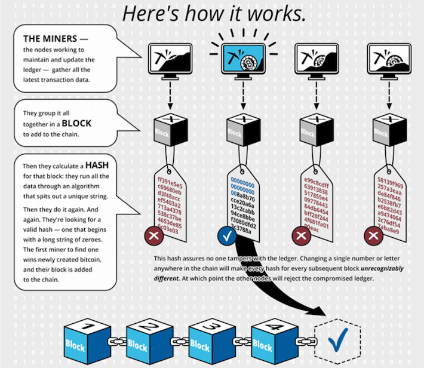

In the fast-paced world of cryptocurrency trading, algorithmic trading has emerged as a powerful tool for investors seeking to enhance their decision-making process through technology. This method involves the use of computer algorithms to execute trades based on a set of predefined criteria, such as timing, price, and volume. As digital assets continue to gain popularity, algorithmic trading enables traders to analyze vast amounts of data and capitalize on market opportunities with precision and speed.

Litecoin, often referred to as the silver to Bitcoin’s gold, presents unique trading opportunities that are particularly well-suited for algorithmic strategies. Created in 2011 by Charlie Lee as a lighter version of Bitcoin, Litecoin is one of the oldest and most established cryptocurrencies. Its significant market capitalization and stable trading platform make it an attractive vehicle for traders looking to implement algorithmic methods. The cryptocurrency boasts faster transaction confirmation times and a different hashing algorithm than Bitcoin, which can offer distinct advantages in the trading landscape.



This article offers a comprehensive guide on trading Litecoin through algorithmic approaches, providing insights and strategies to elevate your trading proficiency. We will explore the fundamentals of algorithmic trading and how they specifically apply to Litecoin. By understanding the principles of this innovative trading method, you can better navigate the cryptocurrency markets and potentially improve your investment outcomes. Whether you're a seasoned trader or new to the world of digital assets, this guide aims to equip you with the knowledge needed to enhance your trading strategies utilizing the power of algorithms.

## Table of Contents

## Understanding Algorithmic Trading

Algorithmic trading, often abbreviated as "algo trading," utilizes computer algorithms to execute trades at rapid speeds and with precision. These algorithms are systems of pre-programmed instructions that automate trading decisions based on a set of defined criteria such as timing, price, and volume. The primary goal of algorithmic trading is to maximize trading efficiency and minimize human errors by allowing transactions to be processed at a pace and accuracy that humans simply cannot achieve.

At its core, algorithmic trading involves creating strategies that can automatically execute buy or sell orders when certain market conditions are met. For instance, an algorithm might be programmed to buy Litecoin when its price dips below a specific threshold or sell when it reaches a desired peak. The parameters for these trades are often defined using historical data and mathematical models, which helps in predicting future price movements.

### Key Components of Algorithmic Trading

1. **Mathematical Models**: Algorithms often employ sophisticated mathematical models to analyze market data. Techniques like moving averages, Bollinger Bands, or even advanced machine learning models can be integrated to inform trading decisions.

2. **Automated Execution**: Once the criteria for a trade are met, the algorithm automatically executes the trade without waiting for manual input. For example, a simple Python snippet for executing a market order might look like this:

   ```python
   def execute_trade(current_price, target_price):
       if current_price <= target_price:
           place_buy_order()
       else:
           place_sell_order()

   current_price = get_current_market_price()
   target_price = 100.0  # Example target price
   execute_trade(current_price, target_price)
   ```

3. **Speed and Precision**: Algorithms operate at speeds beyond human capability, processing thousands of market signals per second. This allows traders to capitalize on even the smallest market movements.

4. **Risk Management**: Algorithms can include risk management protocols to minimize potential losses. This can involve setting stop-loss levels or adjusting trading volumes based on market volatility.

### Application Across Markets

Algorithmic trading is not limited to traditional financial markets such as stocks or [forex](/wiki/forex-system); it is widely used in [cryptocurrency](/wiki/cryptocurrency) markets due to their 24/7 nature and high [volatility](/wiki/volatility-trading-strategies). Cryptocurrencies like Litecoin present unique opportunities for algo trading given their [liquidity](/wiki/liquidity-risk-premium) and the availability of trading pairs on multiple exchanges. The ability to program algorithms to continuously monitor and trade Litecoin allows traders to potentially exploit inefficiencies and price discrepancies across markets.

### Advantages of Algorithmic Trading in Cryptocurrencies

- **Consistency**: Trading decisions are consistent and emotionless, reducing the risk of decisions driven by panic or greed.
- **Scalability**: Algorithms can handle large-scale trading scenarios without the need for increased manpower.
- **Diverse Strategies**: From simple moving average crossovers to complex arbitrage strategies, algorithmic trading suits various trading styles and risk appetites.

In summary, the adoption of [algorithmic trading](/wiki/algorithmic-trading) in cryptocurrencies like Litecoin is fueled by its potential to enhance trading efficiency through automation, speed, and precision. It allows traders to implement systematic trading approaches that can be continually refined through [backtesting](/wiki/backtesting) and optimization. As cryptocurrency markets evolve, the scope of algorithmic strategies continues to expand, offering new horizons for traders willing to embrace technology-driven methods.

## Why Trade Litecoin?

Litecoin, created by Charlie Lee in 2011, has established itself as a significant player in the cryptocurrency market. As a fork of Bitcoin, it shares many of the same attributes but offers distinct advantages that make it particularly appealing for algorithmic trading.

### Stability and Market Cap

Litecoin is one of the oldest cryptocurrencies, which gives it a level of stability and trust not always found in the quickly evolving crypto landscape. Its mature market presence contributes to a relatively significant market cap, providing traders with ample liquidity. This liquidity is crucial for algorithmic trading, as it minimizes the risk associated with slippage—the difference between the expected price of a trade and the actual price when the trade is executed.

### Speed and Efficiency

One of Litecoin’s defining characteristics is its faster block generation time, which is approximately 2.5 minutes compared to Bitcoin's 10 minutes. This increased speed results in quicker transaction confirmations, which is advantageous for traders employing algorithmic strategies that depend on fast execution and processing of large volumes of transactions. Algorithmic traders can exploit these quicker turnaround times to execute a higher frequency of trades efficiently.

### Lower Transaction Fees

The transaction fees associated with Litecoin tend to be lower than those of Bitcoin. For algorithmic traders who are executing a high number of transactions, lower fees allow for increased profitability and the ability to operate on narrower trading margins. Consequently, this financial efficiency enhances the potential returns from algorithms that profit from small price movements.

### Historical Data and Market Behavior

The extensive historical data available for Litecoin is invaluable for traders looking to develop and test algorithmic strategies. Analyzing this data helps identify patterns and trends that could inform profitable trading algorithms. For instance, algorithms can be programmed to recognize patterns or implement trend-following strategies that align with Litecoin’s historical performance metrics.

In applying algorithmic strategies to Litecoin, traders can harness its stability, speed, and cost-effectiveness, potentially achieving optimized trading outcomes. By leveraging Litecoin’s characteristics, traders are better equipped to capitalize on both short-term volatility and long-term market trends.

## Implementing Algo Trading for Litecoin

Setting up algorithmic trading for Litecoin involves several essential steps, beginning with the selection of a suitable trading platform. These platforms provide the necessary tools and interfaces to create, test, and execute algorithmic trading strategies. When choosing a platform, traders should consider factors such as support for multiple cryptocurrencies, programming language compatibility, access to historical data, and reliability.

### Selecting a Trading Platform

1. **Platform Capability**: Numerous platforms, including MetaTrader 4/5, QuantConnect, and CryptoCompare, support algo trading. Each offers varying levels of customization and languages (e.g., Python, C++). Python is particularly favored due to its extensive libraries and ease of use.

2. **Cryptocurrency Support**: It is crucial to select a platform that actively supports cryptocurrency trading with regular updates to accommodate market changes. Platforms like Binance API and Coinbase Pro provide extensive support and documentation for crypto algo trading.

3. **Real-time Data and API Access**: An efficient algo trading process requires timely access to market data. Platforms that provide robust APIs enable fetching real-time and historical data, which is vital for strategy development and testing.

### Developing Trading Strategies for Litecoin

1. **Define Clear Objectives**: Establish clear, quantifiable goals, such as profit targets, risk tolerance, and trade frequency. This helps in tailoring the algorithm’s decision-making process.

2. **Leverage Historical Data**: Utilize historical price and volume data to inform the development of algorithmic rules. Historical data helps identify patterns and test assumptions prior to live trading.

3. **Algorithm Development**:

    ```python
    import pandas as pd
    import numpy as np
    from ta.trend import SMAIndicator

    # Example of a simple moving average crossover strategy
    def sma_crossover_strategy(data, short_window=40, long_window=100):
        sma_short = SMAIndicator(data['Close'], window=short_window).sma_indicator()
        sma_long = SMAIndicator(data['Close'], window=long_window).sma_indicator()

        data['Signal'] = 0
        data['Signal'][short_window:] = np.where(sma_short[short_window:] > sma_long[short_window:], 1, 0)
        data['Position'] = data['Signal'].diff()

        return data
    ```

    - This script demonstrates a basic moving average crossover strategy, where trading signals are generated based on short- and long-term moving averages.

### Backtesting the Algorithm

1. **Simulation of Trades**: Use backtesting tools that utilize historical data to simulate the strategy under past market conditions. Platforms like Backtrader or PyAlgoTrade in Python can facilitate this process.

2. **Performance Metrics**: Monitor key performance indicators (KPIs) such as the Sharpe ratio, maximum drawdown, and profitability to evaluate the strategy's robustness.

3. **Iterative Refinement**: Based on backtesting results, refine and adjust algorithm parameters to improve performance while aligning with risk preferences.

### Execution and Monitoring

1. **Paper Trading**: Before going live, employ paper trading to validate the algorithm in real-time without financial risk. This ensures that the strategy behaves as expected in current market conditions.

2. **Risk Management Implementation**: Incorporate stop-loss and take-profit mechanisms to mitigate potential losses. Ensure that position sizes are calculated according to the risk management strategy.

By combining structured development, thorough backtesting, and vigilant monitoring, traders can successfully implement algorithmic trading strategies for Litecoin, harnessing the cryptocurrency's potential while managing risk effectively.

## Backtesting Your Trading Strategy

Backtesting is a crucial component of algorithmic trading that allows traders to evaluate and refine their strategies using historical data. This process involves simulating trades to understand how a trading algorithm would have performed under various market conditions. By using backtesting, traders can identify potential flaws in their strategies and make necessary adjustments before deploying them in live trading.

To backtest a trading strategy, traders begin by selecting relevant historical data that accurately represents the market conditions they aim to study. This data should include price movements, trading volumes, and any other market indicators that are pertinent to the strategy being tested. For Litecoin, this would involve accessing its price and [volume](/wiki/volume-trading-strategy) history, which can often be obtained from cryptocurrency exchanges or data providers that specialize in crypto markets.

The next step is to simulate trades based on this historical data using the algorithm in question. This involves programming the trading strategy to execute buy and sell orders as dictated by its rules and evaluating the resulting trades. The performance of the algorithm can be measured using key metrics such as the total return, volatility, and maximum drawdown. By analyzing these metrics, traders can assess the strategy's effectiveness and robustness.

Numerous tools and platforms offer backtesting functionalities tailored for cryptocurrencies like Litecoin. Some popular options include:

1. **QuantConnect**: An open-source platform that supports backtesting for various asset classes, including cryptocurrencies. QuantConnect allows traders to write strategies in Python and offers a comprehensive dataset covering numerous cryptocurrencies.

2. **TradingView**: While primarily known for charting, TradingView also provides backtesting capabilities. It allows users to create strategies using Pine Script and test them against historical market data.

3. **CryptoCompare**: Offers an API that provides historical data for a wide range of cryptocurrencies, which can be used in custom backtesting scripts or integrated with other platforms.

4. **Historical Data Tools**: Platforms like CryptoDataDownload offer downloadable historical data files for multiple cryptocurrencies, including Litecoin, which can be used in custom backtesting solutions.

Here's a simple example of a Python script for backtesting a moving average crossover strategy using historical Litecoin data:

```python
import pandas as pd

# Load historical Litecoin data
data = pd.read_csv('litecoin_data.csv', parse_dates=['Date'], index_col='Date')

# Calculate moving averages
data['SMA_50'] = data['Close'].rolling(window=50).mean()
data['SMA_200'] = data['Close'].rolling(window=200).mean()

# Define strategy
data['Signal'] = 0
data['Signal'][50:] = np.where(data['SMA_50'][50:] > data['SMA_200'][50:], 1, 0)
data['Positions'] = data['Signal'].diff()

# Backtest strategy
initial_capital = 10000.0  # Starting capital in USD
litecoin_positions = pd.DataFrame(index=data.index).fillna(0.0)
litecoin_positions['LTC'] = 100 * data['Signal']  # Placeholder for positions in Litecoin

portfolio = litecoin_positions.multiply(data['Close'], axis=0)
pos_diff = litecoin_positions.diff()

portfolio['holdings'] = (litecoin_positions.multiply(data['Close'], axis=0)).sum(axis=1)
portfolio['cash'] = initial_capital - (pos_diff.multiply(data['Close'], axis=0)).sum(axis=1).cumsum()
portfolio['total'] = portfolio['cash'] + portfolio['holdings']
portfolio['returns'] = portfolio['total'].pct_change()

print(portfolio.head())
```

This script calculates two moving averages over the Litecoin price data, creates signals based on their crossover, and tracks the resultant portfolio performance. By systematically applying such backtesting techniques, traders can refine their strategies and be better equipped to navigate the volatile cryptocurrency markets.

## Risk Management in Algo Trading

Risk management is a crucial component of algorithmic trading, especially when dealing with volatile assets like cryptocurrencies, including Litecoin. Effective risk management strategies are key to mitigating potential losses and ensuring long-term profitability. Incorporating these strategies into your trading plan can make a significant difference in the overall success of your algo trading endeavors.

### Incorporating Risk Management into Your Trading Plan

A well-structured risk management plan begins with setting clear risk parameters within your algorithm. This includes defining stop-loss and take-profit levels, which help automate the selling of Litecoin once a certain price is reached, thereby minimizing losses or securing profits. Additionally, position sizing is a fundamental aspect; it determines the amount of Litecoin traded and ensures that no single trade significantly impacts your overall portfolio.

### Risk Management Strategies for Litecoin

1. **Diversification:** Diversifying your algorithmic trading strategy by incorporating varied market instruments can reduce the risk associated with a single asset class. Although this section focuses on Litecoin, consider developing algorithms that interact with other cryptocurrencies or fiat currency pairs to spread risk.

2. **Volatility Measures:** Employ volatility indicators to adjust trading strategies based on market conditions. Litecoin can exhibit significant price swings, and indicators such as the Average True Range (ATR) can help quantify these movements, allowing algorithms to adjust position sizes accordingly.

3. **Drawdown Control:** Monitor and manage the maximum loss from peak to trough in your portfolio's value. Setting a maximum drawdown percentage can help inform when to pause or adjust your trading strategy.

### Leverage, Margin, and Trade Positions

When involved in algorithmic trading, understanding leverage and margin is critical. Leverage allows traders to control more significant positions with a smaller amount of capital, which can amplify both gains and losses. Calculating the appropriate leverage ratio is essential to maintain a balanced risk profile. Here’s a simple formula to determine leverage:

$$
\text{Leverage Ratio} = \frac{\text{Total Position Size}}{\text{Equity}}
$$

Margin, on the other hand, is the amount required to open and maintain leveraged positions. It acts as a buffer to cover potential losses. Keeping track of margin requirements ensures traders maintain sufficient funds in their accounts and avoid margin calls, which could force the liquidation of positions at unfavorable prices.

### Managing Trade Positions

An algorithmic trader must carefully manage trade positions to ensure that they align with the overall risk management framework. This involves continuously assessing the risk-reward ratio for each trade and making adjustments as necessary. The risk-reward ratio helps determine whether the potential profit of a trade justifies the risk incurred. A common ratio used is 1:3, meaning the potential reward is three times the risk.

Risk management in algorithmic trading is not a one-time setup but requires constant monitoring and adjustment to adapt to changing market conditions. By employing effective risk management strategies, traders can protect their capital while taking advantage of the opportunities offered by trading Litecoin and other cryptocurrencies.

## Advanced Strategies for Trading Litecoin

In the context of algorithmic trading, advanced strategies for trading Litecoin can significantly enhance performance and profitability. Among these sophisticated strategies are [trend following](/wiki/trend-following), [arbitrage](/wiki/arbitrage), and [machine learning](/wiki/machine-learning)-driven models, each offering unique advantages in the dynamic cryptocurrency market.

**Trend Following Strategies**

Trend following strategies leverage the [momentum](/wiki/momentum) of Litecoin's price movements. The core idea is to capitalize on definitive trends, either bullish or bearish. Traders typically use tools like moving averages to detect trends. For instance, a simple moving average (SMA) or an exponential moving average (EMA) can serve as indicators to determine entry and [exit](/wiki/exit-strategy) points based on crossover patterns. The formulas for SMA and EMA are given by:

$$

\text{SMA}_n = \frac{1}{n} \sum_{i=1}^{n} P_i 
$$

$$

\text{EMA}_t = \alpha \times P_t + (1 - \alpha) \times \text{EMA}_{t-1}
$$

where $P_i$ is the price at day $i$, $n$ is the time period, $\alpha$ is the smoothing factor, and $EMA_{t-1}$ is the EMA of the previous period.

**Arbitrage Strategies**

Arbitrage strategies aim to exploit price discrepancies across different exchanges or markets. Given Litecoin's presence on multiple trading platforms, price variations can occasionally arise, providing arbitrage opportunities. For example, if Litecoin is priced at $100 on Exchange A and $102 on Exchange B, an arbitrageur could buy on Exchange A and sell on Exchange B, realizing a profit of $2 per Litecoin, excluding transaction costs. The primary challenge lies in executing trades rapidly to minimize risk from shifting prices.

**Machine Learning-Driven Models**

Machine learning models bring a data-driven approach to algorithmic trading by analyzing vast datasets to identify patterns and predict future price movements. Techniques such as decision trees, neural networks, or support vector machines can be employed to forecast Litecoin's price trends. For example, a basic Python implementation using a decision tree for price prediction might involve:

```python
from sklearn.model_selection import train_test_split
from sklearn.tree import DecisionTreeRegressor
import pandas as pd

# Load and preprocess data
data = pd.read_csv('litecoin_price_data.csv')
features = data[['feature1', 'feature2', 'feature3']] # replace with actual feature columns
target = data['price']

# Split data
X_train, X_test, y_train, y_test = train_test_split(features, target, test_size=0.2, random_state=42)

# Initialize and train model
model = DecisionTreeRegressor()
model.fit(X_train, y_train)

# Make predictions
predictions = model.predict(X_test)
```

Machine learning models require extensive historical data and fine-tuning of parameters to accurately predict price movements, and often, a combination of different models can be employed for optimum results.

These advanced strategies not only harness sophisticated techniques but also require an understanding of market dynamics and continuous monitoring to manage risk effectively. By integrating these methods into a trading plan, traders can enhance their algorithmic trading endeavors and potentially improve their outcomes in trading Litecoin.

## Conclusion

Algorithmic trading offers numerous advantages when it comes to trading Litecoin, providing an efficient and sophisticated approach to maximizing returns while minimizing human error. Employing pre-programmed rules, algo trading allows users to execute trades at high speeds, taking full advantage of fleeting market opportunities that might otherwise be missed. The strategies discussed, such as trend following, arbitrage, and machine learning-driven models, serve to optimize trading processes and enhance profitability, enabling traders to harness Litecoin's unique characteristics effectively.

To thrive in the dynamic landscape of cryptocurrency trading, it is paramount for traders to continuously learn and adapt. The market for digital assets is notoriously volatile and rapidly evolving, demanding a proactive mindset that embraces innovation and technological advancements. As new tools, models, and platforms emerge, traders must be vigilant in refining their strategies, ensuring that they remain competitive and informed in their trading pursuits.

Staying current with advancements in algorithmic trading technology can confer significant advantages. By consistently updating their knowledge and leveraging cutting-edge solutions, traders can better navigate the complexities of the crypto market and optimize their return on investment. As the trading landscape continues to change, commitment to ongoing education and strategy enhancement will be key differentiators for successful Litecoin algo traders.

## References & Further Reading

[1]: Bergstra, J., Bardenet, R., Bengio, Y., & Kégl, B. (2011). ["Algorithms for Hyper-Parameter Optimization."](https://papers.nips.cc/paper/4443-algorithms-for-hyper-parameter-optimization) Advances in Neural Information Processing Systems 24.

[2]: ["Advances in Financial Machine Learning"](https://www.amazon.com/Advances-Financial-Machine-Learning-Marcos/dp/1119482089) by Marcos Lopez de Prado

[3]: ["Evidence-Based Technical Analysis: Applying the Scientific Method and Statistical Inference to Trading Signals"](https://www.amazon.com/Evidence-Based-Technical-Analysis-Scientific-Statistical/dp/0470008741) by David Aronson

[4]: ["Machine Learning for Algorithmic Trading"](https://github.com/stefan-jansen/machine-learning-for-trading) by Stefan Jansen

[5]: ["Quantitative Trading: How to Build Your Own Algorithmic Trading Business"](https://books.google.com/books/about/Quantitative_Trading.html?id=j70yEAAAQBAJ) by Ernest P. Chan