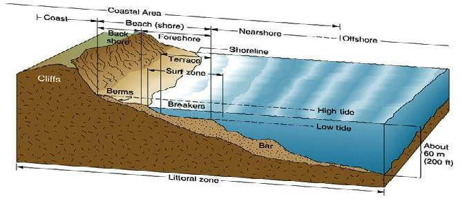

The complex intertwining of natural systems along coastal regions provides a unique environment known as the littoral zone. These areas, where land meets water, are characterized by the dynamic interactions between aquatic and terrestrial influences. The littoral zone is integral not only for maintaining biodiversity but also as a focal point of marine biological studies. It serves as a habitat and breeding ground for countless aquatic species and plays a crucial role in nutrient cycling and sediment deposition, which are vital for ecosystem health.

Interestingly, the management and preservation of these shoreline ecosystems are increasingly interwoven with advancements in technology, particularly in the domain of algorithmic trading (algo trading). Traditionally confined to financial markets, algo trading involves the use of computer algorithms to execute trades at speeds and frequencies that are beyond human capacity. Its integration into environmental management is a modern development, offering unique opportunities to apply data-driven approaches to ecological conservation.



Understanding littoral zones is therefore essential not only for ecological reasons but also for economic ones. These areas are significant in financial investment strategies due to the ecosystem services they provide, which are increasingly being recognized as valuable assets in their own right. The intersection of marine biology and financial innovation presents promising prospects for sustainable management practices that benefit both the environment and investors alike. As we explore the connections between these disciplines, it becomes clear that the synergy between ecological knowledge and financial technology could pave the way for enhanced conservation efforts and sustainable investment in these essential ecosystems.

## Table of Contents

## Understanding Shoreline Ecosystems and Coastal Regions

Shoreline ecosystems, where terrestrial and aquatic environments converge, represent some of the most dynamic and diverse habitats on earth. These ecosystems, often referred to as littoral zones, are areas of high ecological importance due to their role in supporting biodiversity. The littoral zone functions as a crucial habitat and breeding ground for numerous aquatic species. It encompasses the intertidal area, where conditions are highly variable, affecting the organisms that inhabit this transitional zone. Species adapted to these environments often have unique physiological and behavioral characteristics that enable them to thrive in fluctuating conditions.

The biodiversity maintained within shoreline ecosystems is vital for ecological stability. The presence of various plant and animal species contributes to the resilience of these zones, allowing them to recover from and adapt to environmental changes. Moreover, the complex interactions among different species play a significant role in nutrient cycling and energy flow, which are essential processes for the health and sustainability of these ecosystems.

Coastal regions, however, are increasingly subjected to environmental challenges. Erosion, a natural process exacerbated by human activities such as construction and deforestation, contributes to the loss of land and habitat along the shores. Erosion impacts can lead to the displacement of species and the alteration of habitat structures, affecting the overall biodiversity.

Pollution presents another significant threat to shoreline ecosystems. Runoff from urban areas carries pollutants such as heavy metals, oils, and nutrients, which can lead to contamination of water bodies. This pollution can harm aquatic life, disrupt breeding patterns, and reduce water quality, thereby diminishing the effectiveness of littoral zones as critical habitats.

Climate change further complicates the scenario, affecting coastal regions through rising sea levels, ocean acidification, and increased storm frequency and intensity. Sea level rise can lead to coastal flooding, which inundates habitats and alters the distribution of species. Additionally, higher temperatures and changing ocean chemistry impact the physiological processes of marine organisms, potentially leading to shifts in biodiversity.

Efforts to understand and mitigate these challenges are crucial for the preservation of shoreline ecosystems. By recognizing the interplay between terrestrial and aquatic influences, researchers and policymakers can develop strategies to safeguard these vital areas. Effective management practices, combined with continued research, are necessary to ensure the long-term health and viability of shoreline ecosystems in the face of ongoing environmental change.

## The Importance of Littoral Zones

Littoral zones are critical components of coastal ecosystems, characterized by their unique classification into different subzones. These subzones include the supra-littoral, eulittoral, and sub-littoral areas, each serving distinct ecological functions. The supra-littoral zone is typically above the high tide line and marked by infrequent water coverage, allowing only specific terrestrial and marine species adapted to such conditions. The eulittoral zone, lying between the high and low tide lines, experiences periodic submersion and exposure, fostering diverse organisms such as barnacles, seaweeds, and mussels. The sub-littoral zone, permanently submerged, supports rich biodiversity due to its stable environment and includes seagrasses, algae, and various invertebrates.

These zones are essential for nutrient exchange, playing a significant role in cycling nutrients like nitrogen and phosphorus. Nutrient exchange occurs through processes such as tidal movements and organic matter decomposition, facilitating the growth of primary producers like phytoplankton and seagrasses. Littoral zones also contribute to sediment deposition, where sediments carried by water currents settle and provide a substrate for many forms of life.

Littoral zones are crucial nursery grounds for marine life, offering shelter and sustenance for the juvenile stages of numerous species. For example, mangroves and seagrass beds within these zones provide habitat complexity, protecting young fish and invertebrates from predators and ensuring their survival to adulthood. This nursery function supports the replenishment of fish populations, impacting local fishing economies.

Understanding the dynamics of littoral zones is vital for mitigating human impact and preserving biodiversity. Human activities, such as coastal development and pollution, threaten these zones by altering natural processes and reducing habitat availability. To preserve littoral biodiversity, strategies such as protected areas establishment and restoration projects are essential. Moreover, scientific research and monitoring can provide insights into the health of these ecosystems, guiding conservation efforts.

By integrating ecological knowledge and sustainable practices, it is possible to manage human activities effectively, ensuring the sustainability and resilience of littoral zones. This understanding facilitates the implementation of conservation measures that promote biodiversity, bolster ecosystem services, and provide economic benefits to coastal communities.

## Algo Trading: A Financial Perspective

Algorithmic trading, often referred to as algo trading, fundamentally alters the landscape of financial markets by enhancing the speed, precision, and efficiency of trades. This technology-driven approach utilizes complex algorithms to execute trades at fractions of a second, capitalizing on small price movements that humans cannot detect manually. Algo trading's benefits primarily arise from its ability to minimize human error, reduce transaction costs, and leverage historical data for predictive analytics.

Initially associated primarily with equities and fixed-income securities, [algorithmic trading](/wiki/algorithmic-trading) has evolved to encompass a broader range of financial instruments, including commodities. This expansion includes ecological investments and water rights, representing an intersection of financial innovation and environmental management. By enabling rapid, automated trading of water rights, market participants can better manage and distribute these critical resources, aligning financial incentives with sustainable practices.

Algo trading's precision and speed offer unique advantages in ecological investments. Algorithms can sift through vast datasets to identify patterns and trends conducive to environmental sustainability. By analyzing data such as climate conditions, water levels, and resource availability, algorithmic models can inform investment strategies that promote ecological balance. This not only aids in the efficient allocation of resources but also enhances the capacity to fund and support environmental projects through targeted ecological financial products.

Understanding the mechanics of algo trading involves recognizing the role of algorithms in decision-making processes. Algorithms are tasked with identifying trading opportunities based on pre-defined criteria such as price, timing, and market conditions. For instance, a simple trading algorithm could be represented as follows:

```python
def simple_moving_average(prices, window):
    moving_averages = []
    for i in range(len(prices) - window + 1):
        window_avg = sum(prices[i:i + window]) / window
        moving_averages.append(window_avg)
    return moving_averages

prices = [100, 102, 101, 104, 107, 110]
window_size = 3
print(simple_moving_average(prices, window_size))
```

This code illustrates a basic moving average algorithm, which can inform buy or sell signals in trading environments. In more sophisticated setups, traders might employ complex [machine learning](/wiki/machine-learning) models to predict market movements based on historical and real-time data.

The implications of algo trading extend into environmental finance by fostering more efficient markets for ecological assets. As technology advances, these algorithmic tools hold significant promise for improving the transparency and [liquidity](/wiki/liquidity-risk-premium) of environmental project funding, facilitating investments that can drive sustainable outcomes. This connection between cutting-edge financial technology and conservation efforts underscores a paradigm shift in how ecological preservation and financial markets can collaboratively sustain natural resources.

## Connecting Algo Trading with Littoral Ecosystem Management

The integration of algorithmic trading models with littoral ecosystem management represents an innovative intersection between finance and environmental conservation. Algorithmic trading, characterized by its use of mathematical models and computer software to execute transactions at high speeds, can be harnessed for environmental management, particularly regarding sustainable water resource allocation in littoral zones.

Applying trading strategies to environmental assets involves utilizing algorithms to monitor and manage resources such as water rights. For example, these algorithms can analyze patterns in water usage, supply, and demand within coastal ecosystems to make informed decisions on resource allocation. This process can enhance resource efficiency and promote the sustainable use of littoral zones.

Algorithmic models can also predict ecological trends by analyzing vast datasets on environmental conditions, species populations, and climate variables. These predictions can inform conservation efforts by identifying areas that are at risk or require intervention. For instance, machine learning algorithms can process satellite imagery and remote sensing data to monitor coastal erosion or changes in habitat structures, thus aiding in proactive ecosystem management.

In financial markets, environmentally focused products like water exchange-traded funds (ETFs) provide a platform for investors to support littoral zones indirectly. Water ETFs are financial instruments that track the performance of companies involved in the water sector or related sustainable practices. By investing in these ETFs, individuals and institutions contribute to funding that supports water infrastructure, conservation projects, and sustainable water management, all crucial for the health of littoral ecosystems.

Python's versatility in data analysis and model development makes it a suitable choice for crafting and deploying these algorithmic strategies. Using libraries such as NumPy and Pandas, data can be efficiently processed and analyzed. Additionally, machine learning libraries like Scikit-learn could be employed to develop predictive models for ecological trend analysis.

Here's a simple Python example demonstrating how one might use data analytics to identify patterns in water resource usage:

```python
import pandas as pd
from sklearn.linear_model import LinearRegression

# Load dataset of water resource usage
data = pd.read_csv('water_usage.csv')

# Preparing the data
X = data[['temperature', 'precipitation', 'population_density']].values
y = data['water_usage'].values

# Define the model
model = LinearRegression()

# Train the model
model.fit(X, y)

# Predict water usage under specific conditions
predicted_usage = model.predict([[25, 80, 1000]])  # example conditions: 25°C, 80mm rainfall, 1000 people/km²

print(f"Predicted Water Usage: {predicted_usage[0]} units")
```

This script trains a simple linear regression model to predict water usage based on temperature, precipitation, and population density, highlighting the type of predictive analysis that can be extended to broader ecological datasets. By coupling these analytical approaches with algorithmic trading, sustainable management of littoral zones can be significantly enhanced, aligning economic models with ecological preservation.

## Challenges and Opportunities

Marrying finance with environmental conservation introduces several challenges, primarily revolving around the alignment of economic incentives with ecological outcomes. The traditional financial model prioritizes short-term returns, often neglecting long-term ecological health. This dissonance necessitates the creation of financial frameworks that can balance the immediate financial gains against the enduring benefits of environmental conservation.

Opportunities arise by developing sustainable financial models that can safeguard both investors’ interests and the health of ecosystems. One approach is to incorporate Environmental, Social, and Governance ([ESG](/wiki/esg-investing)) criteria into investment decision-making processes. ESG investing allows investors to consider all angles of corporate performance and not just financial gain, possibly leading to enhanced returns as empirical evidence increasingly suggests. Incorporating ecosystem service valuations into economic models may help bridge the gap between financial returns and ecological sustainability.

Technological advancements, particularly in data analytics, offer significant opportunities to refine ecological management practices. Machine learning and big data enable the analysis of complex ecological datasets to uncover patterns invisible to conventional analysis methods. By applying algorithmic models, investors and environmentalists can predict ecological trends, such as population changes in aquatic species or shifts in sediment deposition patterns. These predictions aid in making informed decisions on resource allocation for conservation efforts.

Furthermore, financial instruments like water ETFs or green bonds can provide innovative ways to invest in environmental sustainability. These products allow a broader investment pool to support conservation projects, aligning financial returns with ecological benefits. For instance, investing in a water [ETF](/wiki/etf-trading-strategies) means investing in companies that sustainably manage water resources, indirectly supporting the management of littoral zones.

In implementing these strategies, a comprehensive understanding of both financial markets and ecological systems is essential. This integration is complex but offers the potential for long-term benefits, ensuring the protection of vital ecosystems while maintaining robust investment returns. The synergy between technological advancements and sustainable financial models can play a pivotal role in advancing ecological conservation alongside economic growth.

## Conclusion

Shoreline ecosystems and littoral zones are integral components of our planet's ecological framework, serving as dynamic interfaces where terrestrial and marine environments converge. These zones are not only crucial for maintaining biodiversity but also present unique economic opportunities. The application of innovative financial strategies, such as algorithmic trading, highlights a novel intersection between finance and ecological management. Algo trading, with its ability to forecast market trends and optimize investment portfolios, can be harnessed to support conservation efforts and resource allocation in littoral zones. By aligning trading models with environmental goals, we can ensure the sustainable management of these critical areas.

The integration of algo trading techniques into environmental conservation represents a forward-thinking approach to safeguarding these ecosystems. Through predictive modeling and financial instruments focused on ecological health and sustainability, stakeholders can better manage resources and promote biodiversity. For instance, environmentally focused financial products, such as water exchange-traded funds (ETFs), enable investors to channel funds into projects aimed at preserving littoral zones. These instruments leverage financial markets to generate the necessary capital for ecological preservation, thereby converting ecological sustainability challenges into economic opportunities.

By understanding and fostering the synergy between finance and ecology, we pave the way for sustainable investment in these essential ecosystems. Adopting such integrative strategies not only enhances financial returns but also contributes to the long-term viability and health of shoreline ecosystems. As technological advancements continue to evolve, they offer new tools and methodologies for refining ecological management practices. This evolving landscape provides promise for achieving equilibrium between economic growth and environmental preservation, ensuring the longevity and vitality of littoral zones for future generations.

## References & Further Reading

[1]: ["Dynamics of Littoral Zones in Ecological Systems"](https://www.sciencedirect.com/science/article/pii/S0272771420308799) by Boris O. Zhbankov, which explores the dynamics and ecological importance of littoral zones.

[2]: ["Algorithmic Trading and DMA: An Introduction to Direct Access Trading Strategies"](https://www.amazon.com/Algorithmic-Trading-DMA-introduction-strategies/dp/0956399207) by Barry Johnson, offering insights into the world of algorithmic trading.

[3]: ["Environmental Impact of Erosion and Sediment Transport in River Basins"](https://unesdoc.unesco.org/ark:/48223/pf0000185078) by Des Walling, a study on the environmental effects of erosion relevant to littoral zones.

[4]: ["Trading and Exchanges: Market Microstructure for Practitioners"](https://www.amazon.com/Trading-Exchanges-Market-Microstructure-Practitioners/dp/0195144708) by Larry Harris, covering the fundamentals of trading and market structures.

[5]: ["Restoration of Coastal Ecosystems"](https://www.researchgate.net/publication/236132143_Restoration_of_Coastal_Ecosystems) by Jens B. Unger, which discusses strategies for restoring and managing coastal ecosystems.

[6]: ["Principles of Sustainable Finance"](https://www.researchgate.net/publication/330359025_Principles_of_Sustainable_Finance) by Dirk Schoenmaker and Willem Schramade, providing an overview of financial principles aimed at achieving sustainability.

[7]: ["Managing Coastal Erosion"](https://www.sciencedirect.com/science/article/pii/S0964569116304227) by National Research Council, offering a comprehensive look at approaches to managing coastal erosion challenges.