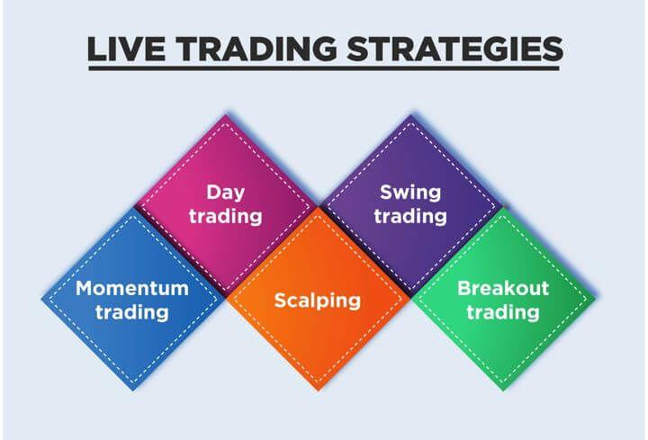

## Table of Contents

## What is live trading and how does it differ from paper trading?

Live trading is when you use real money to buy and sell stocks, cryptocurrencies, or other financial assets. When you do live trading, you can make or lose real money depending on how well your trades go. It's exciting because it's real, but it can also be risky because you could lose money if your trades don't work out.

Paper trading, on the other hand, is like practicing trading without using real money. It lets you pretend to buy and sell assets to see how you would do without any risk. It's a good way to learn and try out different strategies before you start using real money. The main difference is that in paper trading, you don't actually lose or gain money, while in live trading, your money is on the line.

## What are the basic requirements to start live trading?

To start live trading, you need to have a brokerage account. This is like a special bank account where you can buy and sell stocks, cryptocurrencies, or other financial assets. You can open a brokerage account online with many different companies. When you open the account, you'll need to provide some personal information and maybe some documents to prove who you are. Once your account is set up, you can add money to it, which is called depositing funds. This is the money you'll use to make your trades.

After you have your brokerage account set up and funded, you need to choose what you want to trade. This could be stocks, which are shares in companies, or cryptocurrencies like Bitcoin, or other types of financial assets. You'll also need to decide on a trading strategy. This is your plan for when to buy and sell, and it can be simple or complicated depending on what you're comfortable with. Once you have your strategy, you can start making trades. Remember, live trading means using real money, so it's important to be careful and only trade with money you can afford to lose.

## How do you choose a reliable trading platform for live trading?

Choosing a reliable trading platform for live trading is important because it's where you'll be managing your money. You want to make sure the platform is safe and easy to use. One way to check if a platform is reliable is by looking at its reputation. You can read reviews from other users and see what they say about their experiences. It's also a good idea to check if the platform is regulated by a financial authority. This means that the platform follows certain rules to protect your money and keep things fair.

Another thing to consider is the fees the platform charges. Some platforms might have high fees for trading or withdrawing money, which can eat into your profits. Make sure to compare the fees of different platforms to find one that's reasonable. Also, think about the features the platform offers. A good platform should have tools that help you make smart trading decisions, like charts and real-time data. It should also be easy to use, so you can quickly buy and sell without getting confused. By taking the time to research and compare different platforms, you can find one that's reliable and suits your needs.

## What are the key elements of a trading plan for live trading?

A trading plan for live trading is like a roadmap that helps you make smart decisions about buying and selling. It should start with clear goals. What do you want to achieve with your trading? Are you looking to make a little extra money on the side, or do you want to grow your savings over time? Once you know your goals, you can set rules for when to buy and sell. For example, you might decide to buy a stock when its price goes below a certain level, and sell it when it goes above another level. These rules help you stay disciplined and avoid making impulsive decisions.

Another important part of a trading plan is managing risk. This means deciding how much money you're willing to lose on each trade. A common way to do this is by setting a stop-loss order, which automatically sells your asset if its price drops too much. You should also think about how much of your total money you want to use for trading. It's wise not to put all your money into one trade, but to spread it out over several trades. This way, if one trade doesn't go well, you won't lose everything. By having a solid trading plan, you can approach live trading with confidence and control.

## How do you manage risk in live trading?

Managing risk in live trading is super important because it helps you protect your money. One way to do this is by setting a stop-loss order. This is like a safety net that automatically sells your asset if its price drops too much. It helps you limit how much you can lose on a single trade. Another way to manage risk is by not putting all your money into one trade. Instead, you can spread it out over several trades. This way, if one trade goes badly, you won't lose everything. It's also smart to only trade with money you can afford to lose, so you don't end up in financial trouble.

Another part of managing risk is to keep an eye on how much of your total money you're using for trading. A good rule is to only use a small part of your savings for live trading. This way, even if things go wrong, you still have most of your money safe. It's also helpful to keep learning and staying updated on the markets. The more you know, the better you can predict what might happen and make smarter decisions. By following these simple steps, you can manage risk better and trade with more confidence.

## What are common psychological challenges faced during live trading and how can they be overcome?

One common psychological challenge during live trading is fear. When you see your money going up and down, it's easy to get scared and make quick decisions that might not be the best. This fear can make you sell too soon or not take risks that could pay off. To overcome this, it's important to stick to your trading plan. Having a plan helps you stay calm and make decisions based on what you've decided ahead of time, not on how you feel in the moment. It's also helpful to remind yourself that ups and downs are normal in trading, and it's okay to take a break if you're feeling too stressed.

Another challenge is greed. It's tempting to want to make more and more money, which can lead to taking big risks or not selling when you should. This can end up causing big losses. To manage greed, set clear goals for what you want to achieve and stick to them. Decide ahead of time how much profit you're happy with and when you'll sell, so you don't get carried away. It's also good to take a step back and think about the long term, rather than trying to get rich quick. By staying disciplined and keeping your emotions in check, you can trade more successfully.

## How do you analyze market trends and make informed trading decisions in real-time?

Analyzing market trends and making informed trading decisions in real-time can seem tricky, but it's all about using the right tools and staying focused. One helpful tool is a chart that shows how prices are moving over time. By looking at these charts, you can spot patterns that might tell you if a price is going up or down. Another useful thing is to keep an eye on the news. Big news stories can affect prices, so knowing what's happening in the world can help you guess where the market might go next. Also, many trading platforms have tools that show you real-time data and even give you alerts when certain things happen, like a price hitting a level you're watching.

Making decisions based on this information means you need to stay calm and stick to your plan. It's easy to get caught up in the moment and make quick choices, but that can lead to mistakes. Instead, use the data and news to guide you, but always go back to your trading rules. For example, if your plan says to buy when a price drops to a certain level, wait for that to happen before you act. It's also smart to keep learning and updating your knowledge. The more you understand about how markets work, the better you'll be at spotting trends and making good choices. By combining these tools and staying disciplined, you can make informed decisions even when things are moving fast.

## What are the different types of orders used in live trading and their purposes?

In live trading, there are different types of orders you can use to buy or sell assets, and each one has its own purpose. A market order is the simplest type. It's when you want to buy or sell something right away at the current price. For example, if you see a stock you like and want to buy it quickly, you would use a market order. It's fast and easy, but the price you get might be a little different from what you see because the market is always moving.

Another type of order is a limit order. This one lets you set a specific price at which you want to buy or sell. If you think a stock will go down to $50 and you want to buy it at that price, you can set a limit order for $50. Your order will only go through if the stock hits that price. It gives you more control over the price, but there's no guarantee your order will be filled if the stock never reaches your limit. A stop-loss order is used to limit your losses. You set a price at which you want to sell if the asset's price drops to that level. It's like a safety net that helps you avoid big losses if the market moves against you. Each type of order has its own use, and knowing when to use them can help you trade more effectively.

## How can you use technical analysis tools effectively in live trading?

Technical analysis tools are super helpful in live trading because they help you see patterns and make better decisions. One popular tool is moving averages, which smooth out price data to show you the general direction of a trend. If a short-term moving average crosses above a long-term one, it might be a good time to buy because it suggests the price is going up. Another useful tool is the Relative Strength Index (RSI), which tells you if a stock is overbought or oversold. If the RSI is above 70, the stock might be too expensive and could go down soon, so you might want to sell. If it's below 30, the stock might be a good deal, and it could be a good time to buy.

Using these tools effectively means combining them and looking at them together with other information. For example, if you see a moving average crossover and the RSI is also showing that the stock is oversold, that's a strong sign to buy. But don't just rely on the tools alone. It's important to also keep an eye on the news and other things happening in the market that could affect prices. By using technical analysis tools as part of your overall plan, you can make smarter trades and have a better chance of success in live trading.

## What are the tax implications of live trading profits and losses?

When you make money from live trading, you have to pay taxes on those profits. In the United States, if you hold an asset for less than a year before selling it, any profit you make is considered a short-term capital gain. This is taxed as regular income, which means it could be taxed at a rate as high as your income tax rate, depending on how much you earn. If you hold an asset for more than a year, the profit is a long-term capital gain, which usually has a lower tax rate, between 0% and 20%, depending on your income. So, knowing how long you've held an asset can affect how much tax you'll owe.

On the other hand, if you lose money from live trading, you can use those losses to reduce your taxes. This is called a capital loss, and you can use it to offset any capital gains you've made. If your losses are more than your gains, you can even deduct up to $3,000 of the extra loss from your regular income each year. Any remaining loss can be carried over to future years to keep reducing your taxes. It's important to keep good records of all your trades so you can accurately report your profits and losses when you file your taxes.

## How do you evaluate and adjust your trading strategy based on live trading performance?

To evaluate and adjust your trading strategy based on live trading performance, you need to keep track of how well your trades are doing. Look at things like how much money you're making or losing, how often you're winning or losing, and how long you're holding onto your trades. It's helpful to write all this down in a trading journal. By looking at your journal, you can see patterns in your trades. For example, you might notice that you do better with certain types of assets or that you make more money when you hold onto trades for a shorter time. This information can help you figure out what's working and what's not.

Once you know how your strategy is performing, you can start making changes. If you see that you're losing money more often than you're making it, you might need to adjust your entry and [exit](/wiki/exit-strategy) points or change the types of assets you're trading. Maybe you need to set tighter stop-loss orders to limit your losses, or you might want to try a different trading strategy altogether. The key is to be flexible and willing to change your approach based on what the data tells you. By regularly reviewing and adjusting your strategy, you can improve your chances of success in live trading.

## What advanced techniques can be used to optimize live trading outcomes?

One advanced technique to optimize live trading outcomes is using [algorithmic trading](/wiki/algorithmic-trading). This means using computer programs to make trades for you based on a set of rules you've programmed in. These programs can look at a lot of data very quickly and make trades faster than a human could. They can help you take advantage of small changes in the market that you might miss otherwise. For example, you could set up an algorithm to buy a stock when its price drops to a certain level and sell it when it goes up to another level. This can help you make more consistent profits and reduce the impact of emotions on your trading decisions.

Another technique is to use advanced risk management strategies. This means not just setting stop-loss orders, but also using things like position sizing and portfolio diversification. Position sizing is about deciding how much of your money to put into each trade based on how risky it is. By only risking a small part of your money on each trade, you can protect yourself from big losses. Diversification means spreading your money across different types of assets, so if one goes down, you're not losing everything. By combining these advanced techniques, you can make your live trading more effective and potentially increase your profits while keeping your risks under control.

## References & Further Reading

[1]: Bergstra, J., Bardenet, R., Bengio, Y., & Kégl, B. (2011). ["Algorithms for Hyper-Parameter Optimization."](https://proceedings.neurips.cc/paper/2011/file/86e8f7ab32cfd12577bc2619bc635690-Paper.pdf) Advances in Neural Information Processing Systems 24.

[2]: ["Advances in Financial Machine Learning"](https://www.amazon.com/Advances-Financial-Machine-Learning-Marcos/dp/1119482089) by Marcos Lopez de Prado

[3]: ["Evidence-Based Technical Analysis: Applying the Scientific Method and Statistical Inference to Trading Signals"](https://www.amazon.com/Evidence-Based-Technical-Analysis-Scientific-Statistical/dp/0470008741) by David Aronson

[4]: ["Machine Learning for Algorithmic Trading"](https://github.com/stefan-jansen/machine-learning-for-trading) by Stefan Jansen

[5]: ["Quantitative Trading: How to Build Your Own Algorithmic Trading Business"](https://books.google.com/books/about/Quantitative_Trading.html?id=j70yEAAAQBAJ) by Ernest P. Chan