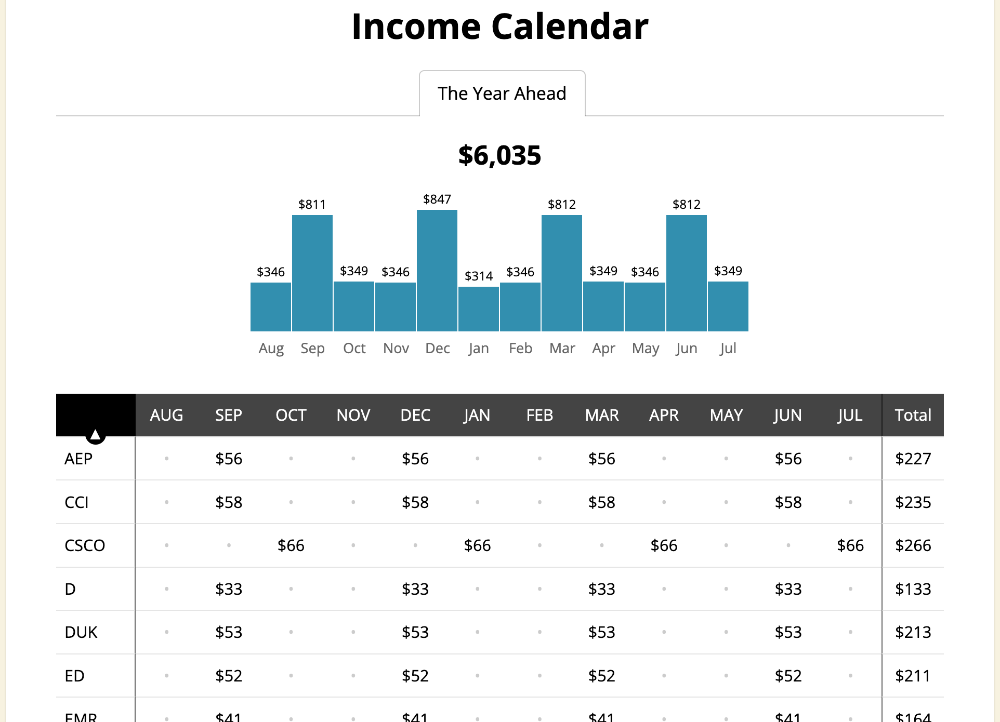

Dividends have been a long-established pillar of investment income, providing investors with a steady stream of passive income over the years. These regular profit distributions, made by companies to their shareholders, can take the form of cash payments or additional stock. Recognized for their reliability, dividends play a crucial role in wealth accumulation and financial planning, offering a consistent return that can weather market volatility.

Meanwhile, algorithmic trading is transforming the way investors engage with financial markets. By leveraging computer algorithms, it automates the execution of trades based on predefined strategies, allowing for rapid decision-making and execution. This modern approach optimizes trading efficiency, analyzing vast amounts of quantitative data to maximize investment returns.



In this article, we explore the integration of dividend investing with algorithmic trading, illustrating how this combination can enhance financial independence through optimized investment income. By automating the selection and trading of dividend stocks, investors can potentially enhance their returns while minimizing manual oversight. This synergy allows for the creation of robust investment strategies that capitalize on stable income from dividends while harnessing the power of technological advancements in trading.

Our objective is to provide a thorough guide to help investors chart their course toward achieving their financial objectives. We will discuss the fundamentals of dividends and algorithmic trading, outline the benefits of merging these strategies, and offer practical steps to start maximizing income generation through their integration. By examining real-world applications and case studies, we aim to demonstrate how dividends and algorithmic trading can collectively fortify your investment portfolio, leading to sustainable income and long-term wealth creation.

## Table of Contents

## Understanding Dividends and Algo Trading

Dividends are regular profit distributions paid by companies to their shareholders, often seen as a sign of a firm’s financial health and operational success. They provide investors with passive income in either cash or additional shares, contributing significantly to long-term wealth accumulation. Typically, companies with stable cash flows and robust business models pay dividends regularly. Not every corporation issues them, as many reinvest profits back into growth opportunities.

Algorithmic trading, on the other hand, involves the use of computer algorithms to execute trades based on predetermined strategies, offering a means to manage trades at unparalleled speeds and scales. This style of trading leverages complex algorithms and quantitative data to make decisions, effectively minimizing human intervention and emotion-driven choices. The automation and efficiency of algorithmic trading can be harnessed to optimize trading processes, enabling precise market entry and exits based on real-time analysis.

Combining dividend investing with [algorithmic trading](/wiki/algorithmic-trading) unlocks new efficiencies in selecting and managing dividend stocks. Investors can automate their selection processes to focus on stocks with high yield and sustainable dividends. By setting up algorithms, traders can effectively capture dividends and optimize reinvestment strategies. This integration allows for “dividend capture” strategies, where stocks are purchased just before the ex-dividend date and sold immediately after securing the dividend, enhancing returns.

Investors can further enhance returns with an automated reinvestment process, reinvesting dividends into additional shares or diversifying into other dividend-paying stocks. The ability to backtest these strategies with historical data ensures that investors employ statistically validated methods tailored to their specific risk profiles and market conditions.

Integration of dividend investing and algorithmic trading provides a robust framework for creating effective investment strategies. It aligns the predictability of dividend income with the precision of algorithmic execution, leading to reinforced portfolio performance and potential risk reduction. By leveraging these methodologies, investors can systematically harness the benefits of dividends while optimizing returns through advanced trading tactics.

## Benefits of Living Off Dividends via Algo Trading

Algorithmic trading, a technologically advanced approach to investing, enhances the utility of dividend investments by employing precise stock selection and automated trading strategies. This integration allows dividends, often seen as a cornerstone of passive income, to be managed with increased efficiency and potential.

1. **Maximizing Dividend Investments Through Precision and Automation**: Algorithmic trading algorithms can analyze a vast array of quantitative financial data to identify dividend stocks that offer optimal returns. These algorithms, leveraging predefined criteria and historical data, automate the buying and selling processes. This capability reduces the emotional biases typically present in manual trading and ensures that decisions are consistent and timed to maximize benefits.

2. **Compound Growth Through Automated Reinvestment**: One of the key benefits of using algorithmic trading for dividend investing is the automation of dividend reinvestment. By automatically reinvesting dividends through pre-set algorithms, investors can compound their returns without the need for manual interventions, increasing the overall growth rate of their portfolio. The formula for compound interest, $A = P(1 + r/n)^{nt}$, where $A$ represents the amount of money accumulated, $P$ the principal amount, $r$ the annual interest rate, $n$ the number of times interest is compounded per year, and $t$ the time in years, exemplifies the power of reinvestment strategies in growing wealth.

3. **Backtesting and Strategy Validation**: Backtesting plays a crucial role in developing robust algorithmic trading strategies. By simulating how a trading strategy would have performed in the past using historical data, investors can validate its potential effectiveness and refine it to minimize risk and enhance returns. This process ensures that the strategies are not just based on theoretical models but are also practically viable and statistically sound.

4. **Scalability and Risk Reduction through Algorithmic Management**: Algorithms are invaluable for managing extensive and diverse portfolios. The scalability provided by algorithmic solutions allows investors to efficiently monitor multiple assets across different sectors. This broad diversification, managed through a coherent strategy, helps in mitigating unsystematic risks that could impact specific stocks or sectors.

5. **Real-Life Applications and Platforms**: Various platforms facilitate the implementation of these strategies through tools tailored for dividend investing. Platforms like QuantConnect and AlgoTrader offer algorithmic trading capabilities with backtesting environments, making them suitable for both novice and seasoned investors interested in leveraging dividends. Real-life case studies often demonstrate how these platforms have been used to generate consistent income streams, providing valuable insights into practical applications.

By integrating these strategies, investors can enhance the profitability and sustainability of living off dividends, potentially achieving a balanced and prosperous financial state.

## Creating a Robust Dividend Portfolio for Algo Trading

Creating a robust dividend portfolio for algorithmic trading involves systematically selecting high-yield, sustainable dividend stocks using advanced computational models. These models predict growth and stability by analyzing a wealth of financial data, including historical performance, market trends, and company financials.

**Identifying High-Yield Stocks**

The foundation of a profitable dividend portfolio lies in identifying high-yield stocks that consistently pay dividends. This identification process can be enhanced by algorithmic models that consider both quantitative and qualitative factors. Quantitative models focus on metrics such as dividend yield, payout ratio, and historical dividend growth rate. Machine learning algorithms, for instance, can be employed to analyze these variables and predict the future performance of dividend-paying stocks.

A typical formula used by algorithmic models to evaluate potential dividend stocks might involve the dividend yield:

$$
\text{Dividend Yield} = \frac{\text{Annual Dividends per Share}}{\text{Price per Share}}
$$

**Diversification Across Sectors**

Diversification remains a critical strategy in mitigating unsystematic risk, which is the risk unique to a particular company or industry. A well-diversified portfolio spreads investments across different sectors. Algorithmic trading systems can automate this process by selecting stocks across various industries to ensure no single sector disproportionately influences the portfolio's overall performance.

**Backtesting and Simulation Tools**

Before deploying algorithmic strategies in real markets, [backtesting](/wiki/backtesting) is essential to evaluate their performance under historical market conditions. Tools such as Python’s `[backtrader](/wiki/backtrader)` and `Zipline` are popular frameworks for strategy backtesting. These tools allow investors to simulate how their strategies would have performed in the past, fine-tuning them without financial risk. An example of a simple backtesting script in Python using `backtrader` might look like this:

```python
import backtrader as bt

class DividendStrategy(bt.Strategy):
    def __init__(self):
        self.dataclose = self.datas[0].close

    def next(self):
        if len(self) > 5:  # Example logic for entry point
            if self.dataclose[0] > self.dataclose[-1]:
                self.buy()

cerebro = bt.Cerebro()
data = bt.feeds.YahooFinanceData(dataname='AAPL')
cerebro.adddata(data)
cerebro.addstrategy(DividendStrategy)
cerebro.run()
```

**Risk Management Techniques**

Implementing risk management techniques such as stop-loss orders and position sizing is crucial for protecting investment capital. Stop-loss orders automatically sell a stock when it reaches a certain price, limiting potential losses. Position sizing refers to determining the amount of capital to allocate to each stock based on perceived risk and reward.

**Platforms for Portfolio Construction**

Various platforms allow investors to construct and manage robust dividend portfolios using algorithmic strategies. QuantConnect, [Interactive Brokers](/wiki/interactive-brokers-api), and MetaTrader provide essential tools and APIs for algorithmic trading. These platforms typically offer extensive market data and backtesting capabilities critical for refining and executing dividend-focused strategies.

In summary, creating a robust dividend portfolio suitable for algorithmic trading requires integrating sophisticated stock selection models, embracing diversification, employing rigorous backtesting, and adhering to solid risk management practices. Using platforms that support these activities ensures investors are well-equipped to maximize their dividend investment returns efficiently.

## Challenges in Living Off Dividends Using Algo Trading

Market [volatility](/wiki/volatility-trading-strategies) and [interest rate](/wiki/interest-rate-trading-strategies) fluctuations are significant challenges for investors looking to live off dividends using algorithmic trading. Volatility can lead to sudden changes in stock prices, affecting the value of dividend-paying stocks and potentially impacting the stability of dividend payouts. For instance, a market downturn could lead a company to cut or suspend its dividend, directly reducing investor income. Similarly, fluctuations in interest rates can influence the attractiveness of dividend stocks relative to bonds and other fixed-income securities, thereby impacting stock valuations and investor returns.

Developing and maintaining robust algorithms is another challenge in this strategy. Crafting an effective algorithm requires a deep understanding of both financial markets and programming. Algorithms must be continuously tested and updated to adapt to changing market conditions. This requires a commitment to ongoing education and technological proficiency. For instance, algorithms should be backtested using historical data to evaluate their performance. Python, with libraries such as Pandas and NumPy, is often used for developing such financial algorithms:

```python
import pandas as pd
import numpy as np

def backtest_strategy(data, algorithm):
    # Implement algorithmic trading strategy
    # data: pandas DataFrame of historical stock prices
    returns = algorithm(data)
    return returns.mean() / returns.std()  # Sharpe ratio calculation

# Example usage with historical data
historical_data = pd.read_csv('historical_stock_data.csv')
algorithm_performance = backtest_strategy(historical_data, some_algorithm_function)
```

Regulatory compliance and tax considerations play crucial roles in algorithmic trading involving dividends. Different jurisdictions have varying rules regarding dividend taxation and trading regulations, and non-compliance can incur significant financial and legal liabilities. Investors must be familiar with the specific tax implications of dividend income and ensure that their trading activities meet the regulatory standards of the markets in which they operate.

Diversification and strategic adjustments are vital for mitigating risk. A diversified portfolio spread across various sectors and asset classes can reduce unsystematic risk, which is the risk associated with individual companies. Strategic adjustments, such as reallocating assets or modifying trading algorithms based on market conditions, help adapt to changes and sustain dividend income. This approach reduces dependence on a single stock or sector and can stabilize income streams even during market turbulence.

By implementing these practices, investors can overcome the inherent challenges of living off dividends using algorithmic trading, thereby achieving a more sustainable and reliable income trajectory.

## Steps to Start Living Off Dividends with Algo Trading

To effectively begin living off dividends using algorithmic trading, one should commence by defining precise income needs and establishing clear investment objectives. This foundational step determines the direction of trading strategies and sets the stage for a structured investment approach.

Start by selecting an algorithmic trading platform that offers robust backtesting capabilities and comprehensive access to dividend stock data. Platforms like QuantConnect or Alpaca offer APIs and datasets critical for testing and executing trading algorithms, particularly those focusing on dividend stocks.

The development of your algorithm should prioritize stable dividend stock selection and reinvestment strategies. A sound algorithm incorporates quantitative analysis to assess dividend yield, payout ratio, and company financials. Here’s a simple Python example to fetch and filter dividend stocks using a trading API:

```python
import pandas as pd
import yfinance as yf  # For more datasets, visit: https://paperswithbacktest.com/datasets

# Define criteria for screening dividend stocks
dividend_yield_threshold = 0.03

# Fetch stock data from yFinance
stocks = ['AAPL', 'JNJ', 'T', 'KO']  # Replace with real tickers
data = yf.download(stocks, start='2020-01-01', group_by='ticker')

# Filter stocks based on dividend yield criteria
dividend_stocks = []
for stock in stocks:
    info = yf.Ticker(stock).info
    if info['dividendYield'] and info['dividendYield'] >= dividend_yield_threshold:
        dividend_stocks.append(stock)

print(f"Selected Dividend Stocks: {dividend_stocks}")
```

Regular reviews and adjustments of your portfolio and algorithmic strategies are crucial to remain aligned with your financial goals and adapt to market trends. This involves performance monitoring, recalibration of parameters, and potentially diversifying into different sectors or asset classes to sustain dividend income.

Providing Python-based examples and platform recommendations enables investors to chart a practical path into algorithmic trading. Both novice and seasoned traders can explore platforms like Interactive Brokers, which offer scripting capabilities in Python, facilitating algorithmic development.

In summary, by establishing clear objectives, leveraging powerful algorithmic platforms, focusing on stable dividend stocks, and regularly updating strategies, investors can embark on a structured journey to achieve financial independence through dividends enhanced by algorithmic trading.

## Conclusion

Living off dividends through algorithmic trading represents a modern approach to achieving stable income by leveraging advanced technology in financial markets. This strategy allows investors to systematically automate trade executions and reinvestment processes, resulting in optimized portfolio performance. By reducing manual oversight, investors can focus more on strategic management, enabling a more efficient approach to income generation.

Success in this domain requires a combination of strategic planning and continuous learning. Investors must remain adaptable to evolving financial landscapes, given the dynamic nature of market conditions and technology. The ability to update and optimize trading algorithms in response to changing market trends is crucial. This adaptability not only helps in achieving immediate financial goals but also secures long-term investment success.

The intersection of dividends and algorithmic trading opens a new era of investment opportunities. This integration allows for enhanced assessment and selection of dividend-paying stocks, maximizing the potential for financial independence through systematic and data-driven decision-making processes. By automating routine tasks, investors can harness the power of compound growth, reinvesting dividends more effectively, and ultimately enhancing their income streams.

Adopting this innovative strategy holds the potential to elevate sustainable income and long-term wealth generation. As financial technologies continue to advance, investors equipped with algorithmic tools are poised to reap the benefits of a more robust and resilient investment portfolio. The blend of stable dividend income and cutting-edge algorithmic strategies sets a foundation for achieving financial independence, providing a transformative pathway in contemporary investment practice.

## References & Further Reading

1. **Scholarly Articles and Books:**
   - Jones, C.M., & Kaul, G. (1996). "The Dynamics of Stock Returns Volatility". _The Journal of Financial Economics_, which discusses the factors influencing stock returns and volatility, essential for understanding dividend stability.
   - Treynor, J.L., & Black, F. (1973). "How to Use Security Analysis to Improve Portfolio Selection". _Journal of Business_, provides insights into quantitative analysis crucial for algorithmic trading and decision-making in dividend stocks.
   - Engle, R.F., & Granger, C.W.J. (1987). "Co-integration and Error Correction: Representation, Estimation, and Testing". _Econometrica_, investigates into time series analysis, beneficial for modeling and predicting financial data in algorithmic trading.

2. **Multi-Disciplinary Resources:**
   - James, G., Witten, D., Hastie, T., & Tibshirani, R. (2013). _An Introduction to Statistical Learning with Applications in R_. Springer. This book provides an introduction to machine learning concepts, applicable for enhancing algorithmic trading models.
   - Murphy, J.J. (1999). _Technical Analysis of the Financial Markets_. New York Institute of Finance. Essential for learning about price pattern recognition and technical trading strategies.

3. **Specific Platforms and Tools:**
   - De Prado, M.L. (2018). _Advances in Financial Machine Learning_. Wiley. This resource offers techniques for implementing artificial intelligence in trading.
   - Prévost, J.P. (2020). _Python for Finance: Mastering Data-Driven Finance_. Apress. Provides practical Python applications for financial analysis and algorithmic trading system development.

4. **Online Resources and Courses:**
   - Coursera offers several courses on finance, machine learning, and algorithmic trading, providing structured learning paths for practical and academic mastery.
   - QuantConnect (www.quantconnect.com): An open-source algorithmic trading platform offering tools and data necessary for backtesting algorithmic strategies.

5. **Frameworks and APIs:**
   - Alpaca (alpaca.markets): Offers a commission-free trading API that is conducive for retail algorithmic trading in U.S. markets.
   - QuantLib (quantlib.org): A library for quantitative finance in C++, which includes tools for modeling, trading, and risk management.

These resources provide a comprehensive foundation for investors and developers aiming to integrate dividends with algorithmic trading, fostering both theoretical comprehension and practical application.

