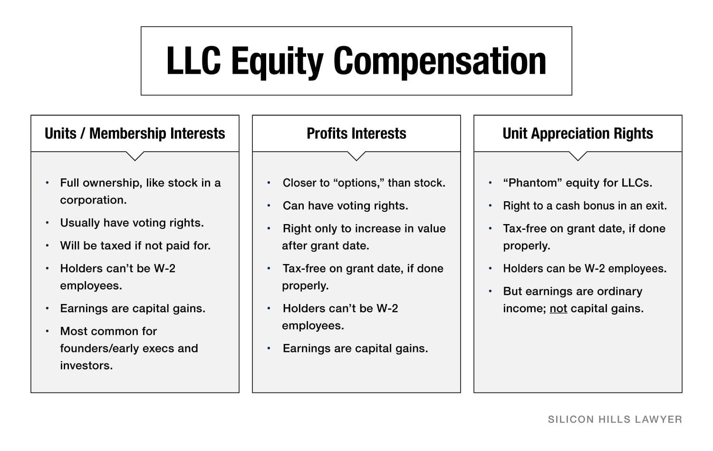

## Table of Contents

## What is an LLC and how does it differ from other business structures?

An LLC, or Limited Liability Company, is a type of business structure that combines the flexibility of a partnership with the limited liability protection of a corporation. This means that the owners, called members, are not personally responsible for the company's debts or liabilities. LLCs are popular because they are easy to set up and maintain, and they offer a lot of flexibility in how they can be managed and taxed.

LLCs differ from other business structures in several ways. Unlike a sole proprietorship or partnership, where the owners are personally liable for business debts, an LLC protects its members from personal liability. Compared to a corporation, an LLC has less paperwork and fewer formalities, making it simpler to run. Additionally, LLCs can choose how they want to be taxed, either as a sole proprietorship, partnership, or corporation, which gives them more tax flexibility than a traditional corporation, which is taxed at the corporate level and then again on dividends.

In summary, an LLC provides a middle ground between the simplicity of a partnership and the protection of a corporation. It's a good choice for business owners who want to protect their personal assets while enjoying the ease of managing their business.

## Can an LLC issue stocks like a corporation?

An LLC cannot issue stocks like a corporation. Stocks are a way for corporations to raise money by selling ownership shares to investors. In an LLC, ownership is divided into membership interests, not stocks. This means that if someone wants to invest in an LLC, they would buy a part of the membership interest instead of buying stocks.

The way LLCs handle ownership is different and more flexible than corporations. LLCs can decide how to split up the ownership among members. They can also set rules on how members can sell or transfer their ownership. This flexibility can be good for businesses that want to keep control within a small group of people, but it can make it harder to raise money from outside investors compared to a corporation that can sell stocks to the public.

## What are the benefits of forming an LLC over a corporation if stock issuance is a concern?

If you're thinking about starting a business and worried about issuing stocks, forming an LLC can be a good choice. LLCs don't issue stocks like corporations do. Instead, they have something called membership interests. This means that if you want to bring in investors, they would buy into the LLC by getting a part of the membership interest. This can be simpler and more flexible because you can set your own rules on how ownership is divided and transferred.

Another benefit of an LLC is that it's easier to run than a corporation. Corporations have to follow strict rules like holding regular meetings and keeping detailed records. LLCs don't have these requirements, which makes them less work to manage. Also, LLCs can choose how they want to be taxed, either like a sole proprietorship, partnership, or corporation. This flexibility can save you money and make things easier when it comes to taxes.

## How can an LLC raise capital if it cannot issue stocks?

An LLC can raise capital in several ways even though it can't issue stocks. One way is by getting loans from banks or other lenders. The LLC can use its assets or future earnings to secure the loan. Another way is by inviting investors to buy into the LLC by purchasing a part of the membership interest. This is different from buying stocks, but it lets people invest money in exchange for a share of the business.

LLCs can also raise money by taking on partners who contribute capital in return for a share of the profits. This can be a good way to bring in new money and expertise without changing the structure of the LLC too much. Sometimes, LLCs can get money from grants or crowdfunding if their business idea is attractive to the public or specific organizations. By using these methods, an LLC can grow and expand without needing to issue stocks like a corporation.

## What is a membership interest in an LLC and how does it compare to stock in a corporation?

A membership interest in an LLC is like a share of ownership in the company. It shows how much of the LLC someone owns and what part of the profits they get. When someone wants to invest in an LLC, they buy a part of the membership interest instead of buying stocks. This can be more flexible because the LLC can set its own rules about how ownership is divided and transferred.

Compared to stock in a corporation, membership interest is different in a few ways. Stocks are pieces of a corporation that anyone can buy and sell, often on a stock market. This makes it easier for corporations to raise money from lots of people. With an LLC, the membership interest can't be traded on a stock market, and the LLC can control who can buy in and how the ownership changes hands. This can be good for keeping control within a smaller group but might make it harder to raise money from the public.

## Can an LLC convert to a corporation to issue stocks, and what are the implications of such a conversion?

Yes, an LLC can convert to a corporation if it wants to issue stocks. This process is called statutory conversion and involves following the rules set by the state where the LLC is registered. The LLC would need to file the right paperwork with the state, get approval from its members, and make sure it meets all the legal requirements for becoming a corporation. Once the conversion is complete, the new corporation can start issuing stocks to raise money from investors.

The implications of converting from an LLC to a corporation are important to think about. First, the business will have to follow the stricter rules that corporations have to follow, like holding regular meetings and keeping detailed records. This can be more work than running an LLC. Second, the tax situation might change. LLCs can choose how they want to be taxed, but corporations are taxed differently, and this might mean paying more in taxes. Finally, the conversion might affect how the business is seen by customers, partners, and investors. It could be seen as a sign that the business is growing and wants to raise more money, but it might also make some people worried about changes in how the business is run.

## What legal considerations should an LLC take into account when exploring alternatives to stock issuance?

When an LLC is looking at other ways to raise money instead of issuing stocks, they need to think about the legal rules in their state. Each state has different laws about what an LLC can do to get money. For example, if an LLC wants to take loans, they need to understand the rules about borrowing money and what they can use as a guarantee for the loan. If they want to sell part of the membership interest to investors, they need to make sure they follow the rules about how to do that. They might need to write a special agreement that says how the new investors can join and what rights they have.

Another important thing to consider is how the LLC's operating agreement might need to change. This agreement is like a rulebook for the LLC, and it might need to be updated to fit the new ways of getting money. For example, if the LLC wants to add new members, the agreement should say how much say the new members will have in running the business. Also, the LLC needs to think about taxes. Different ways of raising money can change how much tax the LLC has to pay, so they need to talk to a tax expert to understand all the tax rules.

Overall, exploring alternatives to stock issuance requires careful planning and understanding of the legal landscape. The LLC should work with a lawyer to make sure they are following all the rules and that their new plan for raising money fits well with their business goals and the legal requirements of their state.

## How do tax implications differ for LLCs versus corporations in the context of equity distribution?

When an LLC decides to give out membership interests to raise money, the tax rules can be simpler than those for a corporation. LLCs can choose how they want to be taxed. They can be taxed like a sole proprietorship if there's only one owner, or like a partnership if there's more than one owner. This means the LLC itself doesn't pay taxes; instead, the owners report the business income on their personal tax returns. When someone buys into the LLC by getting a part of the membership interest, it's usually not taxed right away. The new owner just starts sharing in the profits and losses of the business.

On the other hand, when a corporation issues stocks to raise money, the tax rules can be more complicated. Corporations are taxed on their profits at the corporate level. When they pay out money to shareholders as dividends, those dividends are taxed again on the shareholders' personal tax returns. This is called double taxation. If someone buys stock in a corporation, they might have to pay capital gains tax if they sell the stock later for more than they paid for it. So, the way an LLC and a corporation handle equity distribution can lead to very different tax outcomes.

## What are the steps an LLC must follow if it decides to issue membership units as a form of equity?

If an LLC wants to issue membership units as a form of equity, the first step is to check the LLC's operating agreement. This agreement is like a rulebook for the LLC, and it might already have rules about how to issue new membership units. If it doesn't, the LLC will need to update the agreement to include these rules. The LLC should also look at the laws in their state to make sure they're doing everything right. They might need to file some paperwork with the state to let them know about the new membership units.

Once the LLC has made sure everything is set up correctly, they can start offering the membership units to investors. They need to be clear about what the investors are getting in return for their money. This means telling them how much of the business they will own, what part of the profits they will get, and any other rights they will have as members of the LLC. It's a good idea for the LLC to work with a lawyer to make sure all the legal stuff is done right and to help write up the agreements with the new members.

## How can an LLC structure its ownership to mimic the benefits of stock issuance while maintaining its LLC status?

An LLC can structure its ownership to mimic the benefits of stock issuance by creating classes of membership interests. This means the LLC can have different types of membership units, each with different rights and benefits, much like different classes of stock in a corporation. For example, some units might give the holder voting rights, while others might offer a bigger share of the profits. By setting up these different classes, the LLC can attract different types of investors, just like a corporation does with its stocks.

To set this up, the LLC needs to change its operating agreement to include the rules for these new classes of membership interests. The agreement should clearly state what each class of units offers and how they can be bought or sold. This way, the LLC can control who owns what part of the business and how the ownership can change hands, while still keeping its LLC status. It's important for the LLC to work with a lawyer to make sure all the legal requirements are met and to help write up the agreements for the new members.

## What are the potential risks and drawbacks of using alternative equity structures in an LLC?

Using different types of membership interests in an LLC can be tricky. One big risk is that it can make things more complicated. When you have different classes of membership interests, you need to keep track of who owns what and what rights they have. This can lead to more paperwork and more chances for mistakes. It can also make it harder to decide things in the business because different members might want different things based on their type of interest.

Another drawback is that it might scare off some investors. Some people like the idea of buying stocks because they know how it works. When you offer them something different, like a special type of membership interest, they might not understand it as well. This can make them less likely to invest in your LLC. Plus, if the rules for these different interests are too strict, it can make it hard for members to sell their interest if they want to leave the business, which can be a problem for both the LLC and the members.

## How does the governance of an LLC change when it uses complex equity structures similar to stock issuance?

When an LLC starts using different types of membership interests, like a corporation uses stocks, the way it's run can get more complicated. Instead of everyone having the same say in the business, now some people might have more power because of the type of interest they own. For example, some members might get to vote on big decisions, while others might not. This can make it harder to make choices because everyone might want different things based on what kind of interest they have. The LLC needs to be really clear about who gets to decide what, or it could lead to fights and confusion.

Also, with these complex equity structures, the LLC has to do more paperwork. They need to keep track of who owns which type of interest and what rights come with it. This means more time spent on making sure everything is written down right and following the rules in the operating agreement. If they don't do this well, it can cause problems with the members or even with the law. So, while using different types of membership interests can help the LLC get money and grow, it also makes running the business more work and more complicated.

## References & Further Reading

[1]: ["Understanding Business Structures"](https://corporatefinanceinstitute.com/resources/management/business-structure/) - Internal Revenue Service (IRS)

[2]: Abarbanell, J. S., & Bushee, B. J. (1997). ["Fundamental Analysis, Future Earnings, and Stock Prices."](https://www.jstor.org/stable/2491464) Journal of Accounting Research, 35(1), 1-24.

[3]: Sander, P., & Arun, L. (2020). ["Legal Structures for Businesses: Strategies and Impacts"](https://www.tandfonline.com/doi/full/10.1080/1331677X.2019.1677488) Journal of Entrepreneurship and Innovation in Emerging Economies.

[4]: Bouchaud, J. P., & Potters, M. (2003). ["Theory of Financial Risk and Derivative Pricing"](https://www.cambridge.org/core/books/theory-of-financial-risk-and-derivative-pricing/5BBBA04CE72ED9E5E7C1C028D9A94FCB) Cambridge University Press.

[5]: Ernest, C. J. (2009). ["Quantitative Trading: How to Build Your Own Algorithmic Trading Business"](https://www.amazon.com/Quantitative-Trading-Build-Algorithmic-Business/dp/1119800064) Wiley Trading.

[6]: Lopez de Prado, M. (2018). ["Advances in Financial Machine Learning"](https://www.amazon.com/Advances-Financial-Machine-Learning-Marcos/dp/1119482089) Wiley.

[7]: Narang, R. K. (2013). ["Inside the Black Box: A Simple Guide to Quantitative and High-Frequency Trading"](https://onlinelibrary.wiley.com/doi/book/10.1002/9781118662717) Wiley.

[8]: Alon-Brimer, Y. (2015). ["Algorithmic Trading and DMA: An Introduction to Direct Access Trading Strategies"](https://archive.org/details/algorithmictradi0000john) 4Myeloma Press.